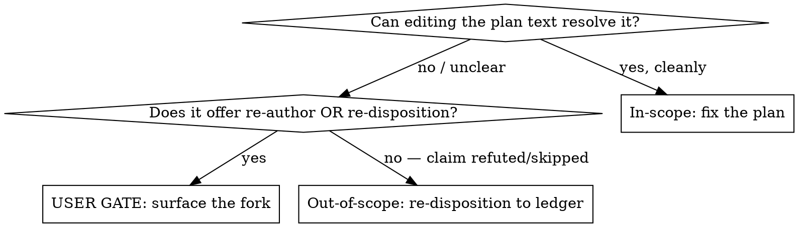

# Revise Health Plan

## Overview

A review document (consolidated findings, commentary, or a plain critique)
identifies problems in an already-written health-loop plan. This skill
reconciles the plan against that review **before** `/implement-health-plan` runs.

**Core principle:** every accepted finding lands in exactly one place — a plan
task that earns its closure, or a ledger row that settles it. Mechanical edits
are the easy part; the discipline is **classifying every finding, surfacing
judgment forks to the user, and proving full coverage before claiming done.**

## When to Use

- A plan in `docs/superpowers/plans/` has a paired `*-commentary.md`,
  `*-consolidated-findings-*.md`, or other review document.
- The user says "use the review/findings to improve the plan."
- Some review findings can't be fixed by editing the plan and need a disposition
  decision instead.

**Not for:** writing a plan from scratch (use `plan-health-findings`); executing
a plan (use `implement-health-plan`); reviews of non-plan files.

## Process

1. **Read all three inputs in full:** the review document, the target plan, and
   `docs/health/dispositions.md` (header for the column schema + `closes #<ID>`
   convention, and the accepted rows the plan covers).
2. **Classify every finding** (see the decision below) into in-scope vs
   out-of-scope. List them before editing anything.
3. **Resolve judgment forks at a user gate** — do not pick silently.
4. **Apply in-scope corrections** to the plan (see Recurring correction patterns).
5. **Re-disposition out-of-scope findings** to the ledger: append one row per ID,
   same ID, `declined`/`grandfathered`, with an exact `closes #<ID>` token in the
   note. Never rewrite the original `accepted` row.
6. **Reconcile coverage** (mandatory — Step gap the baseline misses).
7. **Self-verify structure** (mandatory greps) before claiming done.
8. **Update the loop-state breadcrumb and hand off** to `/implement-health-plan`
   in a fresh session — do not auto-execute.

## Classifying a finding



**The fork rule (the #1 baseline failure):** when a finding says a task "does not
earn its closure" and offers *re-author OR re-disposition*, that is a scope
decision the user owns — especially when re-authoring would collide with a
standing `declined`/`grandfathered` ledger row. Surface it with `AskUserQuestion`;
never default to one branch.

Out-of-scope findings are typically: rubber-duck `skip` rows (refuted /
already-covered), and tasks the review shows don't resolve their accepted finding.

## Recurring correction patterns

These review findings recur across plans; apply the canonical fix:

| Review finding | Canonical correction |
|---|---|
| Commit subjects violate convention | `<emoji> type(scope): subject`, full subject ≤72 chars, subject-only (tool project — no body) |
| A task edits the **executor** skill (`implement-health-plan/SKILL.md`) | Move it **last**, add a restart boundary: stop + re-invoke before Phase 2/3 close-back |
| Bare `git status` can't pass in a dirty worktree | Path-scope every check: `git status --short -- <task-paths>`; forbidden scan over added lines only (`git diff --unified=0`) |
| A grep "passes" on pre-existing text | Bound it (frontmatter-only via `awk`, fixed-string `grep -F`, or a strict measurement that exits non-zero) |
| A task changes a skill's first description sentence | Regenerate + stage the derived `docs/maintainer-tooling.md` |
| A task is dropped (re-dispositioned) | Renumber remaining tasks contiguously; update the Goal count and Provenance range |

## Coverage reconciliation (mandatory)

The accepted set the plan claims (e.g. Provenance "#595–#644") must equal
`plan closes_rows ∪ ledger re-dispositions`, with **no ID in both** and **none
missing**. Compute it explicitly:

```bash
# every accepted ID resolved exactly once:
# (plan closes_rows arrays)  ∪  (new ledger rows with closes #<ID>)  ==  accepted range
```

State the arithmetic in your summary (e.g. "30 plan rows + 20 ledger rows = 50 = #595–#644").

## Self-verification (mandatory before claiming done)

```bash
PLAN=<plan-path>
grep -c '^### Task ' "$PLAN"                       # task count
grep -cE '^- `closes_rows:' "$PLAN"                # must equal task count
grep -E '^- `closes_rows:' "$PLAN" | grep -oE '#[0-9]+' | sort | uniq -d   # expect empty (no dup IDs)
grep -oE 'git commit -m "[^"]+"' "$PLAN" | sed -E 's/.*"-m "//' | awk '{ if (length>72) print "OVER 72: " $0 }'
# no ID appears in BOTH a plan closes_rows and a new ledger re-disposition
```

## Common mistakes

| Mistake | Fix |
|---|---|
| Silently re-authoring a task the review flagged as not-earning-closure | Surface the re-author/re-disposition fork at a user gate |
| Applying every finding to the plan; never touching the ledger | Out-of-scope findings re-disposition to the ledger, not plan tasks |
| Appending ledger rows without a `closes #<ID>` token | Each re-disposition reuses the ID and carries a greppable `closes #<ID>` |
| Editing the executor task in place | It runs last with a restart boundary |
| Claiming done without coverage/structure checks | Run the two mandatory verification blocks first |
| Leaving stale Goal/Provenance counts after dropping a task | Update counts and the accepted range |

## Red flags — STOP

- "The review said re-author OR re-disposition, I'll just re-author." → **Gate it.**
- "I applied all the findings." (but the ledger is untouched) → some are out of scope.
- "The plan looks done." (no coverage arithmetic, no structural greps) → not done.
- An accepted ID is in neither the plan nor a new ledger row → coverage hole.

## Hand off (do not auto-execute)

Write `.dev/health-loop-state.md` pointing `next_command` at
`/implement-health-plan --plan <plan-path>`, note the revised task/row counts and
any executor-last restart boundary, then stop and tell the user to run it in a
fresh session.
