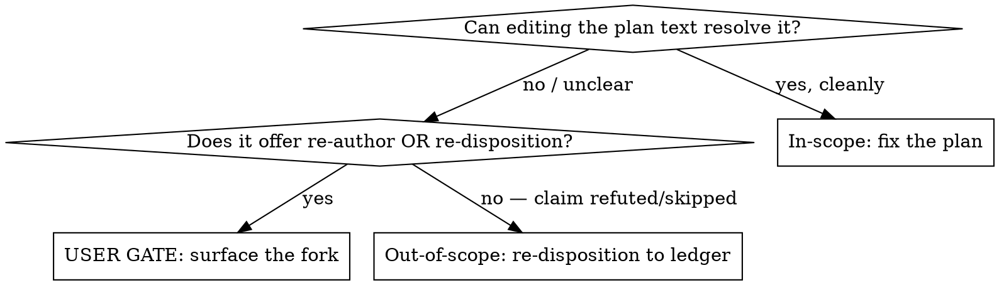

# Revise Health Plan

A review document (consolidated findings, commentary, or a plain critique)
identifies problems in an already-written health-loop plan. This skill
reconciles the plan against that review **before** `/implement-health-plan` runs.

**Core principle:** every accepted finding lands in exactly one place — a plan
task that earns its closure, or a ledger row that settles it. Mechanical edits
are the easy part; the discipline is **classifying every finding, surfacing
judgment forks to the user, and proving full coverage before claiming done.**

- A plan in `docs/superpowers/plans/` has a paired `*-commentary.md`,
  `*-consolidated-findings-*.md`, or other review document.
- The user says "use the review/findings to improve the plan."
- Some review findings can't be fixed by editing the plan and need a disposition
  decision instead.

**Not for:** writing a plan from scratch (use `plan-health-findings`); executing
a plan (use `implement-health-plan`); reviews of non-plan files.

## Phase-proof requirement

This skill follows `../../knowledge/phase-proof-contract.md`: before reporting
any phase complete, advancing to the next phase, or updating
`.dev/health-loop-state.md`, emit a phase-proof block (observed command output
or file-existence check) binding to that phase's deliverable. A restated
intention is not proof.

## Phase 1 — Read inputs and classify

1. **Read all three inputs in full:** the review document, the target plan, and
   `docs/health/dispositions-open.md` (the accepted events the plan covers and
   their `event_id` values used in `closes_event_ids:`).
2. **Classify every finding** (see the decision below) into in-scope vs
   out-of-scope. List them before editing anything.
3. **Resolve judgment forks at a user gate** — do not pick silently.
4. **Apply in-scope corrections** to the plan (see Recurring correction patterns).
5. **Re-disposition out-of-scope findings** to the ledger: append a new
   `declined` or `grandfathered` event whose `closes_event_ids` lists the
   accepted event IDs it settles. Do not reuse `legacy_id` as the closure key.
   Never rewrite the original `accepted` event.
6. **Reconcile coverage** (mandatory — Step gap the baseline misses).
7. **Self-verify structure** (mandatory greps) before claiming done.
8. **Update the loop-state breadcrumb and hand off** to `/implement-health-plan`
   in a fresh session — do not auto-execute.

## Phase 2 — Classify findings and resolve judgment forks

### Classifying a finding



**The fork rule (the #1 baseline failure):** when a finding says a task "does not
earn its closure" and presents *both re-author and re-disposition as equally valid
options* (neither clearly ruled out by the review), that is a scope decision the
user owns — especially when re-authoring would collide with a
standing `declined`/`grandfathered` ledger row. Surface it with `AskUserQuestion`;
never default to one branch.

**Else (the review clearly favours one branch — no gate):** the `AskUserQuestion`
gate applies only when both options are genuinely open.
When the **review clearly favors a clean in-scope fix**, apply it without gating.
When the **review clearly rules the option out-of-scope**, re-disposition it to the ledger without gating.

For this rule, **"clearly"** means the review document contains explicit wording — such as "this is in scope", "decline this finding", or "this should be grandfathered" — stated as a direct conclusion. Implicit framing, absence of objection, and hedged phrasing ("might be worth...") do not qualify and always route through the user gate. When the review's explicit wording supports both branches simultaneously, treat it as ambiguous and route through the user gate.

Out-of-scope findings are typically: rubber-duck `skip` rows (refuted /
already-covered (*the accepted finding is addressed by a different, non-reviewed task already
in the plan*)), and tasks the review shows don't resolve their accepted finding.

## Phase 3 — Apply corrections and re-dispositions

### Recurring correction patterns

These review findings recur across plans; apply the canonical fix:

See `.claude/knowledge/correction-patterns.md` for the canonical correction-patterns
table. When classifying review findings, consult this list first.

If a finding matches no entry in `correction-patterns.md`, treat it as
unclassified and surface it at the Phase 2 user gate for an explicit decision
rather than silently dropping or auto-classifying it.

Once the user resolves a novel defect class this way, **append it as a new row
to `.claude/knowledge/correction-patterns.md`** (review finding → canonical
correction) before claiming done, so the next plan review classifies it
mechanically instead of re-litigating it at the gate. This is how the loop
learns — a one-off resolution becomes a repeatable pattern.

## Phase 4 — Coverage reconciliation and self-verification

### Coverage reconciliation (mandatory)

The accepted set the plan claims must equal
`plan closes_event_ids + re-disposition closes_event_ids = accepted event set`,
with **no event_id in both** and **none missing**. Compute it explicitly:

```bash
# every accepted event_id resolved exactly once:
# (plan closes_event_ids lists)  ∪  (new ledger events with closes_event_ids)  ==  accepted event set
```

State the arithmetic in your summary (e.g. "30 plan events + 20 re-disposition events = 50 total").

### Self-verification (mandatory before claiming done)

```bash
PLAN=<plan-path>
grep -c '^### Task ' "$PLAN"                           # task count
grep -cE '^\s+closes_event_ids:' "$PLAN"              # must equal task count
grep -E '^\s+-\s+disp_' "$PLAN" | sort | uniq -d      # expect empty (no dup event IDs)

# --- commit-format checks (extract the bare subject, count CHARACTERS not bytes) ---
grep -oE 'git commit -m "[^"]+"' "$PLAN" | sed -E 's/^git commit -m "//; s/"$//' > /tmp/subjects
# subject >72 chars: wc -m counts characters, so a 4-byte emoji is not double-counted
while IFS= read -r s; do n=$(printf '%s' "$s" | wc -m); [ "$n" -gt 72 ] && echo "OVER 72 ($n): $s"; done < /tmp/subjects
# missing emoji: subject starts with an ASCII letter (no emoji prefix)
grep -nE 'git commit -m "[a-zA-Z]' "$PLAN" && echo "↑ MISSING EMOJI"
# multi-line body (tool repo = subject only): -m string spanning a newline
grep -Pzo 'git commit -m "[^"]*\n' "$PLAN" && echo "↑ MULTI-LINE COMMIT BODY"
# event id smuggled into the commit message instead of closes_event_ids block
grep -nE 'git commit -m "[^"]*(closes_event_ids|\[#)' "$PLAN" && echo "↑ EVENT ID IN COMMIT MSG"

# no event_id appears in BOTH a plan closes_event_ids and a new re-disposition closes_event_ids
```

> Verify the character-count path against a known 72-character emoji subject so
> the previous byte-counting false positive is actually gone.

### Common mistakes

| Mistake | Fix |
|---|---|
| Silently re-authoring a task the review flagged as not-earning-closure | Surface the re-author/re-disposition fork at a user gate |
| Applying every finding to the plan; never touching the ledger | Out-of-scope findings re-disposition to the ledger, not plan tasks |
| Appending re-disposition events without `closes_event_ids` | Each re-disposition carries `closes_event_ids` listing the accepted event IDs it settles |
| Editing the executor task in place | It runs last with a restart boundary |
| Claiming done without coverage/structure checks | Run the two mandatory verification blocks first |
| Leaving stale Goal/Provenance counts after dropping a task | Update counts and the accepted range |

### Red flags — STOP

- "The review said re-author OR re-disposition, I'll just re-author." → **Gate it.**
- "I applied all the findings." (but the ledger is untouched) → some are out of scope.
- "The plan looks done." (no coverage arithmetic, no structural greps) → not done.
- An accepted ID is in neither the plan nor a new ledger row → coverage hole.

## Phase 5 — Hand off (do not auto-execute)

Write `.dev/health-loop-state.md` pointing `next_command` at
`/implement-health-plan --plan <plan-path>`, note the revised task/row counts and
any executor-last restart boundary, then stop and tell the user to run it in a
fresh session.
