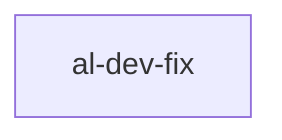

# Plugin Dependency Graph

> Generated by `scripts/generate-plugin-graph.py` on 2026-05-31.
> Re-run the script (or `/plugin-health`) to refresh. Do not hand-edit.

## Dependency graph

```mermaid
flowchart LR
    classDef skillNode fill:#dbeafe,stroke:#2563eb,color:#1e3a5f,font-weight:bold
    classDef agentNode fill:#d1fae5,stroke:#059669,color:#064e3b,font-weight:bold
    classDef knowledgeNode fill:#fef3c7,stroke:#d97706,color:#78350f,font-weight:bold

    subgraph Skills[Skills]
        al_dev_commit[al-dev-commit]
        al_dev_consolidate[al-dev-consolidate]
        al_dev_develop[al-dev-develop]
        al_dev_diagram_generator[al-dev-diagram-generator]
        al_dev_document[al-dev-document]
        al_dev_explore[al-dev-explore]
        al_dev_fix[al-dev-fix]
        al_dev_handoff[al-dev-handoff]
        al_dev_help[al-dev-help]
        al_dev_interview[al-dev-interview]
        al_dev_investigate[al-dev-investigate]
        al_dev_lint[al-dev-lint]
        al_dev_perf[al-dev-perf]
        al_dev_plan[al-dev-plan]
        al_dev_release_notes[al-dev-release-notes]
        al_dev_review_develop[al-dev-review-develop]
        al_dev_support[al-dev-support]
        al_dev_ticket[al-dev-ticket]
        commit_recover[commit-recover]
        plan_with_critic_swarm[plan-with-critic-swarm]
        verify_commits[verify-commits]
    end
    subgraph Agents[Agents]
        al_dev_code_review[al-dev-code-review]
        al_dev_commit_agent_analysis[al-dev-commit-agent-analysis]
        al_dev_commit_agent_execute[al-dev-commit-agent-execute]
        al_dev_commit_lint_fixer[al-dev-commit-lint-fixer]
        al_dev_commit_message_drafter[al-dev-commit-message-drafter]
        al_dev_commit_ooxml_validator[al-dev-commit-ooxml-validator]
        al_dev_commit_recover_verifier[al-dev-commit-recover-verifier]
        al_dev_developer[al-dev-developer]
        al_dev_diagnostics_fixer[al-dev-diagnostics-fixer]
        al_dev_docs_writer[al-dev-docs-writer]
        al_dev_expert_reviewer[al-dev-expert-reviewer]
        al_dev_explore[al-dev-explore]
        al_dev_interview[al-dev-interview]
        al_dev_performance_reviewer[al-dev-performance-reviewer]
        al_dev_release_notes_writer[al-dev-release-notes-writer]
        al_dev_script_engineer[al-dev-script-engineer]
        al_dev_security_reviewer[al-dev-security-reviewer]
        al_dev_solution_architect[al-dev-solution-architect]
        al_dev_support_reply_drafter[al-dev-support-reply-drafter]
        al_dev_support_researcher[al-dev-support-researcher]
        al_dev_ticket_agent[al-dev-ticket-agent]
    end
    subgraph Knowledge[Knowledge Files]
        al_dev_fix_examples_md[al-dev-fix-examples]
        al_developer_patterns_md[al-developer-patterns]
        al_linting_rules_md[al-linting-rules]
        al_symbol_pre_flight_md[al-symbol-pre-flight]
        architect_invocation_patterns_md[architect-invocation-patterns]
        artifact_contracts_md[artifact-contracts]
        code_review_patterns_md[code-review-patterns]
        compile_lint_procedure_md[compile-lint-procedure]
        consolidate_extraction_patterns_md[consolidate-extraction-patterns]
        documentation_rtm_guide_md[documentation-rtm-guide]
        explore_subagent_pattern_md[explore-subagent-pattern]
        intent_preflight_md[intent-preflight]
        interview_question_bank_md[interview-question-bank]
        perf_anti_patterns_prompt_md[perf-anti-patterns-prompt]
        performance_review_examples_md[performance-review-examples]
        release_notes_template_md[release-notes-template]
        scope_expansion_gate_md[scope-expansion-gate]
        script_engineer_conventions_md[script-engineer-conventions]
        security_review_examples_md[security-review-examples]
        solution_plan_template_md[solution-plan-template]
        tdd_workflow_md[tdd-workflow]
        ticket_agent_invocation_pattern_md[ticket-agent-invocation-pattern]
        workflow_resilience_md[workflow-resilience]
        workflow_routing_md[workflow-routing]
    end

    al_dev_develop --> al_dev_commit
    al_dev_develop --> al_dev_review_develop
    al_dev_document --> al_dev_develop
    al_dev_explore --> al_dev_interview
    al_dev_explore --> al_dev_plan
    al_dev_explore --> al_dev_ticket
    al_dev_fix --> al_dev_develop
    al_dev_fix --> al_dev_plan
    al_dev_handoff --> al_dev_investigate
    al_dev_handoff --> al_dev_plan
    al_dev_help --> al_dev_commit
    al_dev_help --> al_dev_develop
    al_dev_help --> al_dev_document
    al_dev_help --> al_dev_explore
    al_dev_help --> al_dev_fix
    al_dev_help --> al_dev_interview
    al_dev_help --> al_dev_plan
    al_dev_help --> al_dev_release_notes
    al_dev_help --> al_dev_ticket
    al_dev_investigate --> al_dev_explore
    al_dev_investigate --> al_dev_handoff
    al_dev_investigate --> al_dev_plan
    al_dev_investigate --> al_dev_ticket
    al_dev_perf --> al_dev_plan
    al_dev_review_develop --> al_dev_commit
    al_dev_review_develop --> al_dev_develop
    al_dev_support --> al_dev_ticket
    al_dev_ticket --> al_dev_interview
    al_dev_ticket --> al_dev_plan
    al_dev_ticket --> al_dev_support
    al_dev_commit --> al_dev_commit_agent_analysis
    al_dev_commit --> al_dev_commit_agent_execute
    al_dev_commit --> al_dev_commit_lint_fixer
    al_dev_commit --> al_dev_commit_message_drafter
    al_dev_commit --> al_dev_commit_ooxml_validator
    al_dev_fix --> al_dev_developer
    al_dev_fix --> al_dev_solution_architect
    al_dev_release_notes --> al_dev_release_notes_writer
    al_dev_review_develop --> al_dev_developer
    al_dev_review_develop --> al_dev_expert_reviewer
    al_dev_review_develop --> al_dev_performance_reviewer
    al_dev_review_develop --> al_dev_security_reviewer
    al_dev_ticket --> al_dev_support_reply_drafter
    al_dev_ticket --> al_dev_support_researcher
    al_dev_ticket --> al_dev_ticket_agent
    commit_recover --> al_dev_commit_recover_verifier
    al_dev_commit --> artifact_contracts_md
    al_dev_commit --> compile_lint_procedure_md
    al_dev_commit --> intent_preflight_md
    al_dev_consolidate --> consolidate_extraction_patterns_md
    al_dev_develop --> al_symbol_pre_flight_md
    al_dev_develop --> artifact_contracts_md
    al_dev_develop --> intent_preflight_md
    al_dev_develop --> scope_expansion_gate_md
    al_dev_develop --> workflow_resilience_md
    al_dev_developer --> al_developer_patterns_md
    al_dev_developer --> al_symbol_pre_flight_md
    al_dev_developer --> tdd_workflow_md
    al_dev_docs_writer --> documentation_rtm_guide_md
    al_dev_expert_reviewer --> code_review_patterns_md
    al_dev_explore --> explore_subagent_pattern_md
    al_dev_fix --> al_dev_fix_examples_md
    al_dev_fix --> al_symbol_pre_flight_md
    al_dev_fix --> architect_invocation_patterns_md
    al_dev_fix --> artifact_contracts_md
    al_dev_fix --> compile_lint_procedure_md
    al_dev_fix --> intent_preflight_md
    al_dev_interview --> interview_question_bank_md
    al_dev_investigate --> explore_subagent_pattern_md
    al_dev_lint --> al_linting_rules_md
    al_dev_lint --> artifact_contracts_md
    al_dev_lint --> intent_preflight_md
    al_dev_perf --> explore_subagent_pattern_md
    al_dev_perf --> perf_anti_patterns_prompt_md
    al_dev_performance_reviewer --> perf_anti_patterns_prompt_md
    al_dev_performance_reviewer --> performance_review_examples_md
    al_dev_plan --> architect_invocation_patterns_md
    al_dev_plan --> artifact_contracts_md
    al_dev_plan --> intent_preflight_md
    al_dev_plan --> solution_plan_template_md
    al_dev_plan --> workflow_resilience_md
    al_dev_plan --> workflow_routing_md
    al_dev_release_notes_writer --> release_notes_template_md
    al_dev_review_develop --> artifact_contracts_md
    al_dev_script_engineer --> script_engineer_conventions_md
    al_dev_security_reviewer --> security_review_examples_md
    al_dev_solution_architect --> al_developer_patterns_md
    al_dev_solution_architect --> solution_plan_template_md
    al_dev_support --> ticket_agent_invocation_pattern_md
    al_dev_ticket --> ticket_agent_invocation_pattern_md
    al_dev_ticket_agent --> ticket_agent_invocation_pattern_md

    class al_dev_commit skillNode
    class al_dev_consolidate skillNode
    class al_dev_develop skillNode
    class al_dev_diagram_generator skillNode
    class al_dev_document skillNode
    class al_dev_explore skillNode
    class al_dev_fix skillNode
    class al_dev_handoff skillNode
    class al_dev_help skillNode
    class al_dev_interview skillNode
    class al_dev_investigate skillNode
    class al_dev_lint skillNode
    class al_dev_perf skillNode
    class al_dev_plan skillNode
    class al_dev_release_notes skillNode
    class al_dev_review_develop skillNode
    class al_dev_support skillNode
    class al_dev_ticket skillNode
    class commit_recover skillNode
    class plan_with_critic_swarm skillNode
    class verify_commits skillNode
    class al_dev_code_review agentNode
    class al_dev_commit_agent_analysis agentNode
    class al_dev_commit_agent_execute agentNode
    class al_dev_commit_lint_fixer agentNode
    class al_dev_commit_message_drafter agentNode
    class al_dev_commit_ooxml_validator agentNode
    class al_dev_commit_recover_verifier agentNode
    class al_dev_developer agentNode
    class al_dev_diagnostics_fixer agentNode
    class al_dev_docs_writer agentNode
    class al_dev_expert_reviewer agentNode
    class al_dev_explore agentNode
    class al_dev_interview agentNode
    class al_dev_performance_reviewer agentNode
    class al_dev_release_notes_writer agentNode
    class al_dev_script_engineer agentNode
    class al_dev_security_reviewer agentNode
    class al_dev_solution_architect agentNode
    class al_dev_support_reply_drafter agentNode
    class al_dev_support_researcher agentNode
    class al_dev_ticket_agent agentNode
    class al_dev_fix_examples_md knowledgeNode
    class al_developer_patterns_md knowledgeNode
    class al_linting_rules_md knowledgeNode
    class al_symbol_pre_flight_md knowledgeNode
    class architect_invocation_patterns_md knowledgeNode
    class artifact_contracts_md knowledgeNode
    class code_review_patterns_md knowledgeNode
    class compile_lint_procedure_md knowledgeNode
    class consolidate_extraction_patterns_md knowledgeNode
    class documentation_rtm_guide_md knowledgeNode
    class explore_subagent_pattern_md knowledgeNode
    class intent_preflight_md knowledgeNode
    class interview_question_bank_md knowledgeNode
    class perf_anti_patterns_prompt_md knowledgeNode
    class performance_review_examples_md knowledgeNode
    class release_notes_template_md knowledgeNode
    class scope_expansion_gate_md knowledgeNode
    class script_engineer_conventions_md knowledgeNode
    class security_review_examples_md knowledgeNode
    class solution_plan_template_md knowledgeNode
    class tdd_workflow_md knowledgeNode
    class ticket_agent_invocation_pattern_md knowledgeNode
    class workflow_resilience_md knowledgeNode
    class workflow_routing_md knowledgeNode
```

## Workflow-path overlays

### Ticket / Support

### Development spine

### Direct fix

## Health callouts

**Orphan agents (spawned by no skill):**

- `al-dev-code-review`
- `al-dev-diagnostics-fixer`
- `al-dev-docs-writer`
- `al-dev-explore`
- `al-dev-interview`
- `al-dev-script-engineer`

**Dead knowledge (referenced by nothing):**

- `agent-tool-projection-policy.md`
- `anti-patterns.md`
- `code-review-template.md`
- `commit-conventions.md`
- `feedback-resolution.md`
- `harness-concepts.md`
- `lens-invocation-patterns.md`
- `map-change-rubber-duck-checks.md`
- `map-suggestion-templates.md`
- `proportional-planning.md`
- `publish-workflow-opportunity.md`
- `quality-checklist.md`
- `review-panel-pattern.md`
- `rubber-duck.md`
- `session-analysis-report-format.md`
- `skill-test-format.md`
- `verification-and-planning.md`

**Off-path skills (not on any workflow path):**

- `al-dev-consolidate`
- `al-dev-diagram-generator`
- `al-dev-document`
- `al-dev-explore`
- `al-dev-handoff`
- `al-dev-help`
- `al-dev-interview`
- `al-dev-lint`
- `al-dev-perf`
- `al-dev-release-notes`
- `al-dev-review-develop`
- `al-dev-support`
- `commit-recover`
- `plan-with-critic-swarm`
- `verify-commits`

**Missing refs (referenced but not on disk):** none

