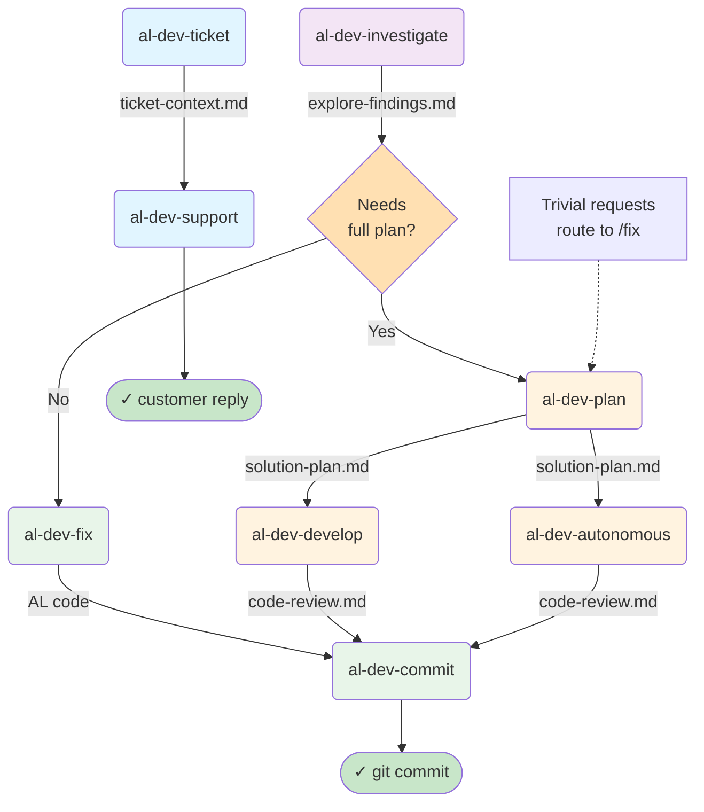
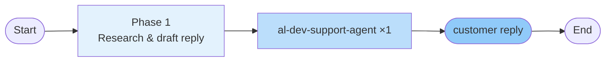
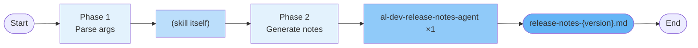
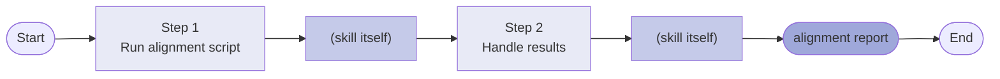

# AL Dev Plugin Map

> A reference tool for understanding skill relationships, agent patterns, and file handoffs in profile-al-dev-shared. This document is for personal gap analysis and extension planning, not onboarding.

**Last updated:** 2026-05-16 (synced all 18 active skills)  
**Scope:** Active skills only. Archived items (al-dev-test, test-engineer agents, al-dev-test-coverage-reviewer) excluded.

---

## Layer 1: Lifecycle Overview

This diagram shows the three entry paths and how they connect through the main development spine.

---

## Layer 2: Per-Skill Drill-Downs

Each skill is shown with its internal phases, spawned agents, and key outputs. Agents are referenced by their full type name (e.g., `al-dev-shared:al-dev-developer`).

### Notation

- **Phase**: Numbered step inside the skill
- **Agent**: Which agent (or skill itself) executes the phase
- **Pattern**: ×1 (serial), ×2-3 (parallel), ×N (variable count)
- **Output**: File written to `.dev/` or code generated

### /al-dev-ticket

### /al-dev-support

### /al-dev-investigate

```mermaid
flowchart LR
    Start([Start]) --> Phase1["Phase 1<br/>Form hypotheses"]
    Phase1 --> SkillWork1["(skill itself)"]
    SkillWork1 --> Phase2["Phase 2<br/>Test hypotheses"]
    Phase2 --> Agent1["al-dev-explore ×2<br/>parallel"]
    Agent1 --> Phase3["Phase 3<br/>Synthesise findings"]
    Phase3 --> SkillWork2["(skill itself)"]
    SkillWork2 --> Output1(["explore-findings.md"])
    Output1 --> End([End])
    
    style Phase1 fill:#f3e5f5
    style Phase2 fill:#f3e5f5
    style Phase3 fill:#f3e5f5
    style SkillWork1 fill:#e1bee7
    style SkillWork2 fill:#e1bee7
    style Agent1 fill:#ce93d8
    style Output1 fill:#ba68c8
```

### /al-dev-fix

**Complexity routing:** Trivial fixes skip the analysis phase; complex fixes route through al-dev-solution-architect.

### /al-dev-plan

**Competitive design phase:** Multiple architects propose approaches in parallel; the skill synthesises the winner into a solution plan.

### /al-dev-develop

**Three-reviewer panel:** Security, AL expert, and performance reviewers run in parallel, then the skill synthesises findings.

### /al-dev-commit

**Two-pass execution:** Analysis pass builds commit groups and messages; execution pass runs the commits with hook support.

### /al-dev-autonomous

**Extends al-dev-develop** with pre-generation signature verification (Phase 1A) and static validation (Phase 4A) before the review team runs.

```mermaid
flowchart LR
    Start([Start]) --> Phase1["Phase 1<br/>Read plan +<br/>verify signatures"]
    Phase1 --> SkillWork1["(skill itself)"]
    SkillWork1 --> Output0(["signatures.md"])
    Output0 --> Phase2["Phase 2<br/>Implement"]
    Phase2 --> DevAgent["al-dev-developer ×1-3<br/>parallel"]
    DevAgent --> Phase3["Phase 3<br/>Static validation"]
    Phase3 --> SkillWork2["(skill itself)"]
    SkillWork2 --> Output1(["static-validation.md"])
    Output1 --> Phase4["Phase 4<br/>Review<br/>in parallel"]

    Phase4 --> SecReview["al-dev-security-reviewer<br/>×1"]
    Phase4 --> ExpertReview["al-dev-expert-reviewer<br/>×1"]
    Phase4 --> PerfReview["al-dev-performance-reviewer<br/>×1"]

    SecReview --> Phase5["Phase 5<br/>Compile + lint"]
    ExpertReview --> Phase5
    PerfReview --> Phase5

    Phase5 --> SkillWork3["(skill itself)"]
    SkillWork3 --> Output2(["code-review.md"])
    Output2 --> End([End])

    style Phase1 fill:#fff8e1
    style Phase2 fill:#fff8e1
    style Phase3 fill:#fff8e1
    style Phase4 fill:#fff8e1
    style Phase5 fill:#fff8e1
    style SkillWork1 fill:#ffe082
    style SkillWork2 fill:#ffe082
    style SkillWork3 fill:#ffe082
    style DevAgent fill:#ffd54f
    style SecReview fill:#ffca28
    style ExpertReview fill:#ffca28
    style PerfReview fill:#ffca28
    style Output0 fill:#fbc02d
    style Output1 fill:#fbc02d
    style Output2 fill:#fbc02d
```

### /al-dev-explore

### /al-dev-interview

```mermaid
flowchart LR
    Start([Start]) --> Phase1["Phase 1<br/>Pre-research"]
    Phase1 --> SkillWork1["(skill itself)"]
    SkillWork1 --> Phase2["Phase 2<br/>Interview"]
    Phase2 --> Agent1["al-dev-interview ×1"]
    Agent1 --> Phase3["Phase 3<br/>Write requirements"]
    Phase3 --> SkillWork2["(skill itself)"]
    SkillWork2 --> Output1(["interview-requirements.md"])
    Output1 --> End([End])

    style Phase1 fill:#e8f5e9
    style Phase2 fill:#e8f5e9
    style Phase3 fill:#e8f5e9
    style SkillWork1 fill:#c8e6c9
    style SkillWork2 fill:#c8e6c9
    style Agent1 fill:#a5d6a7
    style Output1 fill:#81c784
```

### /al-dev-lint

### /al-dev-document

### /al-dev-release-notes

### /al-dev-perf

### /al-dev-handoff

### /al-dev-help

No agents spawned; no `.dev/` output. The skill reads available context files and presents contextual guidance inline.

### /al-dev-align

Runs a Python alignment script; no agents spawned. Reports forbidden-token violations and harness mapping gaps.

### /commit-learn

Spawns one verifier per corrupted-file incident found in `.dev/commit-integrity.log`.

---

## Observations

This section is a placeholder for personal gap analysis. Fill in as you review the map.

### Agents used by only one skill

-

### Skills with no dedicated agent (skill does the work itself)

-

### Potential shared agents not yet extracted

-

### Extension opportunities

-
