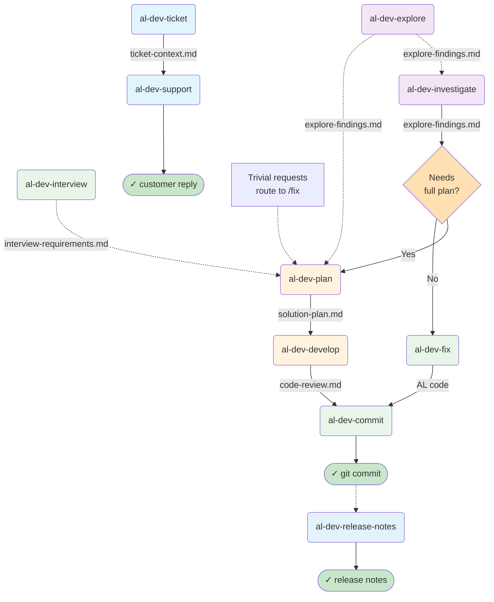
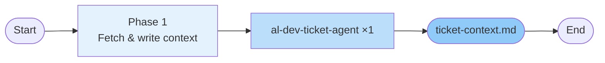
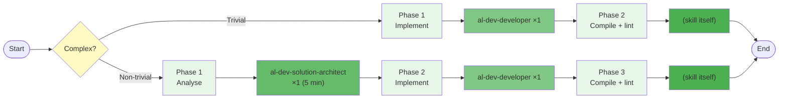
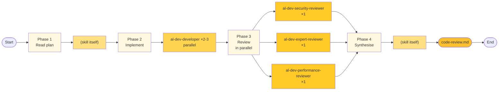
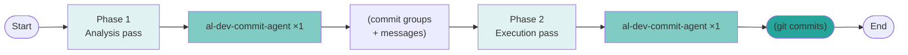
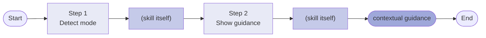
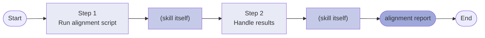

# AL Dev Plugin Map

> A reference tool for understanding skill relationships, agent patterns, and file handoffs in profile-al-dev-shared. This document is for personal gap analysis and extension planning, not onboarding.

**Last updated:** 2026-05-18 (all 2026-05-18 architectural suggestions implemented; observations cleaned up)  
**Scope:** Active skills only. Archived items (al-dev-test, test-engineer agents, al-dev-test-coverage-reviewer) excluded. /al-dev-align moved to `.claude/skills/` (project-local maintenance tool, not distributed).

---

## Layer 1: Lifecycle Overview

This diagram shows pre-planning tributaries (dashed, optional), the three main entry points, and the development spine through to post-commit output.

---

## Layer 2: Per-Skill Drill-Downs

Each skill is shown with its internal phases, spawned agents, and key outputs. Agents are referenced by their full type name (e.g., `al-dev-shared:al-dev-developer`).

### Notation

- **Phase**: Numbered step inside the skill
- **Agent**: Which agent (or skill itself) executes the phase
- **Pattern**: ×1 (serial), ×2-3 (parallel), ×N (variable count)
- **Output**: File written to `.dev/` or code generated

### /al-dev-ticket

### /al-dev-support

### /al-dev-investigate

```mermaid
flowchart LR
    Start([Start]) --> Phase1["Phase 1<br/>Form hypotheses"]
    Phase1 --> SkillWork1["(skill itself)"]
    SkillWork1 --> Phase2["Phase 2<br/>Test hypotheses"]
    Phase2 --> Agent1["al-dev-explore ×2<br/>parallel"]
    Agent1 --> Phase3["Phase 3<br/>Synthesise findings"]
    Phase3 --> SkillWork2["(skill itself)"]
    SkillWork2 --> Output1(["explore-findings.md"])
    Output1 --> End([End])
    
    style Phase1 fill:#f3e5f5
    style Phase2 fill:#f3e5f5
    style Phase3 fill:#f3e5f5
    style SkillWork1 fill:#e1bee7
    style SkillWork2 fill:#e1bee7
    style Agent1 fill:#ce93d8
    style Output1 fill:#ba68c8
```

### /al-dev-fix

**Complexity routing:** Trivial fixes skip the analysis phase; complex fixes route through al-dev-solution-architect.

### /al-dev-plan

**Competitive design phase:** Multiple architects propose approaches in parallel; the skill synthesises the winner into a solution plan.

### /al-dev-develop

**Three-reviewer panel:** Security, AL expert, and performance reviewers run in parallel, then the skill synthesises findings.

### /al-dev-commit

**Two-pass execution:** Analysis pass builds commit groups and messages; execution pass runs the commits with hook support.

### /al-dev-explore

### /al-dev-interview

### /al-dev-lint

### /al-dev-document

```mermaid
flowchart LR
    Start([Start]) --> Phase1["Step 1<br/>Select scope"]
    Phase1 --> SkillWork1["(skill itself)"]
    SkillWork1 --> Phase2["Step 2<br/>Write docs"]
    Phase2 --> Agent1["al-dev-docs-writer ×1"]
    Agent1 --> Phase3["Step 3<br/>Review + refine"]
    Phase3 --> SkillWork2["(skill itself)"]
    SkillWork2 --> Output1(["documentation files"])
    Output1 --> End([End])

    style Phase1 fill:#e3f2fd
    style Phase2 fill:#e3f2fd
    style Phase3 fill:#e3f2fd
    style SkillWork1 fill:#bbdefb
    style SkillWork2 fill:#bbdefb
    style Agent1 fill:#90caf9
    style Output1 fill:#64b5f6
```

### /al-dev-release-notes

### /al-dev-perf

### /al-dev-handoff

### /al-dev-help

No agents spawned; no `.dev/` output. The skill reads available context files and presents contextual guidance inline.

### /al-dev-align

Runs a Python alignment script; no agents spawned. Reports forbidden-token violations and harness mapping gaps.

### /commit-learn

Spawns one verifier per corrupted-file incident found in `.dev/commit-integrity.log`.

```mermaid
flowchart LR
    Start([Start]) --> Phase1["Step 1<br/>Parse incidents"]
    Phase1 --> SkillWork1["(skill itself)"]
    SkillWork1 --> Phase2["Step 2<br/>Analyse + recover"]
    Phase2 --> Agent1["commit-learn-verifier<br/>×N (per incident)"]
    Agent1 --> Phase3["Step 3<br/>Update learnings"]
    Phase3 --> SkillWork2["(skill itself)"]
    SkillWork2 --> Output1(["learnings.md"])
    Output1 --> End([End])

    style Phase1 fill:#e0f2f1
    style Phase2 fill:#e0f2f1
    style Phase3 fill:#e0f2f1
    style SkillWork1 fill:#b2dfdb
    style SkillWork2 fill:#b2dfdb
    style Agent1 fill:#80cbc4
    style Output1 fill:#26a69a
```

---

## Observations

> Generated by /analyze-plugin-design on 2026-05-16.
> Run /review-plugin-map first if the skill list has changed since this was written.

### Agents used by only one skill

- **al-dev-support-agent** — used only by /al-dev-support
- **al-dev-interview** (agent) — used only by /al-dev-interview
- **al-dev-docs-writer** — used only by /al-dev-document
- **al-dev-release-notes-agent** — used only by /al-dev-release-notes
- **al-dev-commit-agent** — used only by /al-dev-commit (dispatched twice per invocation)
- **al-dev-diagnostics-fixer** — primary caller is /al-dev-lint; also invoked internally by /al-dev-develop in its compile-verify phase (not shown in drill-down)
- **commit-learn-verifier** — used only by /commit-learn

### Skills with no dedicated agent (skill does the work itself)

- **/al-dev-align** — runs an external Python alignment script; all logic is inline
- **/al-dev-handoff** — file copy + prompt assembly; purely shell/file operations
- **/al-dev-help** — reads `.dev/` context files and presents guidance inline

### Potential shared agents not yet extracted

- **Explore subagent** — independently invoked by /al-dev-investigate (×2 parallel), /al-dev-explore (×1), /al-dev-perf (×1); each skill defines its own spawn invocation
- **al-dev-developer** — spawned by /al-dev-fix (×1), /al-dev-develop (×2-3); usage pattern varies by context
- **al-dev-solution-architect** — spawned by /al-dev-plan (×2-3 for competitive debate) and /al-dev-fix (×1 for quick analysis); different usage patterns
- **Three-reviewer panel** (al-dev-security-reviewer + al-dev-expert-reviewer + al-dev-performance-reviewer) — parallel composition in /al-dev-develop; canonical definition in `knowledge/review-panel-pattern.md`
- **al-dev-ticket-agent** — invoked by both /al-dev-ticket (primary) and /al-dev-support (as a prerequisite step)

### Architectural suggestions

**Connect: /al-dev-develop — three-reviewer panel** ← implemented  
Observation: The three-reviewer panel (security + expert + performance in parallel) is now documented in `knowledge/review-panel-pattern.md` and referenced from /al-dev-develop Phase 5. Previously defined independently in both /al-dev-develop and /al-dev-autonomous.  
Status: Done — /al-dev-autonomous archived; single canonical panel definition.

**Merge: /al-dev-autonomous → /al-dev-develop --autonomous** ← implemented  
Observation: /al-dev-autonomous phases (1A signature verification, 4A static validation, 5-attempt compile loop) merged into /al-dev-develop as an `--autonomous` flag. /al-dev-autonomous archived to `archived/skills/`.  
Status: Done — skill list reduced from 18 to 17.

**Connect: /al-dev-explore and /al-dev-perf — shared exploration backbone** ← implemented  
Observation: Both skills share an identical spawn structure.  
Status: Done — `knowledge/explore-subagent-pattern.md` created; al-dev-explore, al-dev-perf, and al-dev-investigate all reference it.

**Promote: Explore subagent spawn pattern** ← implemented  
Observation: Three skills independently authored their Explore subagent invocation.  
Status: Done — `knowledge/explore-subagent-pattern.md` is the canonical template; all three callers reference it.

### Move candidates

**Move: /al-dev-align → .claude/skills/** ← implemented  
Observation: Maintenance-only skill with no value to distributed plugin consumers.  
Status: Done — SKILL.md moved to `.claude/skills/al-dev-align/`; Python script stays in plugin for path resolution.

### Extension opportunities

**Extend: Layer 1 — /al-dev-explore and /al-dev-interview as pre-plan tributaries** ← implemented  
Status: Done — both appear in Layer 1 as dashed tributary arrows feeding Investigate and Plan.

**Extend: Layer 1 — /al-dev-release-notes as post-commit output** ← implemented  
Status: Done — /al-dev-release-notes appears in Layer 1 as a dashed post-commit node after `✓ git commit`.
