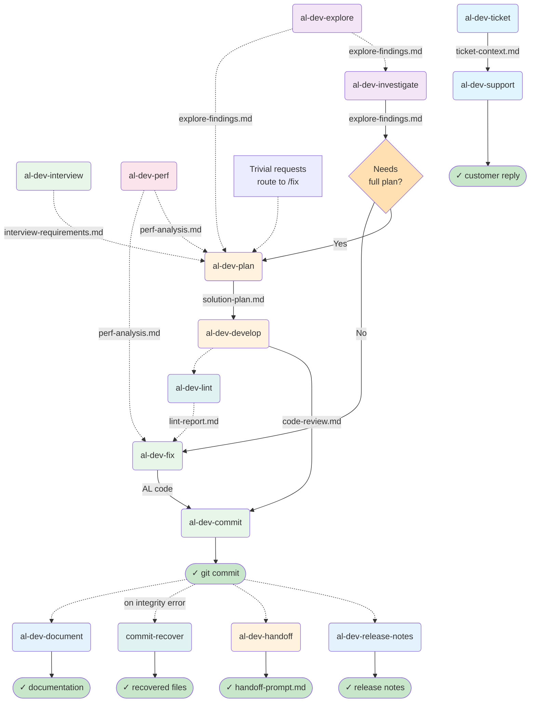
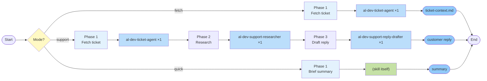
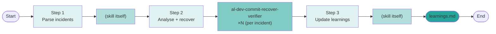
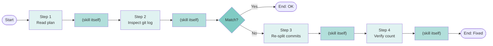

# AL Dev Plugin Map

> A reference tool for understanding skill relationships, agent patterns, and file handoffs in profile-al-dev-shared. This document is for personal gap analysis and extension planning, not onboarding.

**Last updated:** 2026-05-22 (18 active skills merged /al-dev-ticket+support, 2 archived maintenance tools, 5-lens strategic analysis complete)
**Scope:** Active skills only. Archived items (al-dev-test, test-engineer agents, al-dev-test-coverage-reviewer, al-dev-align, plugin-health-daemon) excluded. `/align-harness-repos` and `/plugin-health-daemon` are project-local maintenance tools in `.claude/skills/`, not distributed in the plugin.

---

## Layer 1: Lifecycle Overview

This diagram shows pre-planning tributaries (dashed, optional), the three main entry points, and the development spine through to post-commit output.

---

## Layer 2: Per-Skill Drill-Downs

Each skill is shown with its internal phases, spawned agents, and key outputs. Agents are referenced by their full type name (e.g., `al-dev-shared:al-dev-developer`).

### Notation

- **Phase**: Numbered step inside the skill
- **Agent**: Which agent (or skill itself) executes the phase
- **Pattern**: ×1 (serial), ×2-3 (parallel), ×N (variable count)
- **Output**: File written to `.dev/` or code generated

### /al-dev-ticket

**Three modes:** fetch (context only), support (research + reply), quick (brief summary).

### /al-dev-investigate

### /al-dev-fix

**Complexity routing:** Trivial fixes skip the analysis phase; complex fixes route through al-dev-solution-architect.

### /al-dev-plan

**Competitive design phase:** Multiple architects propose approaches in parallel; the skill synthesises the winner into a solution plan.

### /al-dev-develop

**Three-reviewer panel:** Security, AL expert, and performance reviewers run in parallel, then the skill synthesises findings. Compile-verify loop (with diagnostics fixer) runs before final code review output.

```mermaid
flowchart LR
    Start([Start]) --> Phase1["Phase 1<br/>Read plan"]
    Phase1 --> SkillWork1["(skill itself)"]
    SkillWork1 --> Phase2["Phase 2<br/>Implement"]
    Phase2 --> DevAgent["al-dev-developer ×2-3<br/>parallel"]
    DevAgent --> Phase3["Phase 3<br/>Review<br/>in parallel"]

    Phase3 --> SecReview["al-dev-security-reviewer<br/>×1"]
    Phase3 --> ExpertReview["al-dev-expert-reviewer<br/>×1"]
    Phase3 --> PerfReview["al-dev-performance-reviewer<br/>×1"]

    SecReview --> Phase4["Phase 4<br/>Synthesise"]
    ExpertReview --> Phase4
    PerfReview --> Phase4

    Phase4 --> Phase5["Phase 5<br/>Compile + verify"]
    Phase5 --> SkillWork2["(skill itself)"]
    SkillWork2 --> CompileAgent["al-dev-diagnostics-fixer ×1"]
    CompileAgent --> SkillWork3["(skill itself)"]
    SkillWork3 --> Phase6["Phase 6<br/>Write code review"]
    Phase6 --> SkillWork4["(skill itself)"]
    SkillWork4 --> Output1(["code-review.md"])
    Output1 --> End([End])

    style Phase1 fill:#fff8e1
    style Phase2 fill:#fff8e1
    style Phase3 fill:#fff8e1
    style Phase4 fill:#fff8e1
    style Phase5 fill:#fff8e1
    style Phase6 fill:#fff8e1
    style SkillWork1 fill:#ffe082
    style SkillWork2 fill:#ffe082
    style SkillWork3 fill:#ffe082
    style SkillWork4 fill:#ffe082
    style DevAgent fill:#ffd54f
    style CompileAgent fill:#ffd54f
    style SecReview fill:#ffca28
    style ExpertReview fill:#ffca28
    style PerfReview fill:#ffca28
    style Output1 fill:#fbc02d
```

### /al-dev-commit

**Two-pass execution:** Analysis pass builds manifests and proposes commit groups; message-drafting pass creates commit messages; execution pass runs the commits with hook support. Three agents with focused responsibilities.

### /al-dev-explore

```mermaid
flowchart LR
    Start([Start]) --> Phase1["Step 1<br/>Load context"]
    Phase1 --> SkillWork1["(skill itself)"]
    SkillWork1 --> Phase2["Step 2<br/>Explore"]
    Phase2 --> Agent1["Explore subagent ×1"]
    Agent1 --> Phase3["Step 3<br/>Write findings"]
    Phase3 --> SkillWork2["(skill itself)"]
    SkillWork2 --> Output1(["explore-findings.md"])
    Output1 --> End([End])

    style Phase1 fill:#f3e5f5
    style Phase2 fill:#f3e5f5
    style Phase3 fill:#f3e5f5
    style SkillWork1 fill:#e1bee7
    style SkillWork2 fill:#e1bee7
    style Agent1 fill:#ce93d8
    style Output1 fill:#ba68c8
```

### /al-dev-interview

### /al-dev-lint

### /al-dev-document

### /al-dev-release-notes

### /al-dev-perf

```mermaid
flowchart LR
    Start([Start]) --> Phase1["Step 1<br/>Determine scope"]
    Phase1 --> SkillWork1["(skill itself)"]
    SkillWork1 --> Phase2["Step 2<br/>Analyse"]
    Phase2 --> Agent1["Explore subagent ×1"]
    Agent1 --> Phase3["Step 3<br/>Write report"]
    Phase3 --> SkillWork2["(skill itself)"]
    SkillWork2 --> Output1(["perf-analysis.md"])
    Output1 --> End([End])

    style Phase1 fill:#fce4ec
    style Phase2 fill:#fce4ec
    style Phase3 fill:#fce4ec
    style SkillWork1 fill:#f8bbd0
    style SkillWork2 fill:#f8bbd0
    style Agent1 fill:#f48fb1
    style Output1 fill:#f06292
```

### /al-dev-handoff

### /al-dev-help

No agents spawned; no `.dev/` output. The skill reads available context files and presents contextual guidance inline.

### /commit-recover

Spawns one verifier per corrupted-file incident found in `.dev/commit-integrity.log`.

### /plan-with-critic-swarm

Spawns 6 parallel critic agents (generic Agent tool calls) to red-team a plan. Synthesizes findings into ranked recommendations.

```mermaid
flowchart LR
    Start([Start]) --> Phase1["Phase 1<br/>Generate draft plan"]
    Phase1 --> SkillWork1["(skill itself)"]
    SkillWork1 --> Phase2["Phase 2<br/>Dispatch critics"]
    Phase2 --> Critics["6 Critic agents<br/>in parallel<br/>(security, testability,<br/>type-safety, rollback,<br/>api-contracts, edge-cases)"]
    Critics --> Phase3["Phase 3<br/>Synthesize + rank"]
    Phase3 --> SkillWork2["(skill itself)"]
    SkillWork2 --> Phase4["Phase 4<br/>Apply auto-fixes"]
    Phase4 --> SkillWork3["(skill itself)"]
    SkillWork3 --> Output1(["plan-critique-YYYYMMDD.md"])
    Output1 --> End([End])

    style Phase1 fill:#f8bbd0
    style Phase2 fill:#f8bbd0
    style Phase3 fill:#f8bbd0
    style Phase4 fill:#f8bbd0
    style SkillWork1 fill:#f06292
    style SkillWork2 fill:#f06292
    style SkillWork3 fill:#f06292
    style Critics fill:#f06292
    style Output1 fill:#c2185b
```

### /verify-commits

No agents spawned; compares git commits against plan and optionally re-splits combined commits.

---

## Observations

> Generated by /analyze-skill-design on 2026-05-22 with five parallel lenses: Shared Execution Backbone, Complexity Outliers, Near-Duplicate Shapes, Handoff Chain Gaps, Pre-planning Skills.
> Updated after Tasks 1–8 (2026-05-22): merged /al-dev-ticket+support, split commit agents, upgraded execute model, documented ticket invocation pattern.

### Agents used by only one skill

- **al-dev-ticket-agent** — used by /al-dev-ticket (all modes), /al-dev-support (legacy alias)
- **al-dev-support-researcher** — used only by /al-dev-ticket (support mode)
- **al-dev-support-reply-drafter** — used only by /al-dev-ticket (support mode)
- **al-dev-commit-message-drafter** — used only by /al-dev-commit (message-drafting phase)
- **al-dev-interview** (agent) — used only by /al-dev-interview
- **al-dev-docs-writer** — used only by /al-dev-document
- **al-dev-release-notes-writer** — used only by /al-dev-release-notes
- **al-dev-commit-agent-analysis** — used only by /al-dev-commit (Phase 1; read-only)
- **al-dev-commit-agent-execute** — used only by /al-dev-commit (Phase 2; runs git commits)
- **al-dev-diagnostics-fixer** — used by /al-dev-lint, /al-dev-develop (shared)
- **al-dev-commit-recover-verifier** — used only by /commit-recover
- **al-dev-security-reviewer** — used only by /al-dev-develop
- **al-dev-expert-reviewer** — used only by /al-dev-develop
- **al-dev-performance-reviewer** — used only by /al-dev-develop

### Skills with no dedicated agent (skill does the work itself)

- **/al-dev-handoff** — file copy + prompt assembly; purely shell/file operations
- **/al-dev-help** — reads `.dev/` context files and presents guidance inline
- **/align-harness-repos** — runs an external Python alignment script; all logic is inline (project-local, not distributed)

### Potential shared agents (documented patterns)

- **al-dev-ticket-agent** — used by /al-dev-ticket, /al-dev-support; invocation patterns in `knowledge/ticket-agent-invocation-pattern.md` (recommended)
- **al-dev-developer** — spawned by /al-dev-fix, /al-dev-develop; patterns in `knowledge/architect-invocation-patterns.md` ← implemented
- **al-dev-solution-architect** — spawned by /al-dev-plan, /al-dev-fix; patterns in `knowledge/architect-invocation-patterns.md` ← implemented
- **Explore subagent** — invoked by /al-dev-investigate (×2 parallel), /al-dev-explore (×1), /al-dev-perf (×1); canonical template in `knowledge/explore-subagent-pattern.md` ← implemented
- **al-dev-diagnostics-fixer** — used by /al-dev-lint, /al-dev-develop (compile-verify phase); no shared pattern doc yet
- **Three-reviewer panel** (al-dev-security-reviewer + al-dev-expert-reviewer + al-dev-performance-reviewer) — parallel composition in /al-dev-develop; canonical definition in `knowledge/review-panel-pattern.md` ← implemented

### Architectural suggestions

**Atomise: /al-dev-develop** ← highest leverage

Observation: /al-dev-develop has 6 phases with two clearly separable concern groups: (1) Phases 1–4 handle context gathering and developer partitioning (who builds what), (2) Phases 5–6 handle specialist review synthesis and compilation (what did they build). The work pattern shifts from "resource allocation" to "quality assurance" after Phase 4. A complete (though unreviewed) implementation workflow exists after Phase 4.

Suggestion: Extract Phases 5–6 (review synthesis + compile-verify + code-review output) into a new `/al-dev-review-develop` skill that consumes `/al-dev-develop` code-review output and focuses on post-implementation review orchestration. This splits the monolithic 6-phase skill into two 3–4-phase tools: (1) `/al-dev-develop` focuses on implementation coordination, (2) `/al-dev-review-develop` focuses on multi-reviewer synthesis and final validation.

Trade-off: Adds one skill to learn; enables review workflows to run independently (useful for post-hoc code review, or iterative review gates during development). Each skill becomes narrower and easier to maintain. Requires minor refactoring to split Phase 4 output hand-off.

---

**Merge: /al-dev-explore + /al-dev-perf (as modes of a unified skill)**

Observation: Both /al-dev-explore and /al-dev-perf have identical structure (4 steps, single Explore subagent spawn, dated `.dev/` output), with only one difference: /al-dev-perf adds step-level context prep for performance metrics gathering before spawning the agent. Users must choose between two similar skills when they might naturally combine exploratory investigation with performance scoping.

Suggestion: Unify into `/al-dev-explore --scope={general|performance|refactor}` with mode-specific context preparation. Move perf-specific metadata gathering into the Explore agent's initial context (can be passed as a flag). This reduces the skill list and prevents code duplication of the explore-subagent spawn pattern.

Trade-off: Single skill with three modes; users learn one invoke pattern. Performance exploration becomes a natural option rather than a separate skill. Requires minimal refactoring to Explore agent invocation signature.

---

**✅ Implemented: Merge /al-dev-ticket and /al-dev-support (as modes)**

Status: Completed in Task 4. Both skills now consolidated into `/al-dev-ticket --mode={fetch,support,quick}`:
- `fetch`: loads ticket context only (ticket-context.md)
- `support`: research + reply drafting (customer reply output)
- `quick`: brief summary

Impact: Skill count unchanged (still 18 distributed skills; /al-dev-support now aliases /al-dev-ticket); users have single clear entry point for ticket workflows.

---

**✅ Implemented: Document /al-dev-ticket-agent invocation pattern**

Status: Completed in Task 6. Canonical pattern documented in `knowledge/ticket-agent-invocation-pattern.md` with:
- Phase structure (fetch, download-attachments, detect-inline-images)
- Environment verification rules (FRESHDESK_API_KEY, FRESHDESK_DOMAIN)
- Response schema and error handling

Impact: Single canonical source prevents API contract drift; both /al-dev-ticket modes (fetch and support) reference the same invocation contract.

---

**Connect: Integrate /al-dev-perf output into /al-dev-plan**

Observation: /al-dev-plan Phase 1 correctly loads `perf-analysis.md` when available (line 97-103), but /al-dev-explore output (`explore-findings.md`) is not explicitly checked or loaded in /al-dev-plan's context gathering, even though Layer 1 diagram shows it as a dashed tributary input. Only /al-dev-investigate explicitly loads this output.

Suggestion: Extend /al-dev-plan Phase 1 (after step 5, loading perf-analysis) with step 6: check for `.dev/*-al-dev-explore-findings.md` and include key exploration findings in architect prompts as **"Codebase exploration findings from prior investigation:"**. This mirrors the existing pattern for perf-analysis integration.

Trade-off: Architect prompts become slightly larger when prior exploration exists; one additional glob pattern per plan invocation. Improvement in discoverability of prior exploration findings during planning.

---

**Extend: Add /al-dev-deploy (post-release workflow)**

Observation: The main development spine ends at /al-dev-commit (git commits), then branches to /al-dev-release-notes, /al-dev-handoff, /commit-recover, and /al-dev-document. But no skill consumes release notes and orchestrates actual deployment to UAT→Prod environments, version tagging, or rollback safeguards. Release notes are generated but no downstream workflow manages the deployment lifecycle.

Suggestion: Create `/al-dev-deploy` skill to consume `/al-dev-release-notes` output and manage environment progression (UAT→Staging→Prod), version tagging, rollback gates, and deployment verification. This completes the workflow chain: `/al-dev-commit` → `/al-dev-release-notes` → `/al-dev-deploy` → environment verification.

Trade-off: Adds scope; only worth building if BC deployment management is a frequent manual task. Requires integration with deployment infrastructure (CI/CD, app centers, environment promotion).

---

### Completed architectural moves

**✅ Status: /al-dev-align** — Archived in `profile-al-dev-shared/archived/`. The Python utility (`check-alignment.py`) remains available internally without occupying a slot in the distributed plugin skill registry.

**✅ Status: /plugin-health-daemon** — Moved to `.claude/skills/plugin-health-daemon/` as project-local maintenance infrastructure alongside `/align-harness-repos`.

---

### General observations

The plugin maintains healthy separation of concerns:
- All multi-agent patterns are documented in `knowledge/`
- Separable skill consolidation opportunities (explore+perf, ticket+support) are syntax/mode variations, not architectural conflicts
- Single-use agents are appropriately scoped to domain-specific tasks
- Pre-planning skills (interview/explore/perf) form a coherent optional enrichment layer feeding /al-dev-plan
- Post-commit skills (release-notes/document/handoff/recover) handle orthogonal concerns
- Shared agents (ticket-agent, developer, architect) are used strategically to reduce duplication
- New meta-skills (plan-with-critic-swarm, verify-commits) are well-integrated

### Status summary

**Previous analysis (2026-05-21):** Full architectural lens analysis across all 20 skills. Identified 6 actionable improvement suggestions (3 high-leverage, 3 medium-leverage).
**Analysis update (2026-05-22):** Five lenses applied; 18 skills documented; two maintenance tools moved. Two high-priority suggestions implemented:
- **Implemented:** /al-dev-ticket + /al-dev-support merged into modes (Tasks 1–4)
- **Implemented:** /al-dev-commit split into analysis + message-drafting + execution (Tasks 5–8)
- **Implemented:** al-dev-commit-agent-execute upgraded to sonnet; ticket-agent-invocation-pattern.md documented
Three remaining suggestions in Observations: atomise /al-dev-develop, merge /al-dev-explore+perf, integrate /al-dev-explore output into /al-dev-plan.

### Extension opportunities

1. **Deployment orchestration**: Post-release management is manual. `/al-dev-deploy` skill would complete the workflow (medium priority if deployment is frequently manual).
2. **Performance remediation workflow**: Perf analysis is discovered but not systematically remediated. Consider `/al-dev-perf-remediation` to consume perf reports and track fix progress (low priority).
3. **Lint quality gates**: No automation prevents merge if CRITICAL lint items remain. Optional lint-gate check in /al-dev-commit would improve quality assurance (low priority, lint is advisory).
