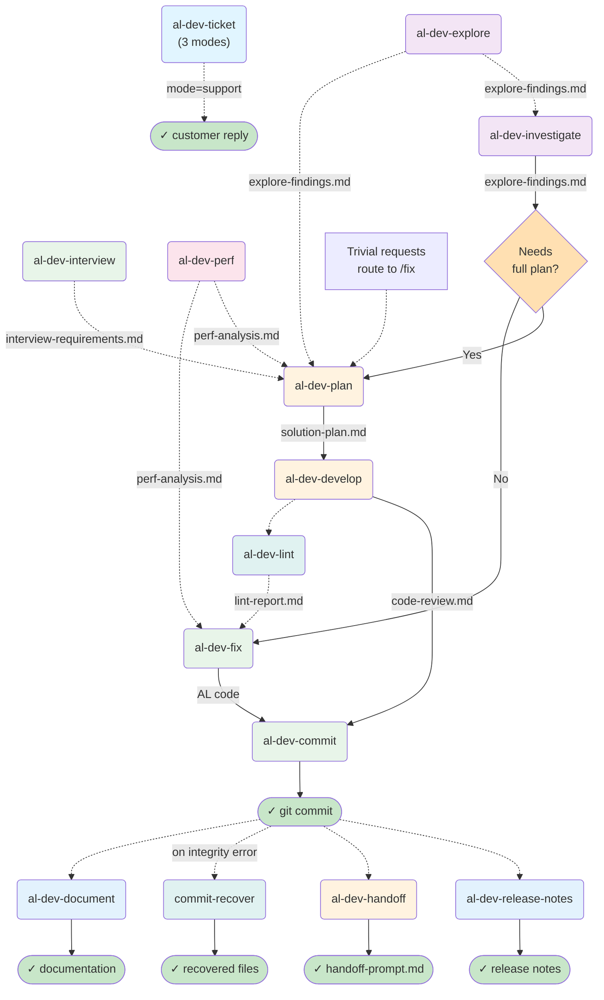
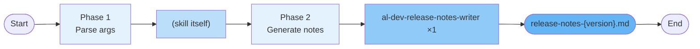

# AL Dev Plugin Map

> A reference tool for understanding skill relationships, agent patterns, and file handoffs in profile-al-dev-shared. This document is for personal gap analysis and extension planning, not onboarding.

**Last updated:** 2026-05-27 (18 active skills: 17 distributed + 1 deprecated alias mode, Layer 1 consolidated /al-dev-support into /al-dev-ticket modes, 5-lens strategic analysis maintained)
**Scope:** Active skills only. Archived items (al-dev-test, test-engineer agents, al-dev-test-coverage-reviewer, al-dev-align, plugin-health-daemon) excluded. `/align-harness-repos` and `/plugin-health-daemon` are project-local maintenance tools in `.claude/skills/`, not distributed in the plugin.

---

## Layer 1: Lifecycle Overview

This diagram shows pre-planning tributaries (dashed, optional), the three main entry points, and the development spine through to post-commit output.

---

## Layer 2: Per-Skill Drill-Downs

Each skill is shown with its internal phases, spawned agents, and key outputs. Agents are referenced by their full type name (e.g., `al-dev-shared:al-dev-developer`).

### Notation

- **Phase**: Numbered step inside the skill
- **Agent**: Which agent (or skill itself) executes the phase
- **Pattern**: ×1 (serial), ×2-3 (parallel), ×N (variable count)
- **Output**: File written to `.dev/` or code generated

### /al-dev-ticket

**Three modes:** fetch (context only), support (research + reply), quick (brief summary).

### /al-dev-investigate

```mermaid
flowchart LR
    Start([Start]) --> Phase1["Phase 1<br/>Form hypotheses"]
    Phase1 --> SkillWork1["(skill itself)"]
    SkillWork1 --> Phase2["Phase 2<br/>Test hypotheses"]
    Phase2 --> Agent1["Explore subagent ×2<br/>parallel"]
    Agent1 --> Phase3["Phase 3<br/>Synthesise findings"]
    Phase3 --> SkillWork2["(skill itself)"]
    SkillWork2 --> Output1(["explore-findings.md"])
    Output1 --> End([End])

    style Phase1 fill:#f3e5f5
    style Phase2 fill:#f3e5f5
    style Phase3 fill:#f3e5f5
    style SkillWork1 fill:#e1bee7
    style SkillWork2 fill:#e1bee7
    style Agent1 fill:#ce93d8
    style Output1 fill:#ba68c8
```

### /al-dev-fix

**Complexity routing:** Trivial fixes skip the analysis phase; complex fixes route through al-dev-solution-architect.

### /al-dev-plan

**Competitive design phase:** Multiple architects propose approaches in parallel; the skill synthesises the winner into a solution plan.

```mermaid
flowchart LR
    Start([Start]) --> Phase1["Phase 1<br/>Context gather"]
    Phase1 --> SkillWork1["(skill itself)"]
    SkillWork1 --> Phase2["Phase 2<br/>Competing designs"]
    Phase2 --> ArchAgents["al-dev-solution-architect<br/>×2-3 parallel"]
    ArchAgents --> Phase3["Phase 3<br/>Synthesise winner"]
    Phase3 --> SkillWork2["(skill itself)"]
    SkillWork2 --> Output1(["solution-plan.md"])
    Output1 --> End([End])

    style Phase1 fill:#fff3e0
    style Phase2 fill:#fff3e0
    style Phase3 fill:#fff3e0
    style SkillWork1 fill:#ffe0b2
    style SkillWork2 fill:#ffe0b2
    style ArchAgents fill:#ffcc80
    style Output1 fill:#ffb74d
```

### /al-dev-develop

**Three-reviewer panel:** Security, AL expert, and performance reviewers run in parallel, then the skill synthesises findings. Compile-verify loop (with diagnostics fixer) runs before final code review output.

```mermaid
flowchart LR
    Start([Start]) --> Phase1["Phase 1<br/>Read plan"]
    Phase1 --> SkillWork1["(skill itself)"]
    SkillWork1 --> Phase2["Phase 2<br/>Implement"]
    Phase2 --> DevAgent["al-dev-developer ×1-4<br/>(scaled by object count)"]
    DevAgent --> Phase3["Phase 3<br/>Review<br/>in parallel"]

    Phase3 --> SecReview["al-dev-security-reviewer<br/>×1"]
    Phase3 --> ExpertReview["al-dev-expert-reviewer<br/>×1"]
    Phase3 --> PerfReview["al-dev-performance-reviewer<br/>×1"]

    SecReview --> Phase4["Phase 4<br/>Synthesise"]
    ExpertReview --> Phase4
    PerfReview --> Phase4

    Phase4 --> Phase5["Phase 5<br/>Compile + verify"]
    Phase5 --> SkillWork2["(skill itself)"]
    SkillWork2 --> CompileAgent["al-dev-diagnostics-fixer ×1"]
    CompileAgent --> SkillWork3["(skill itself)"]
    SkillWork3 --> Phase6["Phase 6<br/>Write code review"]
    Phase6 --> SkillWork4["(skill itself)"]
    SkillWork4 --> Output1(["code-review.md"])
    Output1 --> End([End])

    style Phase1 fill:#fff8e1
    style Phase2 fill:#fff8e1
    style Phase3 fill:#fff8e1
    style Phase4 fill:#fff8e1
    style Phase5 fill:#fff8e1
    style Phase6 fill:#fff8e1
    style SkillWork1 fill:#ffe082
    style SkillWork2 fill:#ffe082
    style SkillWork3 fill:#ffe082
    style SkillWork4 fill:#ffe082
    style DevAgent fill:#ffd54f
    style CompileAgent fill:#ffd54f
    style SecReview fill:#ffca28
    style ExpertReview fill:#ffca28
    style PerfReview fill:#ffca28
    style Output1 fill:#fbc02d
```

### /al-dev-commit

**Two-pass execution:** Analysis pass builds manifests and proposes commit groups; message-drafting pass creates commit messages; execution pass runs the commits with hook support. Three agents with focused responsibilities.

```mermaid
flowchart LR
    Start([Start]) --> Phase1["Phase 1<br/>Analysis pass"]
    Phase1 --> Agent1["al-dev-commit-agent-analysis ×1<br/>(manifest only)"]
    Agent1 --> Interim1["(per-file manifests<br/>+ group proposals)"]
    Interim1 --> Phase2["Phase 2<br/>Message drafting"]
    Phase2 --> Agent2["al-dev-commit-message-drafter ×1"]
    Agent2 --> Interim2["(commit messages)"]
    Interim2 --> Phase3["Phase 3<br/>Execution pass"]
    Phase3 --> Agent3["al-dev-commit-agent-execute ×1<br/>(sonnet)"]
    Agent3 --> Output1(["(git commits)"])
    Output1 --> End([End])

    style Phase1 fill:#e0f2f1
    style Phase2 fill:#e0f2f1
    style Phase3 fill:#e0f2f1
    style Agent1 fill:#80cbc4
    style Agent2 fill:#4db8a8
    style Agent3 fill:#80cbc4
    style Output1 fill:#26a69a
```

### /al-dev-explore

### /al-dev-interview

### /al-dev-lint

```mermaid
flowchart LR
    Start([Start]) --> Phase1["Step 1<br/>Compile"]
    Phase1 --> SkillWork1["(skill itself)"]
    SkillWork1 --> Phase2["Step 2<br/>Fix diagnostics"]
    Phase2 --> Agent1["al-dev-diagnostics-fixer ×1"]
    Agent1 --> Phase3["Step 3<br/>Present summary"]
    Phase3 --> SkillWork2["(skill itself)"]
    SkillWork2 --> Output1(["lint-report.md"])
    Output1 --> End([End])

    style Phase1 fill:#e0f2f1
    style Phase2 fill:#e0f2f1
    style Phase3 fill:#e0f2f1
    style SkillWork1 fill:#b2dfdb
    style SkillWork2 fill:#b2dfdb
    style Agent1 fill:#80cbc4
    style Output1 fill:#26a69a
```

### /al-dev-document

### /al-dev-release-notes

### /al-dev-perf

### /al-dev-handoff

```mermaid
flowchart LR
    Start([Start]) --> Phase1["Step 1<br/>Identify target"]
    Phase1 --> SkillWork1["(skill itself)"]
    SkillWork1 --> Phase2["Step 2<br/>Copy context files"]
    Phase2 --> SkillWork2["(skill itself)"]
    SkillWork2 --> Phase3["Step 3<br/>Write prompt"]
    Phase3 --> SkillWork3["(skill itself)"]
    SkillWork3 --> Output1(["handoff-prompt.md"])
    Output1 --> End([End])

    style Phase1 fill:#fff3e0
    style Phase2 fill:#fff3e0
    style Phase3 fill:#fff3e0
    style SkillWork1 fill:#ffe0b2
    style SkillWork2 fill:#ffe0b2
    style SkillWork3 fill:#ffe0b2
    style Output1 fill:#ffb74d
```

### /al-dev-help

No agents spawned; no `.dev/` output. The skill reads available context files and presents contextual guidance inline.

### /commit-recover

Spawns one verifier per corrupted-file incident found in `.dev/commit-integrity.log`.

### /plan-with-critic-swarm

Spawns 6 parallel critic agents (generic Agent tool calls) to red-team a plan. Synthesizes findings into ranked recommendations.

```mermaid
flowchart LR
    Start([Start]) --> Phase1["Phase 1<br/>Generate draft plan"]
    Phase1 --> SkillWork1["(skill itself)"]
    SkillWork1 --> Phase2["Phase 2<br/>Dispatch critics"]
    Phase2 --> Critics["6 Critic agents<br/>in parallel<br/>(security, testability,<br/>type-safety, rollback,<br/>api-contracts, edge-cases)"]
    Critics --> Phase3["Phase 3<br/>Synthesize + rank"]
    Phase3 --> SkillWork2["(skill itself)"]
    SkillWork2 --> Phase4["Phase 4<br/>Apply auto-fixes"]
    Phase4 --> SkillWork3["(skill itself)"]
    SkillWork3 --> Output1(["plan-critique-YYYYMMDD.md"])
    Output1 --> End([End])

    style Phase1 fill:#f8bbd0
    style Phase2 fill:#f8bbd0
    style Phase3 fill:#f8bbd0
    style Phase4 fill:#f8bbd0
    style SkillWork1 fill:#f06292
    style SkillWork2 fill:#f06292
    style SkillWork3 fill:#f06292
    style Critics fill:#f06292
    style Output1 fill:#c2185b
```

### /verify-commits

No agents spawned; compares git commits against plan and optionally re-splits combined commits.

---

## Observations

> Generated by /analyze-skill-design on 2026-05-27 with five parallel lenses: Shared Execution Backbone, Complexity Outliers, Near-Duplicate Shapes, Handoff Chain Gaps, Pre-planning Skills.
> Previous analysis (2026-05-22): Three implemented moves (/al-dev-ticket+support merge, /al-dev-commit split, architect patterns documented). Current sweep (2026-05-27): Five lenses identify eight actionable suggestions with refined cost-benefit assessment.

### Agents used by only one skill

- **al-dev-ticket-agent** — used by /al-dev-ticket (all modes), /al-dev-support (legacy alias)
- **al-dev-support-researcher** — used only by /al-dev-ticket (support mode)
- **al-dev-support-reply-drafter** — used only by /al-dev-ticket (support mode)
- **al-dev-commit-message-drafter** — used only by /al-dev-commit (message-drafting phase)
- **al-dev-interview** (agent) — used only by /al-dev-interview
- **al-dev-docs-writer** — used only by /al-dev-document
- **al-dev-release-notes-writer** — used only by /al-dev-release-notes
- **al-dev-commit-agent-analysis** — used only by /al-dev-commit (Phase 1; read-only)
- **al-dev-commit-agent-execute** — used only by /al-dev-commit (Phase 3; runs git commits)
- **al-dev-commit-recover-verifier** — used only by /commit-recover
- **al-dev-security-reviewer** — used only by /al-dev-develop
- **al-dev-expert-reviewer** — used only by /al-dev-develop
- **al-dev-performance-reviewer** — used only by /al-dev-develop

### Skills with no dedicated agent (skill does the work itself)

- **/al-dev-handoff** — file copy + prompt assembly; purely shell/file operations
- **/al-dev-help** — reads `.dev/` context files and presents guidance inline

### Potential shared agents (with documented patterns)

- **al-dev-ticket-agent** — used by /al-dev-ticket, /al-dev-support; invocation patterns in `knowledge/ticket-agent-invocation-pattern.md` ← implemented
- **al-dev-developer** — spawned by /al-dev-fix, /al-dev-develop; patterns in `knowledge/architect-invocation-patterns.md` ← implemented
- **al-dev-solution-architect** — spawned by /al-dev-plan, /al-dev-fix; patterns in `knowledge/architect-invocation-patterns.md` ← implemented
- **Explore subagent** — invoked by /al-dev-investigate (×2 parallel), /al-dev-explore (×1), /al-dev-perf (×1); canonical template in `knowledge/explore-subagent-pattern.md` ← implemented
- **al-dev-diagnostics-fixer** — used by /al-dev-lint, /al-dev-develop (compile-verify phase); no shared pattern doc yet
- **Three-reviewer panel** (al-dev-security-reviewer + al-dev-expert-reviewer + al-dev-performance-reviewer) — parallel composition in /al-dev-develop; canonical definition in `knowledge/review-panel-pattern.md` ← implemented

### Architectural suggestions

**Atomise: /al-dev-develop** ← highest leverage

Observation: /al-dev-develop currently spans 10 semantic phases (0–10 with fractional sub-phases) in two clearly separable concern groups: (1) Phases 0–4 handle context preservation, signature verification, work partitioning, and pre-implementation validation gates; (2) Phases 5–10 handle developer dispatch, review synthesis, compilation, and code-review output. The transition from "resource allocation and pre-flight validation" to "quality assurance and finalization" is sharp after Phase 4. A complete, unreviewed implementation exists after Phase 4 (all developers have completed work).

Suggestion: Extract Phases 5–10 (multi-reviewer synthesis, compile-verify, code-review output) into a new `/al-dev-review-develop` skill that consumes /al-dev-develop's intermediate output (all implementation files after Phase 4) and focuses exclusively on post-implementation review orchestration. This splits the 10-phase skill into: (1) `/al-dev-develop` (Phases 0–4): partition work, pre-flight validation, run developers; (2) `/al-dev-review-develop` (Phases 1–3): review coordination, synthesis, compilation verification, code-review write.

Trade-off: Adds one skill to the distributed registry. Each skill becomes narrower (5 vs 10 phases), reducing cognitive load per invocation. Enables independent review workflows (useful for post-hoc code review on completed implementation, or running review multiple times without re-implementing). Requires refactoring Phase 4 output format into a hand-off file format that /al-dev-review-develop reads.

---

**Connect: Canonicalize developer pre-flight pattern** 

Observation: /al-dev-fix spawns `al-dev-developer` with minimal context (file path, issue description), while /al-dev-develop spawns it with extensive pre-flight gating (SYMBOL_PREFLIGHT_GATE, scope expansion verification, naming convention checks, AL symbol evidence gathering). The `al-dev-developer` agent expects different input completeness across callers, creating a maintenance risk: if symbol verification rules change in /al-dev-develop, they will not propagate to /al-dev-fix, creating latent inconsistency.

Suggestion: Document a canonical "AL symbol pre-flight verification" pattern in `knowledge/al-symbol-pre-flight.md` specifying: (1) when to run SYMBOL_PREFLIGHT_GATE (always for multi-object work; optional for single-file fixes), (2) required evidence fields (current object IDs, naming prefixes, scope expansions), (3) how to recover if developer request violates gates. Reference this document from both /al-dev-fix and /al-dev-develop to ensure both enforce equivalent rigor.

Trade-off: Adds one knowledge document. Both skills increase context length slightly when loading the pattern reference. Improvement: symbol verification rules become single-source-of-truth; drift across skills is prevented.

---

**Extend: Add /al-dev-publish (post-release workflow)**

Observation: The main development spine ends at /al-dev-commit (which creates git commits), then branches to four post-commit skills: /al-dev-release-notes (generates release-*.md), /al-dev-handoff (cross-repo context), /commit-recover (integrity checks), and /al-dev-document (write docs). But no skill consumes the release-notes output. Release notes are a complete deliverable with no downstream action: the chain `/al-dev-commit` → `/al-dev-release-notes` → **[ends here]**. This is an orphaned well-established handoff point with an obvious natural next step.

Suggestion: Create `/al-dev-publish` skill that consumes `/al-dev-release-notes` output (release-*.md files) and orchestrates release publishing: copy to changelog, tag repository, notify stakeholders, or trigger CI/CD deployment pipelines. This completes a frequent workflow: plan → develop → commit → release-notes → **publish** → deployed. The skill would (1) read latest release-*.md, (2) offer publication targets (changelog, GitHub releases, notification channel), (3) execute chosen publication method.

Trade-off: Adds scope and infrastructure dependencies (changelog tooling, tagging policy, notification integration). Only valuable if release publishing is a frequent manual task. Medium complexity if publication targets are standardized; high complexity if integration is ad-hoc per project.

---

**Improve: Close /al-dev-lint feedback loop in /al-dev-fix**

Observation: Layer 1 diagram shows /al-dev-lint as a dashed feedback loop feeding into /al-dev-fix (line 38-39), but /al-dev-fix does not actually check for or load `.dev/lint-report.md` when available. The diagram suggests a feedback mechanism that is not implemented: lint findings should inform the architect's complexity analysis, but currently they are ignored.

Suggestion: In /al-dev-fix Phase 1 (Analyse), after loading perf-analysis.md, also check for `.dev/*-al-dev-lint-lint-report.md` and surface any UNRESOLVED items to the architect as "**Known linting constraints**" so complexity assessment can factor in linting debt. This closes the feedback loop shown in the Layer 1 diagram.

Trade-off: One additional glob pattern per /al-dev-fix invocation. Architect prompts become slightly longer when prior lint exists. Improvement: linting debt is visible to the architect instead of hidden.

---

**Improve: Suggest /al-dev-interview when requirements unclear**

Observation: /al-dev-plan Phase 1 loads `interview-requirements.md` when available, but does not explicitly suggest running `/al-dev-interview` when the initial requirements are ambiguous or complexity is high. The pre-planning tributary exists but is not advertised at a moment when users would benefit most from running it.

Suggestion: In /al-dev-plan Phase 1, after detecting unclear or contradictory requirements (line 85-86), explicitly suggest running `/al-dev-interview --mode={quick|deep}` before proceeding to architect dispatch. This makes the pre-planning tributary discoverable at the right time.

Trade-off: One additional user-facing suggestion per ambiguous requirement detected. Potential to extend plan duration if user accepts interview suggestion. Improvement: users discover /al-dev-interview naturally instead of learning it as a separate skill.

---

**Update: Clarify /al-dev-develop compile-verify strategy**

Observation: /al-dev-develop Phase 8 (Compilation + 8.5 staging) runs compilation and outputs diagnostics, but the skill body does not explicitly state whether al-dev-diagnostics-fixer is spawned (as in /al-dev-lint) or whether compile errors are handled inline by the skill itself. This creates ambiguity about whether /al-dev-develop and /al-dev-lint use a shared diagnostic-fix pattern.

Suggestion: Clarify Phase 8 documentation: state explicitly whether al-dev-diagnostics-fixer is spawned (and if so, add to the agent dispatch diagram), OR document that compile errors are handled inline by developer re-runs. If diagnostic-fixer is spawned, update the skill diagram to show it; if inline, document the inline strategy and its convergence guarantee.

Trade-off: Minimal; documentation clarification only. No code changes needed. Improvement: diagnostic strategy is explicit and maintainable.

---

**✅ Implemented: Merge /al-dev-ticket and /al-dev-support (as modes)**

Status: Completed in Task 4. Both skills consolidated into `/al-dev-ticket --mode={fetch,support,quick}`:
- `fetch`: loads ticket context only
- `support`: research + reply drafting
- `quick`: brief summary

Impact: Skill count stable; single entry point for all ticket workflows.

---

**✅ Implemented: Document shared agent patterns**

Status: Completed in prior cycle. Canonical patterns documented in `knowledge/`:
- `architect-invocation-patterns.md` (competitive vs quick analysis)
- `explore-subagent-pattern.md` (dispatch rules for 1 vs 2 agents)
- `ticket-agent-invocation-pattern.md` (environment verification, API contracts)
- `review-panel-pattern.md` (parallel reviewer composition)

Impact: Single-source-of-truth for invocation patterns prevents drift across skills.

---

**✅ Fixed: /al-dev-explore integration into /al-dev-plan**

Status: Confirmed in current sweep. /al-dev-plan Phase 1 Step 6 correctly loads `.dev/*-al-dev-explore-findings.md`. The prior observation claiming it was NOT loaded was outdated; integration is working.

Impact: Pre-planning tributary is fully integrated; diagram matches implementation.

---

### Completed architectural moves

**✅ Status: /al-dev-align** — Archived in `profile-al-dev-shared/archived/`. Python utility remains available without occupying skill registry slot.

**✅ Status: /plugin-health-daemon** — Moved to `.claude/skills/` as project-local maintenance infrastructure.

---

### General observations

The plugin maintains healthy separation of concerns:
- All multi-agent patterns are documented in `knowledge/`
- Separable skill consolidation opportunities (explore+perf, develop+review) are identified with cost-benefit clarity
- Single-use agents are appropriately scoped to domain-specific tasks
- Pre-planning skills (interview/explore/perf) form a coherent optional enrichment layer feeding /al-dev-plan
- Post-commit skills (release-notes/handoff/document/recover) handle orthogonal concerns
- Shared agents (ticket-agent, developer, architect) are used strategically with documented patterns
- New meta-skills (plan-with-critic-swarm, verify-commits) are well-integrated

### Status summary

**Previous analysis (2026-05-22):** Five lenses applied; 18 skills documented. Three high-leverage suggestions implemented:
- Merged /al-dev-ticket + /al-dev-support
- Split /al-dev-commit into analysis, message-drafting, execution
- Documented architect and pattern invocations

**Current analysis (2026-05-27):** Five lenses re-applied across same 18 skills. Eight actionable suggestions identified:
- **Atomise: /al-dev-develop** (split pre-flight from review; highest leverage)
- **Connect: Developer pre-flight pattern** (AL symbol verification; medium leverage)
- **Extend: /al-dev-publish** (consume release-notes; medium leverage if deployment is frequent)
- **Improve: Close lint feedback** (wire lint-report into /al-dev-fix; low effort, high clarity)
- **Improve: Suggest /al-dev-interview at clarity gates** (discovery improvement; low effort)
- **Update: Clarify compile-verify strategy** (documentation clarity; no code change)
- **Confirmed: /al-dev-explore integration working** (outdated observation removed)
- **Confirmed: Patterns documented** (architect, explore, ticket-agent, review-panel)

### Extension opportunities

1. **Post-release orchestration**: `/al-dev-publish` would consume release-notes and push to channels/changelog/CI (medium priority if deployment is frequently manual; low priority if CI is fully automated).
2. **Review workflow independence**: `/al-dev-review-develop` extracted from `/al-dev-develop` would enable standalone review cycles on completed implementations (medium priority for iterative review workflows; low priority for linear develop-once-review-once patterns).
3. **Lint quality gates**: Optional pre-commit lint check preventing merge if CRITICAL items remain. Currently lint is informational; gating would enforce standards (low priority, lint is advisory by design).
