# AL Dev Plugin Map

> A reference tool for understanding skill relationships, agent patterns, and file handoffs in profile-al-dev-shared. This document is for personal gap analysis and extension planning, not onboarding.

**Last updated:** 2026-06-01 (24 active skill directories in `profile-al-dev-shared/skills`: 20 primary lifecycle skills + 1 distributed utility + 3 maintainer-only tools)
**Scope:** Active skill directories only. Archived items (`al-dev-test`, test-engineer agents, `al-dev-test-coverage-reviewer`, `al-dev-align`) excluded. Layer 1 contains 20 primary lifecycle skills. Layer 2 includes 1 additional distributed utility (`/al-dev-help`). Maintainer-only tools (`/al-dev-diagram-generator`, `/al-dev-map-suggestions-verify`, `/plugin-health-audit`) are documented for reference but not part of the distributed plugin surface.

---

## Layer 1: Lifecycle Overview

This diagram shows pre-planning tributaries (dashed, optional), the three main entry points, and the development spine through to post-commit output.

<!-- BEGIN GENERATED: skill-lifecycle-mermaid -->
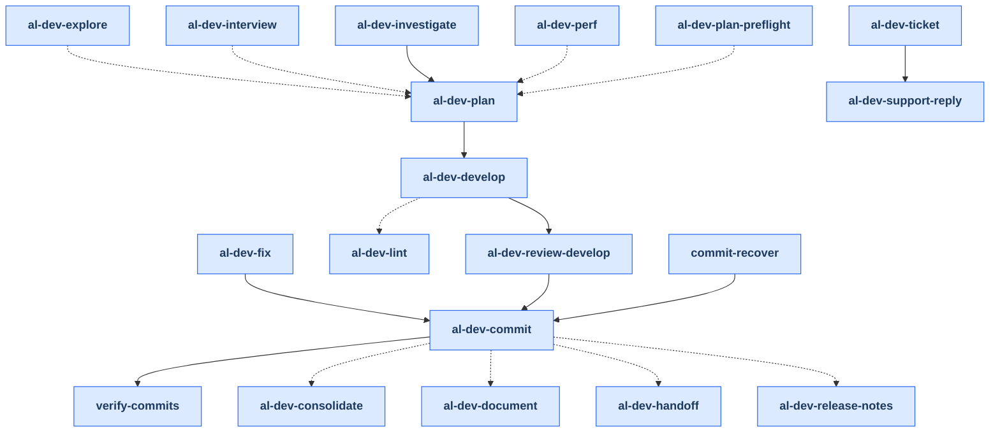
<!-- END GENERATED: skill-lifecycle-mermaid -->

---

## Layer 2: Per-Skill Drill-Downs

Each skill is shown with its internal phases, spawned agents, and key outputs. Agents are referenced by their full type name (for example, `al-dev-shared:al-dev-developer-tdd`).

### Notation

- **Phase**: Numbered step inside the skill
- **Agent**: Which agent (or skill itself) executes the phase
- **Pattern**: ×1 (serial), ×2-3 (parallel), ×N (variable count)
- **Output**: File written to `.dev/` or code generated

### /al-dev-ticket

**Two modes:** `--mode=context-only` (default fetch/context only) and `--mode=full` (fetch context then chains to `/al-dev-support-reply`). Research and reply drafting are handled by `/al-dev-support-reply`. Phases: 0, 0.5, 5.

<!-- BEGIN GENERATED: skill-drilldown-al-dev-ticket -->
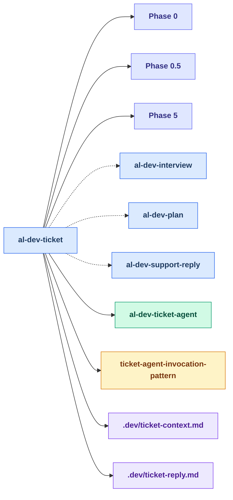

Agents spawned: `al-dev-shared:al-dev-ticket-agent`
<!-- END GENERATED: skill-drilldown-al-dev-ticket -->

### /al-dev-support-reply

Follow-on support workflow used after `/al-dev-ticket --mode=full`. Researches the issue and drafts the customer-facing reply using the ticket context prepared upstream. Phases: 0–3.

<!-- BEGIN GENERATED: skill-drilldown-al-dev-support-reply -->
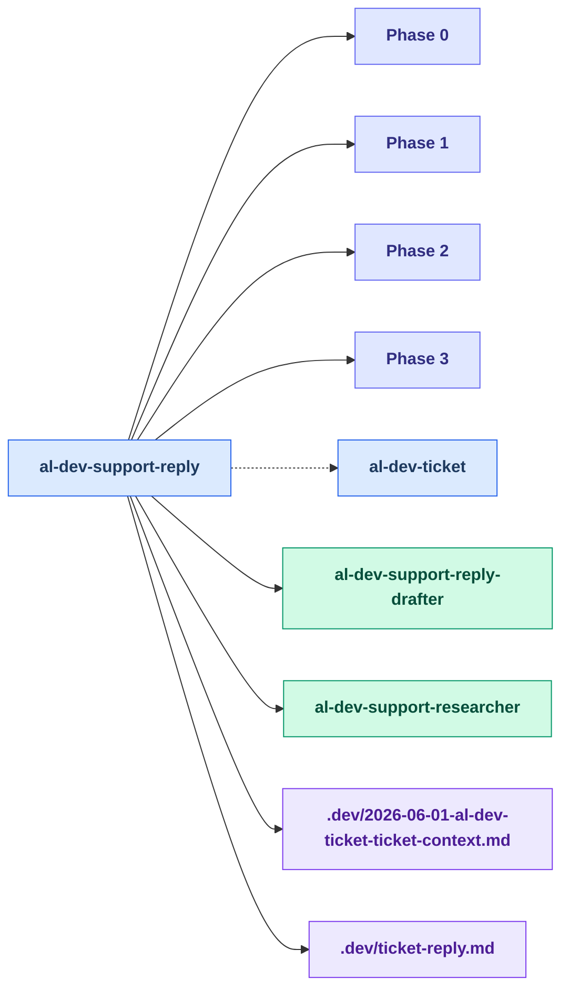

Agents spawned: `al-dev-shared:al-dev-support-reply-drafter`, `al-dev-shared:al-dev-support-researcher`
<!-- END GENERATED: skill-drilldown-al-dev-support-reply -->

### /al-dev-investigate

<!-- BEGIN GENERATED: skill-drilldown-al-dev-investigate -->
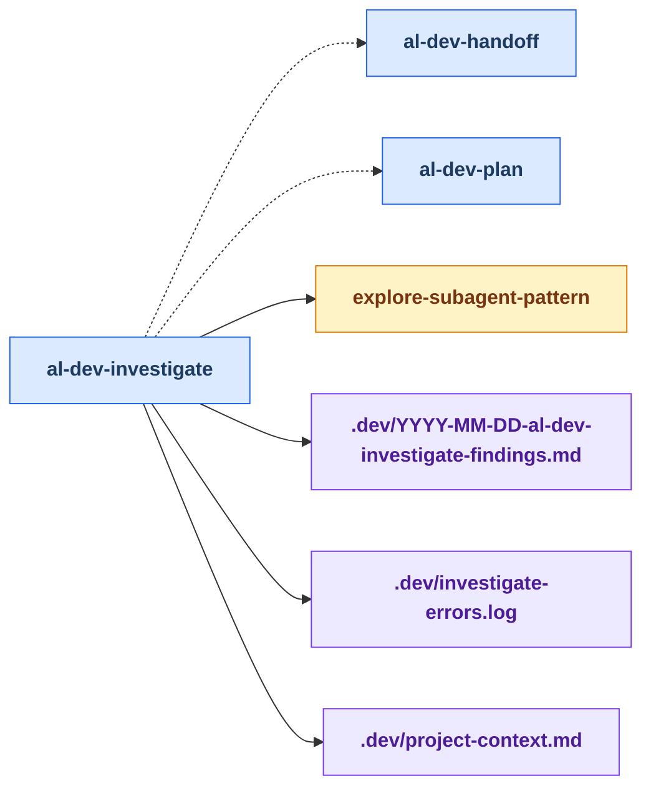
<!-- END GENERATED: skill-drilldown-al-dev-investigate -->

### /al-dev-fix

**Complexity routing:** Trivial fixes skip the analysis phase; complex fixes route through al-dev-solution-architect.

<!-- BEGIN GENERATED: skill-drilldown-al-dev-fix -->
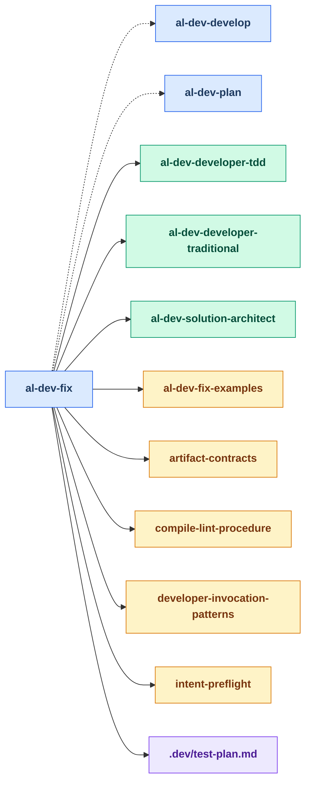

Agents spawned: `al-dev-shared:al-dev-developer-tdd`, `al-dev-shared:al-dev-developer-traditional`, `al-dev-shared:al-dev-solution-architect`
<!-- END GENERATED: skill-drilldown-al-dev-fix -->

### /al-dev-plan

**Competitive design phase:** Dispatches `/al-dev-plan-preflight` first (context assembly + complexity triage), then multiple architects propose approaches in parallel; the skill synthesises the winner into a solution plan. Includes user approval gate before handing off to `/al-dev-develop`. Phases: 0, 2–7.

<!-- BEGIN GENERATED: skill-drilldown-al-dev-plan -->
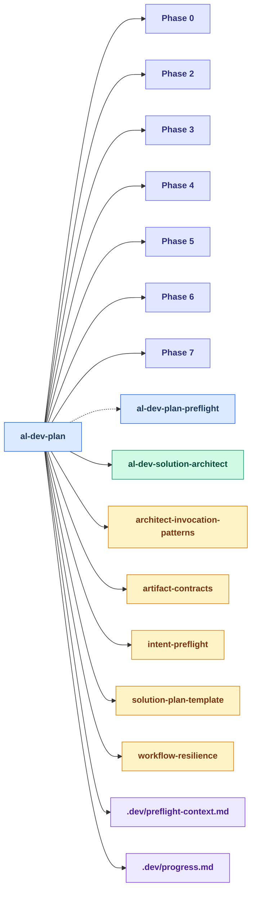

Agents spawned: `al-dev-shared:al-dev-solution-architect`
<!-- END GENERATED: skill-drilldown-al-dev-plan -->

### /al-dev-plan-preflight

Preflight context-assembly workflow that `/al-dev-plan` dispatches before the architect debate. Gathers scope, prior findings, and verified context into `.dev/preflight-context.md`. Phases: 0, 0.5, 1, 1.5, 1.6.

<!-- BEGIN GENERATED: skill-drilldown-al-dev-plan-preflight -->
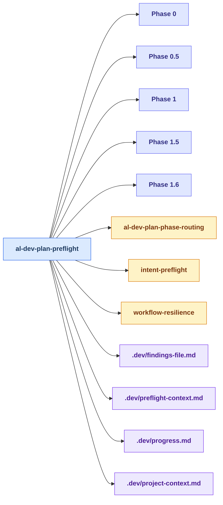
<!-- END GENERATED: skill-drilldown-al-dev-plan-preflight -->

### /al-dev-develop

**Pre-implementation orchestration:** Reads solution plan, validates scope, partitions work across developers, and dispatches parallel developers. Passes Phase 4 handoff to `/al-dev-review-develop` for compilation, review, and code-review output. Phases: 0–4.

<!-- BEGIN GENERATED: skill-drilldown-al-dev-develop -->
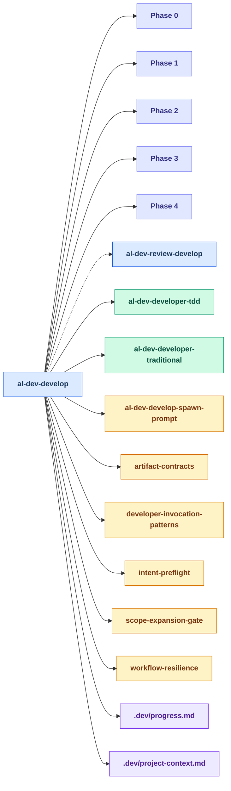

Agents spawned: `al-dev-shared:al-dev-developer-tdd`, `al-dev-shared:al-dev-developer-traditional`
<!-- END GENERATED: skill-drilldown-al-dev-develop -->

### /al-dev-review-develop

**Post-implementation review orchestration:** Consumes Phase 4 handoff from `/al-dev-develop`. Runs compilation verification first (Phase 2) — the review panel is only dispatched if compile passes. Pre-review staging (Phase 3) confirms all prerequisites before the three-specialist panel runs in parallel. Writes code-review artifact and presents findings to user. Phases: 1–6.

<!-- BEGIN GENERATED: skill-drilldown-al-dev-review-develop -->
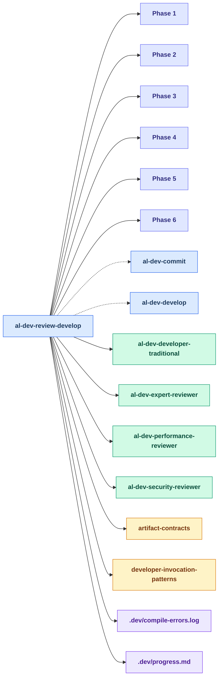

Agents spawned: `al-dev-shared:al-dev-developer-traditional`, `al-dev-shared:al-dev-expert-reviewer`, `al-dev-shared:al-dev-performance-reviewer`, `al-dev-shared:al-dev-security-reviewer`
<!-- END GENERATED: skill-drilldown-al-dev-review-develop -->

### /al-dev-commit

**Multi-pass execution:** Setup and validation (Phase 0) checks project context, file integrity, staged files, acceptance criteria, and advisory alignment; analysis pass (Phase 1) builds manifests and proposes commit groups with message drafting; confirmation pass (Phase 2) gates user approval; preflight pass (Phase 3) runs lint fixes and OOXML validation; execution pass (Phase 4) runs the commits with hook support and presents the final summary. Five agents with focused responsibilities. Phases: 0–4.

<!-- BEGIN GENERATED: skill-drilldown-al-dev-commit -->
```mermaid
flowchart LR
    classDef skillNode fill:#dbeafe,stroke:#2563eb,color:#1e3a5f,font-weight:bold
    classDef agentNode fill:#d1fae5,stroke:#059669,color:#064e3b,font-weight:bold
    classDef knowledgeNode fill:#fef3c7,stroke:#d97706,color:#78350f,font-weight:bold
    classDef artifactNode fill:#ede9fe,stroke:#7c3aed,color:#4c1d95,font-weight:bold
    classDef phaseNode fill:#e0e7ff,stroke:#6366f1,color:#312e81,font-weight:bold

    skill_al_dev_commit[al-dev-commit]
    Phase0["Phase 0"]
    Phase1["Phase 1"]
    Phase2["Phase 2"]
    Phase3["Phase 3"]
    Phase4["Phase 4"]
    agent_al_dev_commit_agent_analysis[al-dev-commit-agent-analysis]
    agent_al_dev_commit_agent_execute[al-dev-commit-agent-execute]
    agent_al_dev_commit_hook_fixer[al-dev-commit-hook-fixer]
    agent_al_dev_commit_lint_fixer[al-dev-commit-lint-fixer]
    agent_al_dev_commit_message_drafter[al-dev-commit-message-drafter]
    agent_al_dev_commit_ooxml_validator[al-dev-commit-ooxml-validator]
    knowledge_artifact_contracts_md[artifact-contracts]
    knowledge_compile_lint_procedure_md[compile-lint-procedure]
    knowledge_intent_preflight_md[intent-preflight]
    artifact_commits_json[.dev/commits.json]
    artifact_compile_errors_log[.dev/compile-errors.log]
    artifact_file_sizes_json[.dev/file-sizes.json]
    artifact_hook_failures_json[.dev/hook-failures.json]

    skill_al_dev_commit --> Phase0
    skill_al_dev_commit --> Phase1
    skill_al_dev_commit --> Phase2
    skill_al_dev_commit --> Phase3
    skill_al_dev_commit --> Phase4
    skill_al_dev_commit --> agent_al_dev_commit_agent_analysis
    skill_al_dev_commit --> agent_al_dev_commit_agent_execute
    skill_al_dev_commit --> agent_al_dev_commit_hook_fixer
    skill_al_dev_commit --> agent_al_dev_commit_lint_fixer
    skill_al_dev_commit --> agent_al_dev_commit_message_drafter
    skill_al_dev_commit --> agent_al_dev_commit_ooxml_validator
    skill_al_dev_commit --> knowledge_artifact_contracts_md
    skill_al_dev_commit --> knowledge_compile_lint_procedure_md
    skill_al_dev_commit --> knowledge_intent_preflight_md
    skill_al_dev_commit --> artifact_commits_json
    skill_al_dev_commit --> artifact_compile_errors_log
    skill_al_dev_commit --> artifact_file_sizes_json
    skill_al_dev_commit --> artifact_hook_failures_json

    class skill_al_dev_commit skillNode
    class Phase0 phaseNode
    class Phase1 phaseNode
    class Phase2 phaseNode
    class Phase3 phaseNode
    class Phase4 phaseNode
    class agent_al_dev_commit_agent_analysis agentNode
    class agent_al_dev_commit_agent_execute agentNode
    class agent_al_dev_commit_hook_fixer agentNode
    class agent_al_dev_commit_lint_fixer agentNode
    class agent_al_dev_commit_message_drafter agentNode
    class agent_al_dev_commit_ooxml_validator agentNode
    class knowledge_artifact_contracts_md knowledgeNode
    class knowledge_compile_lint_procedure_md knowledgeNode
    class knowledge_intent_preflight_md knowledgeNode
    class artifact_commits_json artifactNode
    class artifact_compile_errors_log artifactNode
    class artifact_file_sizes_json artifactNode
    class artifact_hook_failures_json artifactNode
```

Agents spawned: `al-dev-shared:al-dev-commit-agent-analysis`, `al-dev-shared:al-dev-commit-agent-execute`, `al-dev-shared:al-dev-commit-hook-fixer`, `al-dev-shared:al-dev-commit-lint-fixer`, `al-dev-shared:al-dev-commit-message-drafter`, `al-dev-shared:al-dev-commit-ooxml-validator`
<!-- END GENERATED: skill-drilldown-al-dev-commit -->

### /al-dev-explore

<!-- BEGIN GENERATED: skill-drilldown-al-dev-explore -->
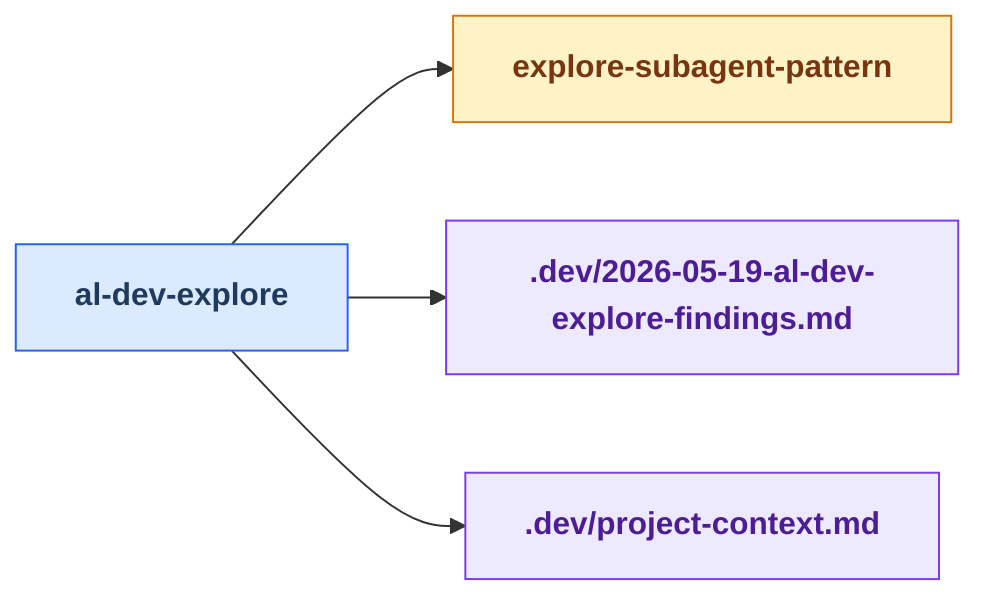
<!-- END GENERATED: skill-drilldown-al-dev-explore -->

### /al-dev-interview

Phases: 1–4.

<!-- BEGIN GENERATED: skill-drilldown-al-dev-interview -->
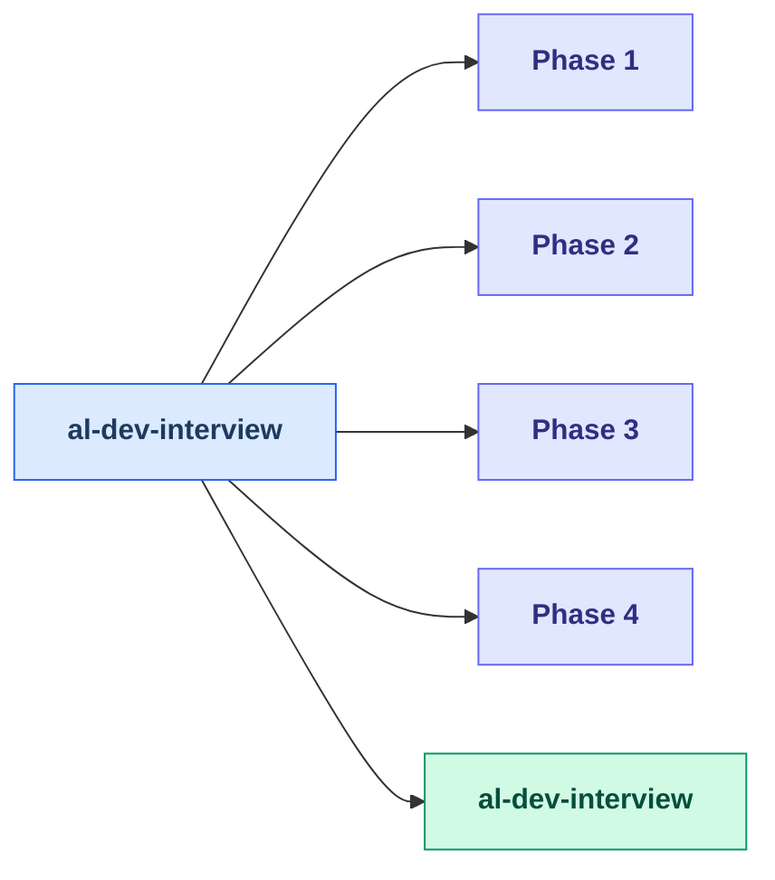

Agents spawned: `al-dev-shared:al-dev-interview`
<!-- END GENERATED: skill-drilldown-al-dev-interview -->

### /al-dev-lint

<!-- BEGIN GENERATED: skill-drilldown-al-dev-lint -->
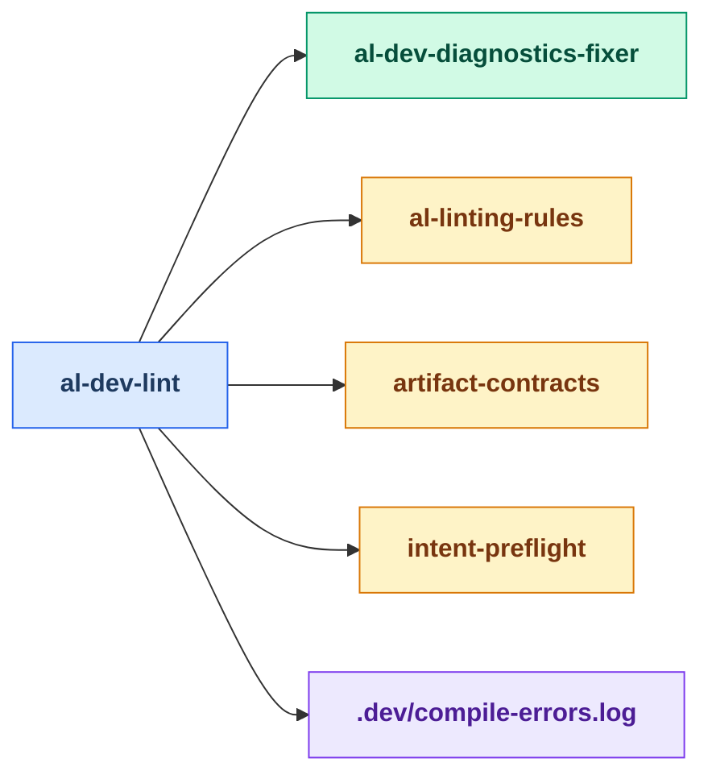

Agents spawned: `al-dev-shared:al-dev-diagnostics-fixer`
<!-- END GENERATED: skill-drilldown-al-dev-lint -->

### /al-dev-document

<!-- BEGIN GENERATED: skill-drilldown-al-dev-document -->
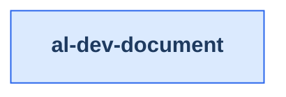
<!-- END GENERATED: skill-drilldown-al-dev-document -->

### /al-dev-release-notes

Phases: 1, 1.5, 2, 3.

<!-- BEGIN GENERATED: skill-drilldown-al-dev-release-notes -->
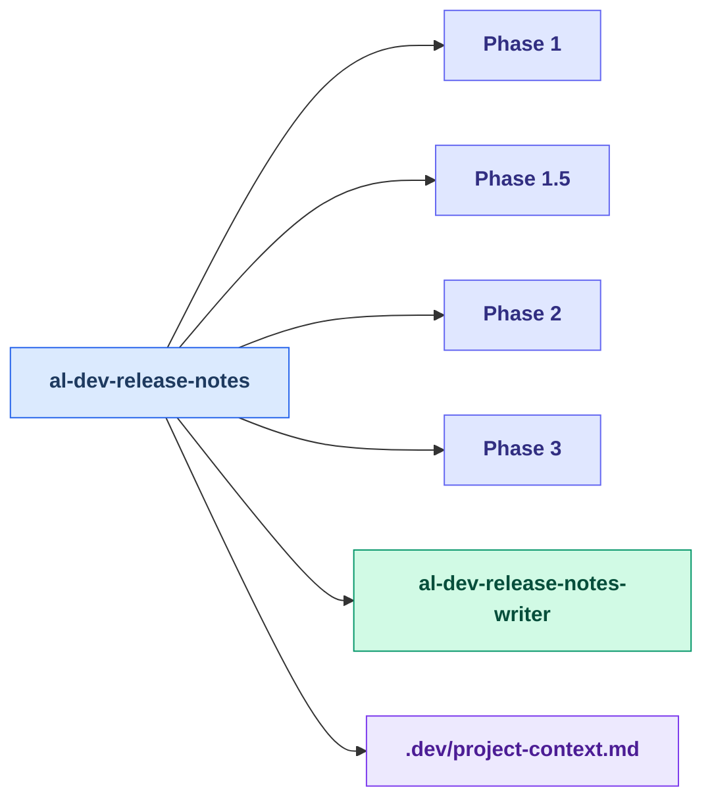

Agents spawned: `al-dev-shared:al-dev-release-notes-writer`
<!-- END GENERATED: skill-drilldown-al-dev-release-notes -->

### /al-dev-perf

<!-- BEGIN GENERATED: skill-drilldown-al-dev-perf -->
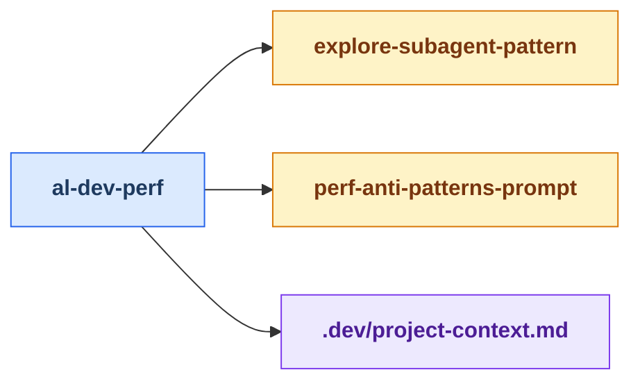
<!-- END GENERATED: skill-drilldown-al-dev-perf -->

### /al-dev-handoff

<!-- BEGIN GENERATED: skill-drilldown-al-dev-handoff -->
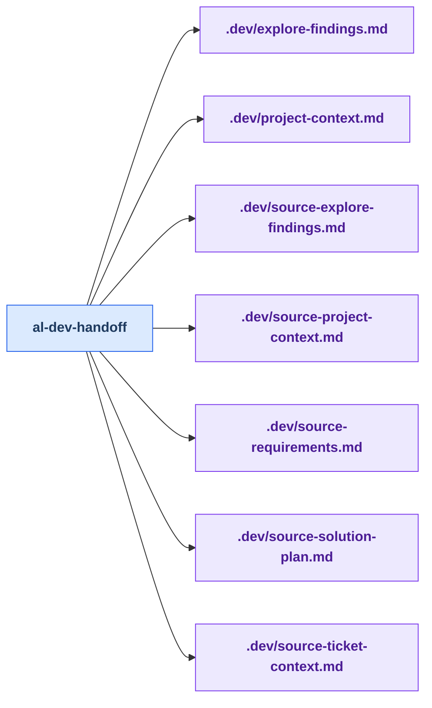
<!-- END GENERATED: skill-drilldown-al-dev-handoff -->

### /al-dev-help

No agents spawned; no `.dev/` output. The skill reads available context files and presents contextual guidance inline.

<!-- BEGIN GENERATED: skill-drilldown-al-dev-help -->
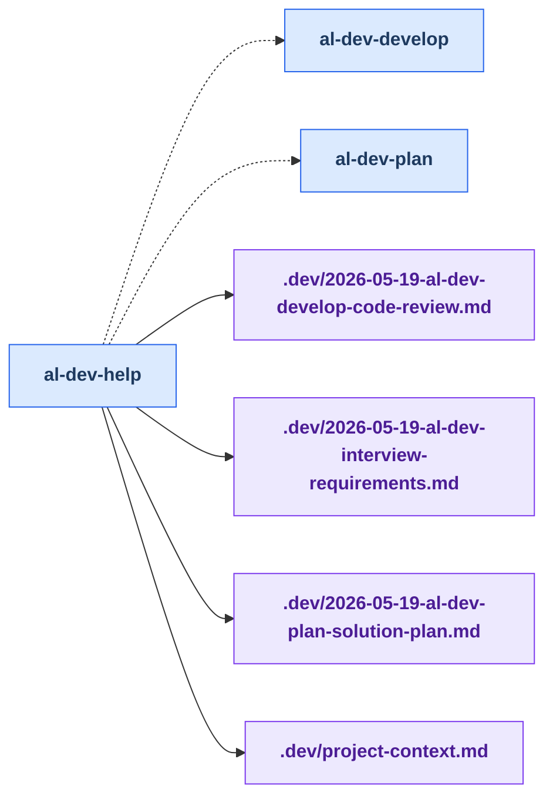
<!-- END GENERATED: skill-drilldown-al-dev-help -->

### /commit-recover

Spawns one fixer per corrupted-file incident found in `.dev/commit-integrity.log`.

<!-- BEGIN GENERATED: skill-drilldown-commit-recover -->
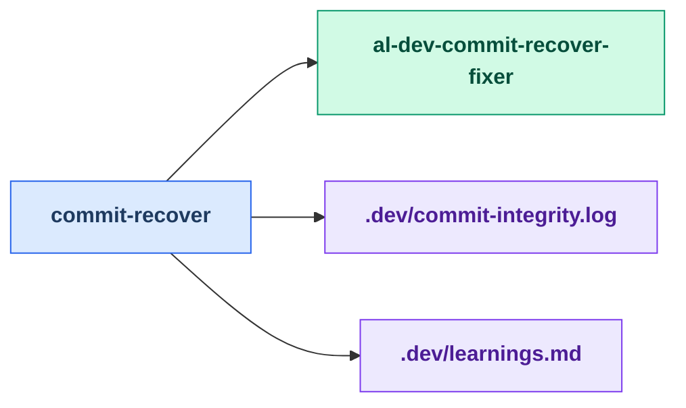

Agents spawned: `al-dev-shared:al-dev-commit-recover-fixer`
<!-- END GENERATED: skill-drilldown-commit-recover -->

### /al-dev-plan-swarm-validate

Spawns 6 parallel critic agents (generic Agent tool calls) to red-team a plan. Synthesizes findings into ranked recommendations.

<!-- BEGIN GENERATED: skill-drilldown-al-dev-plan-swarm-validate -->
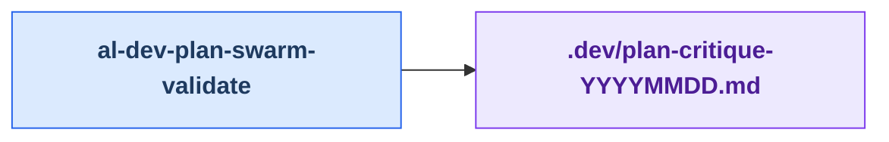
<!-- END GENERATED: skill-drilldown-al-dev-plan-swarm-validate -->

### /verify-commits

No agents spawned; compares git commits against plan and optionally re-splits combined commits.

<!-- BEGIN GENERATED: skill-drilldown-verify-commits -->
```mermaid
flowchart LR
    classDef skillNode fill:#dbeafe,stroke:#2563eb,color:#1e3a5f,font-weight:bold
    classDef agentNode fill:#d1fae5,stroke:#059669,color:#064e3b,font-weight:bold
    classDef knowledgeNode fill:#fef3c7,stroke:#d97706,color:#78350f,font-weight:bold
    classDef artifactNode fill:#ede9fe,stroke:#7c3aed,color:#4c1d95,font-weight:bold
    classDef phaseNode fill:#e0e7ff,stroke:#6366f1,color:#312e81,font-weight:bold

    skill_verify_commits[verify-commits]


    class skill_verify_commits skillNode
```
<!-- END GENERATED: skill-drilldown-verify-commits -->

### /al-dev-consolidate

Standalone utility skill. No agents spawned. Consolidates `.dev/` artifacts
into vault-ready session summaries and an Obsidian-compatible sessions index,
using only bash extraction — file content is never read into LLM context. Phases: 0–4.

<!-- BEGIN GENERATED: skill-drilldown-al-dev-consolidate -->
```mermaid
flowchart LR
    classDef skillNode fill:#dbeafe,stroke:#2563eb,color:#1e3a5f,font-weight:bold
    classDef agentNode fill:#d1fae5,stroke:#059669,color:#064e3b,font-weight:bold
    classDef knowledgeNode fill:#fef3c7,stroke:#d97706,color:#78350f,font-weight:bold
    classDef artifactNode fill:#ede9fe,stroke:#7c3aed,color:#4c1d95,font-weight:bold
    classDef phaseNode fill:#e0e7ff,stroke:#6366f1,color:#312e81,font-weight:bold

    skill_al_dev_consolidate[al-dev-consolidate]
    Phase0["Phase 0"]
    Phase1["Phase 1"]
    Phase2["Phase 2"]
    Phase3["Phase 3"]
    Phase4["Phase 4"]
    knowledge_consolidate_extraction_patterns_md[consolidate-extraction-patterns]

    skill_al_dev_consolidate --> Phase0
    skill_al_dev_consolidate --> Phase1
    skill_al_dev_consolidate --> Phase2
    skill_al_dev_consolidate --> Phase3
    skill_al_dev_consolidate --> Phase4
    skill_al_dev_consolidate --> knowledge_consolidate_extraction_patterns_md

    class skill_al_dev_consolidate skillNode
    class Phase0 phaseNode
    class Phase1 phaseNode
    class Phase2 phaseNode
    class Phase3 phaseNode
    class Phase4 phaseNode
    class knowledge_consolidate_extraction_patterns_md knowledgeNode
```
<!-- END GENERATED: skill-drilldown-al-dev-consolidate -->

### /al-dev-diagram-generator

**Maintainer tool — not part of the main development lifecycle.** Dispatched by `/analyze-agent-design` and `/analyze-skill-design` after their analysis phases complete. Does not appear in the Layer 1 lifecycle diagram because it is called from project-local maintainer tooling (`.claude/skills/`), not from distributed plugin skills.

Generates Mermaid flowchart diagrams showing how the plugin's skills, agents, and knowledge files connect. Writes `docs/al-dev-workflow-diagrams.md`. Phases: 1–4.

| Field | Value |
|---|---|
| Triggered by | `--caller-name <skill-name>` argument from `/analyze-agent-design` or `/analyze-skill-design` |
| Agents spawned | None — skill does all work itself |
| Inputs | Repo source files (grepped via bash); `markdown/md-mermaid-helper.md` style guide |
| Outputs | `docs/al-dev-workflow-diagrams.md` |

<!-- BEGIN GENERATED: skill-drilldown-al-dev-diagram-generator -->
```mermaid
flowchart LR
    classDef skillNode fill:#dbeafe,stroke:#2563eb,color:#1e3a5f,font-weight:bold
    classDef agentNode fill:#d1fae5,stroke:#059669,color:#064e3b,font-weight:bold
    classDef knowledgeNode fill:#fef3c7,stroke:#d97706,color:#78350f,font-weight:bold
    classDef artifactNode fill:#ede9fe,stroke:#7c3aed,color:#4c1d95,font-weight:bold
    classDef phaseNode fill:#e0e7ff,stroke:#6366f1,color:#312e81,font-weight:bold

    skill_al_dev_diagram_generator[al-dev-diagram-generator]
    Phase1["Phase 1"]
    Phase2["Phase 2"]
    Phase3["Phase 3"]
    Phase4["Phase 4"]

    skill_al_dev_diagram_generator --> Phase1
    skill_al_dev_diagram_generator --> Phase2
    skill_al_dev_diagram_generator --> Phase3
    skill_al_dev_diagram_generator --> Phase4

    class skill_al_dev_diagram_generator skillNode
    class Phase1 phaseNode
    class Phase2 phaseNode
    class Phase3 phaseNode
    class Phase4 phaseNode
```
<!-- END GENERATED: skill-drilldown-al-dev-diagram-generator -->

### /al-dev-map-suggestions-verify

**Maintainer tool — not part of the main development lifecycle.** Rubber-ducks architectural suggestions from the map Observations sections using parallel remote agent teams. Reduces session token burn from 1-1.5 hours to 40-50 minutes via async verification and multi-session checkpoint/resume workflow.

Writes `.dev/YYYY-MM-DD-al-dev-plan-plan.md` (generated by `superpowers:writing-plans`).

<!-- BEGIN GENERATED: skill-drilldown-al-dev-map-suggestions-verify -->
```mermaid
flowchart LR
    classDef skillNode fill:#dbeafe,stroke:#2563eb,color:#1e3a5f,font-weight:bold
    classDef agentNode fill:#d1fae5,stroke:#059669,color:#064e3b,font-weight:bold
    classDef knowledgeNode fill:#fef3c7,stroke:#d97706,color:#78350f,font-weight:bold
    classDef artifactNode fill:#ede9fe,stroke:#7c3aed,color:#4c1d95,font-weight:bold
    classDef phaseNode fill:#e0e7ff,stroke:#6366f1,color:#312e81,font-weight:bold

    skill_al_dev_map_suggestions_verify[al-dev-map-suggestions-verify]
    knowledge_map_change_rubber_duck_checks_md[map-change-rubber-duck-checks]
    artifact_YYYY_MM_DD_al_dev_plan_plan_md[.dev/YYYY-MM-DD-al-dev-plan-plan.md]
    artifact_progress_md[.dev/progress.md]

    skill_al_dev_map_suggestions_verify --> knowledge_map_change_rubber_duck_checks_md
    skill_al_dev_map_suggestions_verify --> artifact_YYYY_MM_DD_al_dev_plan_plan_md
    skill_al_dev_map_suggestions_verify --> artifact_progress_md

    class skill_al_dev_map_suggestions_verify skillNode
    class knowledge_map_change_rubber_duck_checks_md knowledgeNode
    class artifact_YYYY_MM_DD_al_dev_plan_plan_md artifactNode
    class artifact_progress_md artifactNode
```
<!-- END GENERATED: skill-drilldown-al-dev-map-suggestions-verify -->

### /plugin-health-audit

**Maintainer tool — not part of the main development lifecycle.** Parallelized health sweep of the al-dev-shared plugin surfaces (skills and agents). Dispatches remote design and quality lenses, ranks findings, and writes dossiers to `docs/health/`. Supports resume workflow to collect results in a separate session. Phases: 1, 3.

<!-- BEGIN GENERATED: skill-drilldown-plugin-health-audit -->
```mermaid
flowchart LR
    classDef skillNode fill:#dbeafe,stroke:#2563eb,color:#1e3a5f,font-weight:bold
    classDef agentNode fill:#d1fae5,stroke:#059669,color:#064e3b,font-weight:bold
    classDef knowledgeNode fill:#fef3c7,stroke:#d97706,color:#78350f,font-weight:bold
    classDef artifactNode fill:#ede9fe,stroke:#7c3aed,color:#4c1d95,font-weight:bold
    classDef phaseNode fill:#e0e7ff,stroke:#6366f1,color:#312e81,font-weight:bold

    skill_plugin_health_audit[plugin-health-audit]
    Phase1["Phase 1"]
    Phase3["Phase 3"]
    artifact_plugin_health_team_checkpoint_json[.dev/plugin-health-team-checkpoint.json]

    skill_plugin_health_audit --> Phase1
    skill_plugin_health_audit --> Phase3
    skill_plugin_health_audit --> artifact_plugin_health_team_checkpoint_json

    class skill_plugin_health_audit skillNode
    class Phase1 phaseNode
    class Phase3 phaseNode
    class artifact_plugin_health_team_checkpoint_json artifactNode
```
<!-- END GENERATED: skill-drilldown-plugin-health-audit -->

---

## Observations

> Generated by /analyze-skill-design on 2026-05-27 with five parallel lenses: Shared Execution Backbone, Complexity Outliers, Near-Duplicate Shapes, Handoff Chain Gaps, Pre-planning Skills.
> Previous analysis (2026-05-22): Three implemented moves (/al-dev-ticket+support consolidation, /al-dev-commit split, architect patterns documented). Current sweep (2026-05-27): Five lenses identify four remaining future-facing suggestions plus four confirmed current-state checks.

### Agents used by only one skill

- **al-dev-ticket-agent** — used by /al-dev-ticket (`--mode=context-only|full`)
- **al-dev-support-researcher** — used only by /al-dev-ticket (`--mode=full`)
- **al-dev-support-reply-drafter** — used only by /al-dev-ticket (`--mode=full`)
- **al-dev-commit-message-drafter** — used only by /al-dev-commit (message-drafting phase)
- **al-dev-interview** (agent) — used only by /al-dev-interview
- **al-dev-docs-writer** — used only by /al-dev-document
- **al-dev-release-notes-writer** — used only by /al-dev-release-notes
- **al-dev-commit-agent-analysis** — used only by /al-dev-commit (Phase 1; read-only)
- **al-dev-commit-agent-execute** — used only by /al-dev-commit (Phase 4; runs git commits)
- **al-dev-commit-lint-fixer** — used only by /al-dev-commit (Phase 3; lint pre-flight)
- **al-dev-commit-ooxml-validator** — used only by /al-dev-commit (Phase 3; OOXML validation)
- **al-dev-commit-recover-fixer** — used only by /commit-recover
- **al-dev-security-reviewer** — used only by /al-dev-review-develop (dispatched in Phase 4)
- **al-dev-expert-reviewer** — used only by /al-dev-review-develop (dispatched in Phase 4)
- **al-dev-performance-reviewer** — used only by /al-dev-review-develop (dispatched in Phase 4)

### Skills with no dedicated agent (skill does the work itself)

- **/al-dev-handoff** — file copy + prompt assembly; purely shell/file operations
- **/al-dev-help** — reads `.dev/` context files and presents guidance inline
- **/al-dev-consolidate** — bash-only artifact extraction; writes session summaries and sessions index to `.dev/sessions/`
- **/al-dev-diagram-generator** — static grep analysis + Mermaid generation; dispatched by `/analyze-agent-design` and `/analyze-skill-design`; writes `docs/al-dev-workflow-diagrams.md`

### Potential shared agents (with documented patterns)

- **al-dev-ticket-agent** — used by /al-dev-ticket; invocation patterns in `knowledge/ticket-agent-invocation-pattern.md` ← implemented
- **al-dev-developer-tdd / al-dev-developer-traditional** — spawned by /al-dev-fix and /al-dev-develop based on test-plan presence; /al-dev-review-develop autonomous compile-fix loops use the traditional variant. Patterns in `knowledge/developer-invocation-patterns.md` ← implemented
- **al-dev-solution-architect** — spawned by /al-dev-plan, /al-dev-fix; patterns in `knowledge/architect-invocation-patterns.md` ← implemented
- **Explore subagent** — invoked by /al-dev-investigate (×2 parallel), /al-dev-explore (×1), /al-dev-perf (×1); canonical template in `knowledge/explore-subagent-pattern.md` ← implemented
- **al-dev-diagnostics-fixer** — used by /al-dev-lint; /al-dev-develop returns compile corrections to developers instead of dispatching the fixer
- **Three-reviewer panel** (al-dev-security-reviewer + al-dev-expert-reviewer + al-dev-performance-reviewer) — parallel composition in /al-dev-develop; canonical definition in `knowledge/review-panel-pattern.md` ← implemented

### Architectural suggestions

**✅ Implemented: /al-dev-review-develop extracted from /al-dev-develop**

Status: Confirmed in current sweep. The live workflow now splits implementation from review:
- `profile-al-dev-shared/skills/al-dev-develop/SKILL.md` produces a Phase 4 handoff for `/al-dev-review-develop`
- `profile-al-dev-shared/skills/al-dev-review-develop/SKILL.md` owns the post-implementation review orchestration (Phase 1-6 local numbering)

Impact: This is no longer remaining implementation scope. The map should treat review-workflow independence as current state, not future work.

---

**Connect: Clarify `/al-dev-fix` escalation boundaries**

Observation: The core propagation work is already present. `/al-dev-fix` now:
- loads prior lint findings on the non-trivial path
- dispatches an architect for non-trivial fixes
- explicitly tells that architect to follow `knowledge/al-symbol-pre-flight.md`

The remaining asymmetry is documentation: `profile-al-dev-shared/knowledge/workflow-routing.md` still describes `/al-dev-fix` as if it were always a direct trivial edit with no planning branch.

Suggestion: Treat symbol pre-flight reuse as implemented for the non-trivial `/al-dev-fix` path. The remaining follow-up is to align routing guidance so `/al-dev-fix` is documented as a fast-fix entrypoint that may escalate to quick architect analysis when the issue is ambiguous, multi-file, or integration-heavy.

Trade-off: Slightly more nuanced routing prose. Improvement: removes false expectations about `/al-dev-fix`, makes existing symbol-rigor behavior discoverable, and avoids adding prompt weight to truly trivial fixes without evidence.

---

**Extend: Add /al-dev-publish (post-release workflow)**

Observation: The main development spine ends at /al-dev-commit (which creates git commits), then branches to four post-commit skills: /al-dev-release-notes (generates dated `.dev/*-al-dev-release-notes-*.md` files), /al-dev-handoff (cross-repo context), /commit-recover (integrity checks), and /al-dev-document (write docs). But no skill consumes the release-notes output. Release notes are a complete deliverable with no downstream action: the chain `/al-dev-commit` → `/al-dev-release-notes` → **[ends here]**. This is an orphaned well-established handoff point with an obvious natural next step.

Suggestion: Create `/al-dev-publish` skill that consumes `/al-dev-release-notes` output (dated `.dev/*-al-dev-release-notes-*.md` files) and orchestrates release publishing: copy to changelog, tag repository, notify stakeholders, or trigger CI/CD deployment pipelines. This completes a frequent workflow: plan → develop → commit → release-notes → **publish** → deployed. The skill would (1) read the latest dated release-notes artifact, (2) offer publication targets (changelog, GitHub releases, notification channel), (3) execute the chosen publication method.

Trade-off: Adds scope and infrastructure dependencies (changelog tooling, tagging policy, notification integration). Only valuable if release publishing is a frequent manual task. Medium complexity if publication targets are standardized; high complexity if integration is ad-hoc per project.

**Status:** Deferred to future work pending scope clarification.
See `knowledge/publish-workflow-opportunity.md` for detailed opportunity analysis.
Current recommendation: Do not implement in shared profile until:
1. Publishing is confirmed to be a frequent manual workflow
2. Publication targets are standardized enough to be harness-neutral
3. Required integrations are known and supportable across downstream repos

---

**✅ Implemented: /al-dev-fix consumes prior lint findings**

Status: Confirmed in current sweep. `/al-dev-fix` Step 3 now:
- loads the latest `.dev/*-al-dev-lint-lint-report.md` when present
- extracts unresolved items
- passes them into the architect prompt as `Known linting constraints`

Impact: The Layer 1 lint -> fix feedback loop is implemented in the live skill. No new behavior change is required here; only the map text needed reconciliation.

---

**✅ Confirmed: /al-dev-plan already points unclear requirements to /al-dev-interview**

Status: Confirmed in current sweep. /al-dev-plan Phase 1 explicitly checks for dated `*-al-dev-interview-requirements.md` input and says "If requirements are unclear/complex, suggest /interview." The pre-planning tributary is already discoverable at the right gate.

Impact: No follow-up work needed unless the team wants to refine the exact wording of that suggestion.

---

**✅ Confirmed: /al-dev-develop compile strategy is already explicit**

Status: Confirmed in current sweep. The live skill now states:
- normal mode = one implementation compile pass, one batched developer fix pass, then one more compile
- `--autonomous` = bounded compile-fix loop with up to five attempts
- reviewers are spawned only after Phase 8 compile handling and Phase 8.5 staging both pass

Impact: No clarification task remains. The maintainer opportunity here is optional future refactoring, not missing current-state documentation.

---

**✅ Implemented: Consolidate ticket workflows under /al-dev-ticket**

Status: Completed in Task 4. The live interface is:
- `/al-dev-ticket --mode=context-only` (default) for fetch/context only
- `/al-dev-ticket --mode=full` for fetch + research + reply drafting

Impact: Single primary entry point for ticket workflows without removing the compatibility alias.

---

**✅ Implemented: Document shared agent patterns**

Status: Completed in prior cycle. Canonical patterns documented in `knowledge/`:
- `architect-invocation-patterns.md` (competitive vs quick analysis)
- `explore-subagent-pattern.md` (dispatch rules for 1 vs 2 agents)
- `ticket-agent-invocation-pattern.md` (environment verification, API contracts)
- `review-panel-pattern.md` (parallel reviewer composition)

Impact: Single-source-of-truth for invocation patterns prevents drift across skills.

---

**✅ Fixed: /al-dev-explore integration into /al-dev-plan**

Status: Confirmed in current sweep. /al-dev-plan Phase 1 Step 6 correctly loads `.dev/*-al-dev-explore-findings.md`. The prior observation claiming it was NOT loaded was outdated; integration is working.

Impact: Pre-planning tributary is fully integrated; diagram matches implementation.

---

### Move candidates

Three skills scored 2+ signals and qualify as move candidates to `.claude/skills/`:

**Move: /al-dev-map-suggestions-verify → .claude/skills/**
Observation: Plugin-maintenance orchestrator. Reads architectural suggestions from the map Observations sections, rubber-ducks them with remote agent teams, and generates plans. No value to distributed AL developers; only used internally by maintainers analyzing the plugin itself.
Signals: internal path refs (✓), self-audit purpose (✓), no spawned al-dev-shared agents (✓).
Suggestion: Move `profile-al-dev-shared/skills/al-dev-map-suggestions-verify/` to `.claude/skills/al-dev-map-suggestions-verify/` and remove from the plugin scope statement. Update Layer 1 diagram to remove the node.
Trade-off: Skill remains available in this repo for maintainer use; removed from the distributed plugin.

**Move: /al-dev-diagram-generator → .claude/skills/**
Observation: Plugin-analysis tool. Generates Mermaid diagrams showing how the plugin's skills, agents, and knowledge files connect. Dispatched exclusively by `/analyze-agent-design` and `/analyze-skill-design` (both maintainer tools). Produces `docs/al-dev-workflow-diagrams.md`. No use case for distributed AL developers.
Signals: internal path refs (✓), self-audit purpose (✓), no spawned al-dev-shared agents (✓).
Suggestion: Move `profile-al-dev-shared/skills/al-dev-diagram-generator/` to `.claude/skills/al-dev-diagram-generator/` and remove from the plugin scope statement. Update Layer 2 to remove the section or relocate to a maintainer-tools appendix.
Trade-off: Skill remains available for local analysis workflows; removed from the distributed plugin.

**Move: /plugin-health-audit → .claude/skills/**
Observation: Plugin health-check and quality-audit tool. Dispatches remote lens agents to audit design, quality, complexity, and naming across the plugin surfaces; writes dossiers to `docs/health/`. Purely for maintainer use; no value to AL developers.
Signals: self-audit purpose (✓), no spawned al-dev-shared agents (✓).
Suggestion: Move `profile-al-dev-shared/skills/plugin-health-audit/` to `.claude/skills/plugin-health-audit/` and remove from the plugin scope statement. Update Layer 2 to remove the section.
Trade-off: Skill remains available for periodic health sweeps; removed from the distributed plugin.

---

### Completed architectural moves

**✅ Status: /al-dev-align** — Archived in `profile-al-dev-shared/archived/`. Python utility remains available without occupying skill registry slot.

**✅ Status: /maintaining-shared-knowledge** — Moved to `.codex/skills/maintaining-shared-knowledge/` as repo-local Codex maintainer tooling. It remains available for maintaining this repository but is no longer part of the distributed `profile-al-dev-shared` skill surface.


---

### General observations

The plugin maintains healthy separation of concerns:
- All multi-agent patterns are documented in `knowledge/`
- Separable skill consolidation opportunities (explore+perf, develop+review) are identified with cost-benefit clarity
- Single-use agents are appropriately scoped to domain-specific tasks
- Pre-planning skills (interview/explore/perf) form a coherent optional enrichment layer feeding /al-dev-plan
- Post-commit skills (release-notes/handoff/document/recover) handle orthogonal concerns
- Shared agents (ticket-agent, developer, architect) are used strategically with documented patterns
- New meta-skills (al-dev-plan-swarm-validate, verify-commits) are well-integrated

### Status summary

**Previous analysis (2026-05-22):** Five lenses applied; 18 skills documented. Three high-leverage suggestions implemented:
- Consolidated /al-dev-support into /al-dev-ticket (removed deprecated alias)
- Split /al-dev-commit into analysis, message-drafting, execution
- Documented architect and pattern invocations

**Current analysis (2026-05-27):** Five lenses re-applied across the same 18 skills. Current state is:
- **Implemented: /al-dev-review-develop extraction** (review workflow independence is now live)
- **Narrow follow-up: `/al-dev-fix` symbol-rigor wording** (non-trivial path already uses symbol pre-flight; routing docs still need alignment)
- **Deferred: /al-dev-publish** (blocked on scope clarification)
- **Implemented: lint feedback into `/al-dev-fix`** (unresolved lint items already surface to the architect)
- **Confirmed: /al-dev-plan interview guidance already present**
- **Confirmed: /al-dev-develop compile/staging gates already documented**
- **Confirmed: /al-dev-explore integration working** (outdated observation removed)
- **Confirmed: Patterns documented** (architect, explore, ticket-agent, review-panel)

### Extension opportunities

1. **Post-release orchestration**: `/al-dev-publish` remains a deferred opportunity until publication targets, tooling, and audience are standardized.
2. **✅ Confirmed implemented: `/al-dev-fix` routing clarity** (2026-05-29): `workflow-routing.md` lines 40–46 already document the non-trivial architect escalation path explicitly. No prose update needed.
3. **Lint quality gates**: Optional pre-commit lint gating remains separate future work; current lint integration is advisory by design.
