# AL Dev Plugin Map

> A reference tool for understanding skill relationships, agent patterns, and file handoffs in profile-al-dev-shared. This document is for personal gap analysis and extension planning, not onboarding.
>
> **Generated sections** are refreshed by `scripts/generate-map-doc-sections.py`. Layer 2 drill-downs include Phase<N> nodes extracted from each skill's SKILL.md file. Do not hand-edit inside `<!-- BEGIN/END GENERATED -->` markers.

**Last updated:** 2026-06-18

<!-- BEGIN GENERATED: skill-coverage -->
**Coverage:** 24 active skills in `profile-al-dev-shared/skills/` (count derived from disk at generation time).
<!-- END GENERATED: skill-coverage -->

**Scope:** Active skill directories only. Archived items (`al-dev-test`, test-engineer agents, `al-dev-test-coverage-reviewer`, `al-dev-align`) excluded. Layer 1 contains 21 primary lifecycle skills. Layer 2 includes 1 additional distributed utility (`/al-dev-help`). Maintainer-surface skills (e.g. `al-dev-consolidate`, relocated to `.claude/skills/`) and tools are documented in separate tracking systems.

---

## Layer 1: Lifecycle Overview

This diagram shows pre-planning tributaries (dashed, optional), the three main entry points, and the development spine through to post-commit output.

<!-- BEGIN GENERATED: skill-lifecycle-mermaid -->
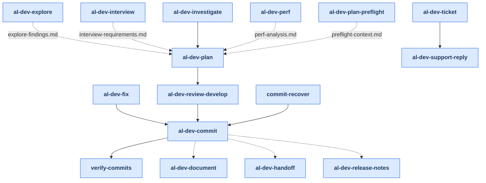
<!-- END GENERATED: skill-lifecycle-mermaid -->

---

## Layer 2: Per-Skill Drill-Downs

Each skill is shown with its internal phases, spawned agents, and key outputs. Agents are referenced by their full type name (for example, `al-dev-shared:al-dev-developer-tdd`).

### Notation

- **Phase**: Numbered step inside the skill
- **Agent**: Which agent (or skill itself) executes the phase
- **Pattern**: ×1 (serial), ×2-3 (parallel), ×N (variable count)
- **Output**: File written to `.dev/` or code generated

### /al-dev-ticket

**Two modes:** `--mode=context-only` (default fetch/context only) and `--mode=full` (fetch context then chains to `/al-dev-support-reply`). Research and reply drafting are handled by `/al-dev-support-reply`. Phases: 0, 1, 2.

<!-- BEGIN GENERATED: skill-drilldown-al-dev-ticket -->
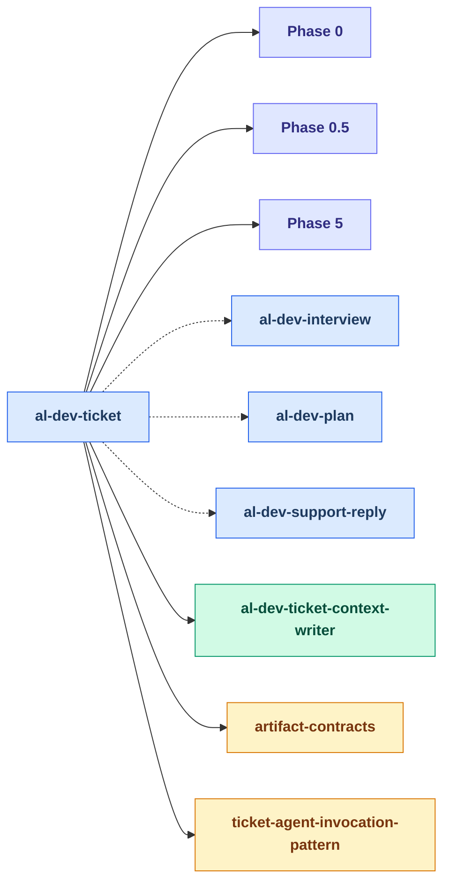

Agents spawned: `al-dev-shared:al-dev-ticket-context-writer`
<!-- END GENERATED: skill-drilldown-al-dev-ticket -->

### /al-dev-support-reply

Follow-on support workflow used after `/al-dev-ticket --mode=full`. Researches the issue and drafts the customer-facing reply using the ticket context prepared upstream. Phases: 0, 1, 2, 3.

<!-- BEGIN GENERATED: skill-drilldown-al-dev-support-reply -->
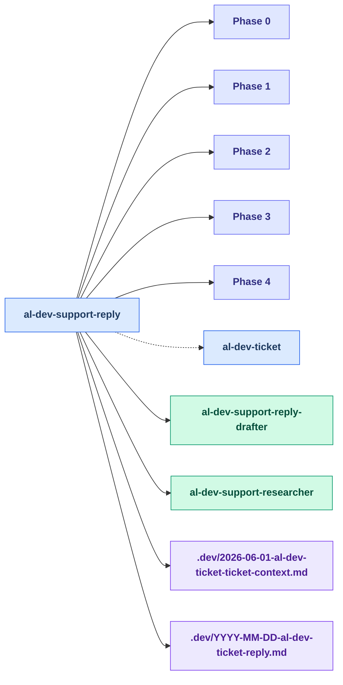

Agents spawned: `al-dev-shared:al-dev-support-reply-drafter`, `al-dev-shared:al-dev-support-researcher`
<!-- END GENERATED: skill-drilldown-al-dev-support-reply -->

### /al-dev-investigate

<!-- BEGIN GENERATED: skill-drilldown-al-dev-investigate -->
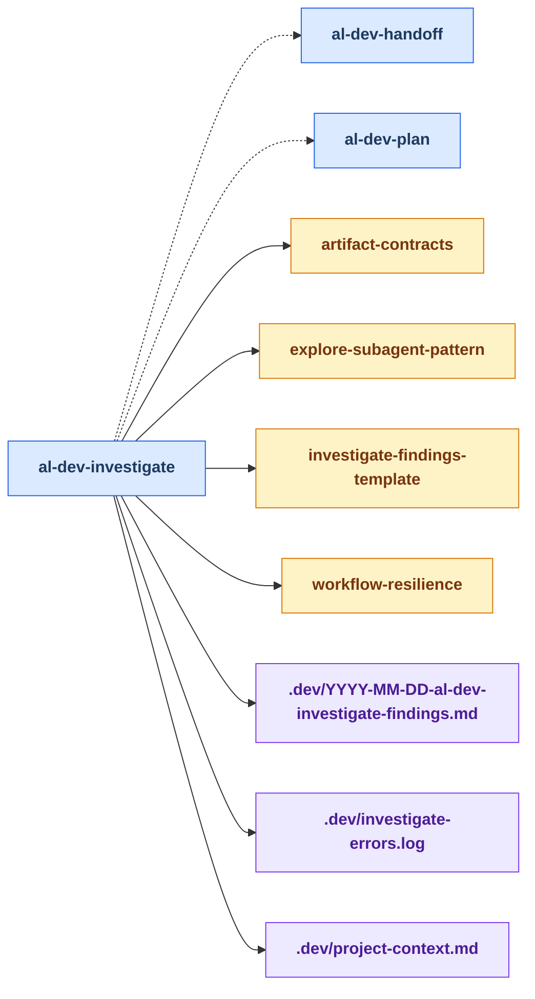
<!-- END GENERATED: skill-drilldown-al-dev-investigate -->

### /al-dev-fix

**Complexity routing:** Trivial fixes skip the analysis phase; complex fixes route through al-dev-solution-architect.

<!-- BEGIN GENERATED: skill-drilldown-al-dev-fix -->
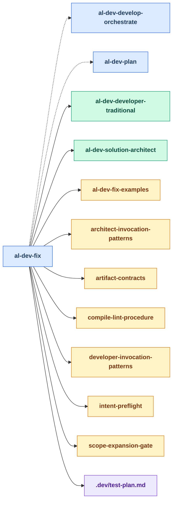

Agents spawned: `al-dev-shared:al-dev-developer-traditional`, `al-dev-shared:al-dev-solution-architect`
<!-- END GENERATED: skill-drilldown-al-dev-fix -->

### /al-dev-plan

**Competitive design phase:** Dispatches `/al-dev-plan-preflight` first (context assembly + complexity triage), then multiple architects propose approaches in parallel; the skill synthesises the winner into a solution plan. Dispatches `/al-dev-plan-final-review` for validation and user approval gate before handing off to `/al-dev-develop-orchestrate`. Phases: 0, 2, 3, 4, 5.

<!-- BEGIN GENERATED: skill-drilldown-al-dev-plan -->
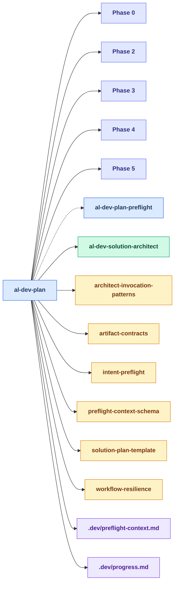

Agents spawned: `al-dev-shared:al-dev-solution-architect`
<!-- END GENERATED: skill-drilldown-al-dev-plan -->

### /al-dev-plan-final-review

User approval gate for the solution plan written by `/al-dev-plan`. Runs validation and gates approval before implementation begins. Called by `/al-dev-plan` after Phase 5; can also be run standalone. Phases: 0–3.

<!-- BEGIN GENERATED: skill-drilldown-al-dev-plan-final-review -->
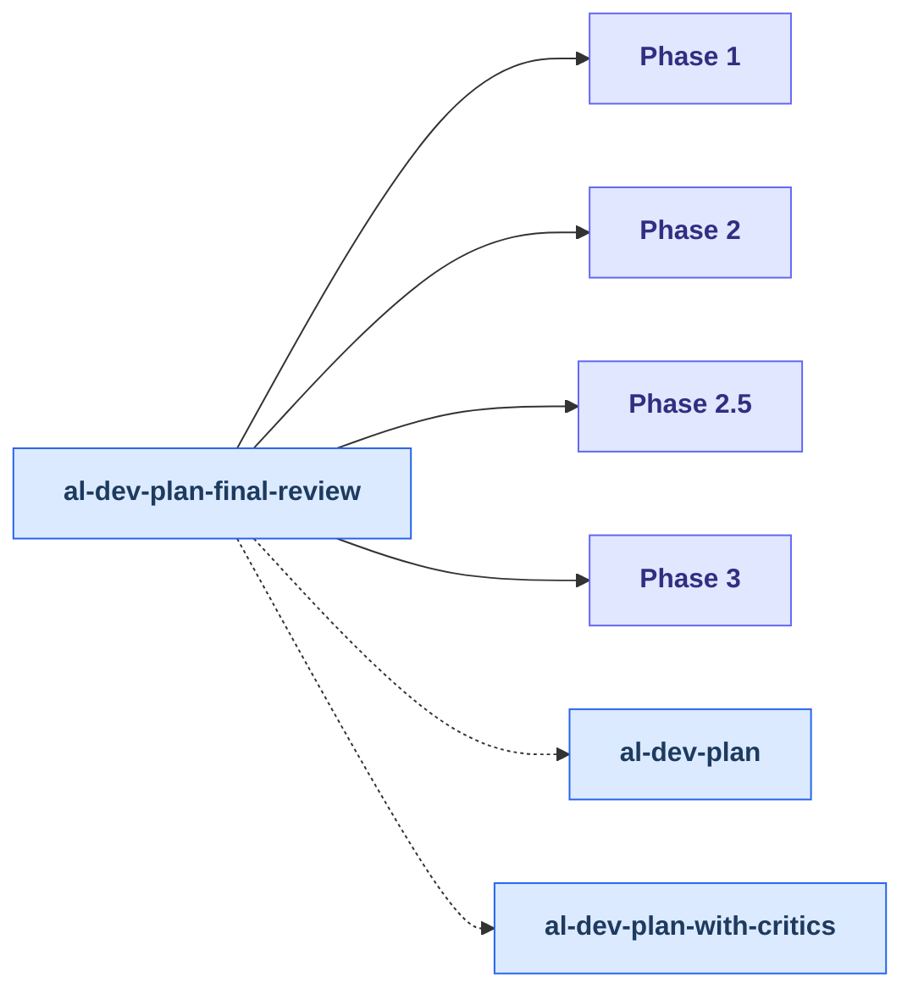
<!-- END GENERATED: skill-drilldown-al-dev-plan-final-review -->

### /al-dev-plan-preflight

Preflight context-assembly workflow that `/al-dev-plan` dispatches before the architect debate. Gathers scope, prior findings, and verified context into `.dev/preflight-context.md`. Phases: 0–4.

<!-- BEGIN GENERATED: skill-drilldown-al-dev-plan-preflight -->
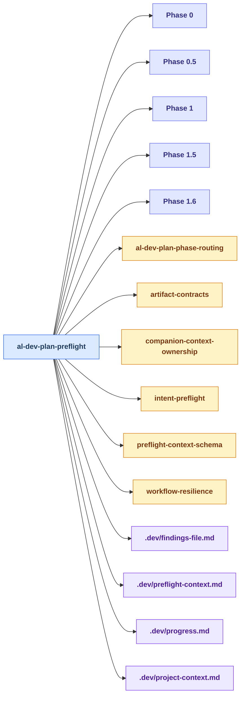
<!-- END GENERATED: skill-drilldown-al-dev-plan-preflight -->

### /al-dev-plan-with-critics

Generate an implementation plan then dispatch 6 parallel critic agents to red-team it. Synthesizes findings, applies auto-fixes, and gates user approval before execution.

<!-- BEGIN GENERATED: skill-drilldown-al-dev-plan-with-critics -->
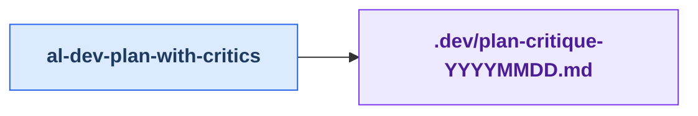
<!-- END GENERATED: skill-drilldown-al-dev-plan-with-critics -->

### /al-dev-develop-orchestrate

**Pre-implementation orchestration:** Reads solution plan, validates scope, partitions work across developers, and dispatches parallel developers. Passes Phase 4 handoff to `/al-dev-review-develop` for compilation, review, and code-review output. Phases: 0, 1, 2, 3, 4.

<!-- BEGIN GENERATED: skill-drilldown-al-dev-develop-orchestrate -->
```mermaid
flowchart LR
    classDef skillNode fill:#dbeafe,stroke:#2563eb,color:#1e3a5f,font-weight:bold
    classDef agentNode fill:#d1fae5,stroke:#059669,color:#064e3b,font-weight:bold
    classDef knowledgeNode fill:#fef3c7,stroke:#d97706,color:#78350f,font-weight:bold
    classDef artifactNode fill:#ede9fe,stroke:#7c3aed,color:#4c1d95,font-weight:bold
    classDef phaseNode fill:#e0e7ff,stroke:#6366f1,color:#312e81,font-weight:bold

    skill_al_dev_develop_orchestrate[al-dev-develop-orchestrate]
    Phase0["Phase 0"]
    Phase1["Phase 1"]
    Phase2["Phase 2"]
    Phase3["Phase 3"]
    Phase4["Phase 4"]
    skill_al_dev_review_develop[al-dev-review-develop]
    agent_al_dev_developer_tdd[al-dev-developer-tdd]
    agent_al_dev_developer_traditional[al-dev-developer-traditional]
    knowledge_al_dev_develop_spawn_prompt_md[al-dev-develop-spawn-prompt]
    knowledge_artifact_contracts_md[artifact-contracts]
    knowledge_companion_context_ownership_md[companion-context-ownership]
    knowledge_developer_invocation_patterns_md[developer-invocation-patterns]
    knowledge_intent_preflight_md[intent-preflight]
    knowledge_scope_expansion_gate_md[scope-expansion-gate]
    knowledge_workflow_resilience_md[workflow-resilience]
    artifact_progress_md[.dev/progress.md]
    artifact_project_context_md[.dev/project-context.md]

    skill_al_dev_develop_orchestrate --> Phase0
    skill_al_dev_develop_orchestrate --> Phase1
    skill_al_dev_develop_orchestrate --> Phase2
    skill_al_dev_develop_orchestrate --> Phase3
    skill_al_dev_develop_orchestrate --> Phase4
    skill_al_dev_develop_orchestrate -.-> skill_al_dev_review_develop
    skill_al_dev_develop_orchestrate --> agent_al_dev_developer_tdd
    skill_al_dev_develop_orchestrate --> agent_al_dev_developer_traditional
    skill_al_dev_develop_orchestrate --> knowledge_al_dev_develop_spawn_prompt_md
    skill_al_dev_develop_orchestrate --> knowledge_artifact_contracts_md
    skill_al_dev_develop_orchestrate --> knowledge_companion_context_ownership_md
    skill_al_dev_develop_orchestrate --> knowledge_developer_invocation_patterns_md
    skill_al_dev_develop_orchestrate --> knowledge_intent_preflight_md
    skill_al_dev_develop_orchestrate --> knowledge_scope_expansion_gate_md
    skill_al_dev_develop_orchestrate --> knowledge_workflow_resilience_md
    skill_al_dev_develop_orchestrate --> artifact_progress_md
    skill_al_dev_develop_orchestrate --> artifact_project_context_md

    class skill_al_dev_develop_orchestrate skillNode
    class Phase0 phaseNode
    class Phase1 phaseNode
    class Phase2 phaseNode
    class Phase3 phaseNode
    class Phase4 phaseNode
    class skill_al_dev_review_develop skillNode
    class agent_al_dev_developer_tdd agentNode
    class agent_al_dev_developer_traditional agentNode
    class knowledge_al_dev_develop_spawn_prompt_md knowledgeNode
    class knowledge_artifact_contracts_md knowledgeNode
    class knowledge_companion_context_ownership_md knowledgeNode
    class knowledge_developer_invocation_patterns_md knowledgeNode
    class knowledge_intent_preflight_md knowledgeNode
    class knowledge_scope_expansion_gate_md knowledgeNode
    class knowledge_workflow_resilience_md knowledgeNode
    class artifact_progress_md artifactNode
    class artifact_project_context_md artifactNode
```

Agents spawned: `al-dev-shared:al-dev-developer-tdd`, `al-dev-shared:al-dev-developer-traditional`
<!-- END GENERATED: skill-drilldown-al-dev-develop-orchestrate -->

### /al-dev-review-develop-preflight

Pre-review qualification workflow dispatched by `/al-dev-develop-orchestrate` before the reviewer panel. Locates the develop handoff, identifies changed AL files, verifies compile, and writes the preflight context file. Phases: 0, 1, 2, 3.

<!-- BEGIN GENERATED: skill-drilldown-al-dev-review-develop-preflight -->
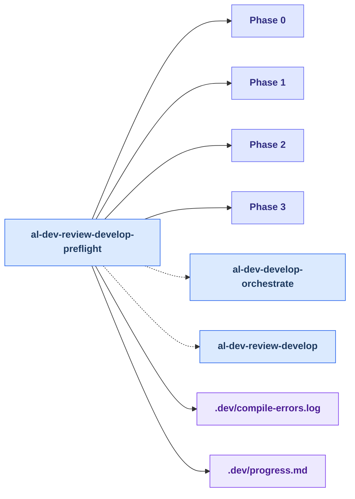
<!-- END GENERATED: skill-drilldown-al-dev-review-develop-preflight -->

### /al-dev-review-develop

**Reviewer dispatch and synthesis:** Reads preflight context from `/al-dev-review-develop-preflight`, then dispatches the three-specialist panel in parallel and synthesises findings. Run `/al-dev-review-develop-preflight` first. Phases: 0–3.

<!-- BEGIN GENERATED: skill-drilldown-al-dev-review-develop -->
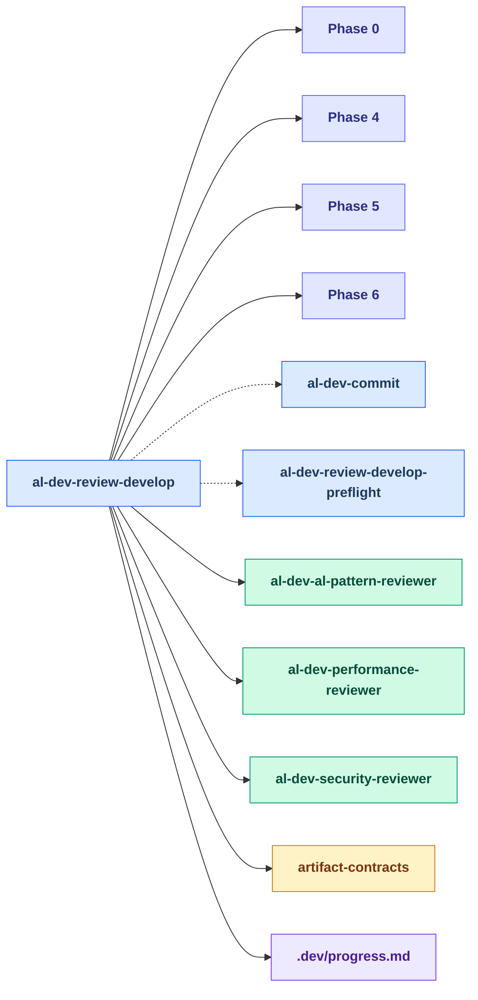

Agents spawned: `al-dev-shared:al-dev-al-pattern-reviewer`, `al-dev-shared:al-dev-performance-reviewer`, `al-dev-shared:al-dev-security-reviewer`
<!-- END GENERATED: skill-drilldown-al-dev-review-develop -->

### /al-dev-commit

**Multi-pass execution:** Setup and validation (Phase 0) checks project context, file integrity, staged files, acceptance criteria, and advisory alignment; analysis pass (Phase 1) builds manifests and proposes commit groups with message drafting; confirmation pass (Phase 2) gates user approval; preflight pass (Phase 3) runs lint fixes and OOXML validation; execution pass (Phase 4) runs the commits with hook support and presents the final summary. Five agents with focused responsibilities. Phases: 0, 1, 2.

<!-- BEGIN GENERATED: skill-drilldown-al-dev-commit -->
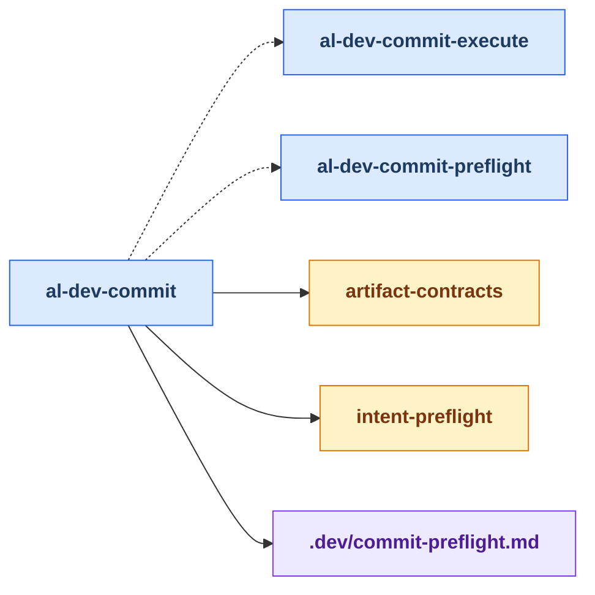
<!-- END GENERATED: skill-drilldown-al-dev-commit -->

### /al-dev-commit-execute

Phases 0, 1, 2 of the atomic commit workflow. Loads the approved plan from `.dev/commit-preflight.md`, runs lint preflight and OOXML validation, dispatches the execution agent, handles hook failures via the classifier+fixer recovery pipeline, and summarises results.

<!-- BEGIN GENERATED: skill-drilldown-al-dev-commit-execute -->
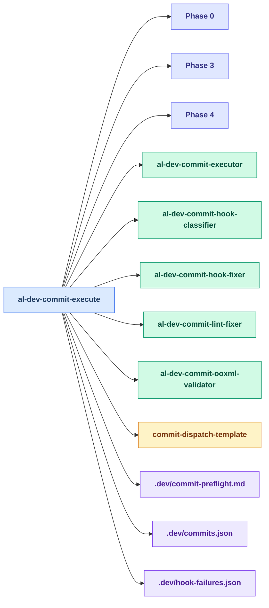

Agents spawned: `al-dev-shared:al-dev-commit-executor`, `al-dev-shared:al-dev-commit-hook-classifier`, `al-dev-shared:al-dev-commit-hook-fixer`, `al-dev-shared:al-dev-commit-lint-fixer`, `al-dev-shared:al-dev-commit-ooxml-validator`
<!-- END GENERATED: skill-drilldown-al-dev-commit-execute -->

### /al-dev-commit-preflight

Phases 0, 1, 2, 3 of the atomic commit workflow. Validates staged files, dispatches the analysis and message-drafting agents, handles user confirmation gates, and persists the approved plan to `.dev/commit-preflight.md`.

<!-- BEGIN GENERATED: skill-drilldown-al-dev-commit-preflight -->
```mermaid
flowchart LR
    classDef skillNode fill:#dbeafe,stroke:#2563eb,color:#1e3a5f,font-weight:bold
    classDef agentNode fill:#d1fae5,stroke:#059669,color:#064e3b,font-weight:bold
    classDef knowledgeNode fill:#fef3c7,stroke:#d97706,color:#78350f,font-weight:bold
    classDef artifactNode fill:#ede9fe,stroke:#7c3aed,color:#4c1d95,font-weight:bold
    classDef phaseNode fill:#e0e7ff,stroke:#6366f1,color:#312e81,font-weight:bold

    skill_al_dev_commit_preflight[al-dev-commit-preflight]
    Phase0["Phase 0"]
    Phase1["Phase 1"]
    Phase2["Phase 2"]
    skill_al_dev_commit_execute[al-dev-commit-execute]
    agent_al_dev_commit_analyzer[al-dev-commit-analyzer]
    agent_al_dev_commit_group_drafter[al-dev-commit-group-drafter]
    knowledge_artifact_contracts_md[artifact-contracts]
    knowledge_commit_dispatch_template_md[commit-dispatch-template]
    knowledge_commit_workflow_orchestration_md[commit-workflow-orchestration]
    knowledge_companion_context_ownership_md[companion-context-ownership]
    knowledge_compile_lint_procedure_md[compile-lint-procedure]
    knowledge_compile_output_safeguard_md[compile-output-safeguard]
    knowledge_intent_preflight_md[intent-preflight]
    knowledge_workflow_resilience_md[workflow-resilience]
    artifact_commit_preflight_md[.dev/commit-preflight.md]
    artifact_compile_baseline_log[.dev/compile-baseline.log]
    artifact_compile_errors_log[.dev/compile-errors.log]
    artifact_file_sizes_json[.dev/file-sizes.json]

    skill_al_dev_commit_preflight --> Phase0
    skill_al_dev_commit_preflight --> Phase1
    skill_al_dev_commit_preflight --> Phase2
    skill_al_dev_commit_preflight -.-> skill_al_dev_commit_execute
    skill_al_dev_commit_preflight --> agent_al_dev_commit_analyzer
    skill_al_dev_commit_preflight --> agent_al_dev_commit_group_drafter
    skill_al_dev_commit_preflight --> knowledge_artifact_contracts_md
    skill_al_dev_commit_preflight --> knowledge_commit_dispatch_template_md
    skill_al_dev_commit_preflight --> knowledge_commit_workflow_orchestration_md
    skill_al_dev_commit_preflight --> knowledge_companion_context_ownership_md
    skill_al_dev_commit_preflight --> knowledge_compile_lint_procedure_md
    skill_al_dev_commit_preflight --> knowledge_compile_output_safeguard_md
    skill_al_dev_commit_preflight --> knowledge_intent_preflight_md
    skill_al_dev_commit_preflight --> knowledge_workflow_resilience_md
    skill_al_dev_commit_preflight --> artifact_commit_preflight_md
    skill_al_dev_commit_preflight --> artifact_compile_baseline_log
    skill_al_dev_commit_preflight --> artifact_compile_errors_log
    skill_al_dev_commit_preflight --> artifact_file_sizes_json

    class skill_al_dev_commit_preflight skillNode
    class Phase0 phaseNode
    class Phase1 phaseNode
    class Phase2 phaseNode
    class skill_al_dev_commit_execute skillNode
    class agent_al_dev_commit_analyzer agentNode
    class agent_al_dev_commit_group_drafter agentNode
    class knowledge_artifact_contracts_md knowledgeNode
    class knowledge_commit_dispatch_template_md knowledgeNode
    class knowledge_commit_workflow_orchestration_md knowledgeNode
    class knowledge_companion_context_ownership_md knowledgeNode
    class knowledge_compile_lint_procedure_md knowledgeNode
    class knowledge_compile_output_safeguard_md knowledgeNode
    class knowledge_intent_preflight_md knowledgeNode
    class knowledge_workflow_resilience_md knowledgeNode
    class artifact_commit_preflight_md artifactNode
    class artifact_compile_baseline_log artifactNode
    class artifact_compile_errors_log artifactNode
    class artifact_file_sizes_json artifactNode
```

Agents spawned: `al-dev-shared:al-dev-commit-analyzer`, `al-dev-shared:al-dev-commit-group-drafter`
<!-- END GENERATED: skill-drilldown-al-dev-commit-preflight -->

### /al-dev-explore

<!-- BEGIN GENERATED: skill-drilldown-al-dev-explore -->
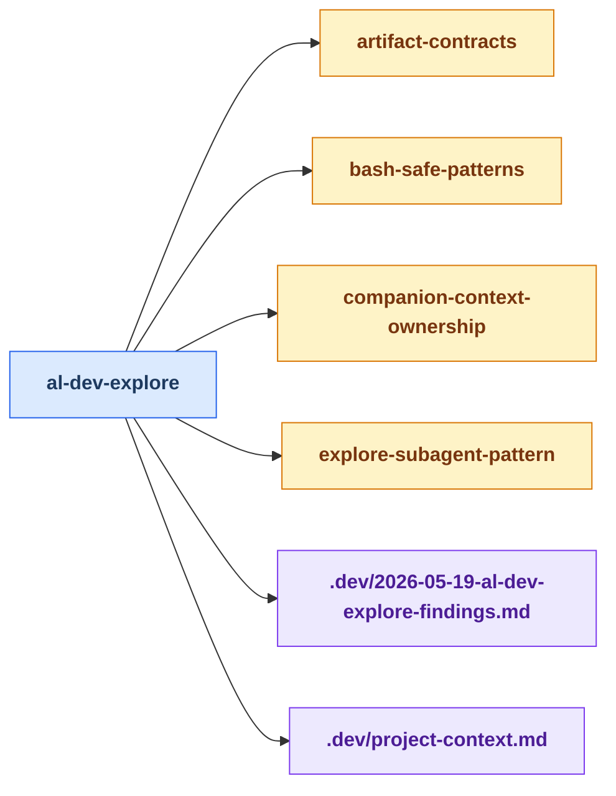
<!-- END GENERATED: skill-drilldown-al-dev-explore -->

### /al-dev-interview

Phases: 1, 2, 3, 4.

<!-- BEGIN GENERATED: skill-drilldown-al-dev-interview -->
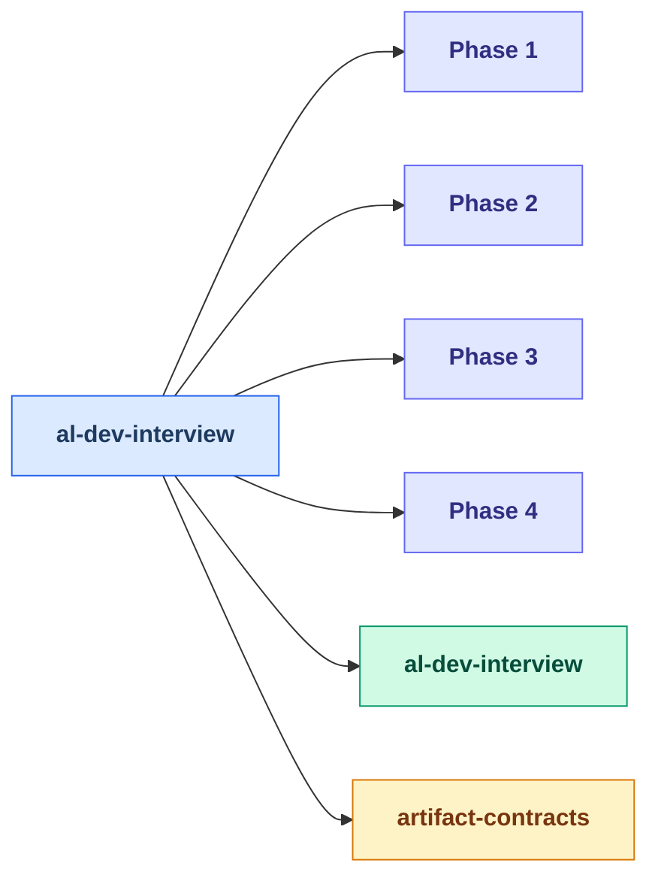

Agents spawned: `al-dev-shared:al-dev-interview`
<!-- END GENERATED: skill-drilldown-al-dev-interview -->

### /al-dev-lint

<!-- BEGIN GENERATED: skill-drilldown-al-dev-lint -->
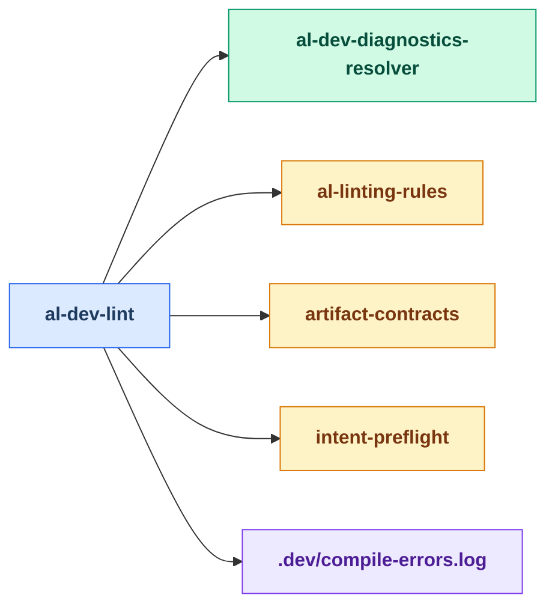

Agents spawned: `al-dev-shared:al-dev-diagnostics-resolver`
<!-- END GENERATED: skill-drilldown-al-dev-lint -->

### /al-dev-document

<!-- BEGIN GENERATED: skill-drilldown-al-dev-document -->

<!-- END GENERATED: skill-drilldown-al-dev-document -->

### /al-dev-release-notes

Phases: 0–3.

<!-- BEGIN GENERATED: skill-drilldown-al-dev-release-notes -->
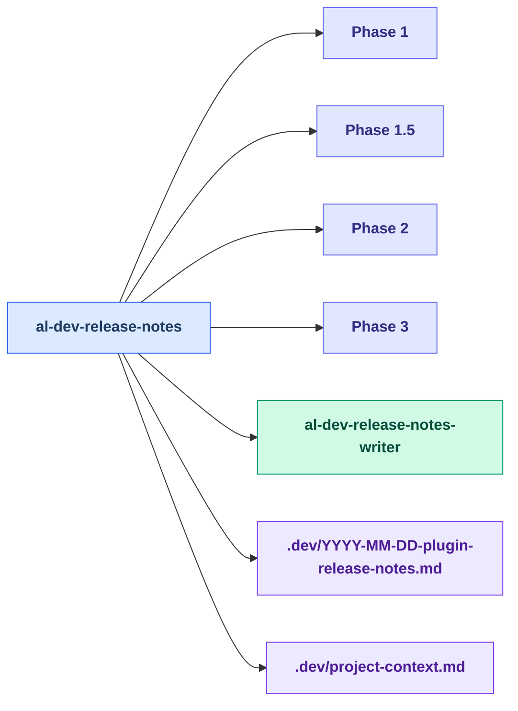

Agents spawned: `al-dev-shared:al-dev-release-notes-writer`
<!-- END GENERATED: skill-drilldown-al-dev-release-notes -->

### /al-dev-perf

<!-- BEGIN GENERATED: skill-drilldown-al-dev-perf -->
```mermaid
flowchart LR
    classDef skillNode fill:#dbeafe,stroke:#2563eb,color:#1e3a5f,font-weight:bold
    classDef agentNode fill:#d1fae5,stroke:#059669,color:#064e3b,font-weight:bold
    classDef knowledgeNode fill:#fef3c7,stroke:#d97706,color:#78350f,font-weight:bold
    classDef artifactNode fill:#ede9fe,stroke:#7c3aed,color:#4c1d95,font-weight:bold
    classDef phaseNode fill:#e0e7ff,stroke:#6366f1,color:#312e81,font-weight:bold

    skill_al_dev_perf[al-dev-perf]
    knowledge_explore_subagent_pattern_md[explore-subagent-pattern]
    knowledge_perf_anti_patterns_prompt_md[perf-anti-patterns-prompt]
    knowledge_perf_report_template_md[perf-report-template]
    artifact_project_context_md[.dev/project-context.md]

    skill_al_dev_perf --> knowledge_explore_subagent_pattern_md
    skill_al_dev_perf --> knowledge_perf_anti_patterns_prompt_md
    skill_al_dev_perf --> knowledge_perf_report_template_md
    skill_al_dev_perf --> artifact_project_context_md

    class skill_al_dev_perf skillNode
    class knowledge_explore_subagent_pattern_md knowledgeNode
    class knowledge_perf_anti_patterns_prompt_md knowledgeNode
    class knowledge_perf_report_template_md knowledgeNode
    class artifact_project_context_md artifactNode
```
<!-- END GENERATED: skill-drilldown-al-dev-perf -->

### /al-dev-handoff

<!-- BEGIN GENERATED: skill-drilldown-al-dev-handoff -->
```mermaid
flowchart LR
    classDef skillNode fill:#dbeafe,stroke:#2563eb,color:#1e3a5f,font-weight:bold
    classDef agentNode fill:#d1fae5,stroke:#059669,color:#064e3b,font-weight:bold
    classDef knowledgeNode fill:#fef3c7,stroke:#d97706,color:#78350f,font-weight:bold
    classDef artifactNode fill:#ede9fe,stroke:#7c3aed,color:#4c1d95,font-weight:bold
    classDef phaseNode fill:#e0e7ff,stroke:#6366f1,color:#312e81,font-weight:bold

    skill_al_dev_handoff[al-dev-handoff]
    knowledge_artifact_contracts_md[artifact-contracts]
    artifact_explore_findings_md[.dev/explore-findings.md]
    artifact_project_context_md[.dev/project-context.md]
    artifact_source_explore_findings_md[.dev/source-explore-findings.md]
    artifact_source_project_context_md[.dev/source-project-context.md]
    artifact_source_release_notes_md[.dev/source-release-notes.md]
    artifact_source_requirements_md[.dev/source-requirements.md]
    artifact_source_solution_plan_md[.dev/source-solution-plan.md]
    artifact_source_ticket_context_md[.dev/source-ticket-context.md]

    skill_al_dev_handoff --> knowledge_artifact_contracts_md
    skill_al_dev_handoff --> artifact_explore_findings_md
    skill_al_dev_handoff --> artifact_project_context_md
    skill_al_dev_handoff --> artifact_source_explore_findings_md
    skill_al_dev_handoff --> artifact_source_project_context_md
    skill_al_dev_handoff --> artifact_source_release_notes_md
    skill_al_dev_handoff --> artifact_source_requirements_md
    skill_al_dev_handoff --> artifact_source_solution_plan_md
    skill_al_dev_handoff --> artifact_source_ticket_context_md

    class skill_al_dev_handoff skillNode
    class knowledge_artifact_contracts_md knowledgeNode
    class artifact_explore_findings_md artifactNode
    class artifact_project_context_md artifactNode
    class artifact_source_explore_findings_md artifactNode
    class artifact_source_project_context_md artifactNode
    class artifact_source_release_notes_md artifactNode
    class artifact_source_requirements_md artifactNode
    class artifact_source_solution_plan_md artifactNode
    class artifact_source_ticket_context_md artifactNode
```
<!-- END GENERATED: skill-drilldown-al-dev-handoff -->

### /al-dev-help

No agents spawned; no `.dev/` output. The skill reads available context files and presents contextual guidance inline.

<!-- BEGIN GENERATED: skill-drilldown-al-dev-help -->
```mermaid
flowchart LR
    classDef skillNode fill:#dbeafe,stroke:#2563eb,color:#1e3a5f,font-weight:bold
    classDef agentNode fill:#d1fae5,stroke:#059669,color:#064e3b,font-weight:bold
    classDef knowledgeNode fill:#fef3c7,stroke:#d97706,color:#78350f,font-weight:bold
    classDef artifactNode fill:#ede9fe,stroke:#7c3aed,color:#4c1d95,font-weight:bold
    classDef phaseNode fill:#e0e7ff,stroke:#6366f1,color:#312e81,font-weight:bold

    skill_al_dev_help[al-dev-help]
    skill_al_dev_develop_orchestrate[al-dev-develop-orchestrate]
    skill_al_dev_plan[al-dev-plan]
    knowledge_workflow_routing_md[workflow-routing]
    artifact_2026_05_19_al_dev_develop_code_review_md[.dev/2026-05-19-al-dev-develop-code-review.md]
    artifact_2026_05_19_al_dev_interview_requirements_md[.dev/2026-05-19-al-dev-interview-requirements.md]
    artifact_2026_05_19_al_dev_plan_solution_plan_md[.dev/2026-05-19-al-dev-plan-solution-plan.md]
    artifact_project_context_md[.dev/project-context.md]

    skill_al_dev_help -.-> skill_al_dev_develop_orchestrate
    skill_al_dev_help -.-> skill_al_dev_plan
    skill_al_dev_help --> knowledge_workflow_routing_md
    skill_al_dev_help --> artifact_2026_05_19_al_dev_develop_code_review_md
    skill_al_dev_help --> artifact_2026_05_19_al_dev_interview_requirements_md
    skill_al_dev_help --> artifact_2026_05_19_al_dev_plan_solution_plan_md
    skill_al_dev_help --> artifact_project_context_md

    class skill_al_dev_help skillNode
    class skill_al_dev_develop_orchestrate skillNode
    class skill_al_dev_plan skillNode
    class knowledge_workflow_routing_md knowledgeNode
    class artifact_2026_05_19_al_dev_develop_code_review_md artifactNode
    class artifact_2026_05_19_al_dev_interview_requirements_md artifactNode
    class artifact_2026_05_19_al_dev_plan_solution_plan_md artifactNode
    class artifact_project_context_md artifactNode
```
<!-- END GENERATED: skill-drilldown-al-dev-help -->

### /commit-recover

Spawns one fixer per corrupted-file incident found in `.dev/commit-integrity.log`.

<!-- BEGIN GENERATED: skill-drilldown-commit-recover -->
```mermaid
flowchart LR
    classDef skillNode fill:#dbeafe,stroke:#2563eb,color:#1e3a5f,font-weight:bold
    classDef agentNode fill:#d1fae5,stroke:#059669,color:#064e3b,font-weight:bold
    classDef knowledgeNode fill:#fef3c7,stroke:#d97706,color:#78350f,font-weight:bold
    classDef artifactNode fill:#ede9fe,stroke:#7c3aed,color:#4c1d95,font-weight:bold
    classDef phaseNode fill:#e0e7ff,stroke:#6366f1,color:#312e81,font-weight:bold

    skill_commit_recover[commit-recover]
    agent_al_dev_commit_recover_fixer[al-dev-commit-recover-fixer]
    artifact_commit_integrity_log[.dev/commit-integrity.log]
    artifact_compile_errors_log[.dev/compile-errors.log]
    artifact_learnings_md[.dev/learnings.md]

    skill_commit_recover --> agent_al_dev_commit_recover_fixer
    skill_commit_recover --> artifact_commit_integrity_log
    skill_commit_recover --> artifact_compile_errors_log
    skill_commit_recover --> artifact_learnings_md

    class skill_commit_recover skillNode
    class agent_al_dev_commit_recover_fixer agentNode
    class artifact_commit_integrity_log artifactNode
    class artifact_compile_errors_log artifactNode
    class artifact_learnings_md artifactNode
```

Agents spawned: `al-dev-shared:al-dev-commit-recover-fixer`
<!-- END GENERATED: skill-drilldown-commit-recover -->

### /verify-commits

No agents spawned; compares git commits against plan and optionally re-splits combined commits.

<!-- BEGIN GENERATED: skill-drilldown-verify-commits -->
```mermaid
flowchart LR
    classDef skillNode fill:#dbeafe,stroke:#2563eb,color:#1e3a5f,font-weight:bold
    classDef agentNode fill:#d1fae5,stroke:#059669,color:#064e3b,font-weight:bold
    classDef knowledgeNode fill:#fef3c7,stroke:#d97706,color:#78350f,font-weight:bold
    classDef artifactNode fill:#ede9fe,stroke:#7c3aed,color:#4c1d95,font-weight:bold
    classDef phaseNode fill:#e0e7ff,stroke:#6366f1,color:#312e81,font-weight:bold

    skill_verify_commits[verify-commits]


    class skill_verify_commits skillNode
```
<!-- END GENERATED: skill-drilldown-verify-commits -->

---

## Observations

> **Findings live in the health dossier, not in this map.** This map is
> documentation only — it describes the current skill structure. To find
> improvement suggestions (Atomise, Absorb, Connect, Merge, Promote, Move,
> Extend), run `/plugin-health-audit` and read the ranked dossier in
> `docs/health/`, then `/al-dev-map-suggestions-verify` to turn accepted
> findings into a plan.
>
> History: in-map suggestions through 2026-05-27 were retired when findings
> converged on the health dossier (2026-06-02).
>
