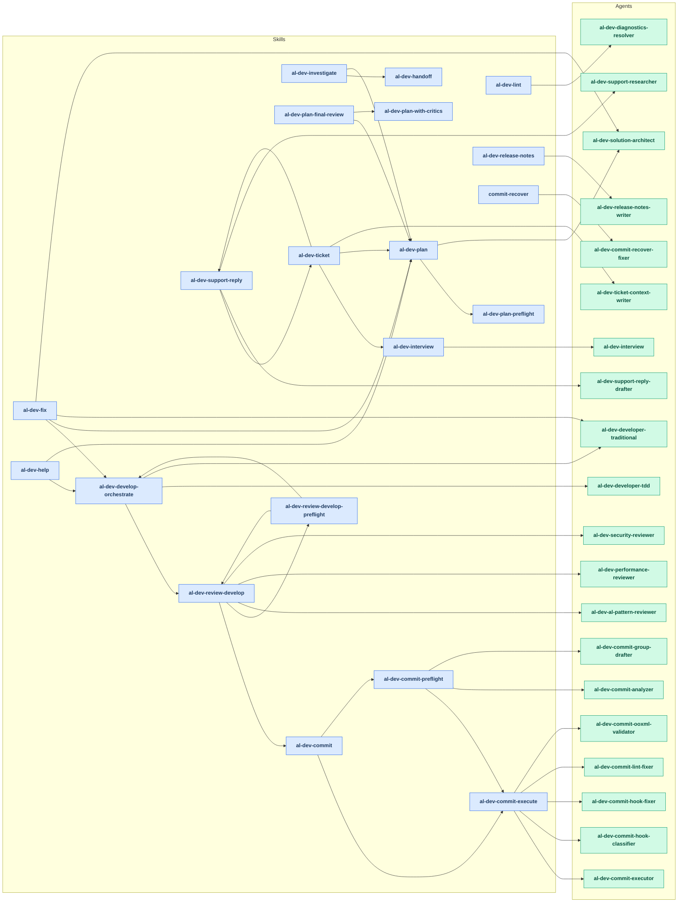

# Plugin Workflow Diagrams

> Generated sections refreshed by `scripts/generate-map-doc-sections.py` on 2026-06-01.
> Re-run the script to refresh bounded generated blocks. Do not hand-edit inside markers.

## Skills → Agents

<!-- BEGIN GENERATED: workflow-skills-agents-mermaid -->

<!-- END GENERATED: workflow-skills-agents-mermaid -->

## Skills and Agents → Knowledge Files

```mermaid
flowchart LR
    classDef skillNode fill:#dbeafe,stroke:#2563eb,color:#1e3a5f,font-weight:bold
    classDef agentNode fill:#d1fae5,stroke:#059669,color:#064e3b,font-weight:bold
    classDef knowledgeNode fill:#fef3c7,stroke:#d97706,color:#78350f,font-weight:bold

    subgraph Skills[Skills]
        skill_al_dev_commit[al-dev-commit]
        skill_al_dev_commit_execute[al-dev-commit-execute]
        skill_al_dev_commit_preflight[al-dev-commit-preflight]
        skill_al_dev_develop_orchestrate[al-dev-develop-orchestrate]
        skill_al_dev_explore[al-dev-explore]
        skill_al_dev_fix[al-dev-fix]
        skill_al_dev_help[al-dev-help]
        skill_al_dev_interview[al-dev-interview]
        skill_al_dev_investigate[al-dev-investigate]
        skill_al_dev_lint[al-dev-lint]
        skill_al_dev_perf[al-dev-perf]
        skill_al_dev_plan[al-dev-plan]
        skill_al_dev_plan_preflight[al-dev-plan-preflight]
        skill_al_dev_review_develop[al-dev-review-develop]
        skill_al_dev_ticket[al-dev-ticket]
    end
    subgraph Agents[Agents]
        agent_al_dev_al_pattern_reviewer[al-dev-al-pattern-reviewer]
        agent_al_dev_commit_analyzer[al-dev-commit-analyzer]
        agent_al_dev_commit_hook_classifier[al-dev-commit-hook-classifier]
        agent_al_dev_commit_hook_fixer[al-dev-commit-hook-fixer]
        agent_al_dev_commit_lint_fixer[al-dev-commit-lint-fixer]
        agent_al_dev_developer_tdd[al-dev-developer-tdd]
        agent_al_dev_developer_traditional[al-dev-developer-traditional]
        agent_al_dev_diagnostics_resolver[al-dev-diagnostics-resolver]
        agent_al_dev_docs_writer[al-dev-docs-writer]
        agent_al_dev_general_code_reviewer[al-dev-general-code-reviewer]
        agent_al_dev_interview[al-dev-interview]
        agent_al_dev_performance_reviewer[al-dev-performance-reviewer]
        agent_al_dev_release_notes_writer[al-dev-release-notes-writer]
        agent_al_dev_script_engineer[al-dev-script-engineer]
        agent_al_dev_security_reviewer[al-dev-security-reviewer]
        agent_al_dev_solution_architect[al-dev-solution-architect]
        agent_al_dev_ticket_context_writer[al-dev-ticket-context-writer]
    end
    subgraph Knowledge[Knowledge Files]
        knowledge_al_dev_develop_spawn_prompt_md[al-dev-develop-spawn-prompt]
        knowledge_al_dev_fix_examples_md[al-dev-fix-examples]
        knowledge_al_dev_plan_phase_routing_md[al-dev-plan-phase-routing]
        knowledge_al_developer_patterns_md[al-developer-patterns]
        knowledge_al_linting_rules_md[al-linting-rules]
        knowledge_al_symbol_pre_flight_md[al-symbol-pre-flight]
        knowledge_architect_invocation_patterns_md[architect-invocation-patterns]
        knowledge_artifact_contracts_md[artifact-contracts]
        knowledge_bash_safe_patterns_md[bash-safe-patterns]
        knowledge_code_review_patterns_md[code-review-patterns]
        knowledge_commit_analysis_patterns_md[commit-analysis-patterns]
        knowledge_commit_dispatch_template_md[commit-dispatch-template]
        knowledge_commit_hook_recovery_patterns_md[commit-hook-recovery-patterns]
        knowledge_commit_workflow_orchestration_md[commit-workflow-orchestration]
        knowledge_compile_lint_procedure_md[compile-lint-procedure]
        knowledge_compile_output_safeguard_md[compile-output-safeguard]
        knowledge_developer_invocation_patterns_md[developer-invocation-patterns]
        knowledge_documentation_rtm_guide_md[documentation-rtm-guide]
        knowledge_explore_subagent_pattern_md[explore-subagent-pattern]
        knowledge_intent_preflight_md[intent-preflight]
        knowledge_interview_question_bank_md[interview-question-bank]
        knowledge_investigate_findings_template_md[investigate-findings-template]
        knowledge_perf_anti_patterns_prompt_md[perf-anti-patterns-prompt]
        knowledge_perf_report_template_md[perf-report-template]
        knowledge_performance_review_examples_md[performance-review-examples]
        knowledge_preflight_context_schema_md[preflight-context-schema]
        knowledge_release_notes_template_md[release-notes-template]
        knowledge_reviewer_findings_template_md[reviewer-findings-template]
        knowledge_scope_expansion_gate_md[scope-expansion-gate]
        knowledge_script_engineer_conventions_md[script-engineer-conventions]
        knowledge_security_review_examples_md[security-review-examples]
        knowledge_solution_architect_research_patterns_md[solution-architect-research-patterns]
        knowledge_solution_architect_schema_mapping_md[solution-architect-schema-mapping]
        knowledge_solution_plan_template_md[solution-plan-template]
        knowledge_tdd_workflow_md[tdd-workflow]
        knowledge_ticket_agent_invocation_pattern_md[ticket-agent-invocation-pattern]
        knowledge_ticket_image_patterns_md[ticket-image-patterns]
        knowledge_workflow_resilience_md[workflow-resilience]
        knowledge_workflow_routing_md[workflow-routing]
    end

    skill_al_dev_commit --> knowledge_intent_preflight_md
    skill_al_dev_commit_execute --> knowledge_commit_dispatch_template_md
    skill_al_dev_commit_preflight --> knowledge_artifact_contracts_md
    skill_al_dev_commit_preflight --> knowledge_commit_dispatch_template_md
    skill_al_dev_commit_preflight --> knowledge_commit_workflow_orchestration_md
    skill_al_dev_commit_preflight --> knowledge_compile_lint_procedure_md
    skill_al_dev_commit_preflight --> knowledge_compile_output_safeguard_md
    skill_al_dev_commit_preflight --> knowledge_intent_preflight_md
    skill_al_dev_develop_orchestrate --> knowledge_al_dev_develop_spawn_prompt_md
    skill_al_dev_develop_orchestrate --> knowledge_artifact_contracts_md
    skill_al_dev_develop_orchestrate --> knowledge_developer_invocation_patterns_md
    skill_al_dev_develop_orchestrate --> knowledge_intent_preflight_md
    skill_al_dev_develop_orchestrate --> knowledge_scope_expansion_gate_md
    skill_al_dev_develop_orchestrate --> knowledge_workflow_resilience_md
    skill_al_dev_explore --> knowledge_artifact_contracts_md
    skill_al_dev_explore --> knowledge_bash_safe_patterns_md
    skill_al_dev_explore --> knowledge_explore_subagent_pattern_md
    skill_al_dev_fix --> knowledge_al_dev_fix_examples_md
    skill_al_dev_fix --> knowledge_architect_invocation_patterns_md
    skill_al_dev_fix --> knowledge_artifact_contracts_md
    skill_al_dev_fix --> knowledge_compile_lint_procedure_md
    skill_al_dev_fix --> knowledge_developer_invocation_patterns_md
    skill_al_dev_fix --> knowledge_intent_preflight_md
    skill_al_dev_fix --> knowledge_scope_expansion_gate_md
    skill_al_dev_help --> knowledge_workflow_routing_md
    skill_al_dev_interview --> knowledge_artifact_contracts_md
    skill_al_dev_investigate --> knowledge_explore_subagent_pattern_md
    skill_al_dev_investigate --> knowledge_investigate_findings_template_md
    skill_al_dev_lint --> knowledge_al_linting_rules_md
    skill_al_dev_lint --> knowledge_artifact_contracts_md
    skill_al_dev_lint --> knowledge_intent_preflight_md
    skill_al_dev_perf --> knowledge_explore_subagent_pattern_md
    skill_al_dev_perf --> knowledge_perf_anti_patterns_prompt_md
    skill_al_dev_perf --> knowledge_perf_report_template_md
    skill_al_dev_plan --> knowledge_architect_invocation_patterns_md
    skill_al_dev_plan --> knowledge_artifact_contracts_md
    skill_al_dev_plan --> knowledge_intent_preflight_md
    skill_al_dev_plan --> knowledge_preflight_context_schema_md
    skill_al_dev_plan --> knowledge_solution_plan_template_md
    skill_al_dev_plan --> knowledge_workflow_resilience_md
    skill_al_dev_plan_preflight --> knowledge_al_dev_plan_phase_routing_md
    skill_al_dev_plan_preflight --> knowledge_artifact_contracts_md
    skill_al_dev_plan_preflight --> knowledge_intent_preflight_md
    skill_al_dev_plan_preflight --> knowledge_preflight_context_schema_md
    skill_al_dev_plan_preflight --> knowledge_workflow_resilience_md
    skill_al_dev_review_develop --> knowledge_artifact_contracts_md
    skill_al_dev_ticket --> knowledge_artifact_contracts_md
    skill_al_dev_ticket --> knowledge_ticket_agent_invocation_pattern_md
    agent_al_dev_al_pattern_reviewer --> knowledge_code_review_patterns_md
    agent_al_dev_al_pattern_reviewer --> knowledge_reviewer_findings_template_md
    agent_al_dev_commit_analyzer --> knowledge_commit_analysis_patterns_md
    agent_al_dev_commit_hook_classifier --> knowledge_commit_hook_recovery_patterns_md
    agent_al_dev_commit_hook_fixer --> knowledge_commit_hook_recovery_patterns_md
    agent_al_dev_commit_lint_fixer --> knowledge_bash_safe_patterns_md
    agent_al_dev_developer_tdd --> knowledge_al_dev_develop_spawn_prompt_md
    agent_al_dev_developer_tdd --> knowledge_al_developer_patterns_md
    agent_al_dev_developer_tdd --> knowledge_al_symbol_pre_flight_md
    agent_al_dev_developer_tdd --> knowledge_compile_output_safeguard_md
    agent_al_dev_developer_tdd --> knowledge_developer_invocation_patterns_md
    agent_al_dev_developer_tdd --> knowledge_tdd_workflow_md
    agent_al_dev_developer_traditional --> knowledge_al_dev_develop_spawn_prompt_md
    agent_al_dev_developer_traditional --> knowledge_al_developer_patterns_md
    agent_al_dev_developer_traditional --> knowledge_al_symbol_pre_flight_md
    agent_al_dev_developer_traditional --> knowledge_compile_output_safeguard_md
    agent_al_dev_developer_traditional --> knowledge_developer_invocation_patterns_md
    agent_al_dev_diagnostics_resolver --> knowledge_bash_safe_patterns_md
    agent_al_dev_docs_writer --> knowledge_documentation_rtm_guide_md
    agent_al_dev_general_code_reviewer --> knowledge_reviewer_findings_template_md
    agent_al_dev_interview --> knowledge_interview_question_bank_md
    agent_al_dev_performance_reviewer --> knowledge_perf_anti_patterns_prompt_md
    agent_al_dev_performance_reviewer --> knowledge_performance_review_examples_md
    agent_al_dev_performance_reviewer --> knowledge_reviewer_findings_template_md
    agent_al_dev_release_notes_writer --> knowledge_release_notes_template_md
    agent_al_dev_script_engineer --> knowledge_script_engineer_conventions_md
    agent_al_dev_security_reviewer --> knowledge_reviewer_findings_template_md
    agent_al_dev_security_reviewer --> knowledge_security_review_examples_md
    agent_al_dev_solution_architect --> knowledge_al_developer_patterns_md
    agent_al_dev_solution_architect --> knowledge_solution_architect_research_patterns_md
    agent_al_dev_solution_architect --> knowledge_solution_architect_schema_mapping_md
    agent_al_dev_solution_architect --> knowledge_solution_plan_template_md
    agent_al_dev_ticket_context_writer --> knowledge_ticket_agent_invocation_pattern_md
    agent_al_dev_ticket_context_writer --> knowledge_ticket_image_patterns_md

    class skill_al_dev_commit skillNode
    class skill_al_dev_commit_execute skillNode
    class skill_al_dev_commit_preflight skillNode
    class skill_al_dev_develop_orchestrate skillNode
    class skill_al_dev_explore skillNode
    class skill_al_dev_fix skillNode
    class skill_al_dev_help skillNode
    class skill_al_dev_interview skillNode
    class skill_al_dev_investigate skillNode
    class skill_al_dev_lint skillNode
    class skill_al_dev_perf skillNode
    class skill_al_dev_plan skillNode
    class skill_al_dev_plan_preflight skillNode
    class skill_al_dev_review_develop skillNode
    class skill_al_dev_ticket skillNode
    class agent_al_dev_al_pattern_reviewer agentNode
    class agent_al_dev_commit_analyzer agentNode
    class agent_al_dev_commit_hook_classifier agentNode
    class agent_al_dev_commit_hook_fixer agentNode
    class agent_al_dev_commit_lint_fixer agentNode
    class agent_al_dev_developer_tdd agentNode
    class agent_al_dev_developer_traditional agentNode
    class agent_al_dev_diagnostics_resolver agentNode
    class agent_al_dev_docs_writer agentNode
    class agent_al_dev_general_code_reviewer agentNode
    class agent_al_dev_interview agentNode
    class agent_al_dev_performance_reviewer agentNode
    class agent_al_dev_release_notes_writer agentNode
    class agent_al_dev_script_engineer agentNode
    class agent_al_dev_security_reviewer agentNode
    class agent_al_dev_solution_architect agentNode
    class agent_al_dev_ticket_context_writer agentNode
    class knowledge_al_dev_develop_spawn_prompt_md knowledgeNode
    class knowledge_al_dev_fix_examples_md knowledgeNode
    class knowledge_al_dev_plan_phase_routing_md knowledgeNode
    class knowledge_al_developer_patterns_md knowledgeNode
    class knowledge_al_linting_rules_md knowledgeNode
    class knowledge_al_symbol_pre_flight_md knowledgeNode
    class knowledge_architect_invocation_patterns_md knowledgeNode
    class knowledge_artifact_contracts_md knowledgeNode
    class knowledge_bash_safe_patterns_md knowledgeNode
    class knowledge_code_review_patterns_md knowledgeNode
    class knowledge_commit_analysis_patterns_md knowledgeNode
    class knowledge_commit_dispatch_template_md knowledgeNode
    class knowledge_commit_hook_recovery_patterns_md knowledgeNode
    class knowledge_commit_workflow_orchestration_md knowledgeNode
    class knowledge_compile_lint_procedure_md knowledgeNode
    class knowledge_compile_output_safeguard_md knowledgeNode
    class knowledge_developer_invocation_patterns_md knowledgeNode
    class knowledge_documentation_rtm_guide_md knowledgeNode
    class knowledge_explore_subagent_pattern_md knowledgeNode
    class knowledge_intent_preflight_md knowledgeNode
    class knowledge_interview_question_bank_md knowledgeNode
    class knowledge_investigate_findings_template_md knowledgeNode
    class knowledge_perf_anti_patterns_prompt_md knowledgeNode
    class knowledge_perf_report_template_md knowledgeNode
    class knowledge_performance_review_examples_md knowledgeNode
    class knowledge_preflight_context_schema_md knowledgeNode
    class knowledge_release_notes_template_md knowledgeNode
    class knowledge_reviewer_findings_template_md knowledgeNode
    class knowledge_scope_expansion_gate_md knowledgeNode
    class knowledge_script_engineer_conventions_md knowledgeNode
    class knowledge_security_review_examples_md knowledgeNode
    class knowledge_solution_architect_research_patterns_md knowledgeNode
    class knowledge_solution_architect_schema_mapping_md knowledgeNode
    class knowledge_solution_plan_template_md knowledgeNode
    class knowledge_tdd_workflow_md knowledgeNode
    class knowledge_ticket_agent_invocation_pattern_md knowledgeNode
    class knowledge_ticket_image_patterns_md knowledgeNode
    class knowledge_workflow_resilience_md knowledgeNode
    class knowledge_workflow_routing_md knowledgeNode
```

<!-- BEGIN GENERATED: workflow-knowledge-mermaid -->

<!-- END GENERATED: workflow-knowledge-mermaid -->
