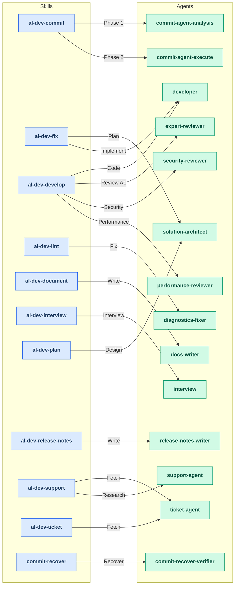
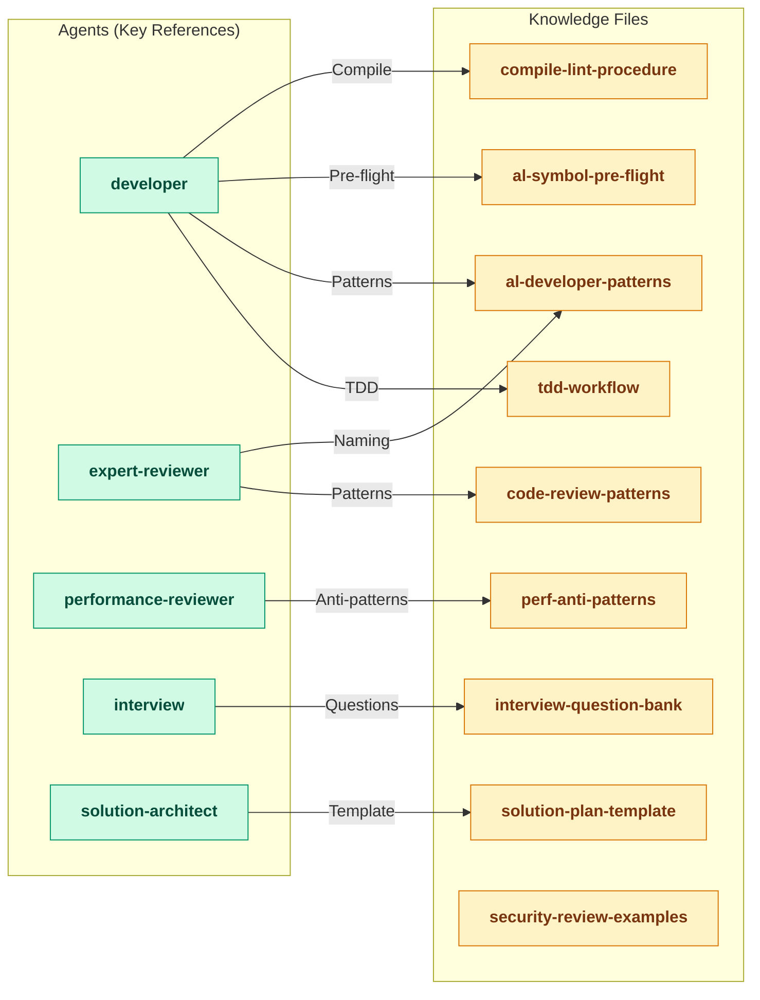

# Plugin Workflow Diagrams

> Generated by `/analyze-agent-design` on 2026-05-21.
> Re-run `/analyze-agent-design` to refresh.

## Full Architecture Overview

The al-dev plugin consists of 11 skills that dispatch 17 agents and reference 28 knowledge files. The architecture is split into two focused diagrams to manage complexity.

## Diagram 1: Skills → Agents (Dispatch Relationships)

Shows which skills spawn which agents in the workflow.

**Key observations:**
- **Multi-agent dispatch**: /al-dev-develop spawns developer + 3 specialist reviewers in parallel
- **Shared agents**: al-dev-developer (2 callers), al-dev-solution-architect (2 callers), al-dev-ticket-agent (2 callers)
- **Single-use agents**: Most agents (10 agents) are spawned by exactly one skill
- **Standalone agents**: al-dev-code-review, al-dev-explore, al-dev-script-engineer (no callers)

## Diagram 2: Agent → Knowledge (Reference Relationships)

Shows which agents reference knowledge files for workflow guidance.

## Design Patterns

### Parallel Review Pattern
The `/al-dev-develop` skill dispatches three specialist reviewers in parallel:
- **al-dev-expert-reviewer** — AL naming conventions, event subscribers, patterns
- **al-dev-security-reviewer** — permissions, data exposure, input validation
- **al-dev-performance-reviewer** — N+1 patterns, query efficiency, resource consumption

This enables independent expert review with debate-phase synthesis.

### Knowledge-Driven Agents
Key agents reference knowledge files rather than embedding detailed instructions:
- **al-dev-developer** references 4+ knowledge files (TDD, AL patterns, pre-flight, compile)
- **al-dev-solution-architect** uses solution-plan-template for consistent output structure
- **al-dev-interview** pulls from interview-question-bank for comprehensive coverage

### Single-Responsibility Principle
10 of 17 agents are single-use (spawned by one skill), creating tight, testable contracts. Shared agents (developer, solution-architect, ticket-agent) have broad scope but well-documented Inputs/Outputs.
