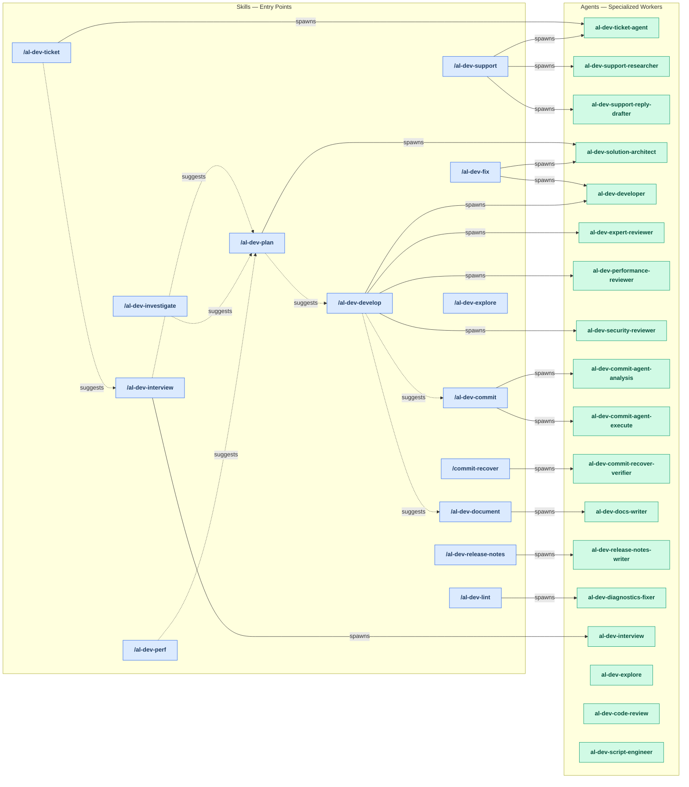

# Plugin Workflow Diagrams

> Generated by `/analyze-agent-design` on 2026-05-22.
> Re-run `/analyze-agent-design` to refresh.

---

## Skills & Agents Architecture

This diagram shows how skills spawn agents and how skills reference each other in the plugin's execution flow.

---

## Knowledge & Agent References

This diagram shows which knowledge files are read by skills and agents — the shared guidance that shapes behavior across the plugin.

```mermaid
flowchart LR
    classDef skillNode fill:#dbeafe,stroke:#2563eb,color:#1e3a5f,font-weight:bold
    classDef agentNode fill:#d1fae5,stroke:#059669,color:#064e3b,font-weight:bold
    classDef knowledgeNode fill:#fef3c7,stroke:#d97706,color:#78350f,font-weight:bold

    subgraph Sources[Skills & Agents]
        al_dev_plan_s["/al-dev-plan"]
        al_dev_fix_s["/al-dev-fix"]
        al_dev_develop_s["/al-dev-develop"]
        al_dev_lint_s["/al-dev-lint"]
        al_dev_explore_s["/al-dev-explore"]
        al_dev_perf_s["/al-dev-perf"]
        al_dev_document_s["/al-dev-document"]
        developer_a["al-dev-developer"]
        solution_architect_a["al-dev-solution-architect"]
        interview_a["al-dev-interview"]
        release_notes_a["al-dev-release-notes-writer"]
        security_review_a["al-dev-security-reviewer"]
        expert_review_a["al-dev-expert-reviewer"]
        perf_review_a["al-dev-performance-reviewer"]
        script_engineer_a["al-dev-script-engineer"]
        docs_writer_a["al-dev-docs-writer"]
    end

    subgraph Knowledge[Knowledge Files]
        workflow_routing["workflow-routing"]
        workflow_resilience["workflow-resilience"]
        architect_patterns["architect-invocation-patterns"]
        solution_template["solution-plan-template"]
        compile_lint["compile-lint-procedure"]
        fix_examples["al-dev-fix-examples"]
        explore_pattern["explore-subagent-pattern"]
        symbol_preflight["al-symbol-pre-flight"]
        review_panel["review-panel-pattern"]
        code_review_template["code-review-template"]
        tdd_workflow["tdd-workflow"]
        al_patterns["al-developer-patterns"]
        perf_patterns["perf-anti-patterns"]
        perf_examples["performance-review-examples"]
        security_examples["security-review-examples"]
        code_review_patterns["code-review-patterns"]
        interview_bank["interview-question-bank"]
        release_template["release-notes-template"]
        linting_rules["al-linting-rules"]
        doc_rtm["documentation-rtm-guide"]
        script_conventions["script-engineer-conventions"]
    end

    %% Skills → Knowledge
    al_dev_plan_s --> workflow_routing
    al_dev_plan_s --> workflow_resilience
    al_dev_plan_s --> architect_patterns
    al_dev_plan_s --> solution_template
    al_dev_fix_s --> compile_lint
    al_dev_fix_s --> architect_patterns
    al_dev_fix_s --> fix_examples
    al_dev_develop_s --> workflow_resilience
    al_dev_develop_s --> symbol_preflight
    al_dev_develop_s --> review_panel
    al_dev_develop_s --> code_review_template
    al_dev_lint_s --> linting_rules
    al_dev_explore_s --> explore_pattern
    al_dev_perf_s --> explore_pattern
    al_dev_perf_s --> perf_patterns
    al_dev_document_s --> doc_rtm

    %% Agents → Knowledge
    developer_a --> symbol_preflight
    developer_a --> tdd_workflow
    developer_a --> al_patterns
    solution_architect_a --> solution_template
    interview_a --> interview_bank
    release_notes_a --> release_template
    security_review_a --> security_examples
    expert_review_a --> code_review_patterns
    perf_review_a --> perf_patterns
    perf_review_a --> perf_examples
    script_engineer_a --> script_conventions
    docs_writer_a --> doc_rtm

    class al_dev_plan_s skillNode
    class al_dev_fix_s skillNode
    class al_dev_develop_s skillNode
    class al_dev_lint_s skillNode
    class al_dev_explore_s skillNode
    class al_dev_perf_s skillNode
    class al_dev_document_s skillNode

    class developer_a agentNode
    class solution_architect_a agentNode
    class interview_a agentNode
    class release_notes_a agentNode
    class security_review_a agentNode
    class expert_review_a agentNode
    class perf_review_a agentNode
    class script_engineer_a agentNode
    class docs_writer_a agentNode

    class workflow_routing knowledgeNode
    class workflow_resilience knowledgeNode
    class architect_patterns knowledgeNode
    class solution_template knowledgeNode
    class compile_lint knowledgeNode
    class fix_examples knowledgeNode
    class explore_pattern knowledgeNode
    class symbol_preflight knowledgeNode
    class review_panel knowledgeNode
    class code_review_template knowledgeNode
    class tdd_workflow knowledgeNode
    class al_patterns knowledgeNode
    class perf_patterns knowledgeNode
    class perf_examples knowledgeNode
    class security_examples knowledgeNode
    class code_review_patterns knowledgeNode
    class interview_bank knowledgeNode
    class release_template knowledgeNode
    class linting_rules knowledgeNode
    class doc_rtm knowledgeNode
    class script_conventions knowledgeNode
```

---

## Key Patterns

### Three Plugin Entry Points (Layer 1)

1. **Ticket/Support Flow** — User has a Freshdesk ticket
   - `/al-dev-ticket` → `/al-dev-support` (research + reply) OR `/al-dev-interview`/`/al-dev-plan`

2. **Development Flow** — User has requirements or a design
   - `/al-dev-interview` (gather) → `/al-dev-plan` (design) → `/al-dev-develop` (implement) → `/al-dev-commit` (stage)

3. **Direct Fix Flow** — User identifies a quick fix
   - `/al-dev-fix` (analyze + implement in one go) → `/al-dev-commit` (stage)

### Optional Pre-Planning Tributaries

- `/al-dev-explore` — understand codebase before planning
- `/al-dev-investigate` — identify root cause before designing a fix
- `/al-dev-perf` — profile performance issues before planning fixes

### Post-Commit Outputs

- `/al-dev-document` — generate documentation after implementation
- `/al-dev-release-notes` — create release notes between commits
- `/commit-recover` — recover corrupted files (fallback)

### Knowledge Distribution

Knowledge files define the shared behavior standards across the plugin:
- **Workflow files** (`workflow-*`, `architect-*`) guide skill dispatch and multi-agent sequencing
- **Template files** (`*-template.md`) define output structure and format
- **Reference files** (`*-examples.md`, `*-patterns.md`) provide domain knowledge and pattern catalogs
- **Checklist files** (`*-preflight.md`, `*-conventions.md`) enforce quality gates and conventions
