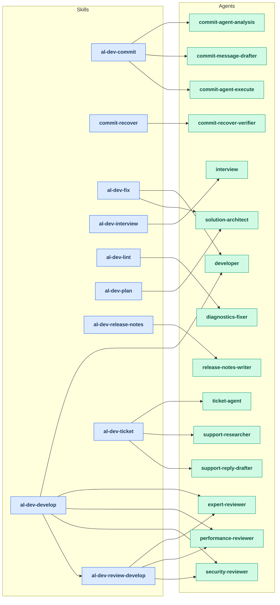
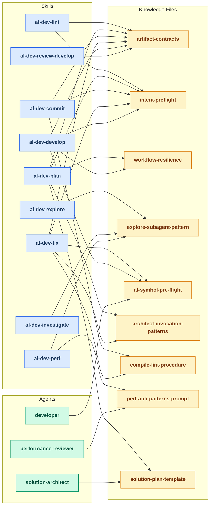

# Plugin Workflow Diagrams

> Generated by `/analyze-agent-design` on 2026-05-29.
> Re-run `/analyze-agent-design` to refresh.

## Skills → Agents

```mermaid
flowchart LR
    classDef skillNode fill:#dbeafe,stroke:#2563eb,color:#1e3a5f,font-weight:bold
    classDef agentNode fill:#d1fae5,stroke:#059669,color:#064e3b,font-weight:bold

    subgraph Skills[Skills]
        al_dev_commit[al-dev-commit]
        commit_recover[commit-recover]
        al_dev_develop[al-dev-develop]
        al_dev_fix[al-dev-fix]
        al_dev_interview_sk[al-dev-interview]
        al_dev_lint[al-dev-lint]
        al_dev_plan[al-dev-plan]
        al_dev_release_notes[al-dev-release-notes]
        al_dev_review_develop[al-dev-review-develop]
        al_dev_ticket[al-dev-ticket]
    end

    subgraph Agents[Agents]
        ag_commit_analysis[commit-agent-analysis]
        ag_commit_drafter[commit-message-drafter]
        ag_commit_execute[commit-agent-execute]
        ag_commit_recover[commit-recover-verifier]
        ag_developer[developer]
        ag_diagnostics[diagnostics-fixer]
        ag_expert[expert-reviewer]
        ag_interview[interview]
        ag_perf[performance-reviewer]
        ag_release[release-notes-writer]
        ag_security[security-reviewer]
        ag_architect[solution-architect]
        ag_support_reply[support-reply-drafter]
        ag_support_research[support-researcher]
        ag_ticket[ticket-agent]
    end

    al_dev_commit --> ag_commit_analysis
    al_dev_commit --> ag_commit_drafter
    al_dev_commit --> ag_commit_execute
    commit_recover --> ag_commit_recover
    al_dev_develop --> ag_developer
    al_dev_develop --> ag_expert
    al_dev_develop --> ag_perf
    al_dev_develop --> ag_security
    al_dev_develop --> al_dev_review_develop
    al_dev_fix --> ag_developer
    al_dev_fix --> ag_architect
    al_dev_interview_sk --> ag_interview
    al_dev_lint --> ag_diagnostics
    al_dev_plan --> ag_architect
    al_dev_release_notes --> ag_release
    al_dev_review_develop --> ag_expert
    al_dev_review_develop --> ag_perf
    al_dev_review_develop --> ag_security
    al_dev_ticket --> ag_ticket
    al_dev_ticket --> ag_support_research
    al_dev_ticket --> ag_support_reply

    class al_dev_commit skillNode
    class commit_recover skillNode
    class al_dev_develop skillNode
    class al_dev_fix skillNode
    class al_dev_interview_sk skillNode
    class al_dev_lint skillNode
    class al_dev_plan skillNode
    class al_dev_release_notes skillNode
    class al_dev_review_develop skillNode
    class al_dev_ticket skillNode
    class ag_commit_analysis agentNode
    class ag_commit_drafter agentNode
    class ag_commit_execute agentNode
    class ag_commit_recover agentNode
    class ag_developer agentNode
    class ag_diagnostics agentNode
    class ag_expert agentNode
    class ag_interview agentNode
    class ag_perf agentNode
    class ag_release agentNode
    class ag_security agentNode
    class ag_architect agentNode
    class ag_support_reply agentNode
    class ag_support_research agentNode
    class ag_ticket agentNode
```

## Skills and Agents → Knowledge Files

```mermaid
flowchart LR
    classDef skillNode fill:#dbeafe,stroke:#2563eb,color:#1e3a5f,font-weight:bold
    classDef agentNode fill:#d1fae5,stroke:#059669,color:#064e3b,font-weight:bold
    classDef knowledgeNode fill:#fef3c7,stroke:#d97706,color:#78350f,font-weight:bold

    subgraph Skills[Skills]
        al_dev_commit2[al-dev-commit]
        al_dev_develop2[al-dev-develop]
        al_dev_explore2[al-dev-explore]
        al_dev_fix2[al-dev-fix]
        al_dev_investigate2[al-dev-investigate]
        al_dev_lint2[al-dev-lint]
        al_dev_perf2[al-dev-perf]
        al_dev_plan2[al-dev-plan]
        al_dev_review_develop2[al-dev-review-develop]
    end

    subgraph Agents[Agents]
        ag_developer2[developer]
        ag_perf_rev[performance-reviewer]
        ag_architect2[solution-architect]
    end

    subgraph Knowledge[Knowledge Files]
        k_artifact[artifact-contracts]
        k_intent[intent-preflight]
        k_resilience[workflow-resilience]
        k_explore[explore-subagent-pattern]
        k_symbol[al-symbol-pre-flight]
        k_architect[architect-invocation-patterns]
        k_compile[compile-lint-procedure]
        k_perf[perf-anti-patterns-prompt]
        k_plan_template[solution-plan-template]
    end

    %% artifact-contracts references
    al_dev_lint2 --> k_artifact
    al_dev_plan2 --> k_artifact
    al_dev_commit2 --> k_artifact
    al_dev_fix2 --> k_artifact
    al_dev_develop2 --> k_artifact
    al_dev_review_develop2 --> k_artifact

    %% intent-preflight references
    al_dev_lint2 --> k_intent
    al_dev_plan2 --> k_intent
    al_dev_commit2 --> k_intent
    al_dev_fix2 --> k_intent
    al_dev_develop2 --> k_intent

    %% workflow-resilience references
    al_dev_plan2 --> k_resilience
    al_dev_develop2 --> k_resilience

    %% explore-subagent-pattern references
    al_dev_explore2 --> k_explore
    al_dev_investigate2 --> k_explore
    al_dev_perf2 --> k_explore

    %% al-symbol-pre-flight references
    al_dev_fix2 --> k_symbol
    al_dev_develop2 --> k_symbol
    ag_developer2 --> k_symbol

    %% architect-invocation-patterns references
    al_dev_plan2 --> k_architect
    al_dev_fix2 --> k_architect

    %% compile-lint-procedure references
    al_dev_commit2 --> k_compile
    al_dev_fix2 --> k_compile

    %% perf-anti-patterns-prompt references
    al_dev_perf2 --> k_perf
    ag_perf_rev --> k_perf

    %% solution-plan-template references
    al_dev_plan2 --> k_plan_template
    ag_architect2 --> k_plan_template

    class al_dev_commit2 skillNode
    class al_dev_develop2 skillNode
    class al_dev_explore2 skillNode
    class al_dev_fix2 skillNode
    class al_dev_investigate2 skillNode
    class al_dev_lint2 skillNode
    class al_dev_perf2 skillNode
    class al_dev_plan2 skillNode
    class al_dev_review_develop2 skillNode
    class ag_developer2 agentNode
    class ag_perf_rev agentNode
    class ag_architect2 agentNode
    class k_artifact knowledgeNode
    class k_intent knowledgeNode
    class k_resilience knowledgeNode
    class k_explore knowledgeNode
    class k_symbol knowledgeNode
    class k_architect knowledgeNode
    class k_compile knowledgeNode
    class k_perf knowledgeNode
    class k_plan_template knowledgeNode
```
