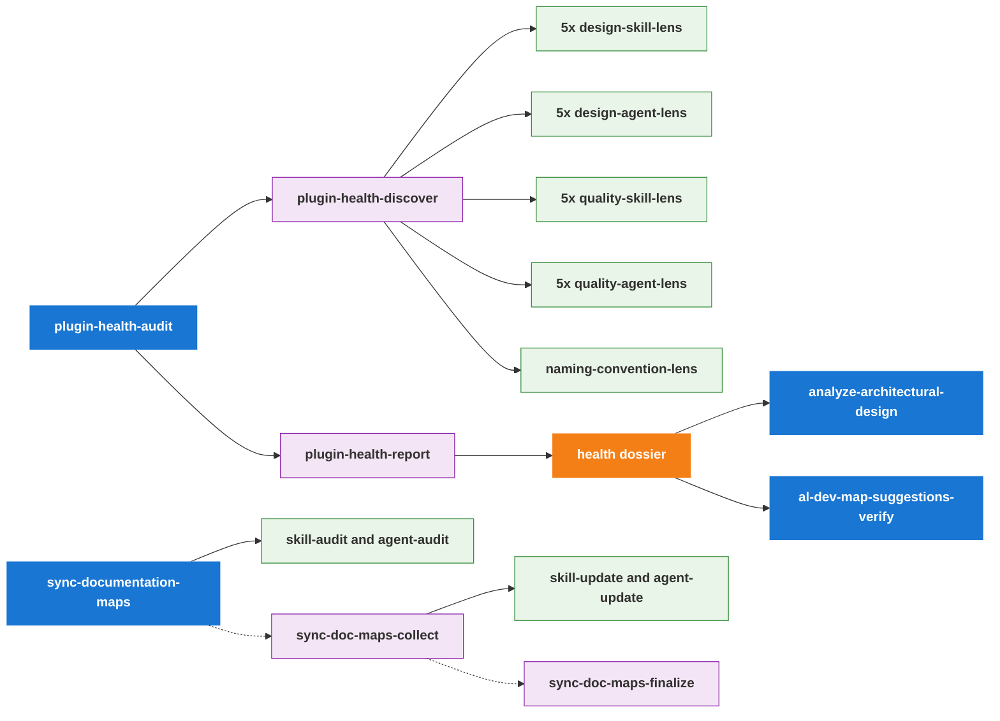
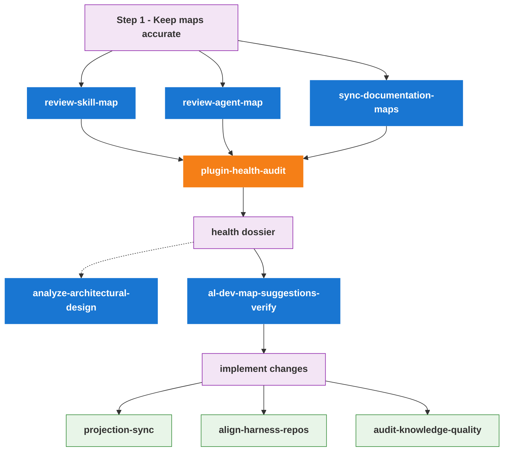

# Maintainer Tooling Reference

The `.claude/` directory contains the **self-healing tool surface** for
maintaining the al-dev-shared plugin. These are repo-local Claude Code skills
and agents — not part of the distributed plugin surface — used to detect drift,
improve design quality, sync documentation, and enforce harness neutrality.

The toolset is one pipeline: **keep maps accurate → find improvements → act on
findings → implement → post-change cleanup.** Findings live in one place — the
health dossier under `docs/health/` — and the maps (`docs/al-dev-skills-map.md`,
`docs/al-dev-agent-map.md`) are documentation only.

**Use this guide to:**

- Find the right skill for a specific task (Skills at a Glance, Quick Reference)
- Understand the calling relationships and execution flow (Skill Hierarchy, Recommended Run Order)
- Learn which agents are dispatched and what they check (Agents Reference)
- See what files each skill writes (Outputs Written)

---

## Skills at a Glance

### User-Facing Entry Points

| Skill | Purpose | When to run |
|-------|---------|-------------|
| `/plugin-health-audit` | The single find-improvements sweep — design + quality + naming lenses → one ranked dossier per surface | "What should I improve?" |
| `/al-dev-map-suggestions-verify` | Rubber-duck accepted dossier findings against live code, then write an implementation plan | After a health audit, before implementing |
| `/review-skill-map` | In-session accuracy sync of `docs/al-dev-skills-map.md` | After adding/removing/restructuring skills |
| `/review-agent-map` | In-session accuracy sync of `docs/al-dev-agent-map.md` | After adding/removing/restructuring agents |
| `/sync-documentation-maps` | Async 3-step accuracy sync via remote agents (session-freeing) | When you want maps synced without waiting |
| `/analyze-architectural-design` | Optional cross-surface synthesis after a health audit (ties skill and agent findings together) | After a both-surface health audit |
| `/audit-knowledge-quality` | Audit `knowledge/` files for stubs and thin content | After editing knowledge files |
| `/projection-sync` | Regenerate harness-native agent projections from canonical source | After editing any `agents/*.md` file |
| `/align-harness-repos` | Validate shared surface has no harness-specific tokens | After editing skills, agents, or knowledge |

### Sub-Skills (called internally, not typically invoked directly)

| Skill | Called by | Role |
|-------|----------|------|
| `/plugin-health-discover` | `/plugin-health-audit` | Dispatches all lenses; writes findings file |
| `/plugin-health-report` | `/plugin-health-audit` | Ranks findings; writes the health dossier |
| `/sync-documentation-maps-collect` | User (step 2 of 3) | Reads audit artifacts; dispatches update agents |
| `/sync-documentation-maps-finalize` | User (step 3 of 3) | Writes maps, regenerates diagrams, commits |

> **Map accuracy vs. finding improvements are separate jobs.** `/review-*-map`
> and `/sync-documentation-maps` only keep the maps factually current — they no
> longer emit design suggestions. All structural and quality findings (Atomise,
> Move, Trim, Inline, bloat, naming, …) come from `/plugin-health-audit`.

---

## Skill Hierarchy

Who calls what and what gets dispatched.

> **Things to notice:**
>
> - `/plugin-health-audit` is the only skill that dispatches the design,
>   quality, and naming lenses. There is one lens-dispatch path — no parallel
>   implementation to drift from.
> - The health dossier is the single findings sink. Both
>   `/al-dev-map-suggestions-verify` (turn findings into a plan) and
>   `/analyze-architectural-design` (cross-surface synthesis) read it.
> - `--dimension design|quality|all` and `--surface plugin|tooling|both` scope
>   the sweep, so a focused design-only or quality-only run is still one command.

---

## Recommended Run Order

When to run each skill and in what sequence.

> Both map-accuracy paths are equivalent — pick the in-session pair
> (`/review-skill-map` + `/review-agent-map`) for a quick check, or the async
> `/sync-documentation-maps` to free the session. Either way, the next step is
> `/plugin-health-audit`.

---

## Understanding Design vs. Quality Analysis

Both kinds of analysis run through one entry — `/plugin-health-audit` — and land
in the same dossier. Scope them with `--dimension`.

**Design analysis** (`--dimension design`): architecture and composition —
whether skills should be split, merged, moved, or refactored; whether agents are
over-allocated or can be inlined. Vocabulary: Atomise, Absorb, Connect, Merge,
Promote, Move, Extend (skills); Trim, Remodel, Split, Inline, Align (agents).

**Quality analysis** (`--dimension quality`): code clarity, structure, naming,
bloat, and description drift in skill/agent files. Vocabulary: Bloat, Clarity,
Structure, Name-fit, Description, plus naming-convention violations.

`/analyze-architectural-design` adds one thing the per-surface dossiers do not:
a cross-surface synthesis relating the skill-layer findings to the agent-layer
findings. Run it after a both-surface health audit.

---

## Agents Reference

### Design Lens Agents — skill-focused (dispatched by `/plugin-health-discover`)

| Agent | What it checks |
|-------|---------------|
| `design-skill-lens-complexity` | High-phase skills with separable concerns (Atomise), zero-agent 2-phase skills (Absorb), and skills that belong in the maintainer surface (Move) |
| `design-skill-lens-handoff-gaps` | Handoff chains with obvious next steps or orphaned outputs (Extend) |
| `design-skill-lens-near-duplicates` | Skill pairs with similar structure that could be merged (Merge) |
| `design-skill-lens-preplanning` | Pre-planning skills shown in the Layer 1 diagram as dashed tributaries with named outputs (Layer 1 diagram fidelity) |
| `design-skill-lens-shared-backbone` | Agent types used by 2+ skills whose patterns could be promoted to knowledge (Connect/Promote) |

### Design Lens Agents — agent-focused (dispatched by `/plugin-health-discover`)

| Agent | What it checks |
|-------|---------------|
| `design-agent-lens-caller-alignment` | Documented Inputs/Outputs vs how spawning skills actually invoke the agent (Align) |
| `design-agent-lens-model-fit` | Whether haiku/sonnet/opus assignment matches task complexity (Remodel) |
| `design-agent-lens-scope-isolation` | Agents with two clearly separable concerns in their system prompt (Split) |
| `design-agent-lens-tool-hygiene` | Tools declared in frontmatter but unused in system prompt body (Trim) |
| `design-agent-lens-usage-patterns` | Single-use agents with small bodies and no documented contract (Inline) |

### Quality Lens Agents (dispatched by `/plugin-health-discover`)

| Agent | Surface | What it checks |
|-------|---------|---------------|
| `quality-skill-lens-clarity` | skills | Ambiguous instructions, vague qualifiers, incomplete conditionals |
| `quality-skill-lens-structure` | skills | Frontmatter completeness, tool canonicality, header numbering |
| `quality-skill-lens-description` | skills | Description drift vs body content |
| `quality-skill-lens-bloat` | skills | Oversized sections, dead branches, repetitive blocks |
| `quality-skill-lens-name-fit` | skills | Skill name vs primary verb and scope |
| `quality-agent-lens-clarity` | agents | Same as skill-clarity for agent files |
| `quality-agent-lens-structure` | agents | Same as skill-structure for agent files |
| `quality-agent-lens-description` | agents | Same as skill-description for agent files |
| `quality-agent-lens-bloat` | agents | Same as skill-bloat for agent files |
| `quality-agent-lens-name-fit` | agents | Same as skill-name-fit for agent files |
| `naming-convention-lens` | both | Tool name and output filename violations per naming convention |

### Map Sync Agents (dispatched by `/sync-documentation-maps` and `-collect`)

| Agent | Role |
|-------|------|
| `sync-documentation-maps-skill-audit` | Audits active skills against `docs/al-dev-skills-map.md`; writes JSON findings |
| `sync-documentation-maps-agent-audit` | Audits active agents against `docs/al-dev-agent-map.md`; writes JSON findings |
| `sync-documentation-maps-skill-update` | Reads skill audit findings; writes updated `al-dev-skills-map.md` to run dir |
| `sync-documentation-maps-agent-update` | Reads agent audit findings; writes updated `al-dev-agent-map.md` to run dir |

---

## Outputs Written

| Skill | Output |
|-------|--------|
| `/plugin-health-discover` | `docs/health/<run-date>-<surface>-findings.md` |
| `/plugin-health-report` | `docs/health/<run-date>-<surface>-health.md` (the dossier); refreshes `docs/al-dev-plugin-graph.md` for the plugin surface |
| `/al-dev-map-suggestions-verify` | implementation plan under `docs/superpowers/plans/` |
| `/analyze-architectural-design` | `docs/al-dev-plugin-synthesis.md` (living doc, overwritten each run) |
| `/review-skill-map` | `docs/al-dev-skills-map.md` |
| `/review-agent-map` | `docs/al-dev-agent-map.md` |
| `/sync-documentation-maps-finalize` | `docs/al-dev-skills-map.md`, `docs/al-dev-agent-map.md`; regenerates diagrams, agent projections, and dependency graph |
| `/projection-sync` | `profile-al-dev-shared/generated/agents/claude/`, `copilot/`, `codex/` |

> Maps no longer carry an Observations/suggestions section — findings live only
> in the dossier.

---

## Quick Reference: Which Skill to Run When

| Situation | Run |
|-----------|-----|
| Added or removed a skill | `/review-skill-map` |
| Added or removed an agent | `/review-agent-map` |
| Edited an agent `.md` file | `/projection-sync`, then `/align-harness-repos` |
| Edited a knowledge file | `/audit-knowledge-quality`, then `/align-harness-repos` |
| Want to find improvements | `/plugin-health-audit` |
| Want design-only or quality-only findings | `/plugin-health-audit --dimension design` or `--dimension quality` |
| Want skill and agent findings tied together | `/analyze-architectural-design` (after a both-surface audit) |
| Ready to act on accepted findings | `/al-dev-map-suggestions-verify` |
| Maps are out of sync, no rush | `/sync-documentation-maps` (async — then `-collect`, then `-finalize`) |
| Maps are out of sync, fix now | `/review-skill-map` + `/review-agent-map` (in-session) |
