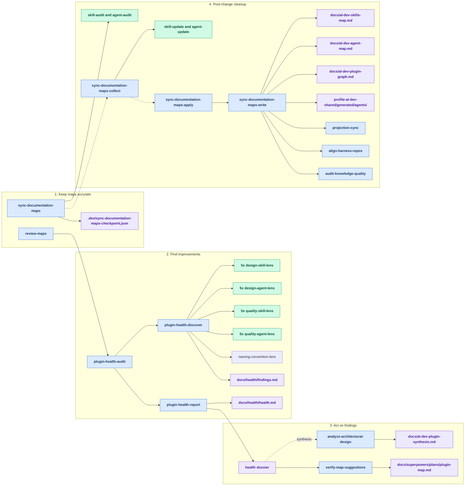
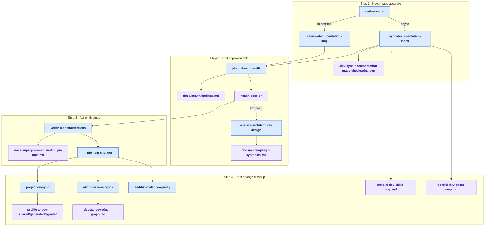

# Maintainer Tooling Reference

The `.claude/` directory contains the **self-healing tool surface** for
maintaining the al-dev-shared plugin. These are repo-local Claude Code skills
and agents — not part of the distributed plugin surface — used to detect drift,
improve design quality, sync documentation, and enforce harness neutrality.

The toolset is one pipeline: **keep maps accurate → find improvements → act on
findings → implement → post-change cleanup.** Findings live in one place — the
health dossier under `docs/health/` — and the maps (`docs/al-dev-skills-map.md`,
`docs/al-dev-agent-map.md`) are documentation only. That dossier is a report
artifact, not a knowledge file. The shared knowledge files live under
`profile-al-dev-shared/knowledge/`.

Glossary:

- **Dossier**: a ranked findings report under `docs/health/`
- **Knowledge file**: a shared reference file under `profile-al-dev-shared/knowledge/`

**Use this guide to:**

- Find the right skill for a specific task (Skills at a Glance, Quick Reference)
- Understand the calling relationships and execution flow (Skill Hierarchy, Recommended Run Order)
- Learn which agents are dispatched and what they check (Agents Reference)
- See what files each skill reads and writes (Inputs Read, Outputs Written)

---

## Skills at a Glance

### User-Facing Entry Points

| Skill | Purpose | When to run |
| --- | --- | --- |
| `/plugin-health-audit` | The single find-improvements sweep — design + quality + naming lenses → one ranked dossier per surface | "What should I improve?" |
| `/verify-map-suggestions` | Rubber-duck accepted dossier findings against live code, then write an implementation plan | After a health audit, before implementing |
| `/review-maps` | Map accuracy sync — asks in-session or async at invocation; pass `--no-update` for audit-only | After adding/removing/restructuring skills or agents |
| `/sync-documentation-maps` | Async 4-step accuracy sync via remote agents (session-freeing) | When you want maps synced without waiting |
| `/analyze-architectural-design` | Cross-surface synthesis add-on for health audit, writes `docs/al-dev-plugin-synthesis.md` (coupling gaps, model-complexity mismatch, shared-pattern coherence). Ties skill and agent findings together. Run after `/plugin-health-audit`. | After a both-surface health audit |
| `/audit-knowledge-quality` | Audit `knowledge/` files for stubs and thin content | After editing knowledge files |
| `/projection-sync` | Regenerate harness-native agent projections from canonical source | After editing any `agents/*.md` file |
| `/align-harness-repos` | Validate harness neutrality in the al-dev-shared shared plugin surface. Scans for forbidden harness-specific tokens (Claude Code, Copilot, etc.) that could break distributable content. Run after changes to skills, agents, or knowledge. | After editing skills, agents, or knowledge |

### Sub-Skills (called internally, not typically invoked directly)

| Skill | Called by | Role |
| --- | --- | --- |
| `/plugin-health-discover` | `/plugin-health-audit` | Dispatches all lenses; writes findings file |
| `/plugin-health-report` | `/plugin-health-audit` | Ranks findings; writes the health dossier |
| `/sync-documentation-maps-collect` | User (step 2 of 4) | Reads audit artifacts; dispatches update agents |
| `/sync-documentation-maps-apply` | User (step 3 of 4) | Validates update artifacts and writes the map files to `docs/` |
| `/sync-documentation-maps-write` | User (step 4 of 4) | Regenerates diagrams, projections, and the dependency graph; commits |
| `/review-documentation-map` | `/review-maps` | In-session audit and update of the skills or agents map against the live codebase. Use `--surface skills|agents` and `--no-update` for audit-only mode. |

> **Map accuracy vs. finding improvements are separate jobs.** `/review-*-map`
> and `/sync-documentation-maps` only keep the maps factually current — they no
> longer emit design suggestions. All structural and quality findings (Atomise,
> Move, Trim, Inline, bloat, naming, …) come from `/plugin-health-audit`.

---

## Skill Hierarchy

Who calls what and what gets dispatched.

> **Things to notice:**
>
> - `/plugin-health-audit` is the only skill that dispatches the design,
>   quality, and naming lenses. There is one lens-dispatch path — no parallel
>   implementation to drift from.
> - The health dossier is the single findings sink. Both
>   `/verify-map-suggestions` (turn findings into a plan) and
>   `/analyze-architectural-design` (cross-surface synthesis) read it.
> - `--dimension design|quality|all` and `--surface plugin|tooling|both` scope
>   the sweep, so a focused design-only or quality-only run is still one command.
>
> **Color key:**
>
> - Blue: skill nodes and entry points
> - Green: dispatched agents and agent groups
> - Violet: generated artifacts, map files, and output paths

---

## Recommended Run Order

When to run each skill and in what sequence.

> `/review-maps` asks which mode at start — in-session or async.
> `/sync-documentation-maps` can also be invoked directly to skip the prompt.
> Either way, the next step is `/plugin-health-audit`.
>
> **Output chain:** maps sync writes `docs/al-dev-skills-map.md` and
> `docs/al-dev-agent-map.md`, the health sweep writes
> `docs/health/*-findings.md` and `docs/health/*-health.md`, synthesis writes
> `docs/al-dev-plugin-synthesis.md`, verification writes
> `docs/superpowers/plans/*.md`, and the post-change steps refresh generated
> projections and the plugin graph.

---

## Understanding Design vs. Quality Analysis

Both kinds of analysis run through one entry — `/plugin-health-audit` — and land
in the same dossier. Scope them with `--dimension`.

**Design analysis** (`--dimension design`): architecture and composition —
whether skills should be split, merged, moved, or refactored; whether agents are
over-allocated or can be inlined. Vocabulary: Atomise, Absorb, Connect, Merge,
Promote, Move, Extend (skills); Trim, Remodel, Split, Inline, Align (agents).

**Quality analysis** (`--dimension quality`): code clarity, structure, naming,
bloat, and description drift in skill/agent files. Vocabulary: Bloat, Clarity,
Structure, Name-fit, Description, plus naming-convention violations.

`/analyze-architectural-design` adds one thing the per-surface dossiers do not:
a cross-surface synthesis relating the skill-layer findings to the agent-layer
findings. Run it after a both-surface health audit.

---

## Agents Reference

### Design Lens Agents — skill-focused (dispatched by `/plugin-health-discover`)

| Agent | What it checks |
| --- | --- |
| `design-skill-lens-complexity` | High-phase skills with separable concerns (Atomise), zero-agent 2-phase skills (Absorb), and skills that belong in the maintainer surface (Move) |
| `design-skill-lens-handoff-gaps` | Handoff chains with obvious next steps or orphaned outputs (Extend) |
| `design-skill-lens-near-duplicates` | Skill pairs with similar structure that could be merged (Merge) |
| `design-skill-lens-preplanning` | Pre-planning skills shown in the Layer 1 diagram as dashed tributaries with named outputs (Layer 1 diagram fidelity) |
| `design-skill-lens-shared-backbone` | Agent types used by 2+ skills whose patterns could be promoted to knowledge (Connect/Promote) |

### Design Lens Agents — agent-focused (dispatched by `/plugin-health-discover`)

| Agent | What it checks |
| --- | --- |
| `design-agent-lens-caller-alignment` | Documented Inputs/Outputs vs how spawning skills actually invoke the agent (Align) |
| `design-agent-lens-model-fit` | Whether haiku/sonnet/opus assignment matches task complexity (Remodel) |
| `design-agent-lens-scope-isolation` | Agents with two clearly separable concerns in their system prompt (Split) |
| `design-agent-lens-tool-hygiene` | Tools declared in frontmatter but unused in system prompt body (Trim) |
| `design-agent-lens-usage-patterns` | Single-use agents with small bodies and no documented contract (Inline) |

### Quality Lens Agents (dispatched by `/plugin-health-discover`)

| Agent | Surface | What it checks |
| --- | --- | --- |
| `quality-skill-lens-clarity` | skills | Ambiguous instructions, vague qualifiers, incomplete conditionals |
| `quality-skill-lens-structure` | skills | Frontmatter completeness, tool canonicality, header numbering |
| `quality-skill-lens-description` | skills | Description drift vs body content |
| `quality-skill-lens-bloat` | skills | Oversized sections, dead branches, repetitive blocks |
| `quality-skill-lens-name-fit` | skills | Skill name vs primary verb and scope |
| `quality-agent-lens-clarity` | agents | Same as skill-clarity for agent files |
| `quality-agent-lens-structure` | agents | Same as skill-structure for agent files |
| `quality-agent-lens-description` | agents | Same as skill-description for agent files |
| `quality-agent-lens-bloat` | agents | Same as skill-bloat for agent files |
| `quality-agent-lens-name-fit` | agents | Same as skill-name-fit for agent files |
| `naming-convention-lens` | both | Tool name and output filename violations per naming convention |

### Map Sync Agents (dispatched by `/sync-documentation-maps` and `-collect`)

| Agent | Role |
| --- | --- |
| `sync-documentation-maps-skill-audit` | Audits active skills against `docs/al-dev-skills-map.md`; writes JSON findings |
| `sync-documentation-maps-agent-audit` | Audits active agents against `docs/al-dev-agent-map.md`; writes JSON findings |
| `sync-documentation-maps-skill-update` | Reads skill audit findings; writes updated `al-dev-skills-map.md` to run dir |
| `sync-documentation-maps-agent-update` | Reads agent audit findings; writes updated `al-dev-agent-map.md` to run dir |

---

## Outputs Written

| Skill | Output |
| --- | --- |
| `/plugin-health-discover` | `docs/health/<run-date>-<surface>-findings.md` |
| `/plugin-health-report` | `docs/health/<run-date>-<surface>-health.md` (the dossier); refreshes `docs/al-dev-plugin-graph.md` for the plugin surface |
| `/verify-map-suggestions` | implementation plan under `docs/superpowers/plans/` |
| `/analyze-architectural-design` | `docs/al-dev-plugin-synthesis.md` (living doc, overwritten each run) |
| `/review-maps` | `docs/al-dev-skills-map.md`, `docs/al-dev-agent-map.md` (via sub-skills) |
| `/review-documentation-map` | `docs/al-dev-skills-map.md` or `docs/al-dev-agent-map.md` |
| `/sync-documentation-maps-apply` | `docs/al-dev-skills-map.md`, `docs/al-dev-agent-map.md` |
| `/sync-documentation-maps-write` | regenerates diagrams, agent projections, and dependency graph |
| `/projection-sync` | `profile-al-dev-shared/generated/agents/claude/`, `copilot/`, `codex/` |

> Maps no longer carry an Observations/suggestions section — findings live only
> in the dossier.

---

## Inputs Read

These skills are mostly artifact-driven. The same maintainer command can look
idle or underspecified if you do not know which document it expects to read
first.

| Skill | Primary input documents | Notes |
| --- | --- | --- |
| `/plugin-health-audit` | none required from the user; orchestrates live repo scans | Entry point only. It chains `/plugin-health-discover` and `/plugin-health-report`. |
| `/plugin-health-discover` | `docs/al-dev-skills-map.md`, `docs/al-dev-agent-map.md`, `profile-al-dev-shared/knowledge/lens-invocation-patterns.md` | Reads the current maps plus the shared knowledge file that defines lens invocation guidance before dispatching the design, quality, and naming lenses. |
| `/plugin-health-report` | latest `docs/health/*-findings.md` | Consumes the structured findings written by `/plugin-health-discover` and turns them into a ranked dossier. |
| `/analyze-architectural-design` | latest `docs/health/*-health.md` dossier, optionally the paired skill and agent dossiers from the same run | This is a synthesis pass over the health dossier, not a fresh audit. Run it after a both-surface health audit. |
| `/verify-map-suggestions` | one or more `docs/health/YYYY-MM-DD-<surface>-health.md` dossiers, `profile-al-dev-shared/knowledge/map-change-rubber-duck-checks.md`, `profile-al-dev-shared/knowledge/rubber-duck.md` | This skill turns accepted dossier findings into an implementation plan. The dossier is the key input artifact; the two knowledge files define the rubber-duck review rules it applies. |
| `/review-maps` | `docs/al-dev-skills-map.md`, `docs/al-dev-agent-map.md` | Wrapper entry point. It prompts for in-session vs async flow, then routes to `/review-documentation-map` or `/sync-documentation-maps`. |
| `/review-documentation-map` | `docs/al-dev-skills-map.md` or `docs/al-dev-agent-map.md`, plus the corresponding live source under `profile-al-dev-shared/skills/` or `profile-al-dev-shared/agents/` | Use `--surface skills` or `--surface agents` when you want one map only. |
| `/sync-documentation-maps` | `docs/al-dev-skills-map.md`, `docs/al-dev-agent-map.md`, `.claude/skills/sync-documentation-maps/checkpoint-patterns.md` | Starts the async path. It compares current maps against live source and writes the initial checkpoint. |
| `/sync-documentation-maps-collect` | `.dev/sync-documentation-maps-checkpoint.json`, `.claude/skills/sync-documentation-maps/checkpoint-patterns.md` | Reads the dispatch checkpoint, inspects audit results, and decides which update agents to launch. |
| `/sync-documentation-maps-apply` | `.dev/sync-documentation-maps-checkpoint.json`, `.claude/skills/sync-documentation-maps/checkpoint-patterns.md` | Reads update outputs, writes the refreshed map files into `docs/`, then marks the checkpoint ready for the write/finalize step. |
| `/sync-documentation-maps-write` | `.dev/sync-documentation-maps-checkpoint.json`, `docs/al-dev-skills-map.md`, `docs/al-dev-agent-map.md` | Final repo write phase. It expects the checkpoint to be in the post-apply state and then regenerates downstream derived artifacts. |
| `/projection-sync` | canonical authored agent source under `profile-al-dev-shared/agents/*.md` | There is no separate plan/report input. The authored agent files are the source of truth for projection generation. |
| `/align-harness-repos` | shared authored content under `profile-al-dev-shared/skills/`, `agents/`, `knowledge/` | Validator-style skill. It scans shared source for harness-specific drift rather than reading a prior report artifact. |
| `/audit-knowledge-quality` | `profile-al-dev-shared/knowledge/*.md` | Directly audits the knowledge files themselves for stubs, thin sections, and structural issues. |

**Practical rule:** most of the maintainer pipeline reads one of four document
types first:

1. map docs in `docs/al-dev-*-map.md`
2. health artifacts in `docs/health/*.md`
3. async checkpoint state in `.dev/sync-documentation-maps-checkpoint.json`
4. canonical shared source under `profile-al-dev-shared/`

If a step appears blocked, check that its expected input artifact exists and was
produced by the preceding step.

---

## Quick Reference: Which Skill to Run When

| Situation | Run |
| --- | --- |
| Added or removed a skill or agent | `/review-maps` |
| Want to check one map only | `/review-documentation-map --surface skills` or `--surface agents` |
| Edited an agent `.md` file | `/projection-sync`, then `/align-harness-repos` |
| Edited a knowledge file | `/audit-knowledge-quality`, then `/align-harness-repos` |
| Want to find improvements | `/plugin-health-audit` |
| Want design-only or quality-only findings | `/plugin-health-audit --dimension design` or `--dimension quality` |
| Want skill and agent findings tied together | `/analyze-architectural-design` (after a both-surface audit) |
| Ready to act on accepted findings | `/verify-map-suggestions` |
| Maps are out of sync, no rush | `/sync-documentation-maps` (async — then `-collect`, `-apply`, `-write`) |
| Maps are out of sync, fix now | `/review-maps` (in-session) |
