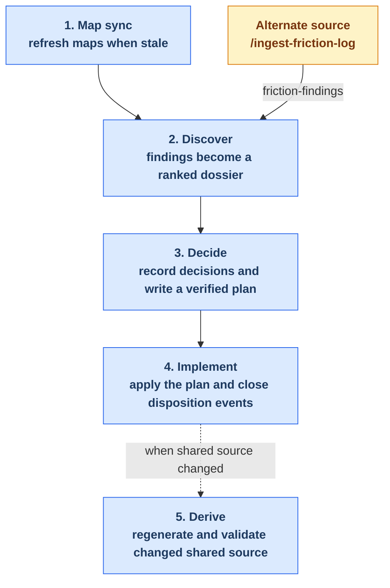

# Maintainer Tooling Reference

Repo-local maintainer tooling lives under `.claude/` and `.codex/`. This guide
organizes the maintenance journey into five stages while keeping the
breadcrumb-controlled health loop distinct from its preparation and follow-up
work.

**What you'll find here:** This reference helps you navigate a complete plugin health
lifecycle: from discovering issues through executing fixes and validating changes. Each
stage is independent and can be run in isolation, but together they form a coherent
workflow controlled by durable handoff artifacts that survive across sessions.

**How to use this guide:** Start by reading the overview below to understand how stages
connect. Then refer to individual stage pages (linked in The Five Stages table) for
detailed workflows, artifact contracts, and command sequences. Use the Quick Reference
section to find the specific entry point matching your situation. Exact skill frontmatter
and generated diagnostics are retained in the appendices for contract maintenance and
troubleshooting.

Content between `BEGIN GENERATED` and `END GENERATED` markers comes from
`.claude/skills/*/SKILL.md` workflow contracts through
`scripts/generate-maintainer-guide.py`. Update the source contract or generator,
then regenerate; do not edit marked content directly.

## Workflow Overview

The five stages divide into three roles:

**Preparation (Stage 1: Map sync)** — Refreshes the inventory of skills and agents so that
later audits have trustworthy context. This stage is independent preparation work that must
preserve any active health-loop breadcrumb pointer; it's not part of the durable loop itself.

**Core health loop (Stages 2–4: Discover → Decide → Implement)** — The durable self-healing
cycle. It starts when you run Discover (either by lens audit or by ingesting friction logs),
converts findings into maintainer decisions, and executes approved changes. Progress is tracked
across sessions via `.dev/health-loop-state.md` breadcrumb artifacts so the loop can survive
interruption and resume.

**Finalization (Stage 5: Derive)** — Conditional cleanup work that runs only if the implementation
changed shared source (agents, knowledge, or skills). Regenerates derived outputs and validates
that all changes remain harness-neutral across all three harnesses (Claude Code, Copilot, Codex).

When shared source changed during Implement, the applicable Derive checks run before the final
ledger-close commit, keeping the loop atomic.

<!-- BEGIN GENERATED: maintainer-workflow-overview -->

<!-- END GENERATED: maintainer-workflow-overview -->

## The Five Stages

| Stage | Purpose | Use it when |
| --- | --- | --- |
| [1. Map sync](./maintainer-tooling/map-sync.md) | Refresh the canonical skill and agent maps, then regenerate their derived documentation. | You've added or removed a skill/agent, renamed one, or changed their relationships. Also use to re-verify map accuracy against the live codebase. This is preparatory work that runs independent of the health loop. |
| [2. Discover](./maintainer-tooling/discover.md) | Produce and verify findings through either a lens audit or friction ingestion. | You want to identify improvement candidates in the plugin. Run the full audit via `/plugin-health-audit` to spawn all design, quality, and naming lenses, or use `/ingest-friction-log` to fold accumulated session-analysis findings into the discovery process. |
| [3. Decide](./maintainer-tooling/decide.md) | Record durable decisions and turn accepted findings into a verified plan. | A dossier contains findings that need disposition (accept, decline, grandfather, or mark as already fixed). Disposition decisions are recorded durably in the ledger before planning, so later reverification can reuse them without re-auditing. |
| [4. Implement](./maintainer-tooling/implement.md) | Execute the approved plan and close its accepted disposition events. | A verified plan exists with explicit `closes_event_ids:` identifiers. Run this to execute tasks one-by-one, verify results, and append fixed events to the JSONL event store to prove the work was completed. The stage is resumable via a progress checkpoint if interrupted. |
| [5. Derive](./maintainer-tooling/derive.md) | Regenerate projections and run shared-source quality checks during finalization. | Implementation or direct edits changed shared agents (→ regenerate projections), shared knowledge (→ audit quality, fix HIGH items), or any shared skill/agent/knowledge (→ validate harness neutrality). These checks happen automatically during health-plan runs before loop closure. |

## Breadcrumb Orchestrator

There is no monolithic orchestrator skill; instead, the core loop uses a simple durable
handoff pattern that works across session boundaries. After each lifecycle skill completes,
it writes a breadcrumb file (`.dev/health-loop-state.md`) that records:

- **Which skill completed** (e.g., `/plugin-health-discover` finished)
- **The exact next command** to run (e.g., `/plugin-health-report --findings <path>`)
- **Required input artifacts** that the next skill should consume (file paths, filter metadata)

When you start a new session, the next skill reads this breadcrumb and knows exactly which
stage you're resuming, which findings, plan, and ledger to load, and what work remains. This
eliminates the need for a stateful orchestrator—each skill is self-contained, but their
read/write patterns keep the loop coherent across interruptions.

**Why it matters:** This design lets you pause a health audit mid-loop without losing context.
If a skill fails or you need to stop for human review, fix the issue (if needed) and simply run
the next command from the breadcrumb file. Don't restart from an earlier stage or re-run prior
steps—the loop remembers what happened before and picks up exactly where it left off.

<!-- BEGIN GENERATED: maintainer-breadcrumb-orchestrator -->
The breadcrumb-controlled core runs from Discover through Implement.
It uses `.dev/health-loop-state.md` as a durable cross-session pointer: each lifecycle skill reads the current pointer before work and writes the next supported command on successful completion.
Map sync prepares the inputs and Derive performs conditional finalization before the closing commit, but neither is a breadcrumb lifecycle stage.

The canonical schema and lifecycle are in `.claude/knowledge/health-loop-state-contract.md`; validation details are in Appendix A.

| Completing skill | Persisted next command | Why it matters |
| --- | --- | --- |
| `/ingest-friction-log` | `/plugin-health-report --findings ...` | friction is an alternate discover source, not a lens rerun |
| `/plugin-health-discover` | `/plugin-health-report --findings ...` | discover is intentionally split across sessions to avoid compaction |
| `/plugin-health-report` | `/record-health-dispositions` | the dossier becomes durable input for ledger triage |
| `/record-health-dispositions` | `/plan-health-findings` | only accepted rows move into planning |
| `/plan-health-findings` | `/implement-health-plan --plan ...` | the handoff preserves `closes_event_ids:` and bypasses the generic writing-plans ending |
| `/implement-health-plan` | `none` | loop closure is explicit and machine-checked |
<!-- END GENERATED: maintainer-breadcrumb-orchestrator -->

## Quick Reference

| Situation | Run | Why |
| --- | --- | --- |
| Added or removed a skill or agent | `/sync-documentation-maps` | Audits the maps, applies changes, and regenerates all documentation and projections that depend on them. Use this when topology changes. |
| Want to audit map accuracy without applying updates | `/sync-documentation-maps --no-update` | Runs the audit phase only and prints what would change without making modifications. Useful for verification before a full sync. |
| Want the main health-audit entry point | `/plugin-health-audit` | Starts a full lens-driven discovery: dispatches design, quality, and naming audits, ranks findings, and writes a dossier. Best starting point for a comprehensive health check. |
| Want to fold accumulated friction into the loop | `/ingest-friction-log` | Converts curated session-analysis findings and tool-error signals from `~/friction-log/` into discoverable findings, then archives the logs. Alternative entry point to `/plugin-health-audit` when you have session-specific issues to fold in. |
| Ready to record decisions from a dossier | `/record-health-dispositions` | Opens a gate to record accept/decline/grandfather/fixed decisions for each finding in a dossier. Ledger entries become durable; later audits can suppress already-decided findings. |
| Ready to turn accepted events into a plan | `/plan-health-findings` | Verifies accepted findings against the live codebase, then writes an implementation plan with explicit `closes_event_ids:` identifiers. Each plan task maps to the event IDs it will close. |
| Ready to execute a verified plan and close events | `/implement-health-plan --plan <path>` | Executes the plan tasks one-by-one with verification, appends `fixed` events to the JSONL event store, and closes the loop with `next_command: none`. Resumable if interrupted. |
| Edited shared agent source directly (without using a health plan) | `/projection-sync` → then `/align-harness-repos` | Regenerates harness-native projections from your edited agents, then validates that the shared surface remains harness-neutral across all three harnesses. |
| Edited shared knowledge directly | `/audit-knowledge-quality` → if HIGH findings exist, run `/fix-knowledge-quality` → then `/align-harness-repos` | Audits knowledge for structural issues. If HIGH-severity items are discovered and you approve them, fix them, then validate the shared surface remains harness-neutral. |

**If a run appears blocked:**

1. **Check the breadcrumb first** — Read `.dev/health-loop-state.md` to see which stage completed
   and what the exact next command should be. This file is your diagnostic source of truth.
2. **Run the next command** — Follow what the breadcrumb says. Don't skip steps or go backward.
3. **If the command fails** — Inspect the artifacts the command should read (listed in the breadcrumb
   or the stage's Key Artifacts section). If an artifact is missing or corrupted, you may need
   to re-run the prior stage or restart the loop entirely.

## Appendices

### Appendix A: Health Loop Contracts

The canonical filter contract is defined in
`.claude/knowledge/health-filter-contract.md`.

**Filter flags and defaults:**

When you don't specify a flag, the default is used. Filters are persisted in the breadcrumb so that
report stages inherit the decisions from discover:

- `--surface plugin|tooling|both` selects the audited and planned surface. **Default:** `both`
- `--dimension design|quality|naming|all` selects concrete finding dimensions. **Default:** `all`
  (audits all three dimensions)
- `--resume` is audit-only; used to continue an interrupted audit without re-running prior lenses.
  Must match the stored filters from the initial audit command.
- `/plugin-health-report` preserves upstream filter metadata from discover and does not expose
  a public `--dimension` flag; filtering is automatically read from the breadcrumb.
- `/ingest-friction-log` is not a lens and has no dimension filtering. Its findings bypass
  automatic artifact selection and enter report through an explicit `--findings <path>` parameter.

Breadcrumb enforcement uses two complementary checks:

- `scripts/validate_health_loop_state.py` validates the on-disk schema and
  lifecycle successor.
- `scripts/check_health_loop_handoffs.py` verifies that lifecycle skill
  instructions contain both the read and completion-write rules.

### Appendix B: Contracted Skills

This generated inventory shows the exact `workflow:` frontmatter for each skill. It is useful
primarily for contract maintenance; the stage pages are the primary reading path.

<!-- BEGIN GENERATED: maintainer-skills-tables -->
### Skills at a glance

| Skill | Stage | Invoked by | Role |
| --- | --- | --- | --- |
| `/sync-documentation-maps` | map-sync | both | Use when plugin documentation maps are out of sync with the current codebase, or to verify accuracy after adding/removing skills or agents. |
| `/sync-documentation-maps-apply` | map-sync | user | Applies validated update artifacts to docs/. |
| `/sync-documentation-maps-collect` | map-sync | user | Collect audit results and dispatch background update agents for the /sync-documentation-maps flow. |
| `/sync-documentation-maps-write` | map-sync | user | Final regeneration step after /sync-documentation-maps-apply; fourth step of the async sync flow. |
| `/ingest-friction-log` | discover | user | Ingest friction logs from ~/friction-log/ (curated session-analysis findings plus aggregated tool-error signals) into the self-healing health loop as a discover-stage source, then archive the consumed logs. |
| `/plugin-health-audit` | discover | user | Standing suggestions-only entry point for the al-dev-shared plugin surfaces. |
| `/plugin-health-discover` | discover | both | Discovery phase of the plugin health sweep. |
| `/plugin-health-report` | discover | both | Report phase of the plugin health sweep. |
| `/plan-health-findings` | decide | user | Verify and plan accepted health-audit findings (formerly verify-map-suggestions). |
| `/record-health-dispositions` | decide | user | Disposition phase of the health-audit loop. |
| `/revise-health-plan` | decide | user | Reconciles a health-loop implementation plan against a review document and re-dispositions out-of-scope findings to the ledger. |
| `/implement-health-plan` | implement | user | Closes the health-audit loop: executes an accepted implementation plan, verifies each change, and appends `fixed` events to the JSONL event store for every `closes_event_ids:` entry (the distinguishing ledger close-back). |
| `/align-harness-repos` | derive | user | Validate harness neutrality in the al-dev-shared single shared plugin surface. |
| `/audit-knowledge-quality` | derive | user | Audit knowledge files for stub sections and structural issues. |
| `/fix-knowledge-quality` | derive | user | Reads HIGH-severity knowledge quality tasks from the fix-task block produced by /audit-knowledge-quality, presents the HIGH-only task list, and conditionally dispatches one `al-dev-docs-writer` agent per issue when the user approves (or when --auto-fix is passed). |
| `/projection-sync` | derive | user | Validates shared agent source and unidirectionally regenerates harness-native agent projections from the canonical agent source, summarizes changes, and asks before committing. |

### Inputs and outputs

| Skill | Reads | Writes | Next |
| --- | --- | --- | --- |
| `/sync-documentation-maps` | `docs/al-dev-skills-map.md`, `docs/al-dev-agent-map.md` | `.dev/sync-documentation-maps-checkpoint.json`, `.dev/sync-documentation-maps-runs/RUN_ID/audit/<surface>-audit.json` | `/sync-documentation-maps-collect` |
| `/sync-documentation-maps-apply` | `.dev/sync-documentation-maps-checkpoint.json`, `.dev/sync-documentation-maps-runs/RUN_ID/updates/<surface>-map.md` | `docs/al-dev-skills-map.md`, `docs/al-dev-agent-map.md` | `/sync-documentation-maps-write` |
| `/sync-documentation-maps-collect` | `.dev/sync-documentation-maps-checkpoint.json`, `.dev/sync-documentation-maps-runs/RUN_ID/audit/<surface>-audit.json` | `.dev/sync-documentation-maps-runs/RUN_ID/updates/<surface>-map.md` | `/sync-documentation-maps-apply` |
| `/sync-documentation-maps-write` | `.dev/sync-documentation-maps-checkpoint.json`, `docs/al-dev-skills-map.md`, `docs/al-dev-agent-map.md` | `docs/al-dev-workflow-diagrams.md`, `docs/al-dev-plugin-graph.md`, `docs/maintainer-tooling.md`, `docs/maintainer-tooling/`, `profile-al-dev-shared/generated/agents/` | `/plugin-health-audit` |
| `/ingest-friction-log` | `~/friction-log/<session>-findings.md`, `~/friction-log/<session>-signals.json` | `docs/health/<date>-<surface>-friction-findings.md` | `/plugin-health-report` |
| `/plugin-health-audit` | `docs/al-dev-skills-map.md`, `docs/al-dev-agent-map.md` | — | `/plugin-health-discover` |
| `/plugin-health-discover` | `docs/al-dev-skills-map.md`, `docs/al-dev-agent-map.md`, `profile-al-dev-shared/knowledge/lens-invocation-patterns.md` | `docs/health/<date>-<surface>-findings.md` | `/plugin-health-report` |
| `/plugin-health-report` | `docs/health/<date>-<surface>-findings.md`, `docs/health/<date>-<surface>-friction-findings.md`, `docs/health/dispositions-open.md` | `docs/health/<date>-<surface>-health.md` | `/record-health-dispositions` |
| `/plan-health-findings` | `docs/health/dispositions-open.md`, `docs/health/dispositions-index.json`, `docs/health/<date>-<surface>-health.md`, `profile-al-dev-shared/knowledge/map-change-rubber-duck-checks.md` | `docs/superpowers/plans/<date>-<topic>.md` | `/implement-health-plan` |
| `/record-health-dispositions` | `docs/health/<date>-<surface>-health.md`, `docs/health/dispositions-open.md` | `docs/health/dispositions-events/<year>/<year>-<month>.jsonl` | `/plan-health-findings` |
| `/revise-health-plan` | `docs/superpowers/plans/<date>-<topic>-commentary.md`, `docs/superpowers/plans/<date>-<topic>.md`, `docs/health/dispositions-open.md` | `docs/superpowers/plans/<date>-<topic>.md`, `docs/health/dispositions-events/<year>/<year>-<month>.jsonl` | `/implement-health-plan` |
| `/implement-health-plan` | `docs/superpowers/plans/<date>-<topic>.md`, `docs/health/dispositions-open.md` | `docs/health/dispositions-events/<year>/<year>-<month>.jsonl`, `.dev/implement-health-plan-progress.md` | `/projection-sync`, `/align-harness-repos`, `/plugin-health-audit` |
| `/align-harness-repos` | `profile-al-dev-shared/skills/`, `profile-al-dev-shared/agents/`, `profile-al-dev-shared/knowledge/` | — | `/audit-knowledge-quality` |
| `/audit-knowledge-quality` | `profile-al-dev-shared/knowledge/` | `docs/al-dev-knowledge-quality.md` | `/fix-knowledge-quality` |
| `/fix-knowledge-quality` | `docs/al-dev-knowledge-quality.md` | `profile-al-dev-shared/knowledge/` | `/align-harness-repos` |
| `/projection-sync` | `profile-al-dev-shared/agents/` | `profile-al-dev-shared/generated/agents/` | `/align-harness-repos` |
<!-- END GENERATED: maintainer-skills-tables -->

### Appendix C: Generated Diagnostics

These are structural signals, not automatically confirmed defects. Terminal
outputs, local provenance logs, generated documentation, and externally
produced inputs can legitimately appear orphaned or sourceless. Verify a signal
against the live skill body before treating it as work.

<!-- BEGIN GENERATED: maintainer-gaps -->
| Signal | Item | Detail |
| --- | --- | --- |
| Orphaned artifact | `.dev/implement-health-plan-progress.md` | produced by /implement-health-plan; consumed by no skill |
| Orphaned artifact | `docs/al-dev-plugin-graph.md` | produced by /sync-documentation-maps-write; consumed by no skill |
| Orphaned artifact | `docs/al-dev-workflow-diagrams.md` | produced by /sync-documentation-maps-write; consumed by no skill |
| Orphaned artifact | `docs/health/dispositions-events/*/*-*.jsonl` | produced by /implement-health-plan, /record-health-dispositions, /revise-health-plan; consumed by no skill |
| Orphaned artifact | `docs/maintainer-tooling.md` | produced by /sync-documentation-maps-write; consumed by no skill |
| Orphaned artifact | `docs/maintainer-tooling/` | produced by /sync-documentation-maps-write; consumed by no skill |
| Orphaned artifact | `profile-al-dev-shared/generated/agents/` | produced by /projection-sync, /sync-documentation-maps-write; consumed by no skill |
| Sourceless input | `docs/health/dispositions-index.json` | consumed by /plan-health-findings; produced by no skill |
| Sourceless input | `docs/health/dispositions-open.md` | consumed by /implement-health-plan, /plan-health-findings, /plugin-health-report, /record-health-dispositions, /revise-health-plan; produced by no skill |
| Sourceless input | `docs/superpowers/plans/*-*-commentary.md` | consumed by /revise-health-plan; produced by no skill |
| Sourceless input | `~/friction-log/*-findings.md` | consumed by /ingest-friction-log; produced by no skill |
| Sourceless input | `~/friction-log/*-signals.json` | consumed by /ingest-friction-log; produced by no skill |
| Manual step | none | — |
| Missing contract | `al-dev-consolidate` | active skill with no workflow contract |
| Missing contract | `review-docs` | active skill with no workflow contract |
| Missing contract | `verify-files` | active skill with no workflow contract |
| Artifact freshness | `.dev/implement-health-plan-progress.md` | latest 2026-06-20 |
| Artifact freshness | `.dev/sync-documentation-maps-checkpoint.json` | latest 2026-06-18 |
| Artifact freshness | `.dev/sync-documentation-maps-runs/*/audit/*-audit.json` | latest 2026-06-18 |
| Artifact freshness | `.dev/sync-documentation-maps-runs/*/updates/*-map.md` | latest 2026-06-18 |
| Artifact freshness | `docs/al-dev-agent-map.md` | latest 2026-06-18 |
| Artifact freshness | `docs/al-dev-knowledge-quality.md` | latest 2026-06-18 |
| Artifact freshness | `docs/al-dev-plugin-graph.md` | latest 2026-06-18 |
| Artifact freshness | `docs/al-dev-skills-map.md` | latest 2026-06-18 |
| Artifact freshness | `docs/al-dev-workflow-diagrams.md` | latest 2026-06-18 |
| Artifact freshness | `docs/health/*-*-findings.md` | latest 2026-06-18 |
| Artifact freshness | `docs/health/*-*-friction-findings.md` | latest 2026-06-18 |
| Artifact freshness | `docs/health/*-*-health.md` | latest 2026-06-18 |
| Artifact freshness | `docs/health/dispositions-events/*/*-*.jsonl` | latest 2026-06-20 |
| Artifact freshness | `docs/maintainer-tooling/` | present |
| Artifact freshness | `docs/superpowers/plans/*-*.md` | latest 2026-06-20 |
| Artifact freshness | `profile-al-dev-shared/generated/agents/` | present |
| Artifact freshness | `profile-al-dev-shared/knowledge/` | present |
| Internal-only skill | none | — |
<!-- END GENERATED: maintainer-gaps -->
