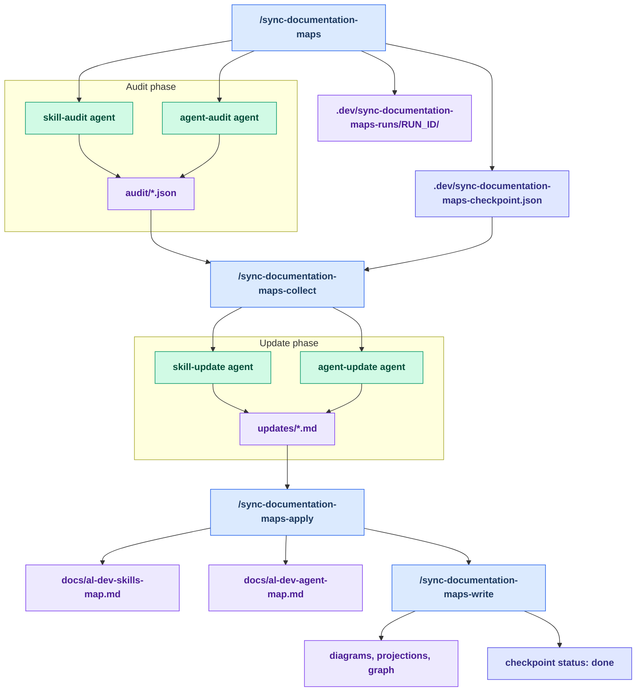

# Maintainer Tooling Reference

Repo-local maintainer tooling lives under `.claude/` and `.codex/`. This page
summarizes the current workflow for map sync, health sweeps, disposition
tracking, planning, projections, and validation.

Use this guide to:

- pick the right entry point for the task
- see which artifacts each skill reads and writes
- understand the current sequence of the maintainer loop

## Visual Workflow

The maintainer tooling is easiest to reason about as an artifact handoff loop:
maps establish the current inventory, health sweeps create findings, disposition
rows record decisions, plans describe accepted work, and validation keeps the
shared surface safe to distribute.

Color key: blue nodes are skills, green nodes are agents, violet nodes are
artifacts, amber nodes are implementation or validation steps, and indigo nodes
are checkpoints.

```mermaid
flowchart LR
    classDef skill fill:#dbeafe,stroke:#2563eb,color:#1e3a5f,font-weight:bold
    classDef agent fill:#d1fae5,stroke:#059669,color:#064e3b,font-weight:bold
    classDef artifact fill:#ede9fe,stroke:#7c3aed,color:#4c1d95,font-weight:bold
    classDef check fill:#fef3c7,stroke:#d97706,color:#78350f,font-weight:bold
    classDef checkpoint fill:#e0e7ff,stroke:#4f46e5,color:#312e81,font-weight:bold
    classDef optional fill:#f3f4f6,stroke:#6b7280,color:#374151,font-style:italic

    subgraph MAPS["1. Map accuracy"]
        direction TB
        RM["/review-maps"]
        RDM["/review-documentation-map"]
        SDM["/sync-documentation-maps"]
        MAPDOCS["docs/al-dev-*-map.md"]
    end

    subgraph HEALTH["2. Improvement discovery"]
        direction TB
        PHA["/plugin-health-audit"]
        PHD["/plugin-health-discover"]
        LENSES["design / quality / naming lenses"]
        FINDINGS["docs/health/*-findings.md"]
        PHR["/plugin-health-report"]
        DOSSIER["docs/health/*-health.md"]
        GRAPH["docs/al-dev-plugin-graph.md"]
    end

    subgraph DECIDE["3. Decide and plan"]
        direction TB
        RHD["/record-health-dispositions"]
        LEDGER["docs/health/dispositions.md"]
        PHF["/plan-health-findings"]
        PLAN["docs/superpowers/plans/*.md"]
        IMPL["implement accepted plan"]
    end

    subgraph DERIVED["4. Derived artifacts and checks"]
        direction TB
        PS["/projection-sync"]
        PROJ["profile-al-dev-shared/generated/agents/"]
        AHR["/align-harness-repos"]
        AKQ["/audit-knowledge-quality"]
        KQ["docs/al-dev-knowledge-quality.md"]
    end

    AAD["/analyze-architectural-design"]
    SYN["docs/al-dev-plugin-synthesis.md"]

    RM --> RDM
    RM --> SDM
    RDM --> MAPDOCS
    SDM --> MAPDOCS
    MAPDOCS --> PHA

    PHA --> PHD
    PHD --> LENSES
    LENSES --> FINDINGS
    FINDINGS --> PHR
    PHR --> DOSSIER
    PHR --> GRAPH

    DOSSIER -. optional synthesis .-> AAD
    AAD --> SYN
    DOSSIER --> RHD
    RHD --> LEDGER
    LEDGER --> PHF
    DOSSIER --> PHF
    PHF --> PLAN
    PLAN --> IMPL

    IMPL --> PS
    PS --> PROJ
    IMPL --> AHR
    IMPL --> AKQ
    AKQ --> KQ

    class RM,RDM,SDM,PHA,PHD,PHR,RHD,PHF,PS,AHR,AKQ skill
    class LENSES agent
    class MAPDOCS,FINDINGS,DOSSIER,GRAPH,LEDGER,PLAN,PROJ,KQ,SYN artifact
    class AAD optional
    class IMPL check
```

## Async Map Sync Detail

Use this view when the maps are stale and the in-session `/review-maps` path is
not the right fit. The checkpoint and run directory are the handoff surfaces
between each async step.

## Current Workflow

### 1. Keep the maps current

- `/review-maps` is the normal entry point. It asks whether to review the maps
  in-session or dispatch the async sync workflow.
- `/review-documentation-map` checks one map at a time against live source.
- `/sync-documentation-maps` dispatches background audit agents and writes the
  checkpoint.
- `/sync-documentation-maps-collect` gathers the audit results and launches the
  update phase.
- `/sync-documentation-maps-apply` writes the refreshed map files.
- `/sync-documentation-maps-write` regenerates downstream artifacts and can
  finish the sync loop.

### 2. Find improvements

- `/plugin-health-audit` is the single suggestions-only entry point.
- It chains `/plugin-health-discover` and `/plugin-health-report`.
- `/plugin-health-discover` runs the design, quality, and naming lenses and
  writes the raw findings file.
- `/plugin-health-report` ranks the findings into a dossier and refreshes the
  plugin graph for the plugin surface.
- `/analyze-architectural-design` is an optional add-on that synthesizes the
  skill and agent findings from a both-surface audit.
- **Re-sweep provenance rule:** a re-sweep may overwrite a same-day dossier
  only when the new dossier carries a "supersedes the earlier … run" note.
  Dossiers from prior dates are history — normalizing one retroactively must
  keep the supersedes note so the report phase's recurrence diff against
  prior findings stays interpretable. Prefer a new dated dossier over
  cross-day rewrites.

### 3. Record decisions and plan accepted work

- `/record-health-dispositions` records accept, decline, grandfather, and fixed
  decisions in `docs/health/dispositions.md`.
- `/plan-health-findings` turns accepted ledger rows into a verified
  implementation plan.
- The plan step is a planning output, not the implementation itself.
- **Closure write-back:** a session that lands a commit resolving an
  `accepted` ledger row must flip that row to `fixed` (or append a `fixed`
  row if the accepted row is already committed) before the session ends,
  citing the commit. See the binding rule in `/record-health-dispositions`;
  `/plugin-health-discover` Phase 0 flags violations as stale-open rows.

### 4. Refresh derived artifacts

- `/projection-sync` regenerates harness-native agent projections from the
  canonical agent source.
- `/align-harness-repos` validates harness neutrality in the shared plugin
  surface.
- `/audit-knowledge-quality` audits the knowledge files and writes the
  knowledge-quality report.

## Skills At A Glance

| Entry point | Role | Primary output |
| --- | --- | --- |
| `/review-maps` | Chooses in-session map review or async sync | Route to map review or sync workflow |
| `/review-documentation-map` | Audits one map against live source | Updated skill or agent map |
| `/sync-documentation-maps` | Dispatches the async map sync | `.dev/sync-documentation-maps-checkpoint.json` |
| `/sync-documentation-maps-collect` | Collects audit results and launches updates | Update-team dispatch state |
| `/sync-documentation-maps-apply` | Writes refreshed maps | `docs/al-dev-skills-map.md`, `docs/al-dev-agent-map.md` |
| `/sync-documentation-maps-write` | Regenerates downstream artifacts | Updated diagrams, projections, and graph |
| `/plugin-health-audit` | Suggestions-only health sweep | `docs/health/*-findings.md` and `docs/health/*-health.md` |
| `/plugin-health-discover` | Runs the lenses and writes raw findings | `docs/health/*-findings.md` |
| `/plugin-health-report` | Ranks findings into a dossier | `docs/health/*-health.md` |
| `/record-health-dispositions` | Records disposition decisions | `docs/health/dispositions.md` |
| `/plan-health-findings` | Builds a verified implementation plan from accepted rows | `docs/superpowers/plans/*.md` |
| `/analyze-architectural-design` | Synthesizes skill and agent findings | `docs/al-dev-plugin-synthesis.md` |
| `/projection-sync` | Regenerates agent projections | `profile-al-dev-shared/generated/agents/` |
| `/align-harness-repos` | Checks harness neutrality | Console findings only |
| `/audit-knowledge-quality` | Audits knowledge file quality | `docs/al-dev-knowledge-quality.md` |

## What The Skills Read

| Skill | Primary inputs | Notes |
| --- | --- | --- |
| `/review-documentation-map` | `docs/al-dev-skills-map.md` or `docs/al-dev-agent-map.md`, plus the corresponding live source | Use `--surface skills` or `--surface agents` to scope one map. |
| `/sync-documentation-maps` | Current map docs plus `.dev/sync-documentation-maps-checkpoint.json` | Async coordinator. It writes the checkpoint and returns. |
| `/plugin-health-discover` | Map docs, `profile-al-dev-shared/knowledge/lens-invocation-patterns.md`, and live plugin source | Reads the maps before dispatching lenses. |
| `/plugin-health-report` | Latest `docs/health/*-findings.md` and `docs/health/dispositions.md` | Suppresses disposed findings and writes the ranked dossier. |
| `/record-health-dispositions` | Latest dossier(s) and `docs/health/dispositions.md` | Appends rows only; it does not edit plugin source. |
| `/plan-health-findings` | Latest dossier(s), `docs/health/dispositions.md`, and `profile-al-dev-shared/knowledge/map-change-rubber-duck-checks.md` | Plans only accepted ledger rows after live verification. |
| `/analyze-architectural-design` | Latest health dossier(s), optionally paired skill and agent dossiers | Synthesizes the cross-surface view. |
| `/projection-sync` | Canonical agent source under `profile-al-dev-shared/agents/*.md` | Regenerates projections from the authored source. |
| `/align-harness-repos` | Shared authored content under `profile-al-dev-shared/skills/`, `agents/`, `knowledge/` | Validation only. No source edits. |
| `/audit-knowledge-quality` | `profile-al-dev-shared/knowledge/*.md` plus the referencing skill or agent | Writes `docs/al-dev-knowledge-quality.md`. |

## What The Skills Write

| Skill | Writes |
| --- | --- |
| `/plugin-health-discover` | `docs/health/<run-date>-<surface>-findings.md` |
| `/plugin-health-report` | `docs/health/<run-date>-<surface>-health.md` and, for the plugin surface, `docs/al-dev-plugin-graph.md` |
| `/record-health-dispositions` | `docs/health/dispositions.md` |
| `/plan-health-findings` | `docs/superpowers/plans/<date>-*.md` |
| `/analyze-architectural-design` | `docs/al-dev-plugin-synthesis.md` |
| `/review-maps` | `docs/al-dev-skills-map.md` and `docs/al-dev-agent-map.md` |
| `/sync-documentation-maps-apply` | `docs/al-dev-skills-map.md` and `docs/al-dev-agent-map.md` |
| `/sync-documentation-maps-write` | diagrams, agent projections, and the dependency graph |
| `/projection-sync` | `profile-al-dev-shared/generated/agents/claude/`, `copilot/`, and `codex/` |
| `/audit-knowledge-quality` | `docs/al-dev-knowledge-quality.md` |

## Quick Reference

| Situation | Run |
| --- | --- |
| Added or removed a skill or agent | `/review-maps` |
| Want to check one map only | `/review-documentation-map --surface skills` or `--surface agents` |
| Maps are out of sync and you want the async path | `/sync-documentation-maps` |
| Maps are out of sync and you want the in-session path | `/review-maps` |
| Edited an agent `.md` file | `/projection-sync`, then `/align-harness-repos` |
| Edited a knowledge file | `/audit-knowledge-quality`, then `/align-harness-repos` |
| Want to find improvement candidates | `/plugin-health-audit` |
| Want design-only or quality-only findings | `/plugin-health-audit --dimension design` or `--dimension quality` |
| Want the skill and agent findings tied together | `/analyze-architectural-design` after a both-surface audit |
| Ready to record disposition decisions | `/record-health-dispositions` |
| Ready to plan accepted findings | `/plan-health-findings` |
| Need the current codebase truth for map updates | `/review-documentation-map` |

## Output Chain

The current maintainer loop is:

1. Map sync keeps `docs/al-dev-skills-map.md` and `docs/al-dev-agent-map.md`
   current.
2. Health audit writes `docs/health/*-findings.md` and `docs/health/*-health.md`.
3. Disposition recording appends to `docs/health/dispositions.md`.
4. Plan generation writes `docs/superpowers/plans/*.md`.
5. Projection sync refreshes `profile-al-dev-shared/generated/agents/`.
6. Validation and quality checks keep the shared surface neutral and readable.

The main boundaries to remember are:

- map sync is accuracy work
- health audit is suggestions work
- disposition and plan steps turn accepted findings into an implementation
  plan

If a step feels blocked, check whether its input artifact exists and was
produced by the preceding step.
