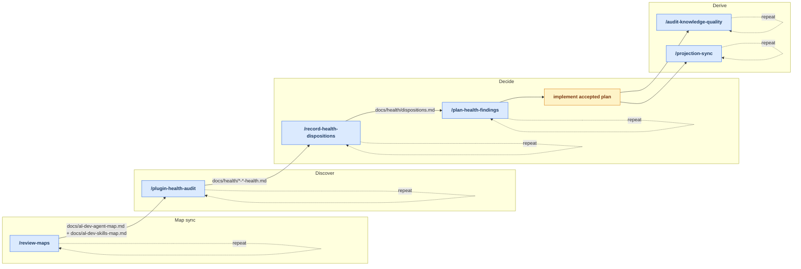
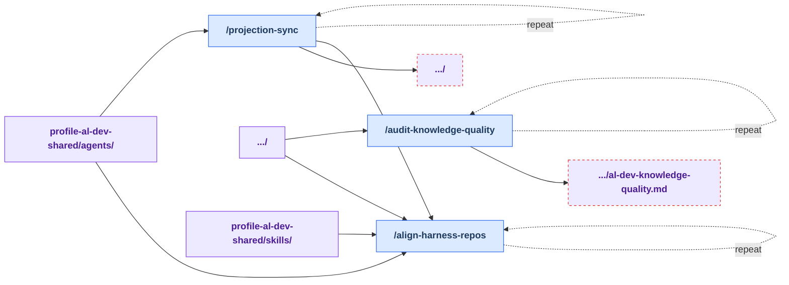
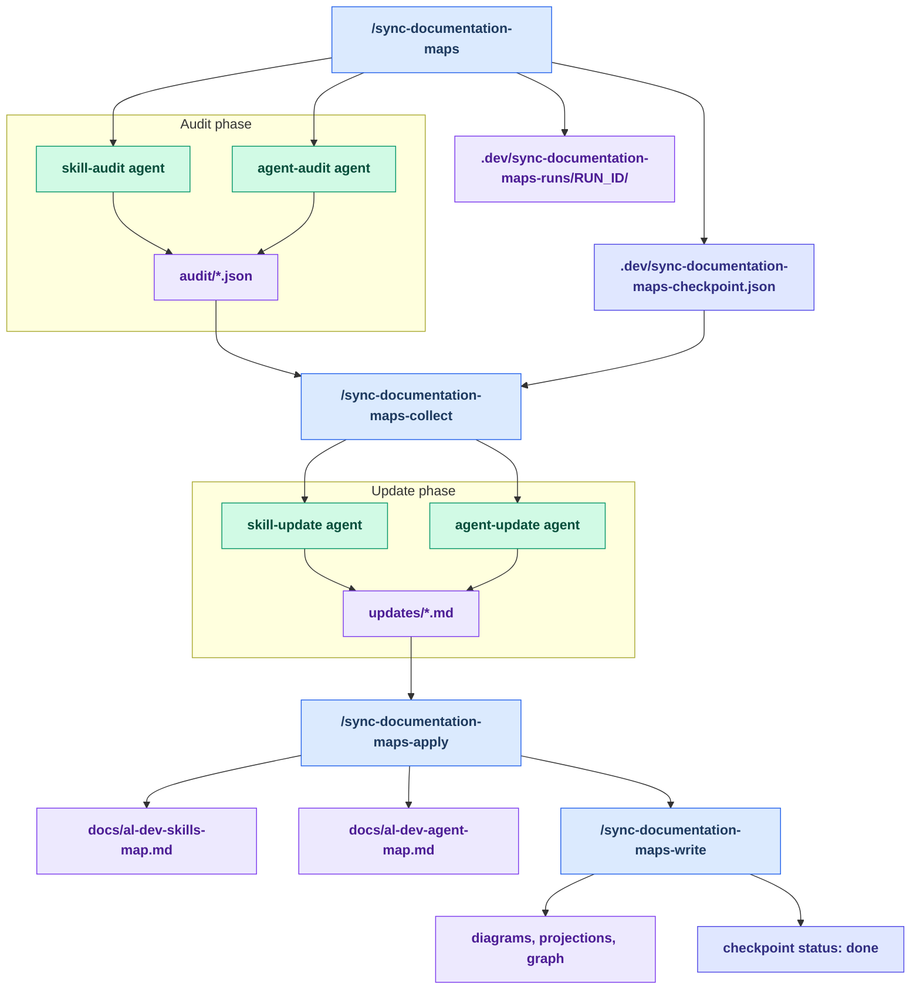

# Maintainer Tooling Reference

Repo-local maintainer tooling lives under `.claude/` and `.codex/`. This page
summarizes the current workflow for map sync, health sweeps, disposition
tracking, planning, projections, and validation.

Use this guide to:

- pick the right entry point for the task
- see which artifacts each skill reads and writes
- understand the current sequence of the maintainer loop
- spot gaps and extension opportunities in the loop

Most diagrams and tables on this page are generated from the `workflow:`
frontmatter contracts in `.claude/skills/*/SKILL.md` by
`scripts/generate-maintainer-guide.py`. Do not hand-edit content between
`BEGIN GENERATED` and `END GENERATED` markers; edit the contracts and re-run
the generator instead. A skill with no `workflow:` block is not an error — it
is reported as a missing-contract gap below.

Color key: blue nodes are user-invoked skills, grey dashed nodes are internal
skills dispatched by other skills, violet nodes are artifacts, violet nodes
with a red dashed border are orphaned artifacts, amber nodes are manual steps,
and indigo nodes are checkpoints (async detail diagram only). Dotted
self-loops marked repeat are steps commonly re-run within one loop pass.
Edge labels in the overview name the artifacts that flow between stages.

## Workflow Overview

<!-- BEGIN GENERATED: maintainer-workflow-overview -->

<!-- END GENERATED: maintainer-workflow-overview -->

## User Journey

<!-- BEGIN GENERATED: maintainer-user-journey -->
### Map sync steps

1. `/review-maps` — Map accuracy sync — asks whether to run in-session or async at start. Repeat as needed.
   - reads: `docs/al-dev-skills-map.md`, `docs/al-dev-agent-map.md`
   - writes: `docs/al-dev-skills-map.md`, `docs/al-dev-agent-map.md`
2. `/review-documentation-map` — Review a plugin documentation map for accuracy and optionally update it. Repeat as needed.
   - reads: `docs/al-dev-skills-map.md`, `docs/al-dev-agent-map.md`, `profile-al-dev-shared/skills/`, `profile-al-dev-shared/agents/`
   - writes: `docs/al-dev-skills-map.md`, `docs/al-dev-agent-map.md`
3. `/sync-documentation-maps` — Use when plugin documentation maps are out of sync with the current codebase, or to verify accuracy after adding/removing skills or agents. Repeat as needed.
   - reads: `docs/al-dev-skills-map.md`, `docs/al-dev-agent-map.md`
   - writes: `.dev/sync-documentation-maps-checkpoint.json`, `.dev/sync-documentation-maps-runs/RUN_ID/audit/<surface>-audit.json`
4. `/sync-documentation-maps-collect` — Collect results from /sync-documentation-maps audit agents.
   - reads: `.dev/sync-documentation-maps-checkpoint.json`, `.dev/sync-documentation-maps-runs/RUN_ID/audit/<surface>-audit.json`
   - writes: `.dev/sync-documentation-maps-runs/RUN_ID/updates/<surface>-map.md`
5. `/sync-documentation-maps-apply` — Applies validated update artifacts to docs/.
   - reads: `.dev/sync-documentation-maps-checkpoint.json`, `.dev/sync-documentation-maps-runs/RUN_ID/updates/<surface>-map.md`
   - writes: `docs/al-dev-skills-map.md`, `docs/al-dev-agent-map.md`
6. `/sync-documentation-maps-write` — Second step of two-step sync finalization.
   - reads: `.dev/sync-documentation-maps-checkpoint.json`, `docs/al-dev-skills-map.md`, `docs/al-dev-agent-map.md`
   - writes: `docs/al-dev-workflow-diagrams.md`, `docs/al-dev-plugin-graph.md`, `docs/maintainer-tooling.md`, `profile-al-dev-shared/generated/agents/`

### Discover steps

1. `/plugin-health-audit` — Suggestions-only health sweep of the al-dev-shared plugin surfaces. Repeat as needed.
   - reads: `docs/al-dev-skills-map.md`, `docs/al-dev-agent-map.md`
2. `/plugin-health-discover` — Discovery phase of the plugin health sweep. Repeat as needed.
   - reads: `docs/al-dev-skills-map.md`, `docs/al-dev-agent-map.md`, `profile-al-dev-shared/knowledge/lens-invocation-patterns.md`
   - writes: `docs/health/<date>-<surface>-findings.md`
3. `/plugin-health-report` — Report phase of the plugin health sweep. Repeat as needed.
   - reads: `docs/health/<date>-<surface>-findings.md`, `docs/health/dispositions.md`
   - writes: `docs/health/<date>-<surface>-health.md`, `docs/al-dev-plugin-graph.md`
4. `/analyze-architectural-design` — Cross-surface synthesis add-on for the health audit.
   - reads: `docs/health/<date>-<surface>-health.md`
   - writes: `docs/al-dev-plugin-synthesis.md`

### Decide steps

1. `/record-health-dispositions` — Disposition phase of the health-audit loop. Repeat as needed.
   - reads: `docs/health/<date>-<surface>-health.md`, `docs/health/dispositions.md`
   - writes: `docs/health/dispositions.md`
2. `/plan-health-findings` — Verify and plan accepted health-audit findings (formerly verify-map-suggestions). Repeat as needed.
   - reads: `docs/health/dispositions.md`, `docs/health/<date>-<surface>-health.md`, `profile-al-dev-shared/knowledge/map-change-rubber-duck-checks.md`
   - writes: `docs/superpowers/plans/<date>-<topic>.md`
3. Manual step: implement accepted plan.

### Derive steps

1. `/audit-knowledge-quality` — Audit knowledge files for stub sections and structural issues. Repeat as needed.
   - reads: `profile-al-dev-shared/knowledge/`
   - writes: `docs/al-dev-knowledge-quality.md`
2. `/projection-sync` — Validates shared agent source and unidirectionally regenerates harness-native projections from the canonical agent source, summarizes changes, and asks before committing. Repeat as needed.
   - reads: `profile-al-dev-shared/agents/`
   - writes: `profile-al-dev-shared/generated/agents/`
3. `/align-harness-repos` — Validate harness neutrality in the al-dev-shared single shared plugin surface. Repeat as needed.
   - reads: `profile-al-dev-shared/skills/`, `profile-al-dev-shared/agents/`, `profile-al-dev-shared/knowledge/`
<!-- END GENERATED: maintainer-user-journey -->

## Stage Details

### Map sync stage

```mermaid
flowchart LR
    classDef userSkill fill:#dbeafe,stroke:#2563eb,color:#1e3a5f,font-weight:bold
    classDef internalSkill fill:#f3f4f6,stroke:#6b7280,color:#374151,stroke-dasharray:5 5,font-weight:bold
    classDef artifact fill:#ede9fe,stroke:#7c3aed,color:#4c1d95,font-weight:bold
    classDef orphanArtifact fill:#ede9fe,stroke:#dc2626,color:#4c1d95,stroke-dasharray:4 4,font-weight:bold
    classDef manualStep fill:#fef3c7,stroke:#d97706,color:#78350f,font-weight:bold

    skill_review_documentation_map["/review-documentation-map"]
    skill_review_maps["/review-maps"]
    skill_sync_documentation_maps["/sync-documentation-maps"]
    skill_sync_documentation_maps_apply["/sync-documentation-maps-apply"]
    skill_sync_documentation_maps_collect["/sync-documentation-maps-collect"]
    skill_sync_documentation_maps_write["/sync-documentation-maps-write"]
    art__dev_sync_documentation_maps_checkpoint_json[".../sync-documentation-maps-checkpoint.json"]
    art__dev_sync_documentation_maps_runs___audit___audit_json[".../*-audit.json"]
    art__dev_sync_documentation_maps_runs___updates___map_md[".../*-map.md"]
    art_docs_al_dev_agent_map_md["docs/al-dev-agent-map.md"]
    art_docs_al_dev_plugin_graph_md["docs/al-dev-plugin-graph.md"]
    art_docs_al_dev_skills_map_md["docs/al-dev-skills-map.md"]
    art_docs_al_dev_workflow_diagrams_md[".../al-dev-workflow-diagrams.md"]
    art_docs_maintainer_tooling_md["docs/maintainer-tooling.md"]
    art_profile_al_dev_shared_agents_["profile-al-dev-shared/agents/"]
    art_profile_al_dev_shared_generated_agents_[".../"]
    art_profile_al_dev_shared_skills_["profile-al-dev-shared/skills/"]

    art_docs_al_dev_agent_map_md --> skill_review_documentation_map
    art_docs_al_dev_skills_map_md --> skill_review_documentation_map
    art_profile_al_dev_shared_agents_ --> skill_review_documentation_map
    art_profile_al_dev_shared_skills_ --> skill_review_documentation_map
    skill_review_documentation_map --> art_docs_al_dev_agent_map_md
    skill_review_documentation_map --> art_docs_al_dev_skills_map_md
    skill_review_documentation_map -. "repeat" .-> skill_review_documentation_map
    art_docs_al_dev_agent_map_md --> skill_review_maps
    art_docs_al_dev_skills_map_md --> skill_review_maps
    skill_review_maps --> art_docs_al_dev_agent_map_md
    skill_review_maps --> art_docs_al_dev_skills_map_md
    skill_review_maps --> skill_review_documentation_map
    skill_review_maps --> skill_sync_documentation_maps
    skill_review_maps -. "repeat" .-> skill_review_maps
    art_docs_al_dev_agent_map_md --> skill_sync_documentation_maps
    art_docs_al_dev_skills_map_md --> skill_sync_documentation_maps
    skill_sync_documentation_maps --> art__dev_sync_documentation_maps_checkpoint_json
    skill_sync_documentation_maps --> art__dev_sync_documentation_maps_runs___audit___audit_json
    skill_sync_documentation_maps --> skill_sync_documentation_maps_collect
    skill_sync_documentation_maps -. "repeat" .-> skill_sync_documentation_maps
    art__dev_sync_documentation_maps_checkpoint_json --> skill_sync_documentation_maps_apply
    art__dev_sync_documentation_maps_runs___updates___map_md --> skill_sync_documentation_maps_apply
    skill_sync_documentation_maps_apply --> art_docs_al_dev_agent_map_md
    skill_sync_documentation_maps_apply --> art_docs_al_dev_skills_map_md
    skill_sync_documentation_maps_apply --> skill_sync_documentation_maps_write
    art__dev_sync_documentation_maps_checkpoint_json --> skill_sync_documentation_maps_collect
    art__dev_sync_documentation_maps_runs___audit___audit_json --> skill_sync_documentation_maps_collect
    skill_sync_documentation_maps_collect --> art__dev_sync_documentation_maps_runs___updates___map_md
    skill_sync_documentation_maps_collect --> skill_sync_documentation_maps_apply
    art__dev_sync_documentation_maps_checkpoint_json --> skill_sync_documentation_maps_write
    art_docs_al_dev_agent_map_md --> skill_sync_documentation_maps_write
    art_docs_al_dev_skills_map_md --> skill_sync_documentation_maps_write
    skill_sync_documentation_maps_write --> art_docs_al_dev_plugin_graph_md
    skill_sync_documentation_maps_write --> art_docs_al_dev_workflow_diagrams_md
    skill_sync_documentation_maps_write --> art_docs_maintainer_tooling_md
    skill_sync_documentation_maps_write --> art_profile_al_dev_shared_generated_agents_

    class skill_review_documentation_map userSkill
    class skill_review_maps userSkill
    class skill_sync_documentation_maps userSkill
    class skill_sync_documentation_maps_apply userSkill
    class skill_sync_documentation_maps_collect userSkill
    class skill_sync_documentation_maps_write userSkill
    class art__dev_sync_documentation_maps_checkpoint_json artifact
    class art__dev_sync_documentation_maps_runs___audit___audit_json artifact
    class art__dev_sync_documentation_maps_runs___updates___map_md artifact
    class art_docs_al_dev_agent_map_md artifact
    class art_docs_al_dev_plugin_graph_md orphanArtifact
    class art_docs_al_dev_skills_map_md artifact
    class art_docs_al_dev_workflow_diagrams_md orphanArtifact
    class art_docs_maintainer_tooling_md orphanArtifact
    class art_profile_al_dev_shared_agents_ artifact
    class art_profile_al_dev_shared_generated_agents_ orphanArtifact
    class art_profile_al_dev_shared_skills_ artifact
```

<!-- BEGIN GENERATED: maintainer-stage-map-sync -->

<!-- END GENERATED: maintainer-stage-map-sync -->

### Discover stage

```mermaid
flowchart LR
    classDef userSkill fill:#dbeafe,stroke:#2563eb,color:#1e3a5f,font-weight:bold
    classDef internalSkill fill:#f3f4f6,stroke:#6b7280,color:#374151,stroke-dasharray:5 5,font-weight:bold
    classDef artifact fill:#ede9fe,stroke:#7c3aed,color:#4c1d95,font-weight:bold
    classDef orphanArtifact fill:#ede9fe,stroke:#dc2626,color:#4c1d95,stroke-dasharray:4 4,font-weight:bold
    classDef manualStep fill:#fef3c7,stroke:#d97706,color:#78350f,font-weight:bold

    skill_analyze_architectural_design["/analyze-architectural-design"]
    skill_plugin_health_audit["/plugin-health-audit"]
    skill_plugin_health_discover["/plugin-health-discover"]
    skill_plugin_health_report["/plugin-health-report"]
    art_docs_al_dev_agent_map_md["docs/al-dev-agent-map.md"]
    art_docs_al_dev_plugin_graph_md["docs/al-dev-plugin-graph.md"]
    art_docs_al_dev_plugin_synthesis_md[".../al-dev-plugin-synthesis.md"]
    art_docs_al_dev_skills_map_md["docs/al-dev-skills-map.md"]
    art_docs_health_____findings_md["docs/health/*-*-findings.md"]
    art_docs_health_____health_md["docs/health/*-*-health.md"]
    art_docs_health_dispositions_md["docs/health/dispositions.md"]
    art_profile_al_dev_shared_knowledge_lens_invocation_patterns_md[".../lens-invocation-patterns.md"]

    art_docs_health_____health_md --> skill_analyze_architectural_design
    skill_analyze_architectural_design --> art_docs_al_dev_plugin_synthesis_md
    art_docs_al_dev_agent_map_md --> skill_plugin_health_audit
    art_docs_al_dev_skills_map_md --> skill_plugin_health_audit
    skill_plugin_health_audit --> skill_plugin_health_discover
    skill_plugin_health_audit -. "repeat" .-> skill_plugin_health_audit
    art_docs_al_dev_agent_map_md --> skill_plugin_health_discover
    art_docs_al_dev_skills_map_md --> skill_plugin_health_discover
    art_profile_al_dev_shared_knowledge_lens_invocation_patterns_md --> skill_plugin_health_discover
    skill_plugin_health_discover --> art_docs_health_____findings_md
    skill_plugin_health_discover --> skill_plugin_health_report
    skill_plugin_health_discover -. "repeat" .-> skill_plugin_health_discover
    art_docs_health_____findings_md --> skill_plugin_health_report
    art_docs_health_dispositions_md --> skill_plugin_health_report
    skill_plugin_health_report --> art_docs_al_dev_plugin_graph_md
    skill_plugin_health_report --> art_docs_health_____health_md
    skill_plugin_health_report --> skill_analyze_architectural_design
    skill_plugin_health_report -. "repeat" .-> skill_plugin_health_report

    class skill_analyze_architectural_design userSkill
    class skill_plugin_health_audit userSkill
    class skill_plugin_health_discover userSkill
    class skill_plugin_health_report userSkill
    class art_docs_al_dev_agent_map_md artifact
    class art_docs_al_dev_plugin_graph_md orphanArtifact
    class art_docs_al_dev_plugin_synthesis_md orphanArtifact
    class art_docs_al_dev_skills_map_md artifact
    class art_docs_health_____findings_md artifact
    class art_docs_health_____health_md artifact
    class art_docs_health_dispositions_md artifact
    class art_profile_al_dev_shared_knowledge_lens_invocation_patterns_md artifact
```

<!-- BEGIN GENERATED: maintainer-stage-discover -->

<!-- END GENERATED: maintainer-stage-discover -->

### Decide stage

```mermaid
flowchart LR
    classDef userSkill fill:#dbeafe,stroke:#2563eb,color:#1e3a5f,font-weight:bold
    classDef internalSkill fill:#f3f4f6,stroke:#6b7280,color:#374151,stroke-dasharray:5 5,font-weight:bold
    classDef artifact fill:#ede9fe,stroke:#7c3aed,color:#4c1d95,font-weight:bold
    classDef orphanArtifact fill:#ede9fe,stroke:#dc2626,color:#4c1d95,stroke-dasharray:4 4,font-weight:bold
    classDef manualStep fill:#fef3c7,stroke:#d97706,color:#78350f,font-weight:bold

    skill_plan_health_findings["/plan-health-findings"]
    skill_record_health_dispositions["/record-health-dispositions"]
    manual_plan_health_findings["implement accepted plan"]
    art_docs_health_____health_md["docs/health/*-*-health.md"]
    art_docs_health_dispositions_md["docs/health/dispositions.md"]
    art_docs_superpowers_plans_____md["docs/superpowers/plans/*-*.md"]
    art_profile_al_dev_shared_knowledge_map_change_rubber_duck_checks_md[".../map-change-rubber-duck-checks.md"]

    art_docs_health_____health_md --> skill_plan_health_findings
    art_docs_health_dispositions_md --> skill_plan_health_findings
    art_profile_al_dev_shared_knowledge_map_change_rubber_duck_checks_md --> skill_plan_health_findings
    skill_plan_health_findings --> art_docs_superpowers_plans_____md
    skill_plan_health_findings --> manual_plan_health_findings
    skill_plan_health_findings -. "repeat" .-> skill_plan_health_findings
    art_docs_health_____health_md --> skill_record_health_dispositions
    art_docs_health_dispositions_md --> skill_record_health_dispositions
    skill_record_health_dispositions --> art_docs_health_dispositions_md
    skill_record_health_dispositions --> skill_plan_health_findings
    skill_record_health_dispositions -. "repeat" .-> skill_record_health_dispositions

    class skill_plan_health_findings userSkill
    class skill_record_health_dispositions userSkill
    class manual_plan_health_findings manualStep
    class art_docs_health_____health_md artifact
    class art_docs_health_dispositions_md artifact
    class art_docs_superpowers_plans_____md orphanArtifact
    class art_profile_al_dev_shared_knowledge_map_change_rubber_duck_checks_md artifact
```

<!-- BEGIN GENERATED: maintainer-stage-decide -->

<!-- END GENERATED: maintainer-stage-decide -->

### Derive stage

<!-- BEGIN GENERATED: maintainer-stage-derive -->

<!-- END GENERATED: maintainer-stage-derive -->

### Adjacent tooling stage

<!-- BEGIN GENERATED: maintainer-stage-support -->
No skills in this stage declare a `workflow:` contract yet. Uncontracted skills appear under Missing contract in the gaps table.
<!-- END GENERATED: maintainer-stage-support -->

## Async Map Sync Detail

Use this view when the maps are stale and the in-session `/review-maps` path is
not the right fit. The checkpoint and run directory are the handoff surfaces
between each async step.

## Current Workflow

### 1. Keep the maps current

- `/review-maps` is the normal entry point. It asks whether to review the maps
  in-session or dispatch the async sync workflow.
- `/review-documentation-map` checks one map at a time against live source.
- `/sync-documentation-maps` dispatches background audit agents and writes the
  checkpoint.
- `/sync-documentation-maps-collect` gathers the audit results and launches the
  update phase.
- `/sync-documentation-maps-apply` writes the refreshed map files.
- `/sync-documentation-maps-write` regenerates downstream artifacts and can
  finish the sync loop.

### 2. Find improvements

- `/plugin-health-audit` is the single suggestions-only entry point.
- It chains `/plugin-health-discover` and `/plugin-health-report`.
- `/plugin-health-discover` runs the design, quality, and naming lenses and
  writes the raw findings file.
- `/plugin-health-report` ranks the findings into a dossier and refreshes the
  plugin graph for the plugin surface.
- `/analyze-architectural-design` is an optional add-on that synthesizes the
  skill and agent findings from a both-surface audit.
- **Re-sweep provenance rule:** a re-sweep may overwrite a same-day dossier
  only when the new dossier carries a "supersedes the earlier … run" note.
  Dossiers from prior dates are history — normalizing one retroactively must
  keep the supersedes note so the report phase's recurrence diff against
  prior findings stays interpretable. Prefer a new dated dossier over
  cross-day rewrites.

### 3. Record decisions and plan accepted work

- `/record-health-dispositions` records accept, decline, grandfather, and fixed
  decisions in `docs/health/dispositions.md`.
- `/plan-health-findings` turns accepted ledger rows into a verified
  implementation plan.
- The plan step is a planning output, not the implementation itself.
- **Closure write-back:** a session that lands a commit resolving an
  `accepted` ledger row must flip that row to `fixed` (or append a `fixed`
  row if the accepted row is already committed) before the session ends,
  citing the commit. See the binding rule in `/record-health-dispositions`;
  `/plugin-health-discover` Phase 0 flags violations as stale-open rows.

### 4. Refresh derived artifacts

- `/projection-sync` regenerates harness-native agent projections from the
  canonical agent source.
- `/align-harness-repos` validates harness neutrality in the shared plugin
  surface.
- `/audit-knowledge-quality` audits the knowledge files and writes the
  knowledge-quality report.

## Skills Reference

<!-- BEGIN GENERATED: maintainer-skills-tables -->
### Skills at a glance

| Skill | Stage | Invoked by | Role |
| --- | --- | --- | --- |
| `/review-documentation-map` | map-sync | both | Review a plugin documentation map for accuracy and optionally update it. |
| `/review-maps` | map-sync | user | Map accuracy sync — asks whether to run in-session or async at start. |
| `/sync-documentation-maps` | map-sync | both | Use when plugin documentation maps are out of sync with the current codebase, or to verify accuracy after adding/removing skills or agents. |
| `/sync-documentation-maps-apply` | map-sync | user | Applies validated update artifacts to docs/. |
| `/sync-documentation-maps-collect` | map-sync | user | Collect results from /sync-documentation-maps audit agents. |
| `/sync-documentation-maps-write` | map-sync | user | Second step of two-step sync finalization. |
| `/analyze-architectural-design` | discover | user | Cross-surface synthesis add-on for the health audit. |
| `/plugin-health-audit` | discover | user | Suggestions-only health sweep of the al-dev-shared plugin surfaces. |
| `/plugin-health-discover` | discover | both | Discovery phase of the plugin health sweep. |
| `/plugin-health-report` | discover | both | Report phase of the plugin health sweep. |
| `/plan-health-findings` | decide | user | Verify and plan accepted health-audit findings (formerly verify-map-suggestions). |
| `/record-health-dispositions` | decide | user | Disposition phase of the health-audit loop. |
| `/align-harness-repos` | derive | user | Validate harness neutrality in the al-dev-shared single shared plugin surface. |
| `/audit-knowledge-quality` | derive | user | Audit knowledge files for stub sections and structural issues. |
| `/projection-sync` | derive | user | Validates shared agent source and unidirectionally regenerates harness-native projections from the canonical agent source, summarizes changes, and asks before committing. |

### Inputs and outputs

| Skill | Reads | Writes | Next |
| --- | --- | --- | --- |
| `/review-documentation-map` | `docs/al-dev-skills-map.md`, `docs/al-dev-agent-map.md`, `profile-al-dev-shared/skills/`, `profile-al-dev-shared/agents/` | `docs/al-dev-skills-map.md`, `docs/al-dev-agent-map.md` | `/plugin-health-audit` |
| `/review-maps` | `docs/al-dev-skills-map.md`, `docs/al-dev-agent-map.md` | `docs/al-dev-skills-map.md`, `docs/al-dev-agent-map.md` | `/review-documentation-map`, `/sync-documentation-maps` |
| `/sync-documentation-maps` | `docs/al-dev-skills-map.md`, `docs/al-dev-agent-map.md` | `.dev/sync-documentation-maps-checkpoint.json`, `.dev/sync-documentation-maps-runs/RUN_ID/audit/<surface>-audit.json` | `/sync-documentation-maps-collect` |
| `/sync-documentation-maps-apply` | `.dev/sync-documentation-maps-checkpoint.json`, `.dev/sync-documentation-maps-runs/RUN_ID/updates/<surface>-map.md` | `docs/al-dev-skills-map.md`, `docs/al-dev-agent-map.md` | `/sync-documentation-maps-write` |
| `/sync-documentation-maps-collect` | `.dev/sync-documentation-maps-checkpoint.json`, `.dev/sync-documentation-maps-runs/RUN_ID/audit/<surface>-audit.json` | `.dev/sync-documentation-maps-runs/RUN_ID/updates/<surface>-map.md` | `/sync-documentation-maps-apply` |
| `/sync-documentation-maps-write` | `.dev/sync-documentation-maps-checkpoint.json`, `docs/al-dev-skills-map.md`, `docs/al-dev-agent-map.md` | `docs/al-dev-workflow-diagrams.md`, `docs/al-dev-plugin-graph.md`, `docs/maintainer-tooling.md`, `profile-al-dev-shared/generated/agents/` | `/plugin-health-audit` |
| `/analyze-architectural-design` | `docs/health/<date>-<surface>-health.md` | `docs/al-dev-plugin-synthesis.md` | — |
| `/plugin-health-audit` | `docs/al-dev-skills-map.md`, `docs/al-dev-agent-map.md` | — | `/plugin-health-discover` |
| `/plugin-health-discover` | `docs/al-dev-skills-map.md`, `docs/al-dev-agent-map.md`, `profile-al-dev-shared/knowledge/lens-invocation-patterns.md` | `docs/health/<date>-<surface>-findings.md` | `/plugin-health-report` |
| `/plugin-health-report` | `docs/health/<date>-<surface>-findings.md`, `docs/health/dispositions.md` | `docs/health/<date>-<surface>-health.md`, `docs/al-dev-plugin-graph.md` | `/analyze-architectural-design`, `/record-health-dispositions` |
| `/plan-health-findings` | `docs/health/dispositions.md`, `docs/health/<date>-<surface>-health.md`, `profile-al-dev-shared/knowledge/map-change-rubber-duck-checks.md` | `docs/superpowers/plans/<date>-<topic>.md` | `/projection-sync`, `/align-harness-repos`, `/audit-knowledge-quality` |
| `/record-health-dispositions` | `docs/health/<date>-<surface>-health.md`, `docs/health/dispositions.md` | `docs/health/dispositions.md` | `/plan-health-findings` |
| `/align-harness-repos` | `profile-al-dev-shared/skills/`, `profile-al-dev-shared/agents/`, `profile-al-dev-shared/knowledge/` | — | — |
| `/audit-knowledge-quality` | `profile-al-dev-shared/knowledge/` | `docs/al-dev-knowledge-quality.md` | `/fix-knowledge-quality` |
| `/projection-sync` | `profile-al-dev-shared/agents/` | `profile-al-dev-shared/generated/agents/` | `/align-harness-repos` |
<!-- END GENERATED: maintainer-skills-tables -->

## Gaps & Extension Candidates

Improvement-spotting surface, generated from the same contracts as the
diagrams. Each row is a candidate to extend or tighten the loop; this is the
only place cross-stage gaps are guaranteed to appear in full.

<!-- BEGIN GENERATED: maintainer-gaps -->
| Signal | Item | Detail |
| --- | --- | --- |
| Orphaned artifact | `docs/al-dev-knowledge-quality.md` | produced by /audit-knowledge-quality; consumed by no skill |
| Orphaned artifact | `docs/al-dev-plugin-graph.md` | produced by /plugin-health-report, /sync-documentation-maps-write; consumed by no skill |
| Orphaned artifact | `docs/al-dev-plugin-synthesis.md` | produced by /analyze-architectural-design; consumed by no skill |
| Orphaned artifact | `docs/al-dev-workflow-diagrams.md` | produced by /sync-documentation-maps-write; consumed by no skill |
| Orphaned artifact | `docs/maintainer-tooling.md` | produced by /sync-documentation-maps-write; consumed by no skill |
| Orphaned artifact | `docs/superpowers/plans/*-*.md` | produced by /plan-health-findings; consumed by no skill |
| Orphaned artifact | `profile-al-dev-shared/generated/agents/` | produced by /projection-sync, /sync-documentation-maps-write; consumed by no skill |
| Sourceless input | none | — |
| Manual step | `implement accepted plan` | follows /plan-health-findings |
| Missing contract | `al-dev-consolidate` | active skill with no workflow contract |
| Missing contract | `al-dev-diagram-generator` | active skill with no workflow contract |
| Missing contract | `fix-knowledge-quality` | active skill with no workflow contract |
| Missing contract | `review-docs` | active skill with no workflow contract |
| Artifact freshness | `.dev/sync-documentation-maps-checkpoint.json` | latest 2026-06-04 |
| Artifact freshness | `.dev/sync-documentation-maps-runs/*/audit/*-audit.json` | latest 2026-06-04 |
| Artifact freshness | `.dev/sync-documentation-maps-runs/*/updates/*-map.md` | latest 2026-06-04 |
| Artifact freshness | `docs/al-dev-agent-map.md` | latest 2026-06-05 |
| Artifact freshness | `docs/al-dev-knowledge-quality.md` | latest 2026-06-05 |
| Artifact freshness | `docs/al-dev-plugin-graph.md` | latest 2026-06-05 |
| Artifact freshness | `docs/al-dev-plugin-synthesis.md` | never produced |
| Artifact freshness | `docs/al-dev-skills-map.md` | latest 2026-06-05 |
| Artifact freshness | `docs/al-dev-workflow-diagrams.md` | latest 2026-06-05 |
| Artifact freshness | `docs/health/*-*-findings.md` | latest 2026-06-05 |
| Artifact freshness | `docs/health/*-*-health.md` | latest 2026-06-05 |
| Artifact freshness | `docs/health/dispositions.md` | latest 2026-06-05 |
| Artifact freshness | `docs/maintainer-tooling.md` | latest 2026-06-06 |
| Artifact freshness | `docs/superpowers/plans/*-*.md` | latest 2026-06-05 |
| Artifact freshness | `profile-al-dev-shared/generated/agents/` | present |
| Internal-only skill | none | — |
<!-- END GENERATED: maintainer-gaps -->

## Quick Reference

| Situation | Run |
| --- | --- |
| Added or removed a skill or agent | `/review-maps` |
| Want to check one map only | `/review-documentation-map --surface skills` or `--surface agents` |
| Maps are out of sync and you want the async path | `/sync-documentation-maps` |
| Maps are out of sync and you want the in-session path | `/review-maps` |
| Edited an agent `.md` file | `/projection-sync`, then `/align-harness-repos` |
| Edited a knowledge file | `/audit-knowledge-quality`, then `/align-harness-repos` |
| Want to find improvement candidates | `/plugin-health-audit` |
| Want design-only or quality-only findings | `/plugin-health-audit --dimension design` or `--dimension quality` |
| Want the skill and agent findings tied together | `/analyze-architectural-design` after a both-surface audit |
| Ready to record disposition decisions | `/record-health-dispositions` |
| Ready to plan accepted findings | `/plan-health-findings` |
| Need the current codebase truth for map updates | `/review-documentation-map` |

If a step feels blocked, check whether its input artifact exists and was
produced by the preceding step — the gaps table above shows each artifact's
freshness.
