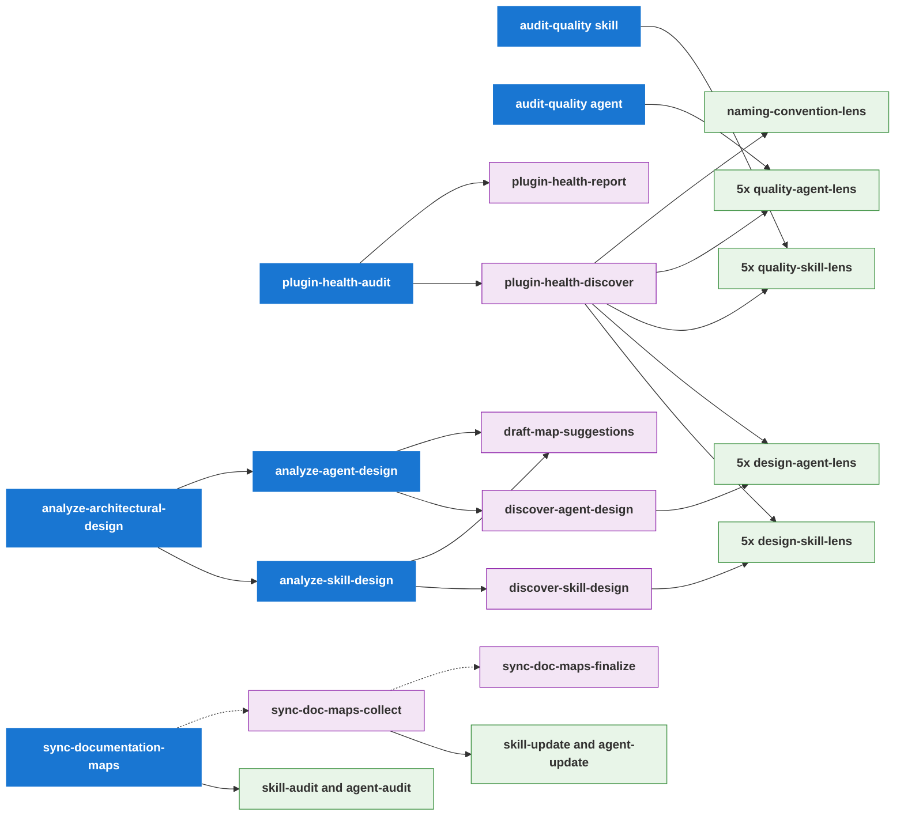
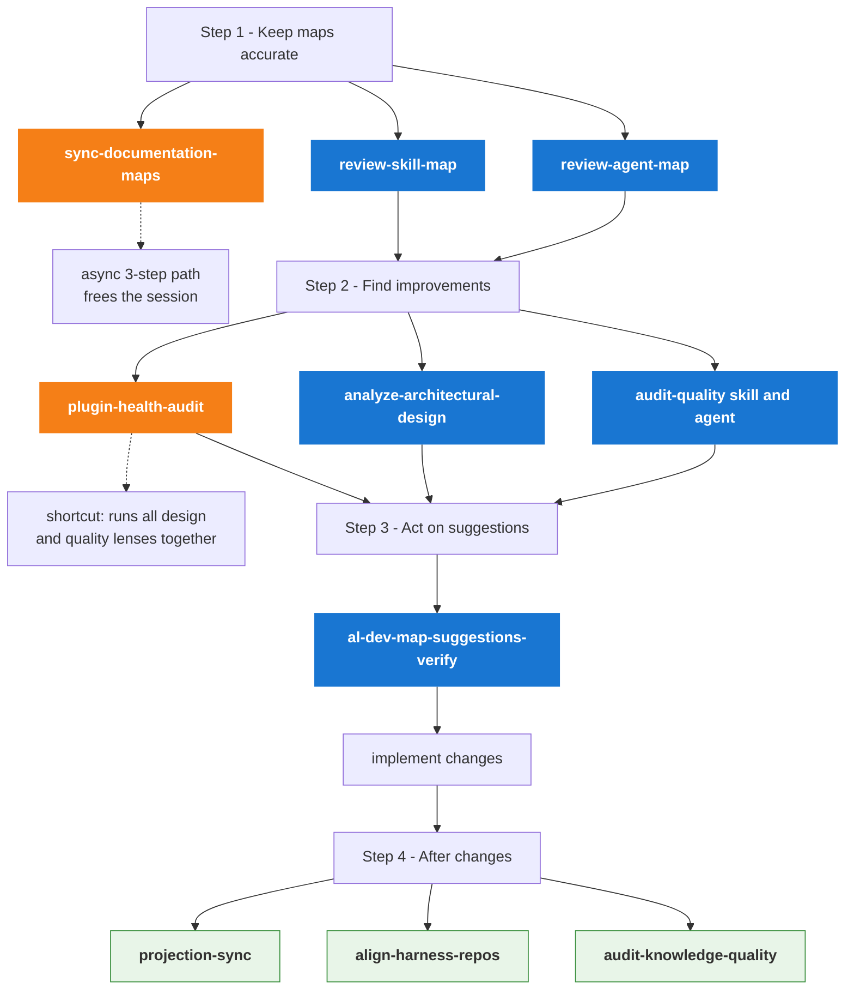

# Maintainer Tooling Reference

The `.claude/` directory contains the **self-healing tool surface** for
maintaining the al-dev-shared plugin. These are repo-local Claude Code skills
and agents — not part of the distributed plugin surface — used to detect drift,
improve design quality, sync documentation, and enforce harness neutrality.

---

## Skills at a Glance

### User-Facing Entry Points

| Skill | Purpose | When to run |
|-------|---------|-------------|
| `/plugin-health-audit` | Full health sweep of one or both plugin surfaces (design + quality + naming) | "Is the plugin healthy?" |
| `/review-skill-map` | In-session sync of `docs/al-dev-skills-map.md` | After adding/removing/restructuring skills |
| `/review-agent-map` | In-session sync of `docs/al-dev-agent-map.md` | After adding/removing/restructuring agents |
| `/sync-documentation-maps` | Async 3-step map sync via remote agents (session-freeing) | When you want maps updated without waiting |
| `/analyze-architectural-design` | Cross-surface design analysis for both skills and agents | "Should we restructure the plugin?" |
| `/analyze-skill-design` | Skill-only design analysis (Atomise / Connect / Merge / Promote) | Focused skill design review |
| `/analyze-agent-design` | Agent-only design analysis (Trim / Remodel / Split / Inline / Align) | Focused agent design review |
| `/audit-quality` | Per-file quality audit (clarity, structure, bloat, naming) | `--type skill` or `--type agent` |
| `/audit-knowledge-quality` | Audit `knowledge/` files for stubs and thin content | After editing knowledge files |
| `/al-dev-map-suggestions-verify` | Rubber-duck map suggestions against live codebase before planning | Before implementing any map suggestion |
| `/projection-sync` | Regenerate harness-native agent projections from canonical source | After editing any `agents/*.md` file |
| `/align-harness-repos` | Validate shared surface has no harness-specific tokens | After editing skills, agents, or knowledge |

### Sub-Skills (called internally, not typically invoked directly)

| Skill | Called by | Role |
|-------|----------|------|
| `/plugin-health-discover` | `/plugin-health-audit` | Dispatches all lenses; writes findings files |
| `/plugin-health-report` | `/plugin-health-audit` | Ranks findings; writes health dossier |
| `/discover-skill-design` | `/analyze-skill-design` | Dispatches 5 design-skill-lens agents |
| `/discover-agent-design` | `/analyze-agent-design` | Dispatches 5 design-agent-lens agents |
| `/draft-map-suggestions` | `/analyze-skill-design`, `/analyze-agent-design` | Writes suggestions to Observations sections |
| `/sync-documentation-maps-collect` | User (step 2 of 3) | Reads audit artifacts; dispatches update agents |
| `/sync-documentation-maps-finalize` | User (step 3 of 3) | Writes maps, regenerates diagrams, commits |

---

## Skill Hierarchy

Who calls what and what gets dispatched.

> **Intersections to notice:**
> - `design-skill-lens-*` agents are dispatched by two independent paths: via `/discover-skill-design` (called from `/analyze-skill-design`), and directly by `/plugin-health-discover` via its internal Workflow — the discover sub-skills are not shared, but the agent implementations are reused
> - The same applies to `design-agent-lens-*` agents: dispatched via `/discover-agent-design` from `/analyze-agent-design`, and independently dispatched directly by `/plugin-health-discover`
> - `quality-skill-lens-*` agents are dispatched by both `/audit-quality --type skill` and `/plugin-health-discover` (directly)
> - `quality-agent-lens-*` agents are dispatched by both `/audit-quality --type agent` and `/plugin-health-discover` (directly)
> - `/plugin-health-audit` is therefore a shortcut for running both `/analyze-architectural-design` and `/audit-quality` for both surfaces in one sweep

---

## Recommended Run Order

When to run each skill and in what sequence.

---

## Agents Reference

### Design Lens Agents (dispatched by `/discover-skill-design` and `/plugin-health-discover`)

| Agent | What it checks |
|-------|---------------|
| `design-skill-lens-complexity` | High-phase skills with separable concerns (Atomise) and zero-agent 2-phase skills (Absorb) |
| `design-skill-lens-handoff-gaps` | Handoff chains with obvious next steps or orphaned outputs (Extend) |
| `design-skill-lens-near-duplicates` | Skill pairs with similar structure that could be merged (Merge) |
| `design-skill-lens-preplanning` | Pre-planning skills in Layer 1 diagram as dashed tributaries with named outputs (Pre-planning) |
| `design-skill-lens-shared-backbone` | Agent types used by 2+ skills whose patterns could be promoted to knowledge (Connect/Promote) |

### Design Lens Agents (dispatched by `/discover-agent-design` and `/plugin-health-discover`)

| Agent | What it checks |
|-------|---------------|
| `design-agent-lens-caller-alignment` | Documented Inputs/Outputs vs how spawning skills actually invoke the agent (Align) |
| `design-agent-lens-model-fit` | Whether haiku/sonnet/opus assignment matches task complexity (Remodel) |
| `design-agent-lens-scope-isolation` | Agents with two clearly separable concerns in their system prompt (Split) |
| `design-agent-lens-tool-hygiene` | Tools declared in frontmatter but unused in system prompt body (Trim) |
| `design-agent-lens-usage-patterns` | Single-use agents with small bodies and no documented contract (Inline) |

### Quality Lens Agents (dispatched by `/audit-quality` and `/plugin-health-discover`)

| Agent | Surface | What it checks |
|-------|---------|---------------|
| `quality-skill-lens-clarity` | skills | Ambiguous instructions, vague qualifiers, incomplete conditionals |
| `quality-skill-lens-structure` | skills | Frontmatter completeness, tool canonicality, header numbering |
| `quality-skill-lens-description` | skills | Description drift vs body content |
| `quality-skill-lens-bloat` | skills | Oversized sections, dead branches, repetitive blocks |
| `quality-skill-lens-name-fit` | skills | Skill name vs primary verb and scope |
| `quality-agent-lens-clarity` | agents | Same as skill-clarity for agent files |
| `quality-agent-lens-structure` | agents | Same as skill-structure for agent files |
| `quality-agent-lens-description` | agents | Same as skill-description for agent files |
| `quality-agent-lens-bloat` | agents | Same as skill-bloat for agent files |
| `quality-agent-lens-name-fit` | agents | Same as skill-name-fit for agent files |
| `naming-convention-lens` | both | Tool name and output filename violations per naming convention |

### Map Sync Agents (dispatched by `/sync-documentation-maps` and `-collect`)

| Agent | Role |
|-------|------|
| `sync-documentation-maps-skill-audit` | Audits active skills against `docs/al-dev-skills-map.md`; writes JSON findings |
| `sync-documentation-maps-agent-audit` | Audits active agents against `docs/al-dev-agent-map.md`; writes JSON findings |
| `sync-documentation-maps-skill-update` | Reads skill audit findings; writes updated `al-dev-skills-map.md` to run dir |
| `sync-documentation-maps-agent-update` | Reads agent audit findings; writes updated `al-dev-agent-map.md` to run dir |

---

## Outputs Written

| Skill | Output |
|-------|--------|
| `/review-skill-map` | `docs/al-dev-skills-map.md` |
| `/review-agent-map` | `docs/al-dev-agent-map.md` |
| `/sync-documentation-maps-finalize` | `docs/al-dev-skills-map.md`, `docs/al-dev-agent-map.md` |
| `/analyze-skill-design` | `docs/al-dev-skills-map.md` (Observations section) |
| `/analyze-agent-design` | `docs/al-dev-agent-map.md` (Observations section) |
| `/analyze-architectural-design` | `docs/al-dev-plugin-graph.md` (cross-surface synthesis) |
| `/audit-quality --type skill` | `docs/al-dev-skill-quality.md` |
| `/audit-quality --type agent` | `docs/al-dev-agent-quality.md` |
| `/plugin-health-discover` | `docs/health/<run-date>-<surface>-findings.md` |
| `/plugin-health-report` | `docs/health/<run-date>-<surface>-health.md` |
| `/projection-sync` | `profile-al-dev-shared/generated/agents/claude/`, `copilot/`, `codex/` |

---

## Quick Reference: Which Skill to Run When

| Situation | Run |
|-----------|-----|
| Added or removed a skill | `/review-skill-map` |
| Added or removed an agent | `/review-agent-map` |
| Edited an agent `.md` file | `/projection-sync`, then `/align-harness-repos` |
| Edited a knowledge file | `/audit-knowledge-quality`, then `/align-harness-repos` |
| Want a design health check | `/review-skill-map` → `/review-agent-map` → `/plugin-health-audit` |
| Want to plan improvements | `/analyze-architectural-design` → `/audit-quality` → `/al-dev-map-suggestions-verify` |
| Suggestion list is stale | `/al-dev-map-suggestions-verify` before planning |
| Maps are out of sync, no rush | `/sync-documentation-maps` (async, frees session) |
| Maps are out of sync, fix now | `/review-skill-map` + `/review-agent-map` (in-session) |

## Context
- Repository: /Users/russelllaing/al-dev-shared
- Isolated worktree: /Users/russelllaing/al-dev-shared/.worktrees/docs/maintainer-tooling-readme-2026-06-02
- Branch: docs/maintainer-tooling-readme-2026-06-02
- This is a docs-only task.
- IMPORTANT: Do not add Co-authored-by trailers to commit messages in this repository.

## Before You Begin
If anything is unclear, ask now.

## Your Job
Once clear, implement exactly the spec, run the specified verification commands, commit, self-review, and report using:
- Status: DONE | DONE_WITH_CONCERNS | BLOCKED | NEEDS_CONTEXT
- Implemented work
- Tests/checks run and results
- Files changed
- Self-review findings
- Concerns
