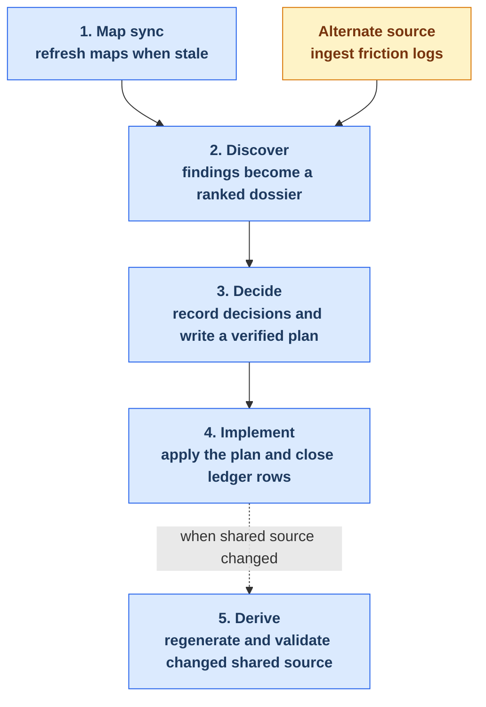

# Maintainer Tooling Reference

Repo-local maintainer tooling lives under `.claude/` and `.codex/`. This guide
organizes the maintenance journey into five stages while keeping the
breadcrumb-controlled health loop distinct from its preparation and follow-up
work.

Use this page to choose an entry point and understand the handoffs. Open a
stage page for its workflow, run order, and key artifacts. Exact skill
frontmatter and generated diagnostics are retained in the appendices.

Content between `BEGIN GENERATED` and `END GENERATED` markers comes from
`.claude/skills/*/SKILL.md` workflow contracts through
`scripts/generate-maintainer-guide.py`. Update the source contract or generator,
then regenerate; do not edit marked content directly.

## Workflow Overview

Map sync is preparatory and Derive is conditional finalization work. The
durable self-healing loop begins in Discover and closes at the end of Implement;
when shared source changed, the applicable Derive checks run before that closing
commit.

<!-- BEGIN GENERATED: maintainer-workflow-overview -->

<!-- END GENERATED: maintainer-workflow-overview -->

## The Five Stages

| Stage | Purpose | Use it when |
| --- | --- | --- |
| [1. Map sync](./maintainer-tooling/map-sync.md) | Refresh the canonical skill and agent maps, then regenerate their derived documentation. | Skills, agents, relationships, or map-backed docs have changed. |
| [2. Discover](./maintainer-tooling/discover.md) | Produce and verify findings through either a lens audit or friction ingestion. | You need a current ranked health dossier. |
| [3. Decide](./maintainer-tooling/decide.md) | Record durable decisions and turn accepted findings into a verified plan. | A dossier contains findings that need disposition or planning. |
| [4. Implement](./maintainer-tooling/implement.md) | Execute the approved plan and close its accepted ledger rows. | A plan contains valid `closes_rows:` identifiers. |
| [5. Derive](./maintainer-tooling/derive.md) | Regenerate projections and run shared-source quality checks during finalization. | Implementation changed shared agents, knowledge, skills, or generated outputs. |

## Breadcrumb Orchestrator

There is no monolithic orchestrator skill. The core loop coordinates fresh
sessions through one durable pointer, `.dev/health-loop-state.md`. The file
records which supported lifecycle skill completed, the exact next command, and
the artifacts that command should adopt.

<!-- BEGIN GENERATED: maintainer-breadcrumb-orchestrator -->
The breadcrumb-controlled core runs from Discover through Implement.
It uses `.dev/health-loop-state.md` as a durable cross-session pointer: each lifecycle skill reads the current pointer before work and writes the next supported command on successful completion.
Map sync prepares the inputs and Derive performs conditional finalization before the closing commit, but neither is a breadcrumb lifecycle stage.

The canonical schema and lifecycle are in `.claude/knowledge/health-loop-state-contract.md`; validation details are in Appendix A.

| Completing skill | Persisted next command | Why it matters |
| --- | --- | --- |
| `/ingest-friction-log` | `/plugin-health-report --findings ...` | friction is an alternate discover source, not a lens rerun |
| `/plugin-health-discover` | `/plugin-health-report --findings ...` | discover is intentionally split across sessions to avoid compaction |
| `/plugin-health-report` | `/record-health-dispositions` | the dossier becomes durable input for ledger triage |
| `/record-health-dispositions` | `/plan-health-findings` | only accepted rows move into planning |
| `/plan-health-findings` | `/implement-health-plan --plan ...` | the handoff preserves `closes_rows:` and bypasses the generic writing-plans ending |
| `/implement-health-plan` | `none` | loop closure is explicit and machine-checked |
<!-- END GENERATED: maintainer-breadcrumb-orchestrator -->

## Quick Reference

| Situation | Run |
| --- | --- |
| Added or removed a skill or agent | `/sync-documentation-maps` |
| Want to audit map accuracy without applying updates | `/sync-documentation-maps --no-update` |
| Want the main health-audit entry point | `/plugin-health-audit` |
| Want to fold accumulated friction into the loop | `/ingest-friction-log` |
| Ready to record decisions from a dossier | `/record-health-dispositions` |
| Ready to turn accepted rows into a plan | `/plan-health-findings` |
| Ready to execute a verified plan and close rows | `/implement-health-plan --plan <path>` |
| Edited shared agent source | `/projection-sync`, then `/align-harness-repos` |
| Edited shared knowledge | `/audit-knowledge-quality`; fix HIGH items if approved; then validate neutrality |

If a run appears blocked, inspect the breadcrumb and the current stage's key
artifacts before starting a new path.

## Appendices

### Appendix A: Health Loop Contracts

The canonical filter contract is
`.claude/knowledge/health-filter-contract.md`.

- `--surface plugin|tooling|both` selects the audited and planned surface.
- `--dimension design|quality|naming|all` selects concrete finding dimensions.
- `--resume` is audit-only and must match the stored concrete filters.
- `/plugin-health-report` preserves upstream filter metadata; it has no public
  `--dimension` flag.
- `/ingest-friction-log` is not a lens. Its findings bypass automatic artifact
  selection and enter report through an explicit `--findings <path>`.

Breadcrumb enforcement uses two complementary checks:

- `scripts/validate_health_loop_state.py` validates the on-disk schema and
  lifecycle successor.
- `scripts/check_health_loop_handoffs.py` verifies that lifecycle skill
  instructions contain both the read and completion-write rules.

### Appendix B: Contracted Skills

This generated inventory is the exact `workflow:` frontmatter view. It is useful
for contract maintenance, but the stage pages are the primary reading path.

<!-- BEGIN GENERATED: maintainer-skills-tables -->
### Skills at a glance

| Skill | Stage | Invoked by | Role |
| --- | --- | --- | --- |
| `/sync-documentation-maps` | map-sync | both | Use when plugin documentation maps are out of sync with the current codebase, or to verify accuracy after adding/removing skills or agents. |
| `/sync-documentation-maps-apply` | map-sync | user | Applies validated update artifacts to docs/. |
| `/sync-documentation-maps-collect` | map-sync | user | Collect results from /sync-documentation-maps audit agents. |
| `/sync-documentation-maps-write` | map-sync | user | Final regeneration step after /sync-documentation-maps-apply; fourth step of the async sync flow. |
| `/ingest-friction-log` | discover | user | Ingest friction logs from ~/friction-log/ (curated session-analysis findings plus aggregated tool-error signals) into the self-healing health loop as a discover-stage source, then archive the consumed logs. |
| `/plugin-health-audit` | discover | user | Standing suggestions-only entry point for the al-dev-shared plugin surfaces. |
| `/plugin-health-discover` | discover | both | Discovery phase of the plugin health sweep. |
| `/plugin-health-report` | discover | both | Report phase of the plugin health sweep. |
| `/plan-health-findings` | decide | user | Verify and plan accepted health-audit findings (formerly verify-map-suggestions). |
| `/record-health-dispositions` | decide | user | Disposition phase of the health-audit loop. |
| `/revise-health-plan` | decide | user | Reconciles a health-loop implementation plan against a review document and re-dispositions out-of-scope findings to the ledger. |
| `/implement-health-plan` | implement | user | Closes the health-audit loop: executes an accepted implementation plan, verifies each change, and appends `fixed` rows to docs/health/dispositions.md and its monthly history shards (docs/health/dispositions-history/YYYY/YYYY-MM.md) for every `closes_rows:` entry (the distinguishing ledger close-back). |
| `/align-harness-repos` | derive | user | Validate harness neutrality in the al-dev-shared single shared plugin surface. |
| `/audit-knowledge-quality` | derive | user | Audit knowledge files for stub sections and structural issues. |
| `/fix-knowledge-quality` | derive | user | Reads HIGH-severity knowledge quality tasks from the fix-task block produced by /audit-knowledge-quality, presents the HIGH-only task list, and conditionally dispatches one `al-dev-docs-writer` agent per issue when the user approves (or when --auto-fix is passed). |
| `/projection-sync` | derive | user | Validates shared agent source and unidirectionally regenerates harness-native agent projections from the canonical agent source, summarizes changes, and asks before committing. |

### Inputs and outputs

| Skill | Reads | Writes | Next |
| --- | --- | --- | --- |
| `/sync-documentation-maps` | `docs/al-dev-skills-map.md`, `docs/al-dev-agent-map.md` | `.dev/sync-documentation-maps-checkpoint.json`, `.dev/sync-documentation-maps-runs/RUN_ID/audit/<surface>-audit.json` | `/sync-documentation-maps-collect` |
| `/sync-documentation-maps-apply` | `.dev/sync-documentation-maps-checkpoint.json`, `.dev/sync-documentation-maps-runs/RUN_ID/updates/<surface>-map.md` | `docs/al-dev-skills-map.md`, `docs/al-dev-agent-map.md` | `/sync-documentation-maps-write` |
| `/sync-documentation-maps-collect` | `.dev/sync-documentation-maps-checkpoint.json`, `.dev/sync-documentation-maps-runs/RUN_ID/audit/<surface>-audit.json` | `.dev/sync-documentation-maps-runs/RUN_ID/updates/<surface>-map.md` | `/sync-documentation-maps-apply` |
| `/sync-documentation-maps-write` | `.dev/sync-documentation-maps-checkpoint.json`, `docs/al-dev-skills-map.md`, `docs/al-dev-agent-map.md` | `docs/al-dev-workflow-diagrams.md`, `docs/al-dev-plugin-graph.md`, `docs/maintainer-tooling.md`, `docs/maintainer-tooling/`, `profile-al-dev-shared/generated/agents/` | `/plugin-health-audit` |
| `/ingest-friction-log` | `~/friction-log/<session>-findings.md`, `~/friction-log/<session>-signals.json` | `docs/health/<date>-<surface>-friction-findings.md`, `docs/health/friction-ingest-log.md` | `/plugin-health-report` |
| `/plugin-health-audit` | `docs/al-dev-skills-map.md`, `docs/al-dev-agent-map.md` | — | `/plugin-health-discover` |
| `/plugin-health-discover` | `docs/al-dev-skills-map.md`, `docs/al-dev-agent-map.md`, `profile-al-dev-shared/knowledge/lens-invocation-patterns.md` | `docs/health/<date>-<surface>-findings.md` | `/plugin-health-report` |
| `/plugin-health-report` | `docs/health/<date>-<surface>-findings.md`, `docs/health/<date>-<surface>-friction-findings.md`, `docs/health/dispositions.md` | `docs/health/<date>-<surface>-health.md` | `/record-health-dispositions` |
| `/plan-health-findings` | `docs/health/dispositions.md`, `docs/health/<date>-<surface>-health.md`, `profile-al-dev-shared/knowledge/map-change-rubber-duck-checks.md` | `docs/superpowers/plans/<date>-<topic>.md` | `/implement-health-plan` |
| `/record-health-dispositions` | `docs/health/<date>-<surface>-health.md`, `docs/health/dispositions.md` | `docs/health/dispositions.md` | `/plan-health-findings` |
| `/revise-health-plan` | `docs/superpowers/plans/<date>-<topic>-commentary.md`, `docs/superpowers/plans/<date>-<topic>.md`, `docs/health/dispositions.md` | `docs/superpowers/plans/<date>-<topic>.md`, `docs/health/dispositions.md` | `/implement-health-plan` |
| `/implement-health-plan` | `docs/superpowers/plans/<date>-<topic>.md`, `docs/health/dispositions.md` | `docs/health/dispositions.md`, `.dev/implement-health-plan-progress.md` | `/projection-sync`, `/align-harness-repos` |
| `/align-harness-repos` | `profile-al-dev-shared/skills/`, `profile-al-dev-shared/agents/`, `profile-al-dev-shared/knowledge/` | — | `/audit-knowledge-quality` |
| `/audit-knowledge-quality` | `profile-al-dev-shared/knowledge/` | `docs/al-dev-knowledge-quality.md` | `/fix-knowledge-quality` |
| `/fix-knowledge-quality` | `docs/al-dev-knowledge-quality.md` | `profile-al-dev-shared/knowledge/` | `/align-harness-repos` |
| `/projection-sync` | `profile-al-dev-shared/agents/` | `profile-al-dev-shared/generated/agents/` | `/align-harness-repos` |
<!-- END GENERATED: maintainer-skills-tables -->

### Appendix C: Generated Diagnostics

These are structural signals, not automatically confirmed defects. Terminal
outputs, local provenance logs, generated documentation, and externally
produced inputs can legitimately appear orphaned or sourceless. Verify a signal
against the live skill body before treating it as work.

<!-- BEGIN GENERATED: maintainer-gaps -->
| Signal | Item | Detail |
| --- | --- | --- |
| Orphaned artifact | `.dev/implement-health-plan-progress.md` | produced by /implement-health-plan; consumed by no skill |
| Orphaned artifact | `docs/al-dev-plugin-graph.md` | produced by /sync-documentation-maps-write; consumed by no skill |
| Orphaned artifact | `docs/al-dev-workflow-diagrams.md` | produced by /sync-documentation-maps-write; consumed by no skill |
| Orphaned artifact | `docs/health/friction-ingest-log.md` | produced by /ingest-friction-log; consumed by no skill |
| Orphaned artifact | `docs/maintainer-tooling.md` | produced by /sync-documentation-maps-write; consumed by no skill |
| Orphaned artifact | `docs/maintainer-tooling/` | produced by /sync-documentation-maps-write; consumed by no skill |
| Orphaned artifact | `profile-al-dev-shared/generated/agents/` | produced by /projection-sync, /sync-documentation-maps-write; consumed by no skill |
| Sourceless input | `docs/superpowers/plans/*-*-commentary.md` | consumed by /revise-health-plan; produced by no skill |
| Sourceless input | `~/friction-log/*-findings.md` | consumed by /ingest-friction-log; produced by no skill |
| Sourceless input | `~/friction-log/*-signals.json` | consumed by /ingest-friction-log; produced by no skill |
| Manual step | none | — |
| Missing contract | `al-dev-consolidate` | active skill with no workflow contract |
| Missing contract | `review-docs` | active skill with no workflow contract |
| Artifact freshness | `.dev/implement-health-plan-progress.md` | latest 2026-06-16 |
| Artifact freshness | `.dev/sync-documentation-maps-checkpoint.json` | latest 2026-06-16 |
| Artifact freshness | `.dev/sync-documentation-maps-runs/*/audit/*-audit.json` | latest 2026-06-16 |
| Artifact freshness | `.dev/sync-documentation-maps-runs/*/updates/*-map.md` | latest 2026-06-16 |
| Artifact freshness | `docs/al-dev-agent-map.md` | latest 2026-06-16 |
| Artifact freshness | `docs/al-dev-knowledge-quality.md` | latest 2026-06-14 |
| Artifact freshness | `docs/al-dev-plugin-graph.md` | latest 2026-06-16 |
| Artifact freshness | `docs/al-dev-skills-map.md` | latest 2026-06-16 |
| Artifact freshness | `docs/al-dev-workflow-diagrams.md` | latest 2026-06-16 |
| Artifact freshness | `docs/health/*-*-findings.md` | latest 2026-06-16 |
| Artifact freshness | `docs/health/*-*-friction-findings.md` | latest 2026-06-16 |
| Artifact freshness | `docs/health/*-*-health.md` | latest 2026-06-13 |
| Artifact freshness | `docs/health/dispositions.md` | latest 2026-06-16 |
| Artifact freshness | `docs/health/friction-ingest-log.md` | latest 2026-06-16 |
| Artifact freshness | `docs/maintainer-tooling/` | present |
| Artifact freshness | `docs/superpowers/plans/*-*.md` | latest 2026-06-13 |
| Artifact freshness | `profile-al-dev-shared/generated/agents/` | present |
| Artifact freshness | `profile-al-dev-shared/knowledge/` | present |
| Internal-only skill | none | — |
<!-- END GENERATED: maintainer-gaps -->
