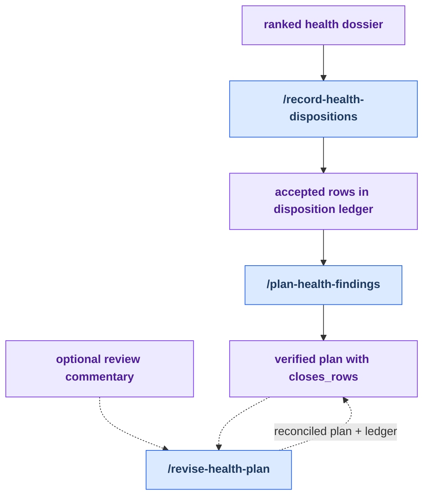

# Stage 3: Decide

[Previous: Discover](./discover.md) | [Back to summary](../maintainer-tooling.md) | [Next: Implement](./implement.md)

Decide turns a ranked dossier into durable maintainer choices. First record
accepted, declined, grandfathered, or already-fixed findings in the disposition
store. Then verify accepted rows against the live repository before writing an
implementation plan with explicit `closes_rows:` identifiers.

Plan revision is an optional side path, not another required stage step. Use it
only when a review or commentary artifact proves that the plan scope or ledger
decisions must change before implementation.

## Workflow

<!-- BEGIN GENERATED: maintainer-stage-decide-diagram -->

<!-- END GENERATED: maintainer-stage-decide-diagram -->

## How This Stage Works

<!-- BEGIN GENERATED: maintainer-stage-decide-journey -->
### Primary path

1. `/record-health-dispositions` — Disposition phase of the health-audit loop.
2. `/plan-health-findings` — Verify and plan accepted health-audit findings (formerly verify-map-suggestions).

### Optional revision path

Run `/revise-health-plan` only when a separate review or commentary artifact requires the plan and ledger decisions to be reconciled before implementation.
<!-- END GENERATED: maintainer-stage-decide-journey -->

## Key Artifacts

<!-- BEGIN GENERATED: maintainer-stage-decide-artifacts -->
| Artifact | Role |
| --- | --- |
| `docs/health/<date>-<surface>-health.md` | Presents the verified findings that require a maintainer decision. |
| `docs/health/dispositions.md` and `docs/health/dispositions-history/` | Store the current ledger view and append-only decision history. |
| `profile-al-dev-shared/knowledge/map-change-rubber-duck-checks.md` | Defines the live verification checks used before accepted findings become plan tasks. |
| `docs/superpowers/plans/<date>-<topic>.md` | Carries the verified implementation tasks and required `closes_rows:` identifiers. |
| `docs/superpowers/plans/<date>-<topic>-commentary.md` | Optional review evidence used only when the plan must be revised. |
<!-- END GENERATED: maintainer-stage-decide-artifacts -->

Exact per-skill reads, writes, and `next` declarations are in
[Appendix B of the summary](../maintainer-tooling.md#appendix-b-contracted-skills).
