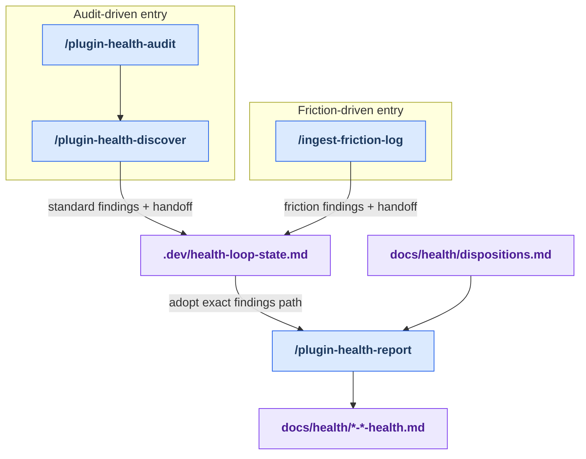

# Stage 2: Discover

[Previous: Map sync](./map-sync.md) | [Back to summary](../maintainer-tooling.md) | [Next: Decide](./decide.md)

Discover is where improvement candidates enter the core health loop. The
audit-driven path dispatches design, quality, and naming lenses over current
map context. The friction-driven path converts curated session findings and
recurring tool-error signals into the same reportable evidence shape.

Both paths converge on `/plugin-health-report`, which verifies evidence,
applies prior dispositions, ranks the surviving findings, and writes a health
dossier. Friction findings require an explicit `--findings <path>` because the
automatic selector intentionally excludes the friction artifact family.

## Workflow

<!-- BEGIN GENERATED: maintainer-stage-discover-diagram -->

<!-- END GENERATED: maintainer-stage-discover-diagram -->

## How This Stage Works

<!-- BEGIN GENERATED: maintainer-stage-discover-journey -->
### Audit-driven path

1. `/plugin-health-audit` — Standing suggestions-only entry point for the al-dev-shared plugin surfaces.
2. `/plugin-health-discover` dispatches the lenses and writes standard findings.
3. `/plugin-health-report --findings <path>` verifies and ranks those findings into a dossier.

### Friction-driven path

1. `/ingest-friction-log` — Ingest friction logs from ~/friction-log/ (curated session-analysis findings plus aggregated tool-error signals) into the self-healing health loop as a discover-stage source, then archive the consumed logs.
2. `/plugin-health-report --findings <path>` consumes the explicit friction findings path; automatic findings selection intentionally does not match this artifact family.
<!-- END GENERATED: maintainer-stage-discover-journey -->

## Key Artifacts

<!-- BEGIN GENERATED: maintainer-stage-discover-artifacts -->
| Artifact | Role |
| --- | --- |
| `docs/al-dev-skills-map.md` and `docs/al-dev-agent-map.md` | Provide current inventory and relationship context to the audit-driven path. |
| `docs/health/<date>-<surface>-findings.md` | Stores raw lens findings before report-time evidence checks and ranking. |
| `docs/health/<date>-<surface>-friction-findings.md` | Carries friction-derived findings into report through an explicit `--findings` path. |
| `.dev/health-loop-state.md` | Persists the exact report handoff across sessions. |
| `docs/health/dispositions.md` | Lets report suppress or re-verify findings that already have durable decisions. |
| `docs/health/<date>-<surface>-health.md` | The ranked dossier handed to the Decide stage. |
<!-- END GENERATED: maintainer-stage-discover-artifacts -->

Exact per-skill reads, writes, and `next` declarations are in
[Appendix B of the summary](../maintainer-tooling.md#appendix-b-contracted-skills).
