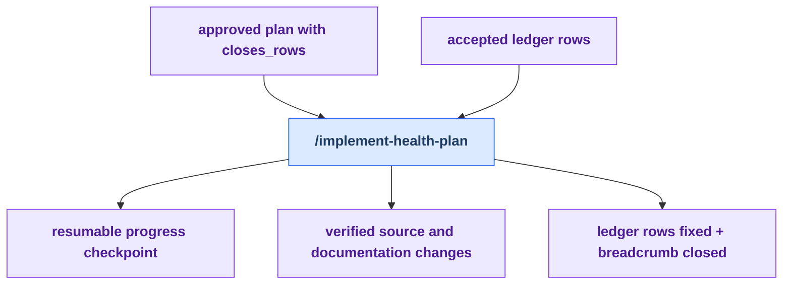

# Stage 4: Implement

[Previous: Decide](./decide.md) | [Back to summary](../maintainer-tooling.md) | [Next: Derive](./derive.md)

Implement executes the verified plan one task at a time, checks each result,
and writes `fixed` close-back rows for every accepted ledger identifier named
by `closes_rows:`. This close-back is what distinguishes the health-loop
executor from a generic plan runner.

The stage is resumable through its progress checkpoint. It closes the core loop
only when the ledger update and `.dev/health-loop-state.md` with
`next_command: none` are committed together. When the implemented work changed
shared source, the applicable Derive actions run during finalization before
that closing commit.

## Workflow

<!-- BEGIN GENERATED: maintainer-stage-implement-diagram -->

<!-- END GENERATED: maintainer-stage-implement-diagram -->

## How This Stage Works

<!-- BEGIN GENERATED: maintainer-stage-implement-journey -->
### Primary path

1. Run `/implement-health-plan --plan <path>` in the fresh session named by the breadcrumb.
2. Execute and verify each plan task, preserving the progress checkpoint for recovery.
3. Append `fixed` ledger rows, archive consumed health artifacts, and commit `next_command: none` with the close-back.
<!-- END GENERATED: maintainer-stage-implement-journey -->

## Key Artifacts

<!-- BEGIN GENERATED: maintainer-stage-implement-artifacts -->
| Artifact | Role |
| --- | --- |
| `docs/superpowers/plans/<date>-<topic>.md` | The approved execution contract; each task must name the ledger rows it closes. |
| `.dev/implement-health-plan-progress.md` | Supports recovery by recording completed tasks and their commits. |
| `docs/health/dispositions.md` and `docs/health/dispositions-history/` | Receive the fixed close-back that proves accepted work was completed. |
| `.dev/health-loop-state.md` | Closes the core loop with `next_command: none` in the ledger-close commit. |
| `docs/health/archived/` and `docs/superpowers/plans/archived/` | Retain consumed findings, dossiers, plans, and review evidence outside live selectors. |
<!-- END GENERATED: maintainer-stage-implement-artifacts -->

Exact per-skill reads, writes, and `next` declarations are in
[Appendix B of the summary](../maintainer-tooling.md#appendix-b-contracted-skills).
