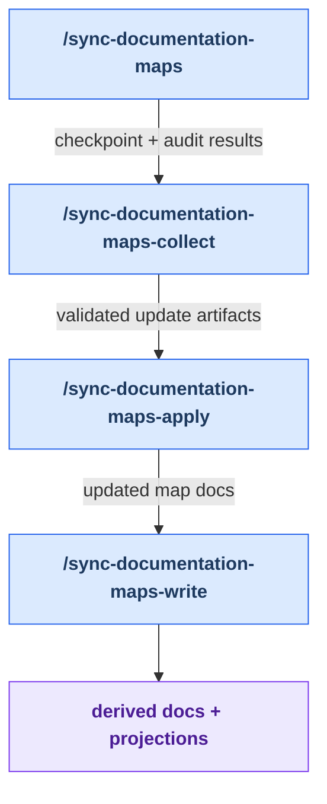

# Stage 1: Map Sync

[Back to summary](../maintainer-tooling.md) | Next:
[Discover](./discover.md)

Map sync prepares trustworthy inventory context for later health audits. It is
an asynchronous four-command workflow: audit the current maps, collect the
agent results, apply validated changes, and regenerate every maintained output
that depends on those maps.

Run this stage when skills, agents, or their relationships changed, or when a
map-backed document appears stale. It is preparation for the health loop, not a
breadcrumb lifecycle stage; it must preserve any existing
`.dev/health-loop-state.md` pointer.

## Workflow

<!-- BEGIN GENERATED: maintainer-stage-map-sync-diagram -->

<!-- END GENERATED: maintainer-stage-map-sync-diagram -->

## How This Stage Works

<!-- BEGIN GENERATED: maintainer-stage-map-sync-journey -->
### Primary path

1. `/sync-documentation-maps` — Use when plugin documentation maps are out of sync with the current codebase, or to verify accuracy after adding/removing skills or agents.
2. `/sync-documentation-maps-collect` — Collect results from /sync-documentation-maps audit agents.
3. `/sync-documentation-maps-apply` — Applies validated update artifacts to docs/.
4. `/sync-documentation-maps-write` — Final regeneration step after /sync-documentation-maps-apply; fourth step of the async sync flow.
<!-- END GENERATED: maintainer-stage-map-sync-journey -->

## Key Artifacts

<!-- BEGIN GENERATED: maintainer-stage-map-sync-artifacts -->
| Artifact | Role |
| --- | --- |
| `docs/al-dev-skills-map.md` and `docs/al-dev-agent-map.md` | Canonical inventory maps audited and updated by the stage. |
| `.dev/sync-documentation-maps-checkpoint.json` | Records the active run, team identifiers, and current async phase. |
| `.dev/sync-documentation-maps-runs/RUN_ID/` | Keeps raw audit results and validated update artifacts separate from the canonical maps. |
| `docs/al-dev-workflow-diagrams.md`, `docs/al-dev-plugin-graph.md`, `docs/maintainer-tooling.md`, and `docs/maintainer-tooling/` | Derived documentation regenerated only after the canonical maps are applied. |
| `profile-al-dev-shared/generated/agents/` | Harness-native projections regenerated from canonical shared agent source. |
<!-- END GENERATED: maintainer-stage-map-sync-artifacts -->

Exact per-skill reads, writes, and `next` declarations are in
[Appendix B of the summary](../maintainer-tooling.md#appendix-b-contracted-skills).
