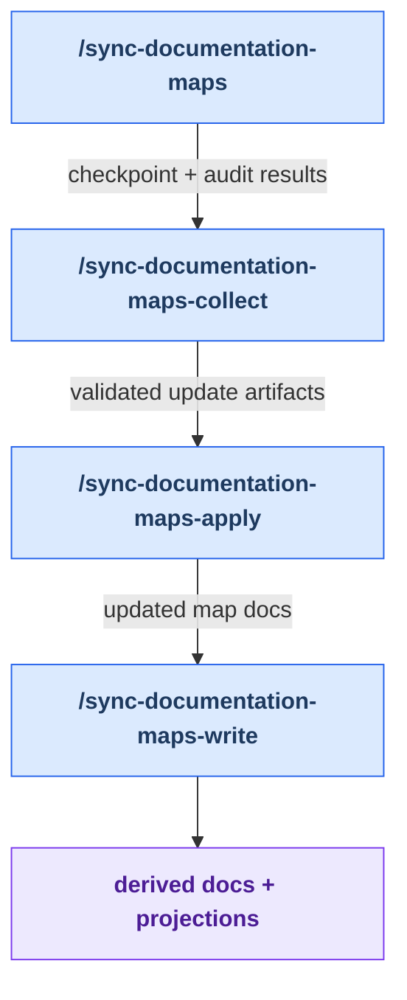

# Stage 1: Map Sync

[Back to summary](../maintainer-tooling.md) | Next:
[Discover](./discover.md)

Map sync prepares trustworthy inventory context for later health audits. It answers the question:
"What skills, agents, and relationships exist right now, and how have they changed since the
last audit?"

**Why this stage exists:** The Discover and Decide stages rely on an accurate inventory of the
plugin surface. If you've added a new skill, removed an old agent, or changed how components
connect, the maps must be refreshed before any audit can see the current topology. Map sync is
a four-command asynchronous workflow that audits the maps against the live codebase, collects
multi-agent audit results, applies validated updates, and regenerates every derived document
(diagrams, projections, stage pages, etc.) that depends on those maps.

**When to run it:** After you've added, removed, or renamed a skill or agent. Also run it when
you suspect documentation is stale or inaccurate, or as part of routine maintenance to verify map
accuracy. This is preparation for the health loop, not a breadcrumb lifecycle stage; it must
preserve any existing `.dev/health-loop-state.md` pointer so active health-loop work isn't disrupted.

## How Map Sync Works

The stage is an asynchronous pipeline designed to handle multi-agent audits without blocking.
Think of it as four sequential phases:

1. **Audit** — Dispatches audit agents that run in the background, comparing the live codebase
   against the maps to find mismatches (skills/agents added, removed, or with changed metadata).
2. **Collect** — Waits for audit results and presents discrepancy findings. You review and approve
   which maps to update.
3. **Apply** — Writes validated changes to the canonical maps in `docs/`.
4. **Write** — Regenerates all derived outputs (diagrams, projections, documentation pages).

You can pause between phases to review intermediate results, or run the full sequence in one go.
The checkpoint file `.dev/sync-documentation-maps-checkpoint.json` tracks where you are in the
workflow, so you can interrupt and resume without losing state.

## Workflow

<!-- BEGIN GENERATED: maintainer-stage-map-sync-diagram -->

<!-- END GENERATED: maintainer-stage-map-sync-diagram -->

## How This Stage Works

<!-- BEGIN GENERATED: maintainer-stage-map-sync-journey -->
### Primary path

1. `/sync-documentation-maps` — Use when plugin documentation maps are out of sync with the current codebase, or to verify accuracy after adding/removing skills or agents.
2. `/sync-documentation-maps-collect` — Collect audit results and dispatch background update agents for the /sync-documentation-maps flow.
3. `/sync-documentation-maps-apply` — Applies validated update artifacts to docs/.
4. `/sync-documentation-maps-write` — Final regeneration step after /sync-documentation-maps-apply; fourth step of the async sync flow.
<!-- END GENERATED: maintainer-stage-map-sync-journey -->

## Key Artifacts

<!-- BEGIN GENERATED: maintainer-stage-map-sync-artifacts -->
| Artifact | Role |
| --- | --- |
| `docs/al-dev-skills-map.md` and `docs/al-dev-agent-map.md` | Canonical inventory maps audited and updated by the stage. |
| `.dev/sync-documentation-maps-checkpoint.json` | Records the active run, team identifiers, and current async phase. |
| `.dev/sync-documentation-maps-runs/RUN_ID/` | Keeps raw audit results and validated update artifacts separate from the canonical maps. |
| `docs/al-dev-workflow-diagrams.md`, `docs/al-dev-plugin-graph.md`, `docs/maintainer-tooling.md`, and `docs/maintainer-tooling/` | Derived documentation regenerated only after the canonical maps are applied. |
| `profile-al-dev-shared/generated/agents/` | Harness-native projections regenerated from canonical shared agent source. |
<!-- END GENERATED: maintainer-stage-map-sync-artifacts -->

Exact per-skill reads, writes, and `next` declarations are in
[Appendix B of the summary](../maintainer-tooling.md#appendix-b-contracted-skills).

---

**Next:** When you're ready to discover improvement candidates in the refreshed plugin, open
[Stage 2: Discover](./discover.md). This stage runs the audits and writes a ranked dossier of findings.
