# Stage 3: Decide

[Previous: Discover](./discover.md) | [Back to summary](../maintainer_tooling.md) | [Next: Implement](./implement.md)

Decide converts a ranked dossier into durable maintainer choices and an executable plan. This
stage answers: "Which findings do we accept? Which do we decline? What work will we do?"

**The process has two parts:**

1. **Record dispositions** — For each finding in the dossier, you decide:
   - **Accept** — This is real work we'll fix now.
   - **Decline** — We're not addressing this; it's out of scope, intentional, or already handled
     elsewhere.
   - **Grandfather** — This is a pre-existing state we're acknowledging but not fixing now.
   - **Fixed** — We realized this was already fixed in a prior session (since the last dossier)
     or by a different maintainer.

   These decisions are recorded as events in the JSONL event store (`docs/health/dispositions_events/`). Later audits filter out
   already-decided findings using the generated `docs/health/dispositions_open.md` view, so you don't re-triage the same issue twice.

2. **Plan accepted findings** — For findings you've accepted, `/plan-plugin-findings` verifies
   each one against the live codebase (using rubber-duck checks), then writes an implementation
   plan with explicit task steps. Crucially, each plan task names the event IDs it will close
   (via `closes_event_ids:`), creating the linkage that lets Implement prove work was completed.

**Plan revision (optional):** If someone reviews the plan and finds that scope or decisions need
to change before execution, run `/revise-plugin-plan` to reconcile the plan and ledger in one
step. This is a side path, not a required step.

## How Decide Works

Dispositions are the key to this stage. By recording durable decisions as JSONL events, you create a durable
audit trail: "We looked at this finding, made a decision, and here's what we did." Later audits
can read the generated `docs/health/dispositions_open.md` view and skip re-triaging findings you've already decided on, making the loop
more efficient over time.

The plan that emerges from accepted findings is not a generic task list—it's a **verified
contract**. Each task in the plan explicitly names which event IDs it will close, creating
an audit trail. When Implement runs the plan, it appends `fixed` events to the JSONL event store for each
`closes_event_ids:` identifier, proving that the work was completed and not just attempted.

If a review stage finds issues with the plan (scope creep, wrong decision, etc.), `/revise-plugin-plan`
lets you reconcile without re-planning from scratch. It reads the review commentary, reconciles
the plan and ledger, and prepares for Implement.

## Workflow

```mermaid
flowchart TD
    classDef userSkill fill:#dbeafe,stroke:#2563eb,color:#1e3a5f,font-weight:bold
    classDef internalSkill fill:#f3f4f6,stroke:#6b7280,color:#374151,stroke-dasharray:5 5,font-weight:bold
    classDef artifact fill:#ede9fe,stroke:#7c3aed,color:#4c1d95,font-weight:bold
    classDef orphanArtifact fill:#ede9fe,stroke:#dc2626,color:#4c1d95,stroke-dasharray:4 4,font-weight:bold
    classDef manualStep fill:#fef3c7,stroke:#d97706,color:#78350f,font-weight:bold

    skill_plan_plugin_findings["/plan-plugin-findings"]
    skill_plan_plugin_findings_verify["/plan-plugin-findings-verify"]
    skill_record_plugin_dispositions["/record-plugin-dispositions"]
    skill_revise_plugin_plan["/revise-plugin-plan"]
    art__dev_health_loop_state_md[".dev/health-loop-state.md"]
    art__dev_plan_plugin_findings_verify_checkpoint_jsonl[".../plan-plugin-findings-verify-checkpoint.jsonl"]
    art_docs_health_____health_md["docs/health/*-*-health.md"]
    art_docs_health_dispositions_events_______jsonl[".../*-*.jsonl"]
    art_docs_health_dispositions_index_json[".../dispositions_index.json"]
    art_docs_health_dispositions_open_md[".../dispositions_open.md"]
    art_docs_superpowers_plans_____commentary_md[".../*-*-commentary.md"]
    art_docs_superpowers_plans_____md["docs/superpowers/plans/*-*.md"]
    art_profile_al_dev_shared_knowledge_map_change_rubber_duck_checks_md[".../map-change-rubber-duck-checks.md"]

    art__dev_health_loop_state_md --> skill_plan_plugin_findings
    art__dev_plan_plugin_findings_verify_checkpoint_jsonl --> skill_plan_plugin_findings
    art_docs_health_dispositions_open_md --> skill_plan_plugin_findings
    skill_plan_plugin_findings --> art__dev_health_loop_state_md
    skill_plan_plugin_findings --> art_docs_superpowers_plans_____md
    skill_plan_plugin_findings -. "repeat" .-> skill_plan_plugin_findings
    art__dev_health_loop_state_md --> skill_plan_plugin_findings_verify
    art_docs_health_____health_md --> skill_plan_plugin_findings_verify
    art_docs_health_dispositions_index_json --> skill_plan_plugin_findings_verify
    art_docs_health_dispositions_open_md --> skill_plan_plugin_findings_verify
    art_profile_al_dev_shared_knowledge_map_change_rubber_duck_checks_md --> skill_plan_plugin_findings_verify
    skill_plan_plugin_findings_verify --> art__dev_health_loop_state_md
    skill_plan_plugin_findings_verify --> art__dev_plan_plugin_findings_verify_checkpoint_jsonl
    skill_plan_plugin_findings_verify --> skill_plan_plugin_findings
    skill_plan_plugin_findings_verify -. "repeat" .-> skill_plan_plugin_findings_verify
    art__dev_health_loop_state_md --> skill_record_plugin_dispositions
    art_docs_health_____health_md --> skill_record_plugin_dispositions
    art_docs_health_dispositions_open_md --> skill_record_plugin_dispositions
    skill_record_plugin_dispositions --> art__dev_health_loop_state_md
    skill_record_plugin_dispositions --> art_docs_health_dispositions_events_______jsonl
    skill_record_plugin_dispositions --> skill_plan_plugin_findings
    skill_record_plugin_dispositions -. "repeat" .-> skill_record_plugin_dispositions
    art_docs_health_dispositions_open_md --> skill_revise_plugin_plan
    art_docs_superpowers_plans_____commentary_md --> skill_revise_plugin_plan
    art_docs_superpowers_plans_____md --> skill_revise_plugin_plan
    skill_revise_plugin_plan --> art_docs_health_dispositions_events_______jsonl
    skill_revise_plugin_plan --> art_docs_superpowers_plans_____md
    skill_revise_plugin_plan -. "repeat" .-> skill_revise_plugin_plan

    class skill_plan_plugin_findings userSkill
    class skill_plan_plugin_findings_verify userSkill
    class skill_record_plugin_dispositions userSkill
    class skill_revise_plugin_plan userSkill
    class art__dev_health_loop_state_md artifact
    class art__dev_plan_plugin_findings_verify_checkpoint_jsonl artifact
    class art_docs_health_____health_md artifact
    class art_docs_health_dispositions_events_______jsonl orphanArtifact
    class art_docs_health_dispositions_index_json artifact
    class art_docs_health_dispositions_open_md artifact
    class art_docs_superpowers_plans_____commentary_md artifact
    class art_docs_superpowers_plans_____md artifact
    class art_profile_al_dev_shared_knowledge_map_change_rubber_duck_checks_md artifact
```

<!-- BEGIN GENERATED: maintainer-stage-decide-diagram -->

<!-- END GENERATED: maintainer-stage-decide-diagram -->

## How This Stage Works

<!-- BEGIN GENERATED: maintainer-stage-decide-journey -->
### Primary path

1. `/record-plugin-dispositions` — Disposition phase of the health-audit loop.
2. `/plan-plugin-findings` — Phase 4-5 planning portion of health-finding planning.

### Optional revision path

Run `/revise-plugin-plan` only when a separate review or commentary artifact requires the plan and ledger decisions to be reconciled before implementation.
<!-- END GENERATED: maintainer-stage-decide-journey -->

## Key Artifacts

<!-- BEGIN GENERATED: maintainer-stage-decide-artifacts -->
| Artifact | Role |
| --- | --- |
| `docs/health/<date>-<surface>-health.md` | Presents the verified findings that require a maintainer decision. |
| `docs/health/dispositions_events/YYYY/YYYY-MM.jsonl` (canonical) + `docs/health/dispositions_open.md` | Canonical event store for decisions; dispositions-open.md is the generated open-items read view. |
| `profile-al-dev-shared/knowledge/map-change-rubber-duck-checks.md` | Defines the live verification checks used before accepted findings become plan tasks. |
| `docs/superpowers/plans/<date>-<topic>.md` | Carries the verified implementation tasks and required `closes_event_ids:` identifiers. |
| `docs/superpowers/plans/<date>-<topic>-commentary.md` | Optional review evidence used only when the plan must be revised. |
<!-- END GENERATED: maintainer-stage-decide-artifacts -->

Exact per-skill reads, writes, and `next` declarations are in
[Appendix B of the summary](../maintainer_tooling.md#appendix-b-contracted-skills).

---

**Next:** Once you have an approved plan with `closes_event_ids:` identifiers, open [Stage 4: Implement](./implement.md)
to execute the plan tasks, verify results, and close the health loop by appending fixed events to the JSONL event store.
