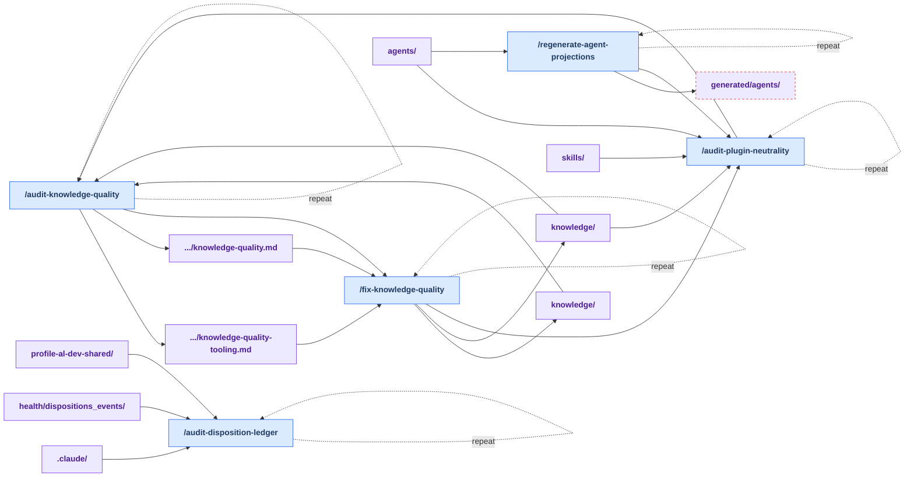

# Stage 5: Derive

[Previous: Implement](./implement.md) | [Back to summary](../maintainer_tooling.md)

Derive refreshes generated outputs and validates canonical shared source during finalization.
This stage answers: "Did the implementation change shared source? If so, did we regenerate
everything correctly and ensure it remains harness-neutral?"

**Why this stage exists:** The `al-dev-shared` plugin is consumed by three harnesses: Claude Code,
Copilot CLI, and Codex. If implementation changed shared agents, knowledge, or skills, we must:

1. **Regenerate derived outputs** — Agent edits require regenerating harness-native projections
   for all three harnesses.
2. **Audit quality** — Knowledge edits must pass structural and semantic quality checks. HIGH-severity
   issues get fixed before final commit.
3. **Validate neutrality** — All changes must remain harness-agnostic. The validator scans for
   harness-specific tokens, paths, and references that could break distributable content.

In a health-plan run, `/implement-plugin-health` invokes the supported projection and neutrality
checks near the end of the run, before the ledger-close commit. Derive is not another
breadcrumb-controlled handoff, and its commands can also run independently if you edit shared
source directly outside a health plan.

**Key principle:** Generated projections are outputs only and must never be edited by hand.
If you need to change a projection, edit the canonical source (the shared agent) and regenerate.

## How Derive Works

The stage has three parallel paths:

**Agent source changed:**

1. Run `/regenerate_agent_projections` to validate the edited agents and regenerate harness-native projections
   for Claude Code, Copilot, and Codex.
2. Run `/validate-plugin-neutrality` to verify the shared surface remains harness-neutral.

**Knowledge source changed:**

1. Run `/audit-knowledge-quality` to check for structural issues (stub sections, incomplete headers).
2. If HIGH-severity findings are discovered and approved, run `/fix-knowledge-quality` to fix them.
3. Re-run `/validate-plugin-neutrality` to ensure no harness-specific leakage was introduced by the fixes.

**Any shared source changed (skills, agents, or knowledge):**
Always run `/validate-plugin-neutrality` as a final validation step. This scans for:

- Claude Code-specific tokens or references
- Copilot-specific tokens or references
- Codex-specific tokens or references
- Harness-specific settings paths
- MCP server references that don't apply universally

The validator ensures the shared surface remains neutral so that all three harnesses can safely
consume it without compatibility issues.

**During health-plan runs:** If Implement changed shared source, the implementer handles the
supported projection and neutrality checks before the loop-closure commit. Run the knowledge
quality path directly when the task is specifically to audit or repair shared knowledge.

## Workflow

<!-- BEGIN GENERATED: maintainer-stage-derive-diagram -->

<!-- END GENERATED: maintainer-stage-derive-diagram -->

## How This Stage Works

<!-- BEGIN GENERATED: maintainer-stage-derive-journey -->
### Agent source changed

1. Run `/regenerate-agent-projections` to validate authored agents and regenerate harness-native projections.
2. Run `/audit-plugin-neutrality` to verify the shared source remains harness-neutral.

### Knowledge source changed

1. Run `/audit-knowledge-quality`.
2. If HIGH findings exist and are approved, run `/fix-knowledge-quality`.
3. Re-run the applicable quality and neutrality checks after fixes.

### Any shared source changed

Run `/audit-plugin-neutrality` after edits to shared skills, agents, or knowledge. In a health-plan run, Implement handles its supported projection and neutrality checks before loop closure; Derive is not another breadcrumb-controlled step.
<!-- END GENERATED: maintainer-stage-derive-journey -->

## Key Artifacts

<!-- BEGIN GENERATED: maintainer-stage-derive-artifacts -->
| Artifact | Role |
| --- | --- |
| `profile-al-dev-shared/agents/` | Canonical authored agent source. |
| `profile-al-dev-shared/generated/agents/` | Generated harness-native projections; never edit these files directly. |
| `profile-al-dev-shared/knowledge/` | Canonical shared guidance audited for structural and semantic quality. |
| `docs/knowledge-quality.md` | Records knowledge findings and the structured HIGH-severity fix task block. |
| `scripts/validate_harness_neutrality.py` | Checks shared skills, agents, and knowledge for harness-specific leakage. |
<!-- END GENERATED: maintainer-stage-derive-artifacts -->

Exact per-skill reads, writes, and `next` declarations are in
[Appendix B of the summary](../maintainer_tooling.md#appendix-b-contracted-skills).
