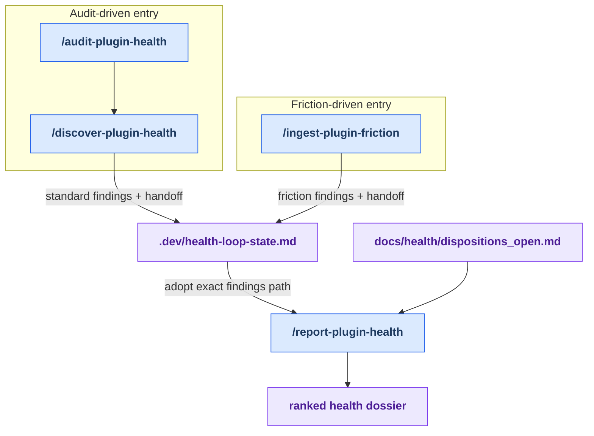

# Stage 2: Discover

[Previous: Map sync](./map_sync.md) | [Back to summary](../maintainer_tooling.md) | [Next: Decide](./decide.md)

Discover is where improvement candidates enter the core health loop. This stage answers:
"What architectural, quality, or naming issues exist in the plugin right now?"

**Two entry paths:**

- **Audit-driven** — Run `/audit-plugin-health` to dispatch design, quality, and naming lenses
  across the entire skill and agent surface. This gives you a comprehensive, ranked inventory
  of issues grouped by type and severity.
- **Friction-driven** — Run `/ingest-plugin-friction` to fold accumulated session-analysis findings
  and tool-error signals from `~/friction-log/` into the discovery process. Use this when you
  have specific recurring issues or user pain points you want to address alongside general audits.

Both paths converge on `/report-plugin-health`, which verifies the evidence, filters out findings
that already have durable decisions in the disposition ledger, ranks the surviving findings by
dimension and severity, and writes a ranked dossier. This dossier becomes the input to the Decide stage.

## How Discover Works

The stage is split into two parallel lanes that merge at reporting:

**Audit-driven lane:** Dispatches design, quality, and naming lenses in parallel across the
skill and agent surface. Each lens type runs independently—for example, design lenses check
architecture (scope isolation, complexity outliers), quality lenses check clarity and structure,
and naming lenses check convention compliance. Raw findings from each lens are collected into
a single findings file. Then report-time filters suppress findings that already have recorded
dispositions (accepted, declined, grandfathered, or fixed) from prior audits, so you only see
new or unresolved issues.

**Friction-driven lane:** Ingests log files from `~/friction-log/` (curated session-analysis
findings and aggregated tool errors) and converts them into findings files. This lets you
route real-world pain points from live usage into the same dossier as architecture findings.

**Report phase:** Regardless of entry path, `/report-plugin-health` verifies the evidence,
applies disposition filters, ranks the surviving findings, and writes a dossier to `docs/health/`.
The dossier is ranked by dimension (design vs. quality vs. naming) and severity, making it easy
for the Decide stage to triage.

**Note on breadcrumb and session split:** Discover is intentionally split across two sessions
(audit in one, report in another) to avoid context compaction. The breadcrumb file preserves
the findings path and other metadata so report runs in a fresh session with full clarity.

## Workflow

<!-- BEGIN GENERATED: maintainer-stage-discover-diagram -->

<!-- END GENERATED: maintainer-stage-discover-diagram -->

## How This Stage Works

<!-- BEGIN GENERATED: maintainer-stage-discover-journey -->
### Audit-driven path

1. `/audit-plugin-health` — Standing suggestions-only entry point for the al-dev-shared plugin surfaces.
2. `/discover-plugin-health` dispatches the lenses and writes standard findings.
3. `/report-plugin-health --findings <path>` verifies and ranks those findings into a dossier.

### Friction-driven path

1. `/ingest-plugin-friction` — Ingest friction logs from ~/friction-log/ (curated session-analysis findings plus aggregated tool-error signals) into the self-healing health loop as a discover-stage source, then archive the consumed logs.
2. `/report-plugin-health --findings <path>` consumes the explicit friction findings path; automatic findings selection intentionally does not match this artifact family.
<!-- END GENERATED: maintainer-stage-discover-journey -->

## Key Artifacts

<!-- BEGIN GENERATED: maintainer-stage-discover-artifacts -->
| Artifact | Role |
| --- | --- |
| `docs/skills-map.md` and `docs/agent-map.md` | Provide current inventory and relationship context to the audit-driven path. |
| `docs/health/<date>-<surface>-findings.md` | Stores raw lens findings before report-time evidence checks and ranking. |
| `docs/health/<date>-<surface>-friction-findings.md` | Carries friction-derived findings into report through an explicit `--findings` path. |
| `.dev/health-loop-state.md` | Persists the exact report handoff across sessions. |
| `docs/health/dispositions_open.md` | Lets report suppress or re-verify findings that already have durable decisions. |
| `docs/health/<date>-<surface>-health.md` | The ranked dossier handed to the Decide stage. |
<!-- END GENERATED: maintainer-stage-discover-artifacts -->

Exact per-skill reads, writes, and `next` declarations are in
[Appendix B of the summary](../maintainer_tooling.md#appendix-b-contracted-skills).

---

**Next:** Once you have a ranked dossier of findings, open [Stage 3: Decide](./decide.md)
to record maintainer decisions (accept, decline, grandfather, fixed) and write an implementation plan.
