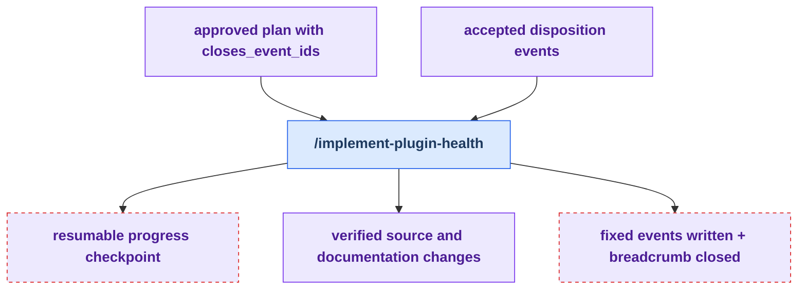

# Stage 4: Implement

[Previous: Decide](./decide.md) | [Back to summary](../maintainer_tooling.md) | [Next: Derive](./derive.md)

Implement executes the verified plan one task at a time, verifies each result, and closes
the health loop by appending `fixed` events to the JSONL event store to prove work was completed. This stage
answers: "Let's actually do the work. Did it succeed? Can we prove it?"

**What makes this stage different from a generic plan runner:**

- **Verification:** After each task completes, the implementation is verified (files exist,
  content is correct, no regressions).
- **Close-back:** For each task that succeeds, a `fixed` event is appended to the JSONL event store. This event
  references the `closes_event_ids:` identifiers from the plan, proving the work happened.
- **Resumability:** A progress checkpoint (`.dev/implement-plugin-health-progress.md`) tracks
  completed tasks and their commits. If interrupted, the next run resumes from where you left
  off without re-doing completed work.
- **Finalization:** If the implementation changed shared source (agents, knowledge, skills),
  the Derive stage runs before the final commit, regenerating projections and validating
  harness neutrality.
- **Loop closure:** The loop closes only when fixed events are appended to the JSONL store AND
  `.dev/health-loop-state.md` is committed with `next_command: none`. This ensures the health
  audit is durably marked as complete.

## How Implement Works

Run `/implement-plugin-health --plan <path>` to execute the plan from Decide. The skill will:

1. **Read the plan and event store** — Understand which tasks to execute and which event IDs they
   close.
2. **Execute tasks one-by-one** — Run each task, verifying that the result matches what was
   expected. If a task fails, the checkpoint lets you pause, fix, and resume.
3. **Verify each result** — Confirm files exist, content is correct, no syntax errors or
   unintended side effects. Verification is not just "did the command run"—it's "did the change
   actually achieve the goal."
4. **Append fixed events** — For each completed task, append a `fixed` event to the JSONL event store naming the
   `closes_event_ids:` identifiers. This proves the work happened and links the fix back to the
   original finding.
5. **Run supported Derive checks (if needed)** — If implementation changed shared
   agents, the skill invokes `/regenerate_agent_projections`. If any
   `profile-al-dev-shared/` source changed, it invokes `/validate-plugin-neutrality`.
   Knowledge quality audit/fix commands remain part of Derive for direct knowledge
   maintenance and are not part of the automatic close-back path unless separately
   invoked.
6. **Commit and close the loop** — Write the final ledger update and set `.dev/health-loop-state.md`
   to `next_command: none`, marking the loop as complete.

The progress checkpoint survives interruptions, so you can pause mid-execution if needed and
resume later with `--plan <path>` again.

## Workflow

<!-- BEGIN GENERATED: maintainer-stage-implement-diagram -->

<!-- END GENERATED: maintainer-stage-implement-diagram -->

## How This Stage Works

<!-- BEGIN GENERATED: maintainer-stage-implement-journey -->
### Primary path

1. Run `/implement-plugin-health --plan <path>` in the fresh session named by the breadcrumb.
2. Execute and verify each plan task, preserving the progress checkpoint for recovery.
3. Append `fixed` disposition events to the JSONL event store, archive consumed health artifacts, and commit `next_command: none` with the close-back.
<!-- END GENERATED: maintainer-stage-implement-journey -->

## Key Artifacts

<!-- BEGIN GENERATED: maintainer-stage-implement-artifacts -->
| Artifact | Role |
| --- | --- |
| `docs/superpowers/plans/<date>-<topic>.md` | The approved execution contract; each task must name the event IDs it closes via `closes_event_ids:`. |
| `.dev/implement-plugin-health-progress.md` | Supports recovery by recording completed tasks and their commits. |
| `docs/health/dispositions_events/YYYY/YYYY-MM.jsonl` | Receives the fixed close-back events that prove accepted work was completed; generated views regenerate from the event store. |
| `.dev/health-loop-state.md` | Closes the core loop with `next_command: none` in the ledger-close commit. |
| `docs/health/archived/` and `docs/superpowers/plans/archived/` | Retain consumed findings, dossiers, plans, and review evidence outside live selectors. |
<!-- END GENERATED: maintainer-stage-implement-artifacts -->

Exact per-skill reads, writes, and `next` declarations are in
[Appendix B of the summary](../maintainer_tooling.md#appendix-b-contracted-skills).

---

**Next:** If implementation changed shared source, `/implement-plugin-health` runs its supported
projection and neutrality checks before loop closure. For direct or manual Derive steps, see
[Stage 5: Derive](./derive.md).
