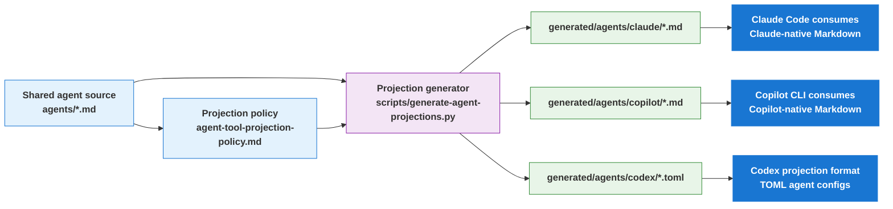

# Projection Layer README

> Maintainer reference for how shared agent source becomes harness-native artifacts for Claude Code, Copilot CLI, and Codex.

**Last updated:** 2026-05-23

---

## Purpose

The projection layer lets `al-dev-shared` keep one canonical authored agent surface while still producing harness-native artifacts for each supported environment.

The split is:

- **Shared source of truth**: `profile-al-dev-shared/agents/*.md`
- **Projection policy**: `profile-al-dev-shared/knowledge/agent-tool-projection-policy.md`
- **Generated artifacts**: `profile-al-dev-shared/generated/agents/**`

Shared authored content stays harness agnostic. Generated projection files are
where harness-native execution artifacts are rendered, while intentional
mapping docs may also name harness-specific details explicitly.

---

## End-to-End Flow



---

## What Each Harness Uses

### Claude Code

- Consumes: `profile-al-dev-shared/generated/agents/claude/*.md`
- Output shape: Markdown frontmatter plus body
- Projection examples:
  - `USER_GATE` -> `AskUserQuestion`
  - MCP tools -> `mcp__plugin_profile-claude-al-dev_*`

### Copilot CLI

- Consumes: `profile-al-dev-shared/generated/agents/copilot/*.md`
- Output shape: Markdown frontmatter plus body
- Projection examples:
  - `USER_GATE` -> `ask_user`
  - shell -> `execute`
  - MCP tools -> `al-mcp-server-*`, `bc-code-intelligence-mcp-*`

### Codex

- Projection artifacts: `profile-al-dev-shared/generated/agents/codex/*.toml`
- Output shape: TOML config with `name`, `description`, and `developer_instructions`
- Projection examples:
  - shared capability intent is rendered as Codex capability notes
  - `USER_GATE` is described via Codex-specific behavior notes rather than a Claude/Copilot-style tool alias

---

## Concrete Example

Use `al-dev-interview` as a simple example.

### 1. Shared source

The shared agent file declares generic capabilities such as:

- `Read`
- `Write`
- `USER_GATE`

It does **not** declare harness-native names like `AskUserQuestion`, `ask_user`, or Codex TOML keys.

### 2. Projection step

The generator reads the shared agent file and applies the projection policy:

- Claude projection maps `USER_GATE` to `AskUserQuestion`
- Copilot projection maps `USER_GATE` to `ask_user`
- Codex projection appends Codex-native capability guidance into TOML `developer_instructions`

### 3. Harness-native result

The same authored agent becomes:

- `generated/agents/claude/al-dev-interview.md`
- `generated/agents/copilot/al-dev-interview.md`
- `generated/agents/codex/al-dev-interview.toml`

This is the key idea of the projection layer: one authored agent, three harness-native outputs.

---

## Claude Code Worktree Integration Example

Claude Code uses the projection layer to load skills and dispatch agents while supporting isolated development workspaces via git worktrees.

### 1. Skill Invocation and Plugin Discovery

When a user types `/al-dev-plan` in Claude Code:

1. Claude Code resolves the skill from `~/.claude/settings.json`:

   ```json
   {
     "al-dev-shared": {
       "source": { "source": "directory", "path": "/Users/russelllaing/al-dev-shared" }
     }
   }
   ```

2. Claude Code loads `profile-al-dev-shared/skills/al-dev-plan/SKILL.md`

3. The skill may dispatch agents referenced by name (e.g., `al-dev-shared:al-dev-architect`)

### 2. Agent Projection Resolution

When a skill dispatches `al-dev-shared:al-dev-architect`, Claude Code:

1. Looks up the agent in `profile-al-dev-shared/generated/agents/claude/al-dev-architect.md`

2. Reads the Claude Code-native frontmatter:

   ```yaml
   name: al-dev-architect
   description: Multi-agent debate on design approach
   model: claude-opus-4-7
   tools:
     - Bash
     - Read
     - Write
     - AskUserQuestion      # <- Projected from generic USER_GATE
   ```

3. Claude Code maps tool names to native operations:
   - `Bash` → execute shell commands
   - `Read` → read files from local filesystem
   - `Write` → write files to local filesystem
   - `AskUserQuestion` → prompt user for input

### 3. Worktree Lifecycle in Claude Code

When developing a feature that needs isolation:

## Phase 1: Workspace Creation

```bash
# User runs /al-dev-plan for a feature design
# Skill invokes superpowers:using-git-worktrees

# Claude Code creates isolated worktree:
git worktree add .claude/worktrees/feature-xyz main
cd .claude/worktrees/feature-xyz

# Plugin is still accessible from worktree:
~/.claude/plugins/cache/claude-plugins-official/...
```

## Phase 2: Skill Execution in Worktree

While in the worktree, the user invokes `/al-dev-develop`:

1. Skill loads from the plugin (shared across all workspaces)
2. Skill dispatches `al-dev-shared:al-dev-developer` agent
3. Agent runs in the worktree context (CWD is the worktree root)
4. Agent uses `Bash` tool to run commands in the worktree
5. Agent uses `Read`/`Write` to edit files in the worktree

The worktree has the full repo structure, including generated agents:

```text
.claude/worktrees/skill-xyz/
  profile-al-dev-shared/
    agents/                    # Shared authored source
    generated/agents/
      claude/                  # Claude Code projections
      copilot/                 # Copilot CLI projections
      codex/                   # Codex projections
```

Agent execution in the worktree:

```bash
# From inside worktree context, agent might run:
git status                          # Shows worktree branch state
npm test                            # Runs tests in worktree
git commit -m "feat: ..."          # Commits to worktree branch

# When /projection-sync runs, it regenerates IN-PLACE:
python3 scripts/generate-agent-projections.py
# → Updates profile-al-dev-shared/generated/agents/claude/*.md
# → Updates profile-al-dev-shared/generated/agents/copilot/*.md
# → Updates profile-al-dev-shared/generated/agents/codex/*.toml
```

## Phase 3: Worktree Cleanup

When development completes, the user invokes `/superpowers:finishing-a-development-branch`:

1. Skill detects worktree state: `git rev-parse --git-dir` ≠ `git rev-parse --git-common-dir`
2. Skill presents merge/PR/keep/discard options
3. On merge: Returns to main repo, merges worktree branch, removes worktree
4. On PR: Keeps worktree alive (user may need to iterate on feedback)

### 4. Concrete Flow: Adding a Feature to al-dev-shared

```text
User: /al-dev-plan "Add new skill for X"

→ /al-dev-plan skill invokes:
  - Architect agent (al-dev-architect) for design debate
  - Dispatched via: al-dev-shared:al-dev-architect projection
  - Uses: AskUserQuestion (USER_GATE projected to Claude native tool)
  
→ User approves design

→ User: /al-dev-develop "Implement the skill"

→ /al-dev-develop skill:
  - Creates worktree: .claude/worktrees/skill-xyz
  - Loads developer agent: al-dev-shared:al-dev-developer
  - Agent uses Bash, Read, Write tools (all Claude Code natives)
  - Agent creates: profile-al-dev-shared/skills/new-skill/SKILL.md
  - Agent runs: /projection-sync to regenerate harness artifacts

→ /projection-sync orchestrates from within worktree:
  - Validates shared source (no harness leakage)
  - Regenerates projections in-place:
    * profile-al-dev-shared/generated/agents/claude/*.md
    * profile-al-dev-shared/generated/agents/copilot/*.md
    * profile-al-dev-shared/generated/agents/codex/*.toml
  - Commits changed projection files to worktree branch
  - Claude Code user sees: only claude/*.md files (but all three harnesses regenerated)

→ User: /superpowers:finishing-a-development-branch

→ Finishing skill detects worktree, offers options

→ User chooses: "Create PR"

→ Skill:
  - Keeps worktree alive at .claude/worktrees/skill-xyz
  - Pushes worktree branch to origin/skill-xyz
  - Creates PR with summary

→ User iterates on feedback in same worktree

→ Feedback incorporated, PR merged

→ User: /superpowers:finishing-a-development-branch again

→ User chooses: "Merge and cleanup"

→ Finishing skill:
  - Detects worktree is under .claude/worktrees/ (Claude Code ownership)
  - Returns to main repo
  - Removes worktree: git worktree remove .claude/worktrees/skill-xyz
  - Deletes feature branch
```

### Key Points

- **Plugin loading is harness-agnostic:** `profile-al-dev-shared/` works the same way in Claude Code, Copilot CLI, and Codex
- **Projections are harness-specific:** Each harness consumes its own `generated/agents/<harness>/` directory
- **Tool mapping is hidden:** Claude Code developers see `Bash`, `Read`, `Write`, `AskUserQuestion`; the projection layer mapped these from generic capability names
- **Worktrees are optional:** Users can work directly on main, or use worktrees for isolation; the projection layer doesn't care which
- **Plugin discovery is once-per-session:** Claude Code reads plugin paths from settings, then uses them for all skills and agents in that session

---

## Boundary Rules

Keep these boundaries strict:

- `profile-al-dev-shared/agents/*.md` is the canonical authored source
- `profile-al-dev-shared/generated/agents/**` is derived output only
- generated artifacts must not be hand-edited
- harness-specific naming belongs in:
  - generated projections
  - projection policy docs
  - harness-mapping docs such as `knowledge/harness-concepts.md`

The validator for shared-surface neutrality is:

```bash
python3 scripts/validate_harness_neutrality.py profile-al-dev-shared
```

---

## Branch History

Two historical branches are relevant to the current projection layer.

### `multi-environment-tool-declarations`

This branch introduced the actual projection system.

Key contribution areas:

- `scripts/generate-agent-projections.py`
- `scripts/tests/test_generate_agent_projections.py`
- `profile-al-dev-shared/generated/agents/{claude,copilot,codex}/`
- `knowledge/agent-tool-projection-policy.md`
- alignment/test work for generated projections

In practical terms, this branch established the **mechanism** for producing harness-native artifacts.

### `projection-rollout-claude-boundary`

This branch focused on repository boundaries and projection-surface discipline.

Key contribution areas:

- clarifying that `.claude/` is repo-local maintainer tooling
- treating `profile-al-dev-shared/generated/agents/` as generated contract output
- tightening alignment checks around projection boundaries

In practical terms, this branch established the **boundary model** around the projection system.

### Current state

Current `master` uses the projection-layer model directly, but not by merging those exact branch tips verbatim. Their ideas landed through current repo state, generated artifacts, projection policy, and boundary documentation now present in `master`.

---

## Files to Check

- Shared source: `profile-al-dev-shared/agents/`
- Projection policy: `profile-al-dev-shared/knowledge/agent-tool-projection-policy.md`
- Harness concepts: `profile-al-dev-shared/knowledge/harness-concepts.md`
- Generated outputs: `profile-al-dev-shared/generated/agents/`
- Generator: `scripts/generate-agent-projections.py`
- Projection tests: `scripts/tests/test_generate_agent_projections.py`

---

## Documentation Boundaries

This projection layer is described in three parallel harness-specific guidance files:

- `CLAUDE.md` — Claude Code registration and usage
- `AGENTS.md` — Copilot CLI registration and usage
- `CODEX.md` — Codex registration and usage

All three reference this document for understanding the projection mechanism itself. Shared content stays harness-agnostic; harness-specific guidance lives in those three files.

When updating this document, ensure the three guidance files are kept in sync regarding the overall multi-harness architecture (even if implementation details differ per harness).

---

## Maintainer Checklist

When changing agent capabilities or projection behavior:

1. Edit the shared agent source or projection policy, not generated files.
2. Regenerate or verify generated artifacts as appropriate.
3. Run the shared-surface neutrality validator.
4. Check that Claude, Copilot, and Codex outputs still reflect the intended capability mapping.
