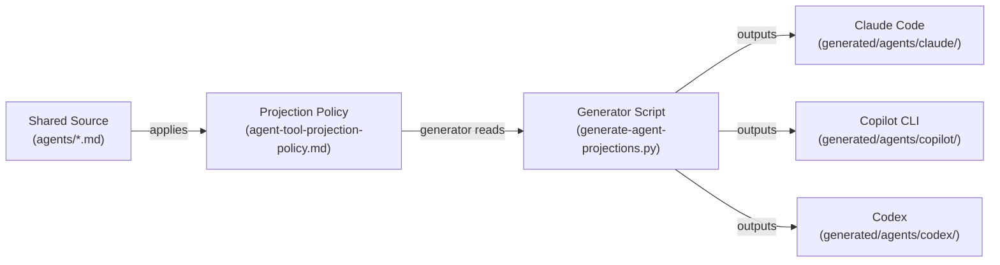
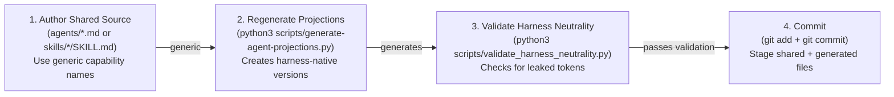
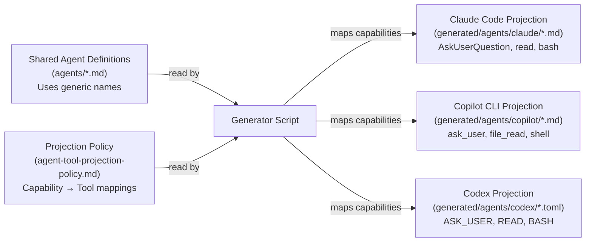
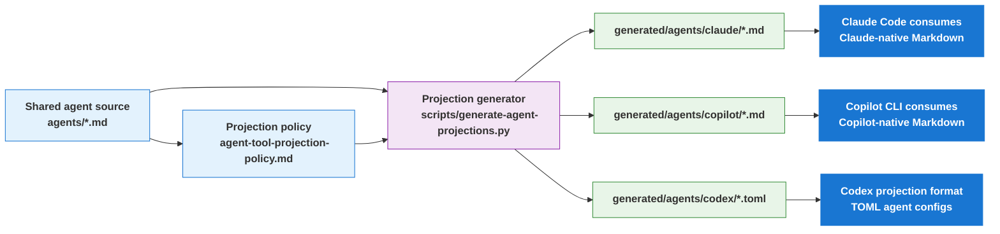
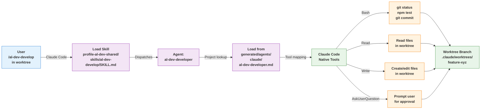
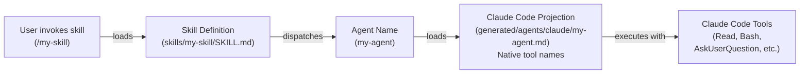

# Projection Layer README

> Maintainer reference for how shared agent source becomes harness-native artifacts for Claude Code, Copilot CLI, and Codex.

**Last updated:** 2026-05-23

---

## Section 1: Conceptual Foundation

### The Problem

The `al-dev-shared` plugin is consumed by three different AI harnesses: Claude Code, Copilot CLI, and Codex. Each harness has its own native tools and naming conventions. Maintaining three completely separate copies of agent definitions would create drift, duplicate work, and inconsistency.

### The Solution: One Source, Three Native Outputs

The projection layer solves this by maintaining **one canonical authored surface** with generic, harness-neutral definitions, then **automatically translating them** into harness-native versions at build time.

- Shared source (`profile-al-dev-shared/agents/*.md`) uses generic capability names (e.g., `Read`, `Bash`, `USER_GATE`)
- The projection **policy** (`knowledge/agent-tool-projection-policy.md`) defines how to map each generic capability to each harness's native tool
- The **generator** reads the shared source and policy, then outputs three sets of harness-specific versions

This means maintainers edit once, and all three harnesses get consistent, synchronized agents automatically.

### End-to-End Flow



The diagram above shows the core insight: shared source (left) flows through the projection policy and generator (center) to produce three harness-native outputs (right). Maintainers edit the shared source once; the generator ensures all three harnesses stay synchronized.

---

## Section 2: Sacred vs. Generated Files (Critical Boundary Rules)

### Sacred Files: Always Edit Directly

These files are canonical authored source and are meant to be edited:

- `profile-al-dev-shared/agents/*.md` — agent definitions
- `profile-al-dev-shared/skills/<name>/SKILL.md` — skill definitions
- `profile-al-dev-shared/knowledge/agent-tool-projection-policy.md` — the mapping policy itself
- `profile-al-dev-shared/knowledge/` — all shared knowledge documents

When you edit these files, you are modifying the source of truth. Changes here flow through to all three harnesses.

### Generated Files: Never Hand-Edit

These directories contain auto-generated harness-native versions. Never edit them directly:

- `profile-al-dev-shared/generated/agents/claude/` — Claude Code projections (generated *.md files)
- `profile-al-dev-shared/generated/agents/copilot/` — Copilot CLI projections (generated *.md files)
- `profile-al-dev-shared/generated/agents/codex/` — Codex projections (generated *.toml files)

If you edit a generated file, your changes will be **lost on the next regeneration**. Always edit the shared source instead, then regenerate.

### Why This Boundary Matters

The boundary exists for three reasons:

1. **Single source of truth:** All three harnesses stay in sync because they all derive from the same authored source
2. **No manual sync work:** Changes in shared source automatically propagate to all generated versions
3. **Safety:** The neutrality validator ensures shared source never contains harness-specific tokens

If the boundary breaks (e.g., hand-editing a generated file, or accidentally copying harness-specific names into shared source), the validator catches it before it causes problems.

### Validation: The Neutrality Check

Before committing, run:

```bash
python3 scripts/validate_harness_neutrality.py profile-al-dev-shared
```

This scanner ensures no harness-specific tokens have leaked into shared source. See Section 5 for details.

---

## Section 3: Workflow — Adding a New Agent or Skill

### Overview

This workflow walks you through adding a new agent or skill safely, from authoring through validation and commit.

### Step-by-Step Workflow

#### Step 1: Author the Shared Source File

Create a new file in the appropriate location:

**For a new agent:**

```bash
# Create the agent definition
cat > /Users/russelllaing/al-dev-shared/profile-al-dev-shared/agents/my-new-agent.md << 'EOF'
---
name: my-new-agent
description: Brief description of what this agent does
model: claude-opus-4-7
tools:
  - Read
  - Bash
  - USER_GATE
---

# System Prompt for the Agent

[Full instructions for the agent here]
EOF
```

**For a new skill:**

```bash
# Create the skill definition
mkdir -p /Users/russelllaing/al-dev-shared/profile-al-dev-shared/skills/my-new-skill
cat > /Users/russelllaing/al-dev-shared/profile-al-dev-shared/skills/my-new-skill/SKILL.md << 'EOF'
---
name: my-new-skill
description: Trigger description (how this skill activates)
argument-hint: "[optional args]"
---

# Skill Instructions

[Full skill instructions here]
EOF
```

**Key rule:** Use generic capability names in the `tools:` list (e.g., `Read`, `Bash`, `USER_GATE`), never harness-specific names like `AskUserQuestion` or `ask_user`. Reference `profile-al-dev-shared/knowledge/harness-concepts.md` for the complete generic vocabulary.

#### Step 2: Regenerate Projections

Run the generator to create harness-native versions:

```bash
cd /Users/russelllaing/al-dev-shared
python3 scripts/generate-agent-projections.py
```

Expected output:

- New files created in `profile-al-dev-shared/generated/agents/claude/`
- New files created in `profile-al-dev-shared/generated/agents/copilot/`
- New files created in `profile-al-dev-shared/generated/agents/codex/`

Run:

```bash
git status
```

You should see your new shared source file plus the three generated versions.

#### Step 3: Validate Harness Neutrality

Run the neutrality validator to ensure no harness-specific tokens leaked into shared source:

```bash
cd /Users/russelllaing/al-dev-shared
python3 scripts/validate_harness_neutrality.py profile-al-dev-shared
```

Expected output:

```plaintext
PASS: no harness-specific leakage in shared authored surface
```

If validation fails, see Section 5 for how to fix violations.

#### Step 4: Commit the Changes

Stage both the shared source and generated versions:

```bash
git add profile-al-dev-shared/agents/my-new-agent.md \
        profile-al-dev-shared/generated/agents/claude/my-new-agent.md \
        profile-al-dev-shared/generated/agents/copilot/my-new-agent.md \
        profile-al-dev-shared/generated/agents/codex/my-new-agent.toml

git commit -m "feat: add my-new-agent to support X workflow

Added new agent definition with tools for Read, Bash, and USER_GATE.
Regenerated projections for all three harnesses."
```

### Maintainer Workflow Diagram



---

## Section 4: Regenerating Projections Safely

### When to Regenerate

You must regenerate projections after any of these changes:

1. **Editing an agent:** You modify `profile-al-dev-shared/agents/*.md`
2. **Editing the projection policy:** You modify `profile-al-dev-shared/knowledge/agent-tool-projection-policy.md`
3. **Editing shared knowledge that affects tool descriptions:** You modify relevant files in `profile-al-dev-shared/knowledge/`

You do **not** need to regenerate when editing skills, knowledge unrelated to agents, or non-source files.

### How to Regenerate

Run the generator script:

```bash
cd /Users/russelllaing/al-dev-shared
python3 scripts/generate-agent-projections.py
```

The script reads all shared agent files and the projection policy, then outputs harness-native versions in-place:

- `profile-al-dev-shared/generated/agents/claude/*.md` — Claude Code versions
- `profile-al-dev-shared/generated/agents/copilot/*.md` — Copilot CLI versions
- `profile-al-dev-shared/generated/agents/codex/*.toml` — Codex versions

### Verify Regeneration Results

After running the generator, always verify the output:

- [ ] **Check git status to see what changed**

```bash
git status
```

You should see modifications to generated agent files, not deletions or unexpected additions.

- [ ] **Review the diffs to ensure changes are sensible**

```bash
git diff profile-al-dev-shared/generated/agents/claude/ | head -100
```

Look for:

- Tool name mappings applied correctly (e.g., `USER_GATE` → `AskUserQuestion` in Claude output)
- No accidental deletions
- No mysterious additions unrelated to your edits

- [ ] **Run the neutrality validator to confirm safety**

```bash
python3 scripts/validate_harness_neutrality.py profile-al-dev-shared
```

Expected: PASS: no harness-specific leakage in shared authored surface

If validation fails, fix the violations (see Section 5) and regenerate again.

### Projection Process Diagram



---

## Section 5: Validating Harness Neutrality

### The Safety Check: What It Does

The neutrality validator scans `profile-al-dev-shared/` (the shared source) for forbidden harness-specific tokens and ensures the source remains generic. This is a critical safety check before committing.

Run:

```bash
python3 scripts/validate_harness_neutrality.py profile-al-dev-shared
```

The validator checks for:

- Harness-specific tool names in agent files (e.g., `AskUserQuestion`, `ask_user`, `ASK_USER`)
- Harness-specific prefixes (e.g., `mcp__`, `claude:`, `copilot:`)
- Harness-specific keys or formats (e.g., TOML-specific syntax in shared source)
- File paths that reference generated directories (should reference shared source only)

Expected successful output:

```plaintext
PASS: no harness-specific leakage in shared authored surface
```

### Common Pitfalls and How to Fix Them

#### Pitfall 1: Using Harness-Specific Tool Names in Shared Source

**Symptom:** Validator reports `AskUserQuestion` in agent tools list

**Example of mistake:**

```markdown
# agents/my-agent.md

tools:
  - Read
  - AskUserQuestion  # ❌ This is Claude-specific, not generic
```

**Fix:** Replace with the generic capability name

```markdown
tools:
  - Read
  - USER_GATE  # ✓ Generic name from harness-concepts.md
```

**How to find the right generic name:** Consult `profile-al-dev-shared/knowledge/harness-concepts.md` for the mapping of harness-specific names to generic names.

#### Pitfall 2: Including Harness-Specific Prefixes in Descriptions

**Symptom:** Validator reports `claude:` or `copilot:` prefix in agent description

**Example of mistake:**

```markdown
description: This agent handles claude:code-review tasks
```

**Fix:** Remove the harness-specific prefix

```markdown
description: This agent handles code review tasks
```

#### Pitfall 3: Copying a Generated File Back Into Shared Source

**Symptom:** You accidentally copied a file from `generated/agents/claude/` into `profile-al-dev-shared/agents/`

**Consequences:** The file will contain Claude-specific tool names and fail validation

**Fix:** Delete the accidentally-copied file and regenerate from the correct shared source

```bash
# Remove the corrupted file
rm profile-al-dev-shared/agents/corrupted-file.md

# Regenerate to ensure consistency
python3 scripts/generate-agent-projections.py

# Validate
python3 scripts/validate_harness_neutrality.py profile-al-dev-shared
```

#### Pitfall 4: Manually Editing a Generated File

**Symptom:** You edited a file in `generated/agents/claude/` directly

**Consequences:** Your edits will be lost on the next regeneration

**Fix:** Edit the shared source instead, then regenerate

```bash
# Find which agent you were trying to edit
# Edit the shared source file
vi profile-al-dev-shared/agents/my-agent.md

# Regenerate
python3 scripts/generate-agent-projections.py

# Validate
python3 scripts/validate_harness_neutrality.py profile-al-dev-shared
```

### Decision Tree: Is It Harness-Specific?

When in doubt, use this decision tree:

1. **Does the name appear in multiple harnesses?** (e.g., `Read` in Claude, Copilot, and Codex)
   - Yes → It's generic, use it
   - No → It might be harness-specific

2. **Is it in the `harness-concepts.md` generic column?**
   - Yes → It's generic, use it
   - No → It's likely harness-specific

3. **Does it reference a specific tool by its harness-native name?** (e.g., `AskUserQuestion`, `ask_user`, `ASK_USER`)
   - Yes → It's harness-specific, use the generic equivalent
   - No → It's generic

---



---

## What Each Harness Uses

### Claude Code

- Consumes: `profile-al-dev-shared/generated/agents/claude/*.md`
- Output shape: Markdown frontmatter plus body
- Projection examples:
  - `USER_GATE` -> `AskUserQuestion`
  - MCP tools -> `mcp__plugin_profile-claude-al-dev_*`

### Copilot CLI

- Consumes: `profile-al-dev-shared/generated/agents/copilot/*.md`
- Output shape: Markdown frontmatter plus body
- Projection examples:
  - `USER_GATE` -> `ask_user`
  - `Bash` -> `execute`
  - MCP tools -> `al-mcp-server-*`, `bc-code-intelligence-mcp-*`

### Codex

- Projection artifacts: `profile-al-dev-shared/generated/agents/codex/*.toml`
- Output shape: TOML config with `name`, `description`, and `developer_instructions`
- Projection examples:
  - shared capability intent is rendered as Codex capability notes
  - `USER_GATE` is described via Codex-specific behavior notes rather than a Claude/Copilot-style tool alias

---

## Concrete Example

Use `al-dev-interview` as a simple example.

### 1. Shared source

The shared agent file declares generic capabilities such as:

- `Read`
- `Write`
- `USER_GATE`

It does **not** declare harness-native names like `AskUserQuestion`, `ask_user`, or Codex TOML keys.

### 2. Projection step

The generator reads the shared agent file and applies the projection policy:

- Claude projection maps `USER_GATE` to `AskUserQuestion`
- Copilot projection maps `USER_GATE` to `ask_user`
- Codex projection appends Codex-native capability guidance into TOML `developer_instructions`

### 3. Harness-native result

The same authored agent becomes:

- `generated/agents/claude/al-dev-interview.md`
- `generated/agents/copilot/al-dev-interview.md`
- `generated/agents/codex/al-dev-interview.toml`

This is the key idea of the projection layer: one authored agent, three harness-native outputs.

---

## Claude Code Worktree Integration Example

Claude Code uses the projection layer to load skills and dispatch agents while supporting isolated development workspaces via git worktrees.

### 1. Skill Invocation and Plugin Discovery

When a user types `/al-dev-plan` in Claude Code:

1. Claude Code resolves the skill from `~/.claude/settings.json`:

   ```json
   {
     "extraKnownMarketplaces": {
       "al-dev-shared": {
         "source": { "source": "directory", "path": "/Users/russelllaing/al-dev-shared" }
       }
     }
   }
   ```

2. Claude Code loads `profile-al-dev-shared/skills/al-dev-plan/SKILL.md`

3. The skill may dispatch agents referenced by name (e.g., `al-dev-shared:al-dev-architect`)

### 2. Agent Projection Resolution

When a skill dispatches `al-dev-shared:al-dev-interview`, Claude Code:

1. Looks up the agent in `profile-al-dev-shared/generated/agents/claude/al-dev-interview.md`

2. Reads the Claude Code-native frontmatter:

   ```yaml
   description: "Interview the user to extract complete BC/AL implementation details..."
   tools:
     - Read
     - Write
     - AskUserQuestion      # <- Projected from generic USER_GATE
   ```

3. Claude Code maps tool names to native operations:
   - `Read` → read files from local filesystem
   - `Write` → write files to local filesystem
   - `AskUserQuestion` → prompt user for input

### 3. Worktree Lifecycle in Claude Code

When developing a feature that needs isolation:

## Phase 1: Workspace Creation

```bash
# User runs /al-dev-plan for a feature design
# Skill invokes superpowers:using-git-worktrees

# Claude Code creates isolated worktree:
git worktree add .claude/worktrees/feature-xyz main
cd .claude/worktrees/feature-xyz

# Plugin is still accessible from worktree:
~/.claude/plugins/cache/claude-plugins-official/...
```

## Phase 2: Skill Execution in Worktree

While in the worktree, the user invokes `/al-dev-develop`:

### Skill Execution Flow



### Execution Details

1. Skill loads from the plugin (shared across all workspaces)
2. Skill dispatches `al-dev-shared:al-dev-developer` agent
3. Agent runs in the worktree context (CWD is the worktree root)
4. Agent uses `Bash` tool to run commands in the worktree
5. Agent uses `Read`/`Write` to edit files in the worktree

The worktree has the full repo structure, including generated agents:

```text
.claude/worktrees/skill-xyz/
  profile-al-dev-shared/
    agents/                    # Shared authored source
    generated/agents/
      claude/                  # Claude Code projections
      copilot/                 # Copilot CLI projections
      codex/                   # Codex projections
```

Agent execution in the worktree:

```bash
# From inside worktree context, agent might run:
git status                          # Shows worktree branch state
npm test                            # Runs tests in worktree
git commit -m "feat: ..."          # Commits to worktree branch

# When /projection-sync runs, it regenerates IN-PLACE:
python3 scripts/generate-agent-projections.py
# → Updates profile-al-dev-shared/generated/agents/claude/*.md
# → Updates profile-al-dev-shared/generated/agents/copilot/*.md
# → Updates profile-al-dev-shared/generated/agents/codex/*.toml
```

## Phase 3: Worktree Cleanup

When development completes, the user invokes `/superpowers:finishing-a-development-branch`:

1. Skill detects worktree state: `git rev-parse --git-dir` ≠ `git rev-parse --git-common-dir`
2. Skill presents merge/PR/keep/discard options
3. On merge: Returns to main repo, merges worktree branch, removes worktree
4. On PR: Keeps worktree alive (user may need to iterate on feedback)

### 4. Concrete Flow: Adding a Feature to al-dev-shared

```text
User: /al-dev-plan "Add new skill for X"

→ /al-dev-plan skill invokes:
  - Architect agent (al-dev-architect) for design debate
  - Dispatched via: al-dev-shared:al-dev-architect projection
  - Uses: AskUserQuestion (USER_GATE projected to Claude native tool)
  
→ User approves design

→ User: /al-dev-develop "Implement the skill"

→ /al-dev-develop skill:
  - Creates worktree: .claude/worktrees/skill-xyz
  - Loads developer agent: al-dev-shared:al-dev-developer
  - Agent uses Bash, Read, Write tools (all Claude Code natives)
  - Agent creates: profile-al-dev-shared/skills/new-skill/SKILL.md
  - Agent runs: /projection-sync to regenerate harness artifacts

→ /projection-sync orchestrates from within worktree:
  - Validates shared source (no harness leakage)
  - Regenerates projections in-place:
    * profile-al-dev-shared/generated/agents/claude/*.md
    * profile-al-dev-shared/generated/agents/copilot/*.md
    * profile-al-dev-shared/generated/agents/codex/*.toml
  - Commits changed projection files to worktree branch
  - Claude Code user sees: only claude/*.md files (but all three harnesses regenerated)

→ User: /superpowers:finishing-a-development-branch

→ Finishing skill detects worktree, offers options

→ User chooses: "Create PR"

→ Skill:
  - Keeps worktree alive at .claude/worktrees/skill-xyz
  - Pushes worktree branch to origin/skill-xyz
  - Creates PR with summary

→ User iterates on feedback in same worktree

→ Feedback incorporated, PR merged

→ User: /superpowers:finishing-a-development-branch again

→ User chooses: "Merge and cleanup"

→ Finishing skill:
  - Detects worktree is under .claude/worktrees/ (Claude Code ownership)
  - Returns to main repo
  - Removes worktree: git worktree remove .claude/worktrees/skill-xyz
  - Deletes feature branch
```

### 5. Key Points

- **Plugin loading is harness-agnostic:** `profile-al-dev-shared/` works the same way in Claude Code, Copilot CLI, and Codex
- **Projections are harness-specific:** Each harness consumes its own `generated/agents/<harness>/` directory
- **Tool mapping is hidden:** Claude Code developers see `Bash`, `Read`, `Write`, `AskUserQuestion`; the projection layer mapped these from generic capability names
- **Worktrees are optional:** Users can work directly on main, or use worktrees for isolation; the projection layer doesn't care which
- **Plugin discovery is once-per-session:** Claude Code reads plugin paths from settings, then uses them for all skills and agents in that session

---

## Appendix A: Files Reference

Quick lookup for file locations and purposes:

| File/Directory | Purpose | Can Edit? |
| --- | --- | --- |
| `profile-al-dev-shared/agents/*.md` | Canonical agent definitions | ✅ Yes |
| `profile-al-dev-shared/skills/<name>/SKILL.md` | Canonical skill definitions | ✅ Yes |
| `profile-al-dev-shared/knowledge/agent-tool-projection-policy.md` | Capability → tool mappings | ✅ Yes |
| `profile-al-dev-shared/knowledge/harness-concepts.md` | Generic capability vocabulary | ✅ Yes |
| `profile-al-dev-shared/knowledge/` | Shared knowledge documents | ✅ Yes |
| `profile-al-dev-shared/generated/agents/claude/` | Claude Code projections | ❌ No (regenerate instead) |
| `profile-al-dev-shared/generated/agents/copilot/` | Copilot CLI projections | ❌ No (regenerate instead) |
| `profile-al-dev-shared/generated/agents/codex/` | Codex projections | ❌ No (regenerate instead) |
| `scripts/generate-agent-projections.py` | Generator script | Read only |
| `scripts/validate_harness_neutrality.py` | Neutrality validator | Read only |

---

## Boundary Rules

Keep these boundaries strict:

- `profile-al-dev-shared/agents/*.md` is the canonical authored source
- `profile-al-dev-shared/generated/agents/**` is derived output only
- generated artifacts must not be hand-edited
- harness-specific naming belongs in:
  - generated projections
  - projection policy docs
  - harness-mapping docs such as `knowledge/harness-concepts.md`

The validator for shared-surface neutrality is:

```bash
python3 scripts/validate_harness_neutrality.py profile-al-dev-shared
```

---

## Branch History

Two historical branches are relevant to the current projection layer.

### `multi-environment-tool-declarations`

This branch introduced the actual projection system.

Key contribution areas:

- `scripts/generate-agent-projections.py`
- `scripts/tests/test_generate_agent_projections.py`
- `profile-al-dev-shared/generated/agents/{claude,copilot,codex}/`
- `knowledge/agent-tool-projection-policy.md`
- alignment/test work for generated projections

In practical terms, this branch established the **mechanism** for producing harness-native artifacts.

### `projection-rollout-claude-boundary`

This branch focused on repository boundaries and projection-surface discipline.

Key contribution areas:

- clarifying that `.claude/` is repo-local maintainer tooling
- treating `profile-al-dev-shared/generated/agents/` as generated contract output
- tightening alignment checks around projection boundaries

In practical terms, this branch established the **boundary model** around the projection system.

### Current state

Current `master` uses the projection-layer model directly, but not by merging those exact branch tips verbatim. Their ideas landed through current repo state, generated artifacts, projection policy, and boundary documentation now present in `master`.

---

## Files to Check

- Shared source: `profile-al-dev-shared/agents/`
- Projection policy: `profile-al-dev-shared/knowledge/agent-tool-projection-policy.md`
- Harness concepts: `profile-al-dev-shared/knowledge/harness-concepts.md`
- Generated outputs: `profile-al-dev-shared/generated/agents/`
- Generator: `scripts/generate-agent-projections.py`
- Projection tests: `scripts/tests/test_generate_agent_projections.py`

---

## Documentation Boundaries

This projection layer is described in three parallel harness-specific guidance files:

- `CLAUDE.md` — Claude Code registration and usage
- `AGENTS.md` — Copilot CLI registration and usage
- `CODEX.md` — Codex registration and usage

All three reference this document for understanding the projection mechanism itself. Shared content stays harness-agnostic; harness-specific guidance lives in those three files.

When updating this document, ensure the three guidance files are kept in sync regarding the overall multi-harness architecture (even if implementation details differ per harness).

---

## Maintainer Checklist

When changing agent capabilities or projection behavior:

1. Edit the shared agent source or projection policy, not generated files.
2. Regenerate or verify generated artifacts as appropriate.
3. Run the shared-surface neutrality validator.
4. Check that Claude, Copilot, and Codex outputs still reflect the intended capability mapping.

## Appendix B: Claude Code Worktree Integration

This section is for advanced users and Claude Code developers who want to understand how projections work within a worktree environment.

### How Claude Code Discovers and Loads Projections

When Claude Code runs in a worktree (an isolated copy of the repository), it:

1. Registers the plugin from `.claude/settings.json` or `~/.claude/settings.json`
2. Looks for skill definitions in `profile-al-dev-shared/skills/`
3. Looks for agent projections in `profile-al-dev-shared/generated/agents/claude/`
4. Loads knowledge files from `profile-al-dev-shared/knowledge/`

The projection layer ensures that agents in the worktree have Claude Code-native tool names (e.g., `AskUserQuestion`, `Read`, `Bash`) instead of generic names.

### Worktree Lifecycle

A worktree is an isolated copy of the repository used for development:

1. **Creation:** Claude Code creates a worktree via `git worktree add` or the EnterWorktree skill
2. **Isolation:** The worktree has its own branch and working directory, separate from the main workspace
3. **Execution:** Skills and agents run in the worktree; projections are loaded from this isolated copy
4. **Cleanup:** On completion, the worktree can be kept or removed

When projections are regenerated in a worktree, the generator outputs harness-native versions specific to Claude Code.

### Example: Adding a Feature to al-dev-shared in a Worktree

This example walks through the full workflow of modifying the plugin within a worktree:

**Scenario:** You want to add a new agent and test it in Claude Code before committing.

#### Step 1: Create a Worktree

In Claude Code, use the `superpowers:using-git-worktrees` skill to create an isolated worktree:

```text
/superpowers:using-git-worktrees
```

This creates a new branch in `.claude/worktrees/` and switches the session to that isolated directory.

#### Step 2: Author the Agent in Shared Source

Create the agent in the worktree's `profile-al-dev-shared/agents/` directory:

```bash
cat > profile-al-dev-shared/agents/my-experimental-agent.md << 'EOF'
---
name: my-experimental-agent
description: Test agent for feature X
model: claude-opus-4-7
tools:
  - Read
  - Bash
  - USER_GATE
---

# System Prompt

[Instructions for the agent]
EOF
```

#### Step 3: Regenerate Projections in the Worktree

Run the generator to create Claude Code-native versions:

```bash
python3 scripts/generate-agent-projections.py
```

The worktree now has:

- `profile-al-dev-shared/agents/my-experimental-agent.md` (generic shared source)
- `profile-al-dev-shared/generated/agents/claude/my-experimental-agent.md` (Claude-native version with `AskUserQuestion`, `Read`, `Bash`)

#### Step 4: Test in Claude Code

Invoke the agent directly via Claude Code's Skill tool to test its behavior:

```text
/al-dev-shared:my-experimental-agent
```

If the agent works as expected, you can commit and exit the worktree. If you need to iterate, edit the shared source, regenerate, and test again.

#### Step 5: Commit and Exit the Worktree

When satisfied with the changes:

```bash
git add profile-al-dev-shared/agents/my-experimental-agent.md \
        profile-al-dev-shared/generated/agents/claude/my-experimental-agent.md

git commit -m "feat: add my-experimental-agent for feature X"
```

Then use the `ExitWorktree` tool to return to the main workspace and clean up the worktree.

### How Skill Execution Flows Through Projections

When you invoke a skill in Claude Code:

1. Claude Code loads the skill definition from `profile-al-dev-shared/skills/<name>/SKILL.md`
2. The skill may dispatch an agent using the agent name (e.g., `al-dev-shared:my-agent`)
3. Claude Code loads the agent projection from `profile-al-dev-shared/generated/agents/claude/my-agent.md`
4. The projection contains Claude Code-native tool names, so the agent can execute directly
5. The agent runs with full access to Claude Code's tools (Read, Bash, AskUserQuestion, etc.)



## Appendix C: Harness Developer Reference

This section is for developers who are building new AI harnesses or extending the projection system to support additional consumers.

### What Each Harness Consumes

Each of the three supported harnesses consumes a different projection format:

#### Claude Code (Desktop App, CLI, IDE Extensions)

- **Location:** `profile-al-dev-shared/generated/agents/claude/*.md`
- **Format:** Markdown with YAML frontmatter
- **Tool Names:** Claude Code-native (e.g., `AskUserQuestion`, `Read`, `Bash`)
- **Registration:** Via `.claude/settings.json` plugin path
- **Execution:** Skills invoke agents via the Skill tool; agents execute with full Claude Code tool access

#### Copilot CLI (Autonomous Command-Line Agent)

- **Location:** `profile-al-dev-shared/generated/agents/copilot/*.md`
- **Format:** Markdown with YAML frontmatter
- **Tool Names:** Copilot-native (e.g., `ask_user`, `file_read`, `shell`)
- **Registration:** Via Copilot CLI plugin discovery
- **Execution:** Agents are dispatched directly by the CLI; they execute with Copilot's tool set

#### Codex (Autonomous Development System)

- **Location:** `profile-al-dev-shared/generated/agents/codex/*.toml`
- **Format:** TOML configuration
- **Tool Names:** Codex-native (e.g., `ASK_USER`, `READ`, `BASH`)
- **Registration:** Via Codex plugin registry
- **Execution:** Agents are loaded by the Codex system; they execute with Codex's tool set

### The Projection Policy: How Mapping Works

The projection policy is the configuration that maps generic capability names to harness-native tool names. It lives in:

```text
profile-al-dev-shared/knowledge/agent-tool-projection-policy.md
```

The policy defines entries like:

```markdown
Generic Name  | Claude Code      | Copilot CLI | Codex
USER_GATE     | AskUserQuestion  | ask_user    | request_user_input
Read          | Read             | read        | native file access capability
Bash          | Bash             | execute     | native shell capability
```

When the generator runs, it:

1. Reads `profile-al-dev-shared/agents/*.md` (generic definitions)
2. Consults the projection policy
3. For each harness, replaces generic capability names with harness-native names
4. Outputs harness-native versions

### Example: Adding Support for a New Harness

To support a new harness (e.g., MyHarness):

1. **Extend the projection policy** to include MyHarness tool mappings:

```markdown
Generic Name  | Claude Code      | Copilot CLI | Codex                          | MyHarness
USER_GATE     | AskUserQuestion  | ask_user    | request_user_input             | prompt_user
Read          | Read             | read        | native file access capability  | load_file
Bash          | Bash             | execute     | native shell capability        | exec_cmd
```

1. **Update the generator script** to output MyHarness projections:

   - Add MyHarness to the `HARNESSES` list
   - Define the output format for MyHarness agents
   - Implement the tool name mapping for MyHarness

2. **Test the generator** to ensure MyHarness projections are created correctly:

   ```bash
   python3 scripts/generate-agent-projections.py
   ls profile-al-dev-shared/generated/agents/myharness/
   ```

3. **Register the plugin** in MyHarness's plugin system so it loads the new projections

### Common Questions for Harness Developers

**Q: Can I add custom extensions to an agent in my harness without modifying shared source?**

A: No. All harness-specific customizations should be made to the shared source using generic capability names, then regenerated. This ensures all harnesses benefit from improvements and stay in sync.

**Q: What if my harness needs a tool that doesn't map to any generic capability?**

A: Add it to the projection policy. Define a new generic capability name (in `harness-concepts.md`), add it to the policy, and regenerate. This keeps the system extensible and maintains parity across harnesses.

**Q: How do I test a projection before committing?**

A: Check it out in a worktree or local environment. Invoke the agent/skill in your harness and verify behavior. The generated artifacts are code — treat them as such.

**Q: What happens if I manually edit a generated projection?**

A: Your edits will be lost on the next regeneration. Always edit the shared source instead, then regenerate. Manual edits to generated files are not supported.
