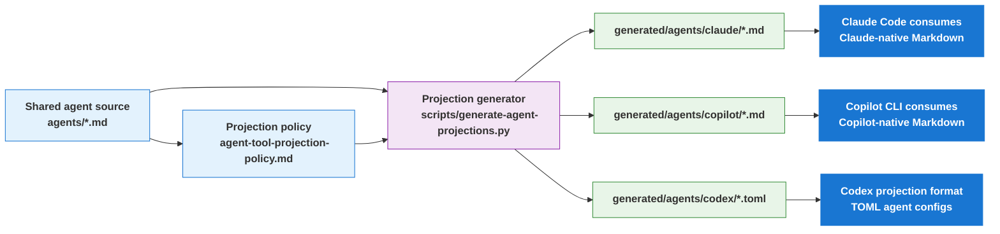

# Projection Layer README

> Maintainer reference for how shared agent source becomes harness-native artifacts for Claude Code, Copilot CLI, and Codex.

**Last updated:** 2026-05-23

---

## Purpose

The projection layer lets `al-dev-shared` keep one canonical authored agent surface while still producing harness-native artifacts for each supported environment.

The split is:

- **Shared source of truth**: `profile-al-dev-shared/agents/*.md`
- **Projection policy**: `profile-al-dev-shared/knowledge/agent-tool-projection-policy.md`
- **Generated artifacts**: `profile-al-dev-shared/generated/agents/**`

Shared authored content stays harness agnostic. Generated projection files are
where harness-native execution artifacts are rendered, while intentional
mapping docs may also name harness-specific details explicitly.

---

## End-to-End Flow



---

## What Each Harness Uses

### Claude Code

- Consumes: `profile-al-dev-shared/generated/agents/claude/*.md`
- Output shape: Markdown frontmatter plus body
- Projection examples:
  - `USER_GATE` -> `AskUserQuestion`
  - MCP tools -> `mcp__plugin_profile-claude-al-dev_*`

### Copilot CLI

- Consumes: `profile-al-dev-shared/generated/agents/copilot/*.md`
- Output shape: Markdown frontmatter plus body
- Projection examples:
  - `USER_GATE` -> `ask_user`
  - shell -> `execute`
  - MCP tools -> `al-mcp-server-*`, `bc-code-intelligence-mcp-*`

### Codex

- Projection artifacts: `profile-al-dev-shared/generated/agents/codex/*.toml`
- Output shape: TOML config with `name`, `description`, and `developer_instructions`
- Projection examples:
  - shared capability intent is rendered as Codex capability notes
  - `USER_GATE` is described via Codex-specific behavior notes rather than a Claude/Copilot-style tool alias

---

## Concrete Example

Use `al-dev-interview` as a simple example.

### 1. Shared source

The shared agent file declares generic capabilities such as:

- `Read`
- `Write`
- `USER_GATE`

It does **not** declare harness-native names like `AskUserQuestion`, `ask_user`, or Codex TOML keys.

### 2. Projection step

The generator reads the shared agent file and applies the projection policy:

- Claude projection maps `USER_GATE` to `AskUserQuestion`
- Copilot projection maps `USER_GATE` to `ask_user`
- Codex projection appends Codex-native capability guidance into TOML `developer_instructions`

### 3. Harness-native result

The same authored agent becomes:

- `generated/agents/claude/al-dev-interview.md`
- `generated/agents/copilot/al-dev-interview.md`
- `generated/agents/codex/al-dev-interview.toml`

This is the key idea of the projection layer: one authored agent, three harness-native outputs.

---

## Boundary Rules

Keep these boundaries strict:

- `profile-al-dev-shared/agents/*.md` is the canonical authored source
- `profile-al-dev-shared/generated/agents/**` is derived output only
- generated artifacts must not be hand-edited
- harness-specific naming belongs in:
  - generated projections
  - projection policy docs
  - harness-mapping docs such as `knowledge/harness-concepts.md`

The validator for shared-surface neutrality is:

```bash
python3 scripts/validate_harness_neutrality.py profile-al-dev-shared
```

---

## Branch History

Two historical branches are relevant to the current projection layer.

### `multi-environment-tool-declarations`

This branch introduced the actual projection system.

Key contribution areas:

- `scripts/generate-agent-projections.py`
- `scripts/tests/test_generate_agent_projections.py`
- `profile-al-dev-shared/generated/agents/{claude,copilot,codex}/`
- `knowledge/agent-tool-projection-policy.md`
- alignment/test work for generated projections

In practical terms, this branch established the **mechanism** for producing harness-native artifacts.

### `projection-rollout-claude-boundary`

This branch focused on repository boundaries and projection-surface discipline.

Key contribution areas:

- clarifying that `.claude/` is repo-local maintainer tooling
- treating `profile-al-dev-shared/generated/agents/` as generated contract output
- tightening alignment checks around projection boundaries

In practical terms, this branch established the **boundary model** around the projection system.

### Current state

Current `master` uses the projection-layer model directly, but not by merging those exact branch tips verbatim. Their ideas landed through current repo state, generated artifacts, projection policy, and boundary documentation now present in `master`.

---

## Files to Check

- Shared source: `profile-al-dev-shared/agents/`
- Projection policy: `profile-al-dev-shared/knowledge/agent-tool-projection-policy.md`
- Harness concepts: `profile-al-dev-shared/knowledge/harness-concepts.md`
- Generated outputs: `profile-al-dev-shared/generated/agents/`
- Generator: `scripts/generate-agent-projections.py`
- Projection tests: `scripts/tests/test_generate_agent_projections.py`

---

## Documentation Boundaries

This projection layer is described in three parallel harness-specific guidance files:

- `CLAUDE.md` — Claude Code registration and usage
- `AGENTS.md` — Copilot CLI registration and usage
- `CODEX.md` — Codex registration and usage

All three reference this document for understanding the projection mechanism itself. Shared content stays harness-agnostic; harness-specific guidance lives in those three files.

When updating this document, ensure the three guidance files are kept in sync regarding the overall multi-harness architecture (even if implementation details differ per harness).

---

## Maintainer Checklist

When changing agent capabilities or projection behavior:

1. Edit the shared agent source or projection policy, not generated files.
2. Regenerate or verify generated artifacts as appropriate.
3. Run the shared-surface neutrality validator.
4. Check that Claude, Copilot, and Codex outputs still reflect the intended capability mapping.
