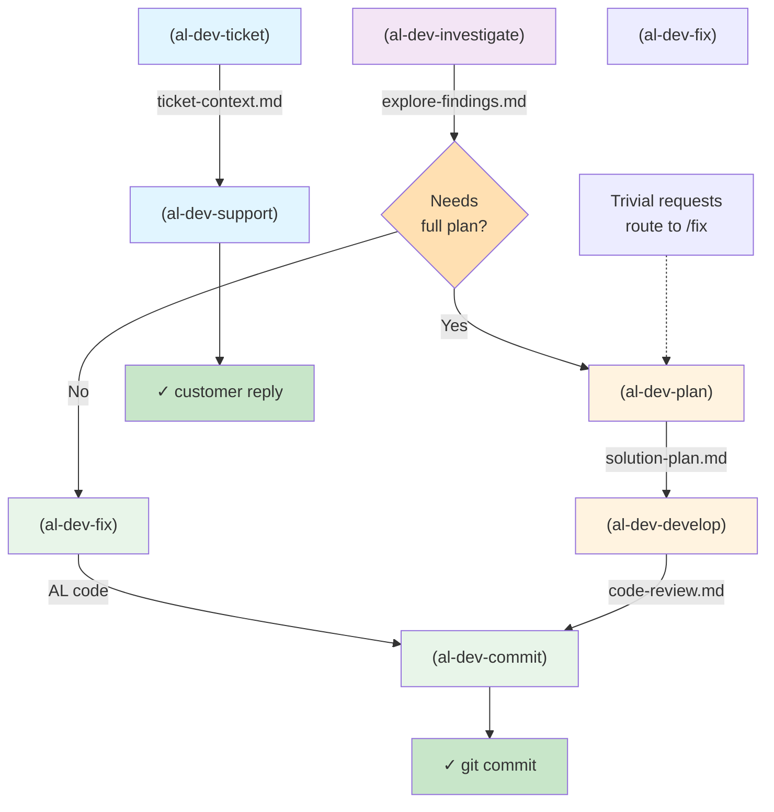
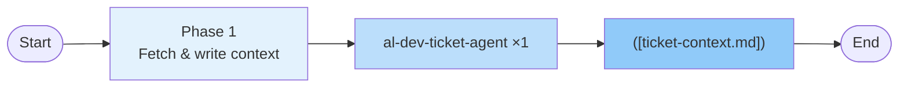
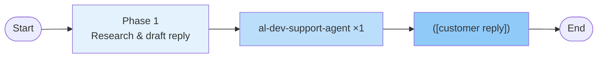
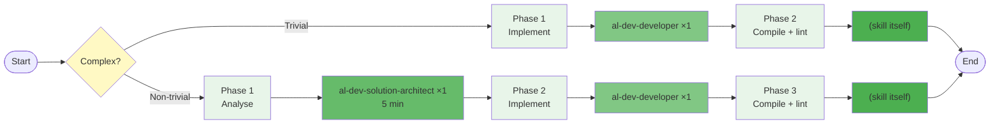
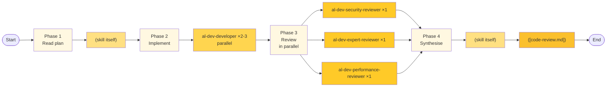
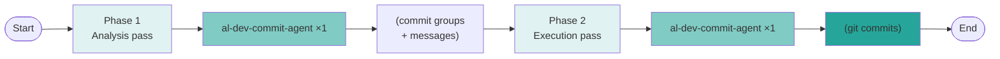

# AL Dev Plugin Map Implementation Plan

> **For agentic workers:** REQUIRED SUB-SKILL: Use superpowers:subagent-driven-development (recommended) or superpowers:executing-plans to implement this plan task-by-task. Steps use checkbox (`- [ ]`) syntax for tracking.

**Goal:** Generate `docs/al-dev-plugin-map.md` — a reference document with Mermaid diagrams showing the active skills, agents, and their relationships in the profile-al-dev-shared plugin.

**Architecture:** Two-layer visual approach: a lifecycle overview showing entry points and main development flow, then seven per-skill drill-down diagrams detailing internal phases, agent spawns, and file outputs. Observations section with placeholder annotations ready for analysis.

**Tech Stack:** Mermaid flowcharts (TD for overview, LR for skill detail), GitHub-flavored Markdown, Mermaid syntax validation.

---

## File Structure

- **Create:** `docs/al-dev-plugin-map.md` — main plugin map document
- **Reference:** `profile-al-dev-shared/markdown/md-mermaid-helper.md` — Mermaid diagram conventions
- **Verify:** Line count and diagram syntax after creation

---

### Task 1: Read Mermaid Helper and Establish Diagram Conventions

**Files:**
- Reference: `profile-al-dev-shared/markdown/md-mermaid-helper.md`

- [ ] **Step 1: Read Mermaid helper guide**

Run: `cat docs/../profile-al-dev-shared/markdown/md-mermaid-helper.md | head -100`

This will establish:
- Naming conventions for node types (rounded rectangles for skills, diamonds for decisions, stadium shapes for outputs)
- Spacing/indentation rules for Mermaid code blocks
- Cross-diagram linking patterns (if any)
- Color/styling guidelines for diagram consistency

- [ ] **Step 2: Document observations**

Note the key conventions in a comment at the top of the document draft:
- Skills always use rounded rectangle syntax: `(skill-name)`
- Decision gates use diamond: `{question?}`
- File outputs use stadium/pill: `([filename.md])`
- Flowchart TD (top-down) for lifecycle, LR (left-to-right) for skill detail

---

### Task 2: Create Document Structure and Lifecycle Overview Diagram

**Files:**
- Create: `docs/al-dev-plugin-map.md`

- [ ] **Step 1: Write document header and introduction**

```markdown
# AL Dev Plugin Map

> A reference tool for understanding skill relationships, agent patterns, and file handoffs in profile-al-dev-shared. This document is for personal gap analysis and extension planning, not onboarding.

**Last updated:** 2026-05-16  
**Scope:** Active skills only. Archived items (al-dev-test, test-engineer agents, al-dev-test-coverage-reviewer) excluded.

---

## Layer 1: Lifecycle Overview

This diagram shows the three entry paths and how they connect through the main development spine.
```

- [ ] **Step 2: Write lifecycle overview diagram**

```markdown


- [ ] **Step 3: Add Layer 2 introduction**

```markdown
---

## Layer 2: Per-Skill Drill-Downs

Each skill is shown with its internal phases, spawned agents, and key outputs. Agents are referenced by their full type name (e.g., `al-dev-shared:al-dev-developer`).

### Notation

- **Phase**: Numbered step inside the skill
- **Agent**: Which agent (or skill itself) executes the phase
- **Pattern**: ×1 (serial), ×2-3 (parallel), ×N (variable count)
- **Output**: File written to `.dev/` or code generated
```

---

### Task 3: Write Per-Skill Drill-Down Diagrams (Part 1: Lightweight Skills)

**Files:**
- Modify: `docs/al-dev-plugin-map.md` (append drill-down diagrams)

- [ ] **Step 1: Write al-dev-ticket skill diagram**

```markdown
### /al-dev-ticket


- [ ] **Step 2: Write al-dev-support skill diagram**

```markdown
### /al-dev-support



---

### Task 4: Write Per-Skill Drill-Down Diagrams (Part 2: Investigation and Fix)

**Files:**
- Modify: `docs/al-dev-plugin-map.md` (append drill-down diagrams)

- [ ] **Step 1: Write al-dev-investigate skill diagram**

```markdown
### /al-dev-investigate

```mermaid
flowchart LR
    Start([Start]) --> Phase1["Phase 1<br/>Form hypotheses"]
    Phase1 --> SkillWork1["(skill itself)"]
    SkillWork1 --> Phase2["Phase 2<br/>Test hypotheses"]
    Phase2 --> Agent1["al-dev-explore ×2 parallel"]
    Agent1 --> Phase3["Phase 3<br/>Synthesise findings"]
    Phase3 --> SkillWork2["(skill itself)"]
    SkillWork2 --> Output1["([explore-findings.md])"]
    Output1 --> End([End])
    
    style Phase1 fill:#f3e5f5
    style Phase2 fill:#f3e5f5
    style Phase3 fill:#f3e5f5
    style SkillWork1 fill:#e1bee7
    style SkillWork2 fill:#e1bee7
    style Agent1 fill:#ce93d8
    style Output1 fill:#ba68c8
```



- [ ] **Step 2: Write al-dev-fix skill diagram showing both paths**

```markdown
### /al-dev-fix

**Complexity routing:** Trivial fixes skip the analysis phase; complex fixes route through al-dev-solution-architect.



---

### Task 5: Write Per-Skill Drill-Down Diagrams (Part 3: Planning and Development)

**Files:**
- Modify: `docs/al-dev-plugin-map.md` (append drill-down diagrams)

- [ ] **Step 1: Write al-dev-plan skill diagram**

```markdown
### /al-dev-plan

**Competitive design phase:** Multiple architects propose approaches in parallel; the skill synthesises the winner into a solution plan.

```mermaid
flowchart LR
    Start([Start]) --> Phase1["Phase 1<br/>Context gather"]
    Phase1 --> SkillWork1["(skill itself)"]
    SkillWork1 --> Phase2["Phase 2<br/>Competing designs"]
    Phase2 --> ArchAgents["al-dev-solution-architect ×2-3<br/>parallel"]
    ArchAgents --> Phase3["Phase 3<br/>Synthesise winner"]
    Phase3 --> SkillWork2["(skill itself)"]
    SkillWork2 --> Output1["([solution-plan.md])"]
    Output1 --> End([End])
    
    style Phase1 fill:#fff3e0
    style Phase2 fill:#fff3e0
    style Phase3 fill:#fff3e0
    style SkillWork1 fill:#ffe0b2
    style SkillWork2 fill:#ffe0b2
    style ArchAgents fill:#ffcc80
    style Output1 fill:#ffb74d
```



- [ ] **Step 2: Write al-dev-develop skill diagram**

```markdown
### /al-dev-develop

**Three-reviewer panel:** Security, AL expert, and performance reviewers run in parallel, then the skill synthesises findings.



---

### Task 6: Write Per-Skill Drill-Down Diagrams (Part 4: Commit)

**Files:**
- Modify: `docs/al-dev-plugin-map.md` (append drill-down diagram)

- [ ] **Step 1: Write al-dev-commit skill diagram**

```markdown
### /al-dev-commit

**Two-pass execution:** Analysis pass builds commit groups and messages; execution pass runs the commits with hook support.



---

### Task 7: Add Observations Section with Placeholder Annotations

**Files:**
- Modify: `docs/al-dev-plugin-map.md` (append observations section)

- [ ] **Step 1: Add observations section structure**

```markdown
---

## Observations

This section is a placeholder for personal gap analysis. Fill in as you review the map.

### Agents used by only one skill

- 

### Skills with no dedicated agent (skill does the work itself)

- 

### Potential shared agents not yet extracted

- 

### Extension opportunities

- 
```

---

### Task 8: Verify Document Structure and Syntax

**Files:**
- Verify: `docs/al-dev-plugin-map.md`

- [ ] **Step 1: Check file exists and has expected sections**

Run: `grep -c "^### /" docs/al-dev-plugin-map.md`

Expected output: `7` (seven skills: ticket, support, investigate, fix, plan, develop, commit)

- [ ] **Step 2: Verify Mermaid code blocks are well-formed**

Run: `grep -c "^'mermaid$" docs/al-dev-plugin-map.md`

Expected: At least 8 blocks (1 lifecycle + 7 skills)

- [ ] **Step 3: Check for excluded items (must not appear)**

Run: `grep -E "(al-dev-test|test-engineer|test-coverage-reviewer|al-dev-align|al-dev-autonomous|al-dev-document|al-dev-explore|al-dev-handoff|al-dev-help|al-dev-interview|al-dev-lint|al-dev-perf|al-dev-release-notes|commit-learn)" docs/al-dev-plugin-map.md`

Expected: No output (no exclusions present)

- [ ] **Step 4: Count lines and verify non-empty**

Run: `wc -l docs/al-dev-plugin-map.md`

Expected: ~300+ lines (comprehensive diagrams + text)

---

### Task 9: Commit the Plugin Map Document

**Files:**
- Commit: `docs/al-dev-plugin-map.md` (new file)

- [ ] **Step 1: Stage the file**

Run: `git -C /Users/russelllaing/al-dev-shared add docs/al-dev-plugin-map.md`

- [ ] **Step 2: Create commit**

Run:
```bash
git -C /Users/russelllaing/al-dev-shared commit -m "docs: add al-dev plugin map with lifecycle and skill diagrams"
```

Expected: Commit succeeds with message about plugin map creation.

- [ ] **Step 3: Verify commit**

Run: `git -C /Users/russelllaing/al-dev-shared log --oneline -1`

Expected: Latest commit shows plugin map commit message.

---

## Self-Review Checklist

Before submitting for execution, verify:

1. **Spec coverage:**
   - ✓ Lifecycle overview diagram (Layer 1) with three entry paths (ticket, investigate, fix)
   - ✓ Main development spine (plan → develop → commit)
   - ✓ Seven per-skill drill-downs (ticket, support, investigate, fix, plan, develop, commit)
   - ✓ File handoffs labelled on edges (ticket-context.md, explore-findings.md, solution-plan.md, code-review.md)
   - ✓ Terminal nodes (git commit, customer reply)
   - ✓ Complexity gate on plan routing trivial to fix
   - ✓ Observations section with placeholders

2. **Exclusions verified:**
   - ✓ al-dev-test excluded
   - ✓ Test-engineer agents excluded
   - ✓ al-dev-test-coverage-reviewer excluded
   - ✓ Peripheral skills excluded (align, autonomous, document, explore, handoff, help, interview, lint, perf, release-notes, commit-learn)

3. **Diagram syntax:**
   - ✓ All diagrams use Mermaid syntax (flowchart TD/LR)
   - ✓ Node shapes follow conventions (rounded = skills, diamond = decisions, stadium = outputs)
   - ✓ Phase numbering consistent and sequential

4. **No placeholders:**
   - ✓ All diagram content complete
   - ✓ No "TBD", "TODO", or "fill in" in Mermaid code
   - ✓ Observations section intentionally has placeholders (by spec requirement)

5. **File structure:**
   - ✓ Document saved to correct location: `docs/al-dev-plugin-map.md`
   - ✓ Sections ordered: Header → Lifecycle → Per-skill diagrams → Observations
