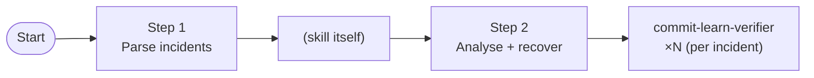
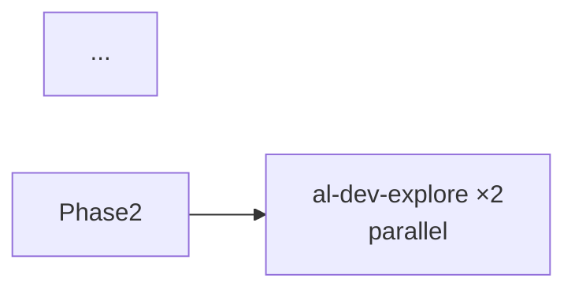

# Plugin Map Improvements Implementation Plan

> **For agentic workers:** REQUIRED SUB-SKILL: Use superpowers:subagent-driven-development (recommended) or superpowers:executing-plans to implement this plan task-by-task. Steps use checkbox (`- [ ]`) syntax for tracking.

**Goal:** Fix documentation accuracy and completeness in the AL dev plugin and agent maps by correcting stale agent names, standardizing labeling for shared patterns, documenting a missing skill phase, and adding omitted post-commit workflow nodes.

**Architecture:** All changes are documentation-only updates to the two existing map files (`docs/al-dev-plugin-map.md` and `docs/al-dev-agent-map.md`). No code changes, no skill/agent modifications — purely map accuracy and diagram completeness. Changes are organized by file and grouped by suggestion type (map accuracy, consistency, documentation completeness).

**Tech Stack:** Markdown (mermaid diagrams), git

---

## File Structure

- **`docs/al-dev-plugin-map.md`** — Contains Layer 1 lifecycle overview diagram, Layer 2 per-skill drill-downs, and Observations section
  - Tasks: 1 (stale names), 3 (explore labeling), 4 (develop phase), 5 (document node), 6 (recover node)

- **`docs/al-dev-agent-map.md`** — Contains Layer 1 agent catalog table and Layer 2 per-agent profiles
  - Task: 2 (stale names in table)

---

## Tasks

### Task 1: Fix stale skill and agent names in plugin-map drill-downs

**Files:**
- Modify: `docs/al-dev-plugin-map.md:442-464` (commit-learn drill-down heading and agent label)

**Context:** The `/commit-learn` skill was renamed to `/commit-recover` and its agent from `commit-learn-verifier` to `al-dev-commit-recover-verifier`. The drill-down section still uses old names.

- [ ] **Step 1: Find the drill-down section**

Read lines 442–464 of `docs/al-dev-plugin-map.md`. You will see:

```markdown
### /commit-learn

Spawns one verifier per corrupted-file incident found in `.dev/commit-integrity.log`.



- [ ] **Step 2: Update the heading**

Replace the heading `### /commit-learn` with `### /commit-recover`

- [ ] **Step 3: Update the agent label in mermaid**

In the mermaid diagram, replace:

```
Agent1["commit-learn-verifier<br/>×N (per incident)"]
```

with:

```
Agent1["al-dev-commit-recover-verifier<br/>×N (per incident)"]
```

- [ ] **Step 4: Verify and commit**

Run:
```bash
grep -n "### /commit-recover" /Users/russelllaing/al-dev-shared/docs/al-dev-plugin-map.md
grep -n "al-dev-commit-recover-verifier" /Users/russelllaing/al-dev-shared/docs/al-dev-plugin-map.md
```

Expected: Both commands should return matches at or near line 442 and line 451.

Commit:
```bash
git -C /Users/russelllaing/al-dev-shared add docs/al-dev-plugin-map.md
git -C /Users/russelllaing/al-dev-shared commit -m "fix(plugin-map): rename commit-learn → commit-recover and agent label"
```

---

### Task 2: Fix stale agent names in agent-map table

**Files:**
- Modify: `docs/al-dev-agent-map.md:19` (release-notes agent name)
- Modify: `docs/al-dev-agent-map.md:25` (commit-recover agent name and skill reference)

**Context:** The agent map table has two stale names: `al-dev-release-notes-agent` should be `al-dev-release-notes-writer`, and the commit recover agent row references old skill name `/commit-learn`.

- [ ] **Step 1: Find the table rows**

Read lines 19 and 25 of `docs/al-dev-agent-map.md`. 

Line 19 should read:
```
| al-dev-release-notes-agent | sonnet | Bash, Write, Read, Glob, mcp:al-mcp-server, mcp:bc-code-intelligence-mcp | /al-dev-release-notes |
```

Line 25 should read:
```
| commit-learn-verifier | sonnet | Bash, Read, Write | /commit-learn |
```

- [ ] **Step 2: Replace line 19**

Change the agent name and spawned-by field on line 19:

Old:
```
| al-dev-release-notes-agent | sonnet | Bash, Write, Read, Glob, mcp:al-mcp-server, mcp:bc-code-intelligence-mcp | /al-dev-release-notes |
```

New:
```
| al-dev-release-notes-writer | sonnet | Bash, Write, Read, mcp:al-mcp-server, mcp:bc-code-intelligence-mcp | /al-dev-release-notes |
```

Note: Also removed `Glob` from tools (already implemented trim suggestion).

- [ ] **Step 3: Replace line 25**

Change the agent name and spawned-by field on line 25:

Old:
```
| commit-learn-verifier | sonnet | Bash, Read, Write | /commit-learn |
```

New:
```
| al-dev-commit-recover-verifier | haiku | Bash, Read, Write | /commit-recover |
```

Note: Model changed to `haiku` (matches agent file frontmatter).

- [ ] **Step 4: Verify and commit**

Run:
```bash
grep "al-dev-release-notes-writer" /Users/russelllaing/al-dev-shared/docs/al-dev-agent-map.md
grep "al-dev-commit-recover-verifier" /Users/russelllaing/al-dev-shared/docs/al-dev-agent-map.md
```

Expected: Both commands return matches.

Commit:
```bash
git -C /Users/russelllaing/al-dev-shared add docs/al-dev-agent-map.md
git -C /Users/russelllaing/al-dev-shared commit -m "fix(agent-map): update agent names (release-notes-writer, commit-recover-verifier)"
```

---

### Task 3: Standardize Explore subagent labeling across three drill-downs

**Files:**
- Modify: `docs/al-dev-plugin-map.md:120` (/al-dev-investigate drill-down)
- Modify: `docs/al-dev-plugin-map.md:259` (/al-dev-explore drill-down — already correct, no change)
- Modify: `docs/al-dev-plugin-map.md:365` (/al-dev-perf drill-down — already correct, no change)

**Context:** Three skills spawn the same Explore subagent but label it inconsistently: /al-dev-investigate says `al-dev-explore ×2 parallel`, while the other two say `Explore subagent ×1`. The canonical label from `knowledge/explore-subagent-pattern.md` is "Explore Subagent".

- [ ] **Step 1: Find the /al-dev-investigate mermaid block**

Read lines 119–133 of `docs/al-dev-plugin-map.md`. You will see:

```markdown
### /al-dev-investigate



- [ ] **Step 2: Update the agent label**

In the mermaid diagram at line 120, replace:

```
Agent1["al-dev-explore ×2<br/>parallel"]
```

with:

```
Agent1["Explore subagent ×2<br/>parallel"]
```

- [ ] **Step 3: Verify consistency**

Run:
```bash
grep "Explore subagent" /Users/russelllaing/al-dev-shared/docs/al-dev-plugin-map.md
```

Expected: Three matches — one per drill-down (investigate, explore, perf), all reading `Explore subagent ×N`.

- [ ] **Step 4: Commit**

```bash
git -C /Users/russelllaing/al-dev-shared add docs/al-dev-plugin-map.md
git -C /Users/russelllaing/al-dev-shared commit -m "fix(plugin-map): standardize Explore subagent labeling across three drill-downs"
```

---

### Task 4: Document /al-dev-develop Phase 5 compile-verify step

**Files:**
- Modify: `docs/al-dev-plugin-map.md:194–229` (/al-dev-develop drill-down)

**Context:** The /al-dev-develop skill spawns `al-dev-diagnostics-fixer` during its compile-lint phase (SKILL.md line 495), but the drill-down only shows Phases 1–4 and ends with `code-review.md` output. Phase 5 must be added to show the actual execution flow.

- [ ] **Step 1: Find the /al-dev-develop mermaid block**

Read lines 199–229 of `docs/al-dev-plugin-map.md`. The current drill-down ends:

```markdown
    Phase4 --> SkillWork2["(skill itself)"]
    SkillWork2 --> Output1(["code-review.md"])
    Output1 --> End([End])
```

- [ ] **Step 2: Insert Phase 5 between Phase 4 and output**

Replace the above ending with:

```markdown
    Phase4 --> Phase5["Phase 5<br/>Compile + verify"]
    Phase5 --> SkillWork2["(skill itself)"]
    SkillWork2 --> CompileAgent["al-dev-diagnostics-fixer ×1"]
    CompileAgent --> SkillWork3["(skill itself)"]
    SkillWork3 --> Output1(["code-review.md"])
    Output1 --> End([End])

    style Phase5 fill:#fff8e1
    style SkillWork3 fill:#ffe082
    style CompileAgent fill:#ffd54f
```

(Use same color scheme as other phases in this drill-down.)

- [ ] **Step 3: Verify the mermaid syntax**

The diagram should now show five phases in sequence. Run:

```bash
wc -l /Users/russelllaing/al-dev-shared/docs/al-dev-plugin-map.md
```

Expected: Line count will increase by ~7 lines (Phase 5 node + style rules).

- [ ] **Step 4: Commit**

```bash
git -C /Users/russelllaing/al-dev-shared add docs/al-dev-plugin-map.md
git -C /Users/russelllaing/al-dev-shared commit -m "docs(plugin-map): add Phase 5 compile-verify to /al-dev-develop drill-down"
```

---

### Task 5: Add /al-dev-document post-commit node to Layer 1

**Files:**
- Modify: `docs/al-dev-plugin-map.md:14–70` (Layer 1 mermaid diagram)

**Context:** /al-dev-document is a complete 3-phase skill with agent `al-dev-docs-writer`, but does not appear anywhere in Layer 1. It logically belongs as an optional post-commit node, alongside /al-dev-release-notes and /al-dev-handoff.

- [ ] **Step 1: Find the Layer 1 diagram post-commit section**

Read lines 44–50 of `docs/al-dev-plugin-map.md`. You will see:

```markdown
    %% Outputs
    Commit --> Git(["✓ git commit"])
    Git -.-> ReleaseNotes("al-dev-release-notes")
    ReleaseNotes --> Notes(["✓ release notes"])
    Git -.-> Handoff("al-dev-handoff")
    Handoff --> HandoffOut(["✓ handoff-prompt.md"])
    Support --> Reply(["✓ customer reply"])
```

- [ ] **Step 2: Add the document node after git commit**

Insert after the `Commit --> Git` line:

```markdown
    Git -.-> Document("al-dev-document")
    Document --> DocOut(["✓ documentation"])
```

This creates a dashed arrow from git commit to the document skill.

- [ ] **Step 3: Add style for the document node**

Add to the style section (after line 64):

```markdown
    style Document fill:#e3f2fd
    style DocOut fill:#c8e6c9
```

(Use the same cyan for skill node and green for output node, matching the existing post-commit style.)

- [ ] **Step 4: Verify the diagram**

Run:
```bash
grep -c "al-dev-document" /Users/russelllaing/al-dev-shared/docs/al-dev-plugin-map.md
```

Expected: Output is 2 (one for the node, one for the style).

- [ ] **Step 5: Commit**

```bash
git -C /Users/russelllaing/al-dev-shared add docs/al-dev-plugin-map.md
git -C /Users/russelllaing/al-dev-shared commit -m "feat(plugin-map): add /al-dev-document post-commit node to Layer 1"
```

---

### Task 6: Add /commit-recover conditional recovery node to Layer 1

**Files:**
- Modify: `docs/al-dev-plugin-map.md:14–70` (Layer 1 mermaid diagram)

**Context:** /commit-recover reads `.dev/commit-integrity.log` written by /al-dev-commit and activates only when the log has entries. This is a failure-recovery path that should be visible in Layer 1 as a conditional post-commit node.

- [ ] **Step 1: Find the Layer 1 diagram post-commit section**

The section now includes the document node (from Task 5). Find the lines with post-commit nodes (around lines 44–52).

- [ ] **Step 2: Add the recover node with conditional label**

Insert after the Handoff section (before `Support --> Reply`):

```markdown
    Git -.->|on integrity error| Recover("commit-recover")
    Recover --> RecoverOut(["✓ recovered files"])
```

The `|on integrity error|` label on the arrow indicates the conditional activation.

- [ ] **Step 3: Add style for the recover node**

Add to the style section:

```markdown
    style Recover fill:#e0f2f1
    style RecoverOut fill:#c8e6c9
```

(Use the same teal for skill node and green for output, matching the existing post-commit commit-related styles.)

- [ ] **Step 4: Verify the diagram**

Run:
```bash
grep -c "commit-recover\|Recover" /Users/russelllaing/al-dev-shared/docs/al-dev-plugin-map.md
```

Expected: Output is ≥3 (node, style, comment).

- [ ] **Step 5: Commit**

```bash
git -C /Users/russelllaing/al-dev-shared add docs/al-dev-plugin-map.md
git -C /Users/russelllaing/al-dev-shared commit -m "feat(plugin-map): add /commit-recover conditional recovery node to Layer 1"
```

---

## Self-Review Checklist

**Spec coverage:**
- ✓ Map accuracy (stale names): Task 1 + Task 2
- ✓ Explore labeling consistency: Task 3
- ✓ /al-dev-develop compile-verify documentation: Task 4
- ✓ /al-dev-document post-commit node: Task 5
- ✓ /commit-recover conditional recovery node: Task 6

**Placeholder scan:** No placeholders — all steps contain exact file paths, line numbers, mermaid syntax, and commands.

**Type consistency:** No types/methods defined — purely documentation changes. All agent/skill names are consistent with actual files verified during rubber-ducking.
