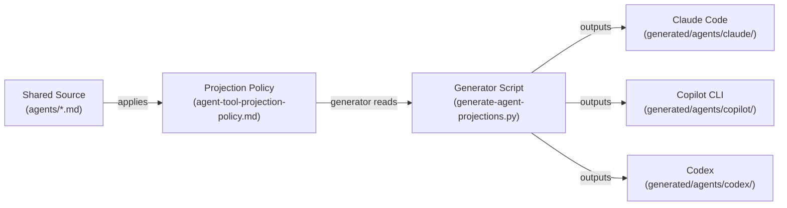
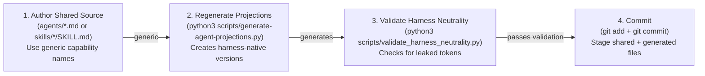
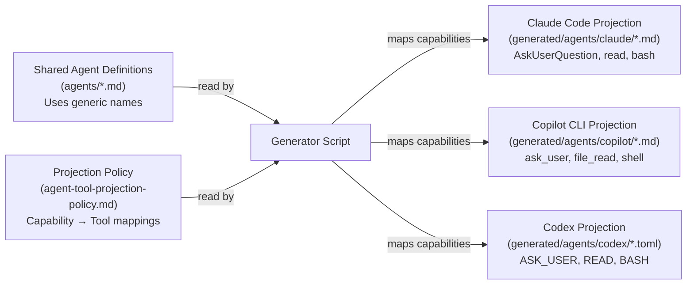
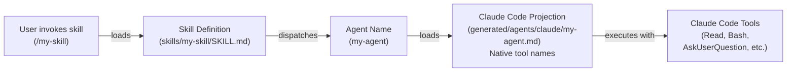

# Projection Layer README Restructure Implementation Plan

> **For agentic workers:** REQUIRED SUB-SKILL: Use superpowers:subagent-driven-development (recommended) or superpowers:executing-plans to implement this plan task-by-task. Steps use checkbox (`- [ ]`) syntax for tracking.

**Goal:** Restructure `docs/projection-layer-readme.md` from architecture-centric to task-driven, maintainer-focused narrative with clear boundary rules and workflows.

**Architecture:** Single-file restructure organized around four core maintainer workflows: adding agents/skills, regenerating projections, validating harness neutrality, and understanding boundaries. Appendices serve contributors and harness developers. Existing Mermaid diagrams are preserved and recontextualized.

**Tech Stack:** Markdown, Mermaid diagrams, git

---

## File Map

**Input:**
- `docs/projection-layer-readme.md` — existing document to restructure

**Output:**
- `docs/projection-layer-readme.md` — restructured document (same file)

**Supporting files referenced in plan:**
- `profile-al-dev-shared/knowledge/agent-tool-projection-policy.md` — projection policy (read only)
- `profile-al-dev-shared/knowledge/harness-concepts.md` — generic capability names (read only)
- `profile-al-dev-shared/agents/` — example agents (read only)

---

## Task 1: Read and Extract Current Content

**Files:**
- Read: `docs/projection-layer-readme.md`

- [ ] **Step 1: Read the current projection-layer-readme.md**

Run:
```bash
wc -l /Users/russelllaing/al-dev-shared/docs/projection-layer-readme.md
```

Expected: Get line count to understand document size

- [ ] **Step 2: Identify existing sections and key content**

Read the full current document and note:
- Which sections explain the projection layer's purpose
- Where boundary rules are mentioned (if at all)
- Where workflows/procedural steps appear
- Where diagrams are located
- What content can be reused vs. reorganized vs. newly written

This is a read-only exploration step. No edits yet.

---

## Task 2: Read Supporting Files for Content Reference

**Files:**
- Read: `profile-al-dev-shared/knowledge/agent-tool-projection-policy.md`
- Read: `profile-al-dev-shared/knowledge/harness-concepts.md`
- Read (sample): `profile-al-dev-shared/agents/al-dev-plan.md`

- [ ] **Step 1: Read the projection policy file**

Run:
```bash
head -50 /Users/russelllaing/al-dev-shared/profile-al-dev-shared/knowledge/agent-tool-projection-policy.md
```

Expected: Understand how the projection policy maps capabilities to harness-native names

- [ ] **Step 2: Read the harness-concepts file**

Run:
```bash
head -50 /Users/russelllaing/al-dev-shared/profile-al-dev-shared/knowledge/harness-concepts.md
```

Expected: Identify the generic capability vocabulary (e.g., `USER_GATE`, `Read`, `Bash`) that should replace harness-specific names

- [ ] **Step 3: Examine a sample agent to understand structure**

Run:
```bash
head -30 /Users/russelllaing/al-dev-shared/profile-al-dev-shared/agents/al-dev-plan.md
```

Expected: Understand frontmatter format and how agents use generic vs. harness-specific naming (validation rule for later)

---

## Task 3: Draft Section 1 — Conceptual Foundation

**Files:**
- Edit: `docs/projection-layer-readme.md`

This section establishes why the projection layer exists and the mental model. It should be 2-3 paragraphs plus the end-to-end flow diagram.

- [ ] **Step 1: Write the conceptual foundation opening**

Replace the current introduction with a concise problem/solution explanation. Insert at the very top of the document (after title/date/audience):

```markdown
## Section 1: Conceptual Foundation

### The Problem

The `al-dev-shared` plugin is consumed by three different AI harnesses: Claude Code, Copilot CLI, and Codex. Each harness has its own native tools and naming conventions. Maintaining three completely separate copies of agent definitions would create drift, duplicate work, and inconsistency.

### The Solution: One Source, Three Native Outputs

The projection layer solves this by maintaining **one canonical authored surface** with generic, harness-neutral definitions, then **automatically translating them** into harness-native versions at build time.

- Shared source (`profile-al-dev-shared/agents/*.md`) uses generic capability names (e.g., `Read`, `Bash`, `USER_GATE`)
- The projection **policy** (`knowledge/agent-tool-projection-policy.md`) defines how to map each generic capability to each harness's native tool
- The **generator** reads the shared source and policy, then outputs three sets of harness-specific versions

This means maintainers edit once, and all three harnesses get consistent, synchronized agents automatically.
```

- [ ] **Step 2: Preserve the end-to-end flow diagram**

Locate the existing end-to-end flow diagram (showing Shared → Policy → Generator → outputs) in the current document and keep it in this section. If it doesn't exist, create a simple Mermaid diagram:



Add a brief caption explaining the diagram.

---

## Task 4: Draft Section 2 — Boundary Rules

**Files:**
- Edit: `docs/projection-layer-readme.md`

This section makes explicit what maintainers can and cannot edit. Add after Section 1:

- [ ] **Step 1: Write the boundary rules section**

```markdown
## Section 2: Boundary Rules (Critical for Maintainers)

### Sacred Files: Always Edit Directly

These files are canonical authored source and are meant to be edited:

- `profile-al-dev-shared/agents/*.md` — agent definitions
- `profile-al-dev-shared/skills/<name>/SKILL.md` — skill definitions
- `profile-al-dev-shared/knowledge/agent-tool-projection-policy.md` — the mapping policy itself
- `profile-al-dev-shared/knowledge/` — all shared knowledge documents

When you edit these files, you are modifying the source of truth. Changes here flow through to all three harnesses.

### Generated Files: Never Hand-Edit

These directories contain auto-generated harness-native versions. Never edit them directly:

- `profile-al-dev-shared/generated/agents/claude/` — Claude Code projections (generated *.md files)
- `profile-al-dev-shared/generated/agents/copilot/` — Copilot CLI projections (generated *.md files)
- `profile-al-dev-shared/generated/agents/codex/` — Codex projections (generated *.toml files)

If you edit a generated file, your changes will be **lost on the next regeneration**. Always edit the shared source instead, then regenerate.

### Why This Boundary Matters

The boundary exists for three reasons:

1. **Single source of truth:** All three harnesses stay in sync because they all derive from the same authored source
2. **No manual sync work:** Changes in shared source automatically propagate to all generated versions
3. **Safety:** The neutrality validator ensures shared source never contains harness-specific tokens

If the boundary breaks (e.g., hand-editing a generated file, or accidentally copying harness-specific names into shared source), the validator catches it before it causes problems.

### Validation: The Neutrality Check

Before committing, run:

```bash
python3 scripts/validate_harness_neutrality.py profile-al-dev-shared
```

This scanner ensures no harness-specific tokens have leaked into shared source. See Section 5 for details.
```

---

## Task 5: Draft Section 3 — Adding an Agent or Skill Workflow

**Files:**
- Edit: `docs/projection-layer-readme.md`

This is the core maintainer workflow section. Add after Section 2:

- [ ] **Step 1: Write the workflow introduction and steps**

```markdown
## Section 3: Workflow — Adding a New Agent or Skill

### Overview

This workflow walks you through adding a new agent or skill safely, from authoring through validation and commit.

### Step-by-Step Workflow

#### Step 1: Author the Shared Source File

Create a new file in the appropriate location:

**For a new agent:**
```bash
# Create the agent definition
cat > /Users/russelllaing/al-dev-shared/profile-al-dev-shared/agents/my-new-agent.md << 'EOF'
---
name: my-new-agent
description: Brief description of what this agent does
model: claude-opus-4-7
tools:
  - Read
  - Bash
  - USER_GATE
---

# System Prompt for the Agent

[Full instructions for the agent here]
EOF
```

**For a new skill:**
```bash
# Create the skill definition
mkdir -p /Users/russelllaing/al-dev-shared/profile-al-dev-shared/skills/my-new-skill
cat > /Users/russelllaing/al-dev-shared/profile-al-dev-shared/skills/my-new-skill/SKILL.md << 'EOF'
---
name: my-new-skill
description: Trigger description (how this skill activates)
argument-hint: "[optional args]"
---

# Skill Instructions

[Full skill instructions here]
EOF
```

**Key rule:** Use generic capability names in the `tools:` list (e.g., `Read`, `Bash`, `USER_GATE`), never harness-specific names like `AskUserQuestion` or `ask_user`. Reference `profile-al-dev-shared/knowledge/harness-concepts.md` for the complete generic vocabulary.

#### Step 2: Regenerate Projections

Run the generator to create harness-native versions:

```bash
cd /Users/russelllaing/al-dev-shared
python3 scripts/generate-agent-projections.py
```

Expected output:
- New files created in `profile-al-dev-shared/generated/agents/claude/`
- New files created in `profile-al-dev-shared/generated/agents/copilot/`
- New files created in `profile-al-dev-shared/generated/agents/codex/`

Run:
```bash
git status
```

You should see your new shared source file plus the three generated versions.

#### Step 3: Validate Harness Neutrality

Run the neutrality validator to ensure no harness-specific tokens leaked into shared source:

```bash
cd /Users/russelllaing/al-dev-shared
python3 scripts/validate_harness_neutrality.py profile-al-dev-shared
```

Expected output:
```
✓ No harness-specific tokens detected in shared source
```

If validation fails, see Section 5 for how to fix violations.

#### Step 4: Commit the Changes

Stage both the shared source and generated versions:

```bash
git add profile-al-dev-shared/agents/my-new-agent.md \
        profile-al-dev-shared/generated/agents/claude/my-new-agent.md \
        profile-al-dev-shared/generated/agents/copilot/my-new-agent.md \
        profile-al-dev-shared/generated/agents/codex/my-new-agent.toml

git commit -m "feat: add my-new-agent to support X workflow

Added new agent definition with tools for Read, Bash, and USER_GATE.
Regenerated projections for all three harnesses."
```

### Maintainer Workflow Diagram


```

---

## Task 6: Draft Section 4 — Regenerating Projections Safely

**Files:**
- Edit: `docs/projection-layer-readme.md`

Add after Section 3:

- [ ] **Step 1: Write the regeneration section**

```markdown
## Section 4: Regenerating Projections Safely

### When to Regenerate

You must regenerate projections after any of these changes:

1. **Editing an agent:** You modify `profile-al-dev-shared/agents/*.md`
2. **Editing the projection policy:** You modify `profile-al-dev-shared/knowledge/agent-tool-projection-policy.md`
3. **Editing shared knowledge that affects tool descriptions:** You modify relevant files in `profile-al-dev-shared/knowledge/`

You do **not** need to regenerate when editing skills, knowledge unrelated to agents, or non-source files.

### How to Regenerate

Run the generator script:

```bash
cd /Users/russelllaing/al-dev-shared
python3 scripts/generate-agent-projections.py
```

The script reads all shared agent files and the projection policy, then outputs harness-native versions in-place:

- `profile-al-dev-shared/generated/agents/claude/*.md` — Claude Code versions
- `profile-al-dev-shared/generated/agents/copilot/*.md` — Copilot CLI versions
- `profile-al-dev-shared/generated/agents/codex/*.toml` — Codex versions

### Verify Regeneration Results

After running the generator, always verify the output:

- [ ] **Check git status to see what changed**

```bash
git status
```

You should see modifications to generated agent files, not deletions or unexpected additions.

- [ ] **Review the diffs to ensure changes are sensible**

```bash
git diff profile-al-dev-shared/generated/agents/claude/ | head -100
```

Look for:
- Tool name mappings applied correctly (e.g., `USER_GATE` → `AskUserQuestion` in Claude output)
- No accidental deletions
- No mysterious additions unrelated to your edits

- [ ] **Run the neutrality validator to confirm safety**

```bash
python3 scripts/validate_harness_neutrality.py profile-al-dev-shared
```

Expected: ✓ No harness-specific tokens detected in shared source

If validation fails, fix the violations (see Section 5) and regenerate again.

### Projection Process Diagram



---

## Task 7: Draft Section 5 — Validating Harness Neutrality

**Files:**
- Edit: `docs/projection-layer-readme.md`

Add after Section 4:

- [ ] **Step 1: Write the validation section**

```markdown
## Section 5: Validating Harness Neutrality

### The Safety Check: What It Does

The neutrality validator scans `profile-al-dev-shared/` (the shared source) for forbidden harness-specific tokens and ensures the source remains generic. This is a critical safety check before committing.

Run:

```bash
python3 scripts/validate_harness_neutrality.py profile-al-dev-shared
```

The validator checks for:
- Harness-specific tool names in agent files (e.g., `AskUserQuestion`, `ask_user`, `ASK_USER`)
- Harness-specific prefixes (e.g., `mcp__`, `claude:`, `copilot:`)
- Harness-specific keys or formats (e.g., TOML-specific syntax in shared source)
- File paths that reference generated directories (should reference shared source only)

Expected successful output:
```
✓ No harness-specific tokens detected in shared source
✓ All files are harness-agnostic
```

### Common Pitfalls and How to Fix Them

#### Pitfall 1: Using Harness-Specific Tool Names in Shared Source

**Symptom:** Validator reports `AskUserQuestion` in agent tools list

**Example of mistake:**
```markdown
# agents/my-agent.md

tools:
  - Read
  - AskUserQuestion  # ❌ This is Claude-specific, not generic
```

**Fix:** Replace with the generic capability name

```markdown
tools:
  - Read
  - USER_GATE  # ✓ Generic name from harness-concepts.md
```

**How to find the right generic name:** Consult `profile-al-dev-shared/knowledge/harness-concepts.md` for the mapping of harness-specific names to generic names.

#### Pitfall 2: Including Harness-Specific Prefixes in Descriptions

**Symptom:** Validator reports `claude:` or `copilot:` prefix in agent description

**Example of mistake:**
```markdown
description: This agent handles claude:code-review tasks
```

**Fix:** Remove the harness-specific prefix

```markdown
description: This agent handles code review tasks
```

#### Pitfall 3: Copying a Generated File Back Into Shared Source

**Symptom:** You accidentally copied a file from `generated/agents/claude/` into `profile-al-dev-shared/agents/`

**Consequences:** The file will contain Claude-specific tool names and fail validation

**Fix:** Delete the accidentally-copied file and regenerate from the correct shared source

```bash
# Remove the corrupted file
rm profile-al-dev-shared/agents/corrupted-file.md

# Regenerate to ensure consistency
python3 scripts/generate-agent-projections.py

# Validate
python3 scripts/validate_harness_neutrality.py profile-al-dev-shared
```

#### Pitfall 4: Manually Editing a Generated File

**Symptom:** You edited a file in `generated/agents/claude/` directly

**Consequences:** Your edits will be lost on the next regeneration

**Fix:** Edit the shared source instead, then regenerate

```bash
# Find which agent you were trying to edit
# Edit the shared source file
vi profile-al-dev-shared/agents/my-agent.md

# Regenerate
python3 scripts/generate-agent-projections.py

# Validate
python3 scripts/validate_harness_neutrality.py profile-al-dev-shared
```

### Decision Tree: Is It Harness-Specific?

When in doubt, use this decision tree:

1. **Does the name appear in multiple harnesses?** (e.g., `Read` in Claude, Copilot, and Codex)
   - Yes → It's generic, use it
   - No → It might be harness-specific

2. **Is it in the `harness-concepts.md` generic column?** 
   - Yes → It's generic, use it
   - No → It's likely harness-specific

3. **Does it reference a specific tool by its harness-native name?** (e.g., `AskUserQuestion`, `ask_user`, `ASK_USER`)
   - Yes → It's harness-specific, use the generic equivalent
   - No → It's generic

---

## Task 8: Draft Appendix A — Files Reference

**Files:**
- Edit: `docs/projection-layer-readme.md`

Add after Section 5:

- [ ] **Step 1: Write the files reference appendix**

```markdown
## Appendix A: Files Reference

Quick lookup for file locations and purposes:

| File/Directory | Purpose | Can Edit? |
|---|---|---|
| `profile-al-dev-shared/agents/*.md` | Canonical agent definitions | ✅ Yes |
| `profile-al-dev-shared/skills/<name>/SKILL.md` | Canonical skill definitions | ✅ Yes |
| `profile-al-dev-shared/knowledge/agent-tool-projection-policy.md` | Capability → tool mappings | ✅ Yes |
| `profile-al-dev-shared/knowledge/harness-concepts.md` | Generic capability vocabulary | ✅ Yes |
| `profile-al-dev-shared/knowledge/` | Shared knowledge documents | ✅ Yes |
| `profile-al-dev-shared/generated/agents/claude/` | Claude Code projections | ❌ No (regenerate instead) |
| `profile-al-dev-shared/generated/agents/copilot/` | Copilot CLI projections | ❌ No (regenerate instead) |
| `profile-al-dev-shared/generated/agents/codex/` | Codex projections | ❌ No (regenerate instead) |
| `scripts/generate-agent-projections.py` | Generator script | Read only |
| `scripts/validate_harness_neutrality.py` | Neutrality validator | Read only |

---

## Task 9: Draft Appendix B — Worktree Integration

**Files:**
- Edit: `docs/projection-layer-readme.md`

Add after Appendix A. This recontextualizes existing content about Claude Code worktree integration:

- [ ] **Step 1: Write the worktree appendix introduction**

```markdown
## Appendix B: Claude Code Worktree Integration

This section is for advanced users and Claude Code developers who want to understand how projections work within a worktree environment.

### How Claude Code Discovers and Loads Projections

When Claude Code runs in a worktree (an isolated copy of the repository), it:

1. Registers the plugin from `.claude/settings.json` or `~/.claude/settings.json`
2. Looks for skill definitions in `profile-al-dev-shared/skills/`
3. Looks for agent projections in `profile-al-dev-shared/generated/agents/claude/`
4. Loads knowledge files from `profile-al-dev-shared/knowledge/`

The projection layer ensures that agents in the worktree have Claude Code-native tool names (e.g., `AskUserQuestion`, `Read`, `Bash`) instead of generic names.

### Worktree Lifecycle

A worktree is an isolated copy of the repository used for development:

1. **Creation:** Claude Code creates a worktree via `git worktree add` or the EnterWorktree skill
2. **Isolation:** The worktree has its own branch and working directory, separate from the main workspace
3. **Execution:** Skills and agents run in the worktree; projections are loaded from this isolated copy
4. **Cleanup:** On completion, the worktree can be kept or removed

When projections are regenerated in a worktree, the generator outputs harness-native versions specific to Claude Code.

### Example: Adding a Feature to al-dev-shared in a Worktree

This example walks through the full workflow of modifying the plugin within a worktree:

**Scenario:** You want to add a new agent and test it in Claude Code before committing.

#### Step 1: Create a Worktree

In Claude Code, use the `superpowers:using-git-worktrees` skill to create an isolated worktree:

```
/superpowers:using-git-worktrees
```

This creates a new branch in `.claude/worktrees/` and switches the session to that isolated directory.

#### Step 2: Author the Agent in Shared Source

Create the agent in the worktree's `profile-al-dev-shared/agents/` directory:

```bash
cat > profile-al-dev-shared/agents/my-experimental-agent.md << 'EOF'
---
name: my-experimental-agent
description: Test agent for feature X
model: claude-opus-4-7
tools:
  - Read
  - Bash
  - USER_GATE
---

# System Prompt

[Instructions for the agent]
EOF
```

#### Step 3: Regenerate Projections in the Worktree

Run the generator to create Claude Code-native versions:

```bash
python3 scripts/generate-agent-projections.py
```

The worktree now has:
- `profile-al-dev-shared/agents/my-experimental-agent.md` (generic shared source)
- `profile-al-dev-shared/generated/agents/claude/my-experimental-agent.md` (Claude-native version with `AskUserQuestion`, `Read`, `Bash`)

#### Step 4: Test in Claude Code

Invoke the agent directly via Claude Code's Skill tool to test its behavior:

```
/al-dev-shared:my-experimental-agent
```

If the agent works as expected, you can commit and exit the worktree. If you need to iterate, edit the shared source, regenerate, and test again.

#### Step 5: Commit and Exit the Worktree

When satisfied with the changes:

```bash
git add profile-al-dev-shared/agents/my-experimental-agent.md \
        profile-al-dev-shared/generated/agents/claude/my-experimental-agent.md

git commit -m "feat: add my-experimental-agent for feature X"
```

Then use the `ExitWorktree` tool to return to the main workspace and clean up the worktree.

### How Skill Execution Flows Through Projections

When you invoke a skill in Claude Code:

1. Claude Code loads the skill definition from `profile-al-dev-shared/skills/<name>/SKILL.md`
2. The skill may dispatch an agent using the agent name (e.g., `al-dev-shared:my-agent`)
3. Claude Code loads the agent projection from `profile-al-dev-shared/generated/agents/claude/my-agent.md`
4. The projection contains Claude Code-native tool names, so the agent can execute directly
5. The agent runs with full access to Claude Code's tools (Read, Bash, AskUserQuestion, etc.)


```

---

## Task 10: Draft Appendix C — Harness Developer Reference

**Files:**
- Edit: `docs/projection-layer-readme.md`

Add after Appendix B:

- [ ] **Step 1: Write the harness developer reference**

```markdown
## Appendix C: Harness Developer Reference

This section is for developers who are building new AI harnesses or extending the projection system to support additional consumers.

### What Each Harness Consumes

Each of the three supported harnesses consumes a different projection format:

#### Claude Code (Desktop App, CLI, IDE Extensions)

- **Location:** `profile-al-dev-shared/generated/agents/claude/*.md`
- **Format:** Markdown with YAML frontmatter
- **Tool Names:** Claude Code-native (e.g., `AskUserQuestion`, `Read`, `Bash`)
- **Registration:** Via `.claude/settings.json` plugin path
- **Execution:** Skills invoke agents via the Skill tool; agents execute with full Claude Code tool access

#### Copilot CLI (Autonomous Command-Line Agent)

- **Location:** `profile-al-dev-shared/generated/agents/copilot/*.md`
- **Format:** Markdown with YAML frontmatter
- **Tool Names:** Copilot-native (e.g., `ask_user`, `file_read`, `shell`)
- **Registration:** Via Copilot CLI plugin discovery
- **Execution:** Agents are dispatched directly by the CLI; they execute with Copilot's tool set

#### Codex (Autonomous Development System)

- **Location:** `profile-al-dev-shared/generated/agents/codex/*.toml`
- **Format:** TOML configuration
- **Tool Names:** Codex-native (e.g., `ASK_USER`, `READ`, `BASH`)
- **Registration:** Via Codex plugin registry
- **Execution:** Agents are loaded by the Codex system; they execute with Codex's tool set

### The Projection Policy: How Mapping Works

The projection policy is the configuration that maps generic capability names to harness-native tool names. It lives in:

```
profile-al-dev-shared/knowledge/agent-tool-projection-policy.md
```

The policy defines entries like:

```
Generic Name  | Claude Code      | Copilot CLI | Codex
USER_GATE     | AskUserQuestion  | ask_user    | ASK_USER
Read          | Read             | file_read   | READ
Bash          | Bash             | shell       | BASH
```

When the generator runs, it:

1. Reads `profile-al-dev-shared/agents/*.md` (generic definitions)
2. Consults the projection policy
3. For each harness, replaces generic capability names with harness-native names
4. Outputs harness-native versions

### Example: Adding Support for a New Harness

To support a new harness (e.g., MyHarness):

1. **Extend the projection policy** to include MyHarness tool mappings:

```markdown
Generic Name  | Claude Code      | Copilot CLI | Codex       | MyHarness
USER_GATE     | AskUserQuestion  | ask_user    | ASK_USER    | prompt_user
Read          | Read             | file_read   | READ        | load_file
Bash          | Bash             | shell       | BASH        | exec_cmd
```

2. **Update the generator script** to output MyHarness projections:

   - Add MyHarness to the `HARNESSES` list
   - Define the output format for MyHarness agents
   - Implement the tool name mapping for MyHarness

3. **Test the generator** to ensure MyHarness projections are created correctly:

```bash
python3 scripts/generate-agent-projections.py
ls profile-al-dev-shared/generated/agents/myharness/
```

4. **Register the plugin** in MyHarness's plugin system so it loads the new projections

### Common Questions for Harness Developers

**Q: Can I add custom extensions to an agent in my harness without modifying shared source?**

A: No. All harness-specific customizations should be made to the shared source using generic capability names, then regenerated. This ensures all harnesses benefit from improvements and stay in sync.

**Q: What if my harness needs a tool that doesn't map to any generic capability?**

A: Add it to the projection policy. Define a new generic capability name (in `harness-concepts.md`), add it to the policy, and regenerate. This keeps the system extensible and maintains parity across harnesses.

**Q: How do I test a projection before committing?**

A: Check it out in a worktree or local environment. Invoke the agent/skill in your harness and verify behavior. The generated artifacts are code — treat them as such.

**Q: What happens if I manually edit a generated projection?**

A: Your edits will be lost on the next regeneration. Always edit the shared source instead, then regenerate. Manual edits to generated files are not supported.
```

---

## Task 11: Verify Document Structure Against Spec

**Files:**
- Read: `docs/projection-layer-readme.md`
- Reference spec: `docs/superpowers/specs/2026-05-24-projection-layer-readme-restructure-design.md`

- [ ] **Step 1: Check spec coverage**

Open the spec and verify this checklist:

- [ ] Section 1: Conceptual Foundation ✓
  - Problem/solution explanation (2-3 paragraphs)
  - End-to-end flow diagram showing Shared → Policy → Generator → outputs
  
- [ ] Section 2: Boundary Rules ✓
  - Clear statement of sacred vs. generated files
  - Explanation of why the boundary matters
  - Reference to neutrality validator
  
- [ ] Section 3: Adding agent/skill workflow ✓
  - Step 1: Author shared source (with generic capability rule)
  - Step 2: Regenerate projections
  - Step 3: Validate harness neutrality
  - Step 4: Commit
  - Concrete example with actual commands
  - Maintainer workflow diagram
  
- [ ] Section 4: Regenerating projections ✓
  - When to regenerate (list of trigger conditions)
  - How to regenerate (script command)
  - Verification steps (git status, diffs, validation)
  - Projection process diagram
  
- [ ] Section 5: Validating harness neutrality ✓
  - What the check does
  - Common pitfalls (with examples and fixes)
  - Decision tree for harness-specific detection
  
- [ ] Appendix A: Files reference ✓
  - Quick lookup table with locations and edit status
  
- [ ] Appendix B: Worktree integration ✓
  - How Claude Code discovers projections
  - Worktree lifecycle
  - Concrete example: adding a feature in a worktree
  - Skill execution flow diagram
  
- [ ] Appendix C: Harness developer reference ✓
  - What each harness consumes (locations, formats, tool names)
  - Projection policy explanation
  - Example: adding support for a new harness
  - Common questions for harness developers

- [ ] **Step 2: Scan for forbidden patterns**

Search the document for:
- `TODO`, `TBD`, `[date]`, `YYYY-MM-DD` (unrendered templates)
- `claude:` or `copilot:` prefixed comments (debug tokens)
- Vague language like "add appropriate error handling" (without concrete steps)
- Missing code examples in procedural steps

If found, fix inline before proceeding.

- [ ] **Step 3: Verify success criteria from spec**

Check each success criterion:

1. ✓ A maintainer can find how to add a new agent or skill in one place → Section 3 covers this
2. ✓ Boundary rules are stated clearly and early → Section 2, right after foundation
3. ✓ Document flows around maintenance tasks, not abstract architecture → All five sections are task-driven
4. ✓ Diagrams illustrate workflows, not just mechanics → Four diagrams (end-to-end, maintainer workflow, projection process, skill execution flow)
5. ✓ Document remains conceptual, not just reference → Sections 1-5 explain why and how; Appendices are auxiliary
6. ✓ Contributors and harness developers have auxiliary sections → Appendices B and C serve these audiences without interrupting main narrative

---

## Task 12: Final Integration Review and Commit

**Files:**
- Modified: `docs/projection-layer-readme.md`

- [ ] **Step 1: Read the complete restructured document**

Run:
```bash
wc -l /Users/russelllaing/al-dev-shared/docs/projection-layer-readme.md
```

Verify the new document is reasonable in size (should be longer than the original due to additional sections, but not excessively so).

- [ ] **Step 2: Spot-check content flow**

Skim through the document from top to bottom:
- Does Section 1 establish the mental model clearly?
- Does Section 2 make boundaries explicit?
- Does Section 3 walk through the full workflow with concrete commands?
- Does Section 4 cover when/how to regenerate with verification steps?
- Does Section 5 explain the validator and common fixes?
- Do appendices provide auxiliary detail without interrupting the main narrative?

- [ ] **Step 3: Verify all Mermaid diagrams are syntactically correct**

If you added or modified any diagrams, test them:

- Copy each diagram block into a Mermaid editor (e.g., mermaid.live)
- Verify they render without errors
- Check that captions are present and clear

- [ ] **Step 4: Check git status**

Run:
```bash
git status
```

Expected: `docs/projection-layer-readme.md` modified (only this file, no unexpected changes)

- [ ] **Step 5: Review the diff**

Run:
```bash
git diff docs/projection-layer-readme.md | head -200
```

Spot-check that:
- Content is added in the right order (Sections 1-5, then Appendices)
- No accidental deletions of important content
- No merge artifacts or formatting issues

- [ ] **Step 6: Commit the restructured document**

```bash
git add docs/projection-layer-readme.md

git commit -m "docs: restructure projection-layer-readme for task-driven narrative

Reorganized from architecture-centric to maintainer-focused flow:
- Section 1: Conceptual foundation (problem, solution, end-to-end diagram)
- Section 2: Boundary rules (sacred vs. generated files, validation)
- Section 3: Adding agents/skills workflow (step-by-step with example)
- Section 4: Regenerating projections safely (when, how, verify)
- Section 5: Validating harness neutrality (checks, pitfalls, fixes)
- Appendix A: Files reference (quick lookup table)
- Appendix B: Worktree integration (Claude Code advanced usage)
- Appendix C: Harness developer reference (tool consumption, policies)

Maintained all existing Mermaid diagrams and recontextualized for clarity.
Document now flows around maintainer workflows, not abstract architecture."
```

- [ ] **Step 7: Verify commit was created**

Run:
```bash
git log --oneline -n 1
```

Expected output should show your new commit with the message above.

---

## Execution Handoff

Plan complete and saved to `docs/superpowers/plans/2026-05-24-projection-layer-readme-restructure.md`.

**Two execution options:**

**1. Subagent-Driven (recommended)** — I dispatch a fresh subagent per task with review between tasks for fast iteration and quality control.

**2. Inline Execution** — Execute tasks in this session using superpowers:executing-plans with checkpoints.

**Which approach would you prefer?**
