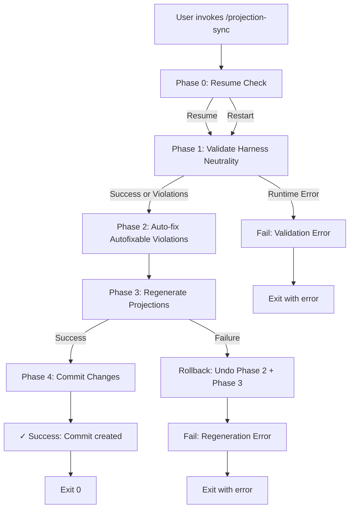

# Design: `/projection-sync` Skill

**Date:** 2026-05-24  
**Status:** Approved  
**Author:** Claude Code Brainstorming

---

## Overview

`/projection-sync` is a Claude Code maintainer skill that validates shared agent source for harness-specific tokens, auto-fixes violations, regenerates harness-native projections, and commits all changes with contextual message. It lives in `.claude/skills/projection-sync/` as repository maintenance tooling.

---

## Purpose & Scope

The AL development plugin distributes a single canonical agent surface (`profile-al-dev-shared/agents/`) and three harness-native projections (Claude Code, Copilot CLI, Codex). When shared agents are edited, their changes must be validated for harness neutrality, then propagated into the three generated projection artifacts.

**In scope:**
- Validating shared agent source against harness-specific token patterns
- Auto-fixing autofixable violations (token replacement)
- Regenerating all three harness projections
- Committing changes with contextual message

**Out of scope:**
- Manual review UI for non-autofixable violations (reported in commit message only)
- Interactive diff review (user sees changes via git)
- Harness mapping table updates (align-harness-repos skill handles that)

---

## Entry Point & Trigger

**Manual invocation:** `/projection-sync`  
**Argument:** None (optional in future: `--validate-only`, `--dry-run`, but not required for v1)  
**Prerequisite:** User has edited shared agents in `profile-al-dev-shared/agents/` and wants to propagate changes

---

## Workflow Phases

### Phase 0: Resume Check (Standard Checkpoint)

Read `.dev/projection-sync-progress.md` if it exists. If present, offer user:
- `Resume` — continue from last completed phase
- `Restart` — begin from Phase 1

If no progress file exists, proceed to Phase 1.

**Output file:** `.dev/projection-sync-progress.md` (checkpoint after each phase)

---

### Phase 1: Validate Harness Neutrality

**Command:**
```bash
python3 scripts/validate_harness_neutrality.py profile-al-dev-shared
```

**Exit code handling:**
- **0 (clean)** → Proceed to Phase 2
- **1 (violations found)** → Proceed to Phase 2 (auto-fix will attempt repairs)
- **2 (runtime error)** → Fail with error message, roll back, exit

**Captured output:** Store stdout/stderr in `.dev/projection-sync-validation.json` (or parse JSON if script outputs it directly)

**Progress checkpoint:** Update `.dev/projection-sync-progress.md`
```yaml
phase: 1
status: complete
violations_found: N
autofixable: M
manual_review: K
```

---

### Phase 2: Auto-fix Autofixable Violations

Parse validation output. For each violation where `autofixable: true`:

1. Read the target file
2. Locate the forbidden token line
3. Identify the generic concept name from `profile-al-dev-shared/knowledge/harness-concepts.md`
4. Replace the token with the concept name, preserving surrounding text
5. Write the file back

**Non-autofixable violations:** Collect in a list (flagged for commit message documentation only; do NOT auto-modify)

**Verification:**
```bash
# After all auto-fixes, re-run validation to confirm
python3 scripts/validate_harness_neutrality.py profile-al-dev-shared --mode check
```

If re-validation still has violations, note them in commit message but proceed to Phase 3 (violations may be acceptable per team review).

**Progress checkpoint:** Update `.dev/projection-sync-progress.md`
```yaml
phase: 2
status: complete
fixes_applied: M
manual_review_remaining: K
```

---

### Phase 3: Regenerate Projections

**Command:**
```bash
python3 scripts/generate-agent-projections.py
```

**Exit code handling:**
- **0 (success)** → Proceed to Phase 4
- **Non-zero (failure)** → Fail with error message, roll back all changes (undo fixes from Phase 2), exit

**Verification:** Check that files were created/updated:
```bash
git status profile-al-dev-shared/generated/agents/
```

**Progress checkpoint:** Update `.dev/projection-sync-progress.md`
```yaml
phase: 3
status: complete
projections_generated:
  claude: N_agents
  copilot: N_agents
  codex: N_agents
```

---

### Phase 4: Commit Changes

Determine what changed:
```bash
git diff --name-only
```

**Commit message format:**

```
refactor: regenerate agent projections

Validation:
- Violations found: N (M auto-fixed, K manual review)

Regenerated projections:
- Claude Code: agents/claude/ (N agents)
- Copilot CLI: agents/copilot/ (N agents)
- Codex: agents/codex/ (N agents)

If violations remain, note:
- Manual review required: [list]

Co-Authored-By: Claude Haiku 4.5 <noreply@anthropic.com>
```

**No-changes case:** Still commit with message:
```
refactor: regenerate projections (no changes)

Validation: clean (no violations found)
Regenerated: no changes to agents

Co-Authored-By: Claude Haiku 4.5 <noreply@anthropic.com>
```

**Commit behavior:** Use `git commit` (not git amend); create new atomic commit.

**Progress checkpoint:** Update `.dev/projection-sync-progress.md`
```yaml
phase: 4
status: complete
commit_hash: <hash>
commit_message: <first_line>
```

---

## Error Handling & Rollback

**On failure at any phase:**

1. Print error message with phase context
2. Run rollback:
   ```bash
   # Undo all modified files from Phase 2
   git checkout profile-al-dev-shared/
   # Remove any partially-generated artifacts from Phase 3
   rm -rf profile-al-dev-shared/generated/agents/
   ```
3. Remove progress file: `rm .dev/projection-sync-progress.md`
4. Exit with non-zero code

**User action:** User must investigate the error (check validation failure reason, regeneration error, etc.) and retry.

---

## Success Criteria

- [ ] Validation runs successfully (exit 0 or violations found but manageable)
- [ ] All autofixable violations are replaced with concept names
- [ ] Regeneration produces valid projections for all three harnesses
- [ ] Exactly one atomic commit is created with contextual message
- [ ] If no changes: empty commit is created with "no changes" message
- [ ] Rollback works correctly on any failure (repo state is clean)
- [ ] Progress file exists at end (for debugging / resume capability in future)

---

## Implementation Notes

**Scripts location:** All scripts live in `scripts/` at repo root; skill invokes them via relative paths or `AL_DEV_SHARED_PLUGIN_ROOT` env var.

**Working directory:** Skill executes from repo root (al-dev-shared).

**Dependencies:**
- Python 3.7+ (for script execution)
- `profile-al-dev-shared/knowledge/harness-concepts.md` (for concept name mapping)
- `scripts/validate_harness_neutrality.py`
- `scripts/generate-agent-projections.py`

**Tool usage:** Bash for script execution; Read/Write for file manipulation in Phase 2.

---

## Future Enhancements

Not in scope for v1, but worth noting:
- `--validate-only` flag to skip regeneration and commits
- `--dry-run` to show changes without committing
- Detailed report output (`.dev/projection-sync-report.md`)
- Integration with other skills (e.g., trigger after agent edits)

---

## Diagram



