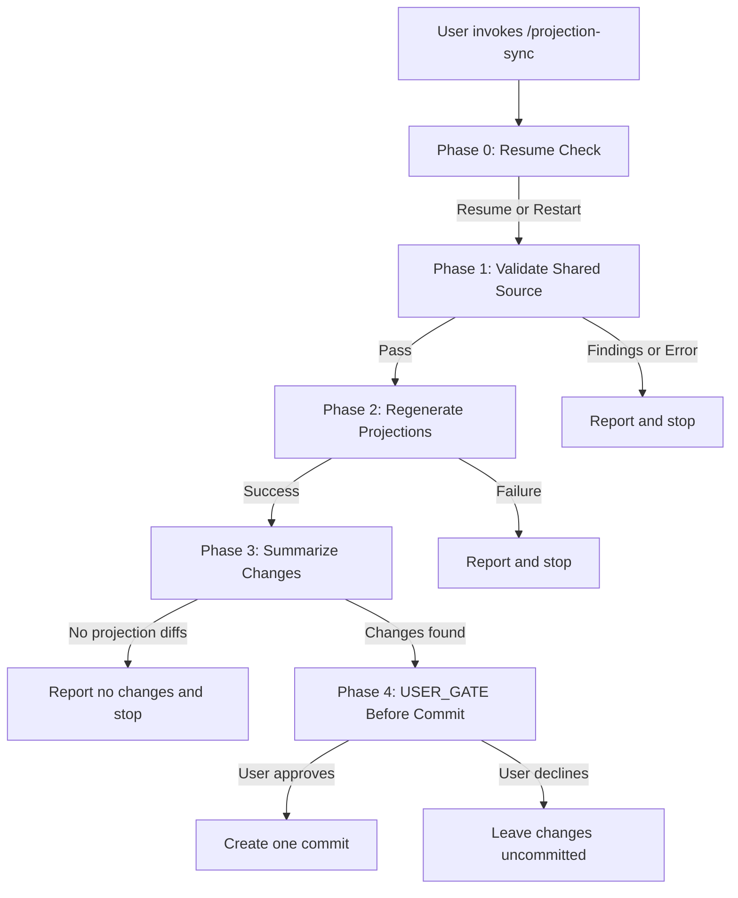

# Design: `/projection-sync` Skill

**Date:** 2026-05-24  
**Status:** Revised for implementation planning  
**Author:** Claude Code Brainstorming

---

## Overview

`/projection-sync` is a Claude Code maintainer skill that validates shared
agent source, regenerates harness-native projections, summarizes the resulting
changes, and asks before creating a commit. It lives in
`.claude/skills/projection-sync/` as repo-local maintenance tooling.

This skill is intentionally narrow. It orchestrates existing repo scripts and
generated outputs; it does not replace the richer alignment/audit workflow that
already exists elsewhere in the repo.

---

## Purpose & Scope

The AL development plugin distributes a single canonical agent surface
(`profile-al-dev-shared/agents/`) and three harness-native projections (Claude
Code, Copilot CLI, Codex). When shared agents are edited, maintainers need a
safe way to validate shared source, regenerate projections, inspect what
changed, and optionally commit the result.

**In scope:**
- Running the current shared-surface neutrality validator
- Regenerating all three harness projection sets
- Summarizing changed files for maintainer review
- Asking before any staging or commit action
- Writing a simple progress checkpoint file in `.dev/`

**Out of scope for v1:**
- Auto-fixing validation failures
- Replacing `/align-harness-repos`
- Editing harness mapping tables
- Creating empty "no changes" commits
- Broad rollback of user changes
- Any destructive cleanup outside files this workflow explicitly owns

---

## Relationship to Existing Tooling

`/projection-sync` is a thin maintainer wrapper over existing repo primitives:

- `scripts/validate_harness_neutrality.py`
- `scripts/generate-agent-projections.py`

It should not duplicate the responsibilities of
`.claude/skills/align-harness-repos/SKILL.md`, which already covers broader
alignment concerns such as mapping-table coverage, repo-local `.claude`
boundary findings, and richer fix-oriented flows.

The current validator interface is also intentionally simple. At present it
returns only:

- exit `0` for pass
- exit `1` for findings
- plain text findings in `path: rule: excerpt` form

It does **not** currently provide:

- JSON output
- line numbers
- context classification
- `autofixable` metadata
- token-to-concept mapping data

That means v1 of `/projection-sync` must stop on validation failures instead of
trying to auto-repair them.

---

## Entry Point & Trigger

**Manual invocation:** `/projection-sync`  
**Argument:** None in v1  
**Prerequisite:** The maintainer has edited shared agent source under
`profile-al-dev-shared/agents/` and wants to propagate those edits into
generated projection artifacts.

Possible future flags such as `--validate-only` or `--dry-run` are reasonable,
but they are not part of this design.

---

## Workflow Phases

### Phase 0: Resume Check

Read `.dev/projection-sync-progress.md` if it exists. If present, offer:

- `Resume` — continue from the next incomplete phase
- `Restart` — overwrite the checkpoint and begin again at Phase 1

If no progress file exists, proceed directly to Phase 1.

**Checkpoint file:** `.dev/projection-sync-progress.md`

---

### Phase 1: Validate Shared Source

**Command:**
```bash
python3 scripts/validate_harness_neutrality.py profile-al-dev-shared
```

**Observed current contract:**
- Exit `0`: validation passed
- Exit `1`: one or more findings were reported
- Findings are emitted as plain text lines

**Behavior:**
- On exit `0`, proceed to Phase 2
- On exit `1`, present the validator output, record the failure in the progress
  file, and stop
- On any unexpected runtime failure, report the command failure, record it in
  the progress file, and stop

**Progress checkpoint example:**
```yaml
phase: 1
status: complete
result: pass
```

Validation failure example:
```yaml
phase: 1
status: blocked
result: findings_reported
```

---

### Phase 2: Regenerate Projections

This phase only runs if Phase 1 passes.

**Command:**
```bash
python3 scripts/generate-agent-projections.py
```

**Behavior:**
- On success, proceed to Phase 3
- On failure, report the generator error, record the failed phase, and stop

**Verification:**
- Inspect `git diff --name-only -- profile-al-dev-shared/generated/agents`
- Confirm whether the generator changed any projection files

**Progress checkpoint example:**
```yaml
phase: 2
status: complete
result: projections_regenerated
```

---

### Phase 3: Summarize Changes

Determine what changed after regeneration:

```bash
git diff --name-only
```

Summarize, at minimum:

- Whether any files changed at all
- Which files under `profile-al-dev-shared/generated/agents/` changed
- Whether only generated projections changed or other tracked files also differ
- Whether the progress checkpoint file changed

If there are no projection diffs, report that regeneration produced no changes
and stop without committing unless the user explicitly asks for a commit anyway.

**Progress checkpoint example:**
```yaml
phase: 3
status: complete
result: diff_summarized
changed_files:
  - profile-al-dev-shared/generated/agents/claude/example.md
```

---

### Phase 4: USER_GATE Before Commit

If there are meaningful changes, stop and ask whether to commit them.

The approval point must occur immediately before any `git add` or `git commit`.

Prompt shape:

```text
Projection regeneration is complete.

Changed files:
- [list]

Do you want me to stage and commit these changes?
```

**Behavior:**
- If the user says yes, stage only the intended files and create one commit
- If the user says no, stop and leave the working tree unchanged

**Commit policy:**
- No commit without explicit approval
- No empty commit in the no-change case
- No `git amend`

**Progress checkpoint example after approval and commit:**
```yaml
phase: 4
status: complete
result: committed
commit_hash: <hash>
```

Declined example:
```yaml
phase: 4
status: complete
result: user_declined_commit
```

---

## Error Handling

v1 should use conservative failure handling:

- Do not run `git checkout profile-al-dev-shared/`
- Do not delete `profile-al-dev-shared/generated/agents/`
- Do not attempt to clean up unrelated working-tree changes

On failure:

1. Report the failing phase and command
2. Preserve the working tree as-is
3. Update `.dev/projection-sync-progress.md` with the failed state
4. Stop

This keeps the skill safe in a dirty repo and avoids discarding unrelated user
work.

---

## Success Criteria

- [ ] Validation passes before regeneration is attempted
- [ ] Projection regeneration runs through the existing generator script
- [ ] The skill summarizes changed files before any commit action
- [ ] The skill asks before staging or committing
- [ ] No commit is created in the no-change case unless explicitly requested
- [ ] Failures do not discard unrelated repo changes
- [ ] The progress checkpoint reflects the last completed or blocked phase

---

## Implementation Notes

**Scripts location:** `scripts/` at repo root  
**Working directory:** repo root (`al-dev-shared`)  
**Skill placement:** `.claude/skills/projection-sync/`

**Dependencies:**
- `scripts/validate_harness_neutrality.py`
- `scripts/generate-agent-projections.py`
- `profile-al-dev-shared/generated/agents/`

**Current validator constraints that shape v1:**
- `scripts/validate_harness_neutrality.py` scans shared authored directories and
  reports only `path`, `rule`, and `excerpt` findings
- The script currently has no structured output mode or fix metadata
- Any future auto-fix design must start by extending the validator contract or
  delegating to existing alignment tooling

---

## Future Enhancements

Not in scope for v1:

- `--validate-only`
- `--dry-run`
- Structured validator output for machine-readable findings
- Auto-fix support driven by line-level and concept-mapping metadata
- Delegation into `/align-harness-repos` when a maintainer wants broader repair
  behavior
- A richer `.dev/projection-sync-report.md` artifact

---

## Diagram


