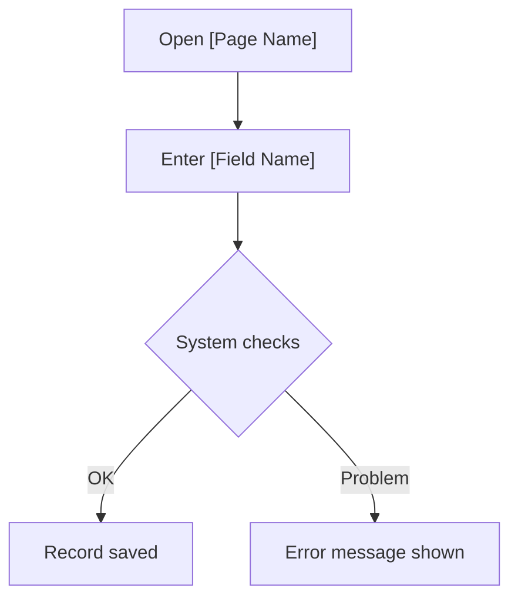

# [Feature Name] — User Guide

**Audience:** End User
**Version:** [Version added]

## What This Feature Does

[2-3 sentences. Plain language. No technical terms.
What can you do now that you couldn't do before?]

## How to Access It

Navigate to: **[Menu Path]** → **[Page Name]**

Or search for **[Page Name]** using the search bar (Alt+Q).

## [Workflow Name]

[1-2 sentences. What does completing this workflow achieve?]

**Steps:**

1. Open **[Page Name]**.
2. In the **[Field Name]** field, enter [what to enter and why].
3. Click **[Action / Button Name]**.
4. [Expected result — what the user sees when it works correctly.]

[Repeat this section for each workflow the user needs to know.]

## Common Questions

**Q: [Common question users ask about this feature]**

A: [Plain-language answer. One paragraph maximum.]

**Q: [Second common question]**

A: [Answer.]

## Troubleshooting

| Problem | Likely Cause | What to Do |
| --- | --- | --- |
| [What the user sees] | [Why it happens in plain language] | [Steps to resolve] |
