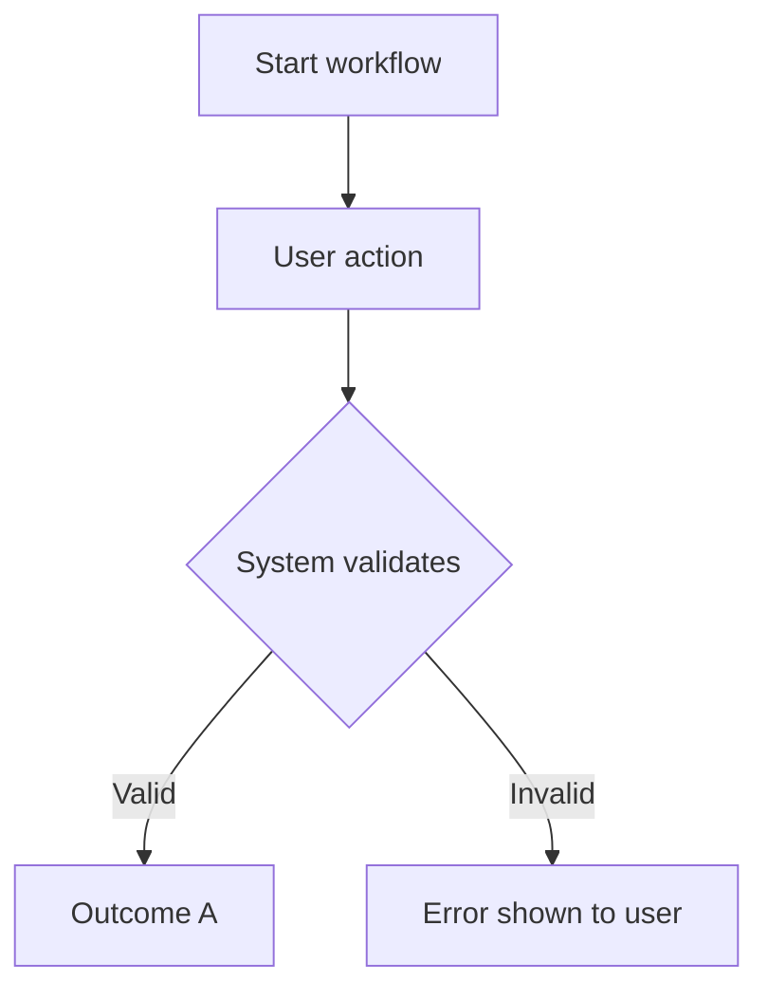

# Feature: [Feature Name] — Functional Overview

**Audience:** Business Analyst / Consultant
**Status:** [Implemented / In Progress]
**Version:** [Plugin version or release tag]

## Business Purpose

[2-3 sentences. What business problem does this feature solve?
Who benefits? What was the limitation before?]

## Functional Scope

**Included:**

- [What this feature covers — in business terms]
- [Each bullet is one functional area or user capability]

**Not included:**

- [What is explicitly out of scope]

## Workflows

### [Workflow Name]

[1-2 sentences describing what this workflow achieves.]

1. [Business step 1 — what the user does]
2. [Business step 2]
3. [System validates/processes — what happens automatically]
4. [Outcome — what the user sees or receives]

[Repeat this section for each major workflow.]

## Validation Rules

The following rules are enforced automatically by the system:

1. [Rule in plain language —
   e.g. "A credit limit must be zero or greater"]
2. [Rule 2]
3. [Rule 3]

## Integration with Other Processes

| Process | How It Connects |
| --- | --- |
| [Sales Order Processing] | [What happens at this integration point] |
| [Finance / Ledger] | [How this affects financial entries] |

## Requirements Traceability

[Reduced RTM table — columns: ID, Status, Requirement only.
No Type, Priority, or Acceptance Criteria columns.
Requirement text in plain language — no code references.]

| ID | Status | Requirement |
| --- | --- | --- |
| REQ-001 | VERIFIED | [Plain-language requirement description] |
